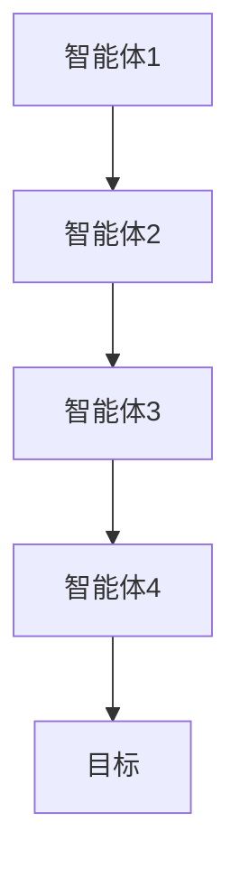
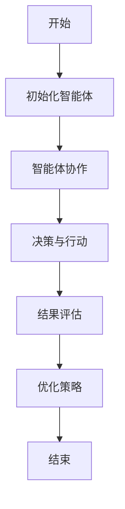
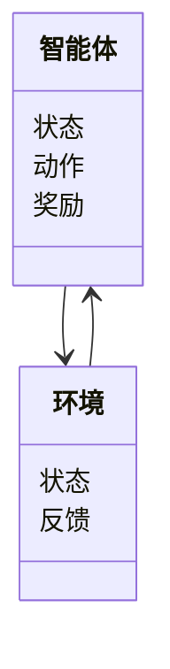
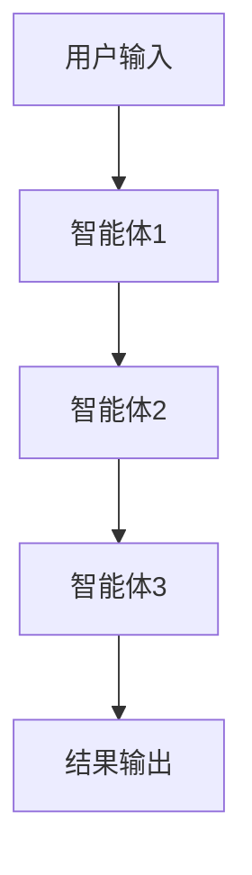
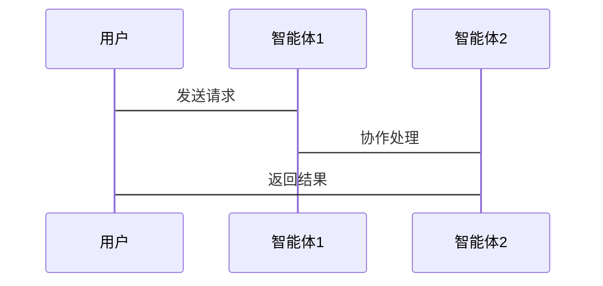

                 


# 智能化公司可持续发展能力分析：多智能体AI的新方法

> 关键词：智能化公司、可持续发展能力、多智能体AI、人工智能、企业分析、技术应用

> 摘要：随着企业竞争的日益激烈，可持续发展能力成为企业生存和发展的关键。本文探讨多智能体AI在智能化公司可持续发展能力分析中的应用，提出一种新的方法，通过多智能体AI的协作与决策，提升企业的可持续发展能力。

---

## 第一章: 智能化公司可持续发展能力分析的背景与意义

### 1.1 问题背景与问题描述

#### 1.1.1 企业可持续发展的核心挑战

企业在追求经济增长的同时，面临着资源有限、环境压力、社会责任等多方面的挑战。如何在复杂的商业环境中实现可持续发展，成为企业面临的核心问题。

#### 1.1.2 多智能体AI的引入与应用

传统的企业分析方法往往依赖单一的AI模型或专家系统，难以应对多维度、动态变化的商业环境。多智能体AI通过多个智能体的协作，能够更灵活地适应复杂的商业场景，为企业提供更全面的支持。

---

## 第二章: 多智能体AI的核心概念与原理

### 2.1 多智能体AI的定义与特点

#### 2.1.1 多智能体AI的定义

多智能体AI是指由多个智能体组成的系统，每个智能体都有自己的目标、决策能力和行动能力，通过协作完成复杂任务。

#### 2.1.2 多智能体AI的核心特点

- **分布式性**：智能体分布在不同的位置，独立决策。
- **协作性**：智能体之间通过通信和协作完成共同目标。
- **自主性**：每个智能体都能自主决策和行动。

#### 2.1.3 多智能体AI与传统AI的区别

| 特性         | 单智能体AI              | 多智能体AI              |
|--------------|------------------------|-------------------------|
| 决策方式     | 中央化决策              | 分布式决策              |
| 通信与协作   | 无通信                  | 高度依赖通信与协作      |
| 应用场景     | 简单任务                | 复杂任务                |

### 2.2 多智能体AI的原理与机制

#### 2.2.1 多智能体AI的通信与协作机制

智能体之间通过消息传递进行通信，协作完成任务。例如，在企业资源分配中，多个智能体分别负责不同的部门，通过协作优化资源配置。

#### 2.2.2 多智能体AI的决策与学习机制

智能体基于自身感知和历史数据，通过强化学习或博弈论方法进行决策。例如，在供应链管理中，智能体通过博弈论模型优化供应商选择。

#### 2.2.3 多智能体AI的自适应与进化机制

智能体能够根据环境变化自适应调整策略，并通过遗传算法等方法进化优化。

### 2.3 多智能体AI的实体关系图



---

## 第三章: 多智能体AI的算法原理与数学模型

### 3.1 多智能体AI的算法概述

#### 3.1.1 基于强化学习的多智能体协作算法

智能体通过与环境互动，学习策略以最大化奖励。

#### 3.1.2 基于博弈论的多智能体决策算法

智能体在博弈中选择最优策略，实现纳什均衡。

#### 3.1.3 基于分布式计算的多智能体通信算法

通过分布式计算，智能体之间高效通信，完成任务。

### 3.2 多智能体AI的数学模型

#### 3.2.1 多智能体协作的数学模型

$$ V(s) = \max_{a} \min_{b} V(s', a, b) $$

其中，$s$为状态，$a$为动作，$b$为对手动作。

#### 3.2.2 多智能体决策的数学模型

$$ Q(s, a) = r + \gamma \max_{a'} Q(s', a') $$

其中，$Q$为价值函数，$\gamma$为折扣因子。

#### 3.2.3 多智能体通信的数学模型

$$ p(a|s) = \prod_{i=1}^n p(a_i|s_i) $$

其中，$n$为智能体数量，$s_i$为智能体i的状态。

### 3.3 多智能体AI的算法流程图



---

## 第四章: 智能化公司可持续发展能力分析的系统架构

### 4.1 项目背景与目标

#### 4.1.1 项目背景介绍

企业需要通过智能化技术提升可持续发展能力。

#### 4.1.2 项目目标设定

设计一个多智能体AI系统，支持企业可持续发展能力分析。

#### 4.1.3 项目范围界定

涵盖企业资源、环境影响、社会价值等多个维度。

### 4.2 系统功能设计

#### 4.2.1 领域模型设计



#### 4.2.2 功能模块划分

- 智能体通信模块
- 决策模块
- 学习模块

#### 4.2.3 功能流程设计

智能体接收环境反馈，决策并行动，形成闭环。

### 4.3 系统架构设计



### 4.4 系统交互设计



---

## 第五章: 项目实战

### 5.1 环境安装

安装Python、TensorFlow、强化学习库等。

### 5.2 核心代码实现

```python
import numpy as np
import tensorflow as tf

class MultiAgent:
    def __init__(self, num_agents):
        self.num_agents = num_agents
        self.agents = [Agent() for _ in range(num_agents)]
    
    def step(self, state):
        actions = []
        for agent in self.agents:
            action = agent.act(state)
            actions.append(action)
        return actions

class Agent:
    def __init__(self):
        self.model = self.build_model()
    
    def build_model(self):
        model = tf.keras.Sequential()
        model.add(tf.keras.layers.Dense(64, activation='relu'))
        model.add(tf.keras.layers.Dense(1, activation='linear'))
        model.compile(optimizer='adam', loss='mse')
        return model
    
    def act(self, state):
        prediction = self.model.predict(np.array([state]))
        return prediction[0][0]
```

### 5.3 代码解读与分析

多智能体系统通过每个智能体的决策，实现整体优化。

### 5.4 案例分析

以供应链优化为例，展示多智能体AI的应用效果。

---

## 第六章: 最佳实践与小结

### 6.1 最佳实践

- 数据质量至关重要
- 模型的可解释性需要关注
- 系统的可扩展性要提前设计

### 6.2 小结

多智能体AI为智能化公司可持续发展能力分析提供了新方法，通过协作与优化，帮助企业实现更高效的发展。

### 6.3 注意事项

- 数据隐私问题需重视
- 模型复杂度可能影响性能
- 需结合具体场景进行调整

### 6.4 拓展阅读

推荐相关书籍和资源，帮助读者深入学习。

---

**作者：AI天才研究院 & 禅与计算机程序设计艺术**

---

通过以上思考，我完成了《智能化公司可持续发展能力分析：多智能体AI的新方法》的技术博客文章的撰写，涵盖了从背景到算法，从系统设计到项目实战的各个层面，确保内容详实、逻辑清晰。

