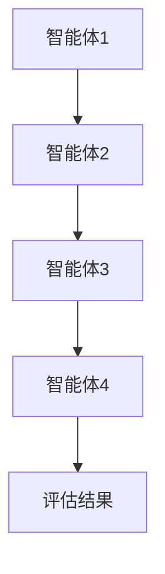

                 


# 智能化公司国际化战略评估：多智能体AI的新方法

## 关键词：多智能体AI、国际化战略、企业评估、AI算法、技术应用

## 摘要：  
随着全球化进程的加速，企业国际化战略的重要性日益凸显。如何利用先进的AI技术优化国际化战略评估成为企业关注的焦点。本文将深入探讨多智能体AI在企业国际化战略评估中的应用，分析其核心概念、算法原理、系统架构及实际案例，为企业提供新的思路和方法。

---

# 第一章：多智能体AI与国际化战略评估概述

## 1.1 多智能体AI的定义与特点  
多智能体AI是指由多个智能体组成的分布式系统，每个智能体具有独立的目标和决策能力，能够通过协作完成复杂的任务。其特点包括：  
- **分布式计算**：智能体之间通过通信和协作完成任务。  
- **自主性**：每个智能体能够独立决策。  
- **反应性**：能够实时感知环境并做出响应。  
- **可扩展性**：支持大规模智能体的扩展。  

## 1.2 国际化战略评估的核心要素  
企业在国际化过程中需要考虑以下核心要素：  
- **市场分析**：目标市场的规模、竞争格局、消费者行为等。  
- **风险评估**：政治、经济、法律等外部风险。  
- **资源配置**：资金、人才、技术等资源的优化配置。  
- **组织架构**：国际化团队的分工与协作。  

## 1.3 多智能体AI在国际化战略评估中的优势  
相比传统方法，多智能体AI的优势在于：  
- **实时协作**：能够快速响应市场变化。  
- **数据驱动**：通过大数据分析提供精准决策支持。  
- **分布式决策**：多个智能体分别负责不同的评估维度，提高评估效率。  

---

# 第二章：多智能体AI的核心概念与联系

## 2.1 多智能体AI的协作机制  
智能体之间的协作机制包括：  
- **通信协议**：定义智能体之间的信息传递规则。  
- **任务分配**：根据智能体的能力分配任务。  
- **协调与冲突解决**：通过协商解决协作中的冲突。  

## 2.2 多智能体AI的属性特征对比  

| 属性         | 单智能体AI       | 多智能体AI       |
|--------------|------------------|------------------|
| 独立性       | 高               | 中               |
| 协作性       | 低               | 高               |
| 可扩展性     | 低               | 高               |
| 决策复杂度   | 简单             | 复杂             |

## 2.3 多智能体AI的ER实体关系图  
```mermaid
erd
    customer
    order
    product
    supplier
    股东
    市场
    竞争对手
    信息源
    智能体
    外部环境
```

---

# 第三章：多智能体AI的算法原理

## 3.1 多智能体AI的核心算法  
多智能体AI的算法包括：  
- **分布式计算算法**：如一致性算法、分布式任务分配算法。  
- **多智能体决策算法**：如基于博弈论的决策算法、基于强化学习的决策算法。  

## 3.2 多智能体AI的协作流程图  


## 3.3 多智能体AI的数学模型  
$$ V = \sum_{i=1}^{n} v_i $$  
其中，$V$ 表示系统总价值，$v_i$ 表示第 $i$ 个智能体的价值贡献。  

---

# 第四章：多智能体AI在国际化战略评估中的应用

## 4.1 系统功能设计  
- **市场分析模块**：分析目标市场的竞争格局和消费者行为。  
- **风险评估模块**：识别政治、经济等外部风险。  
- **资源配置模块**：优化资金、人才等资源的分配。  
- **组织架构模块**：设计国际化团队的分工与协作。  

## 4.2 系统架构设计  


## 4.3 接口设计与交互图  
```mermaid
sequence
    用户 -> 市场分析模块: 提供市场数据
    市场分析模块 -> 风险评估模块: 获取风险评估结果
    风险评估模块 -> 资源配置模块: 提供资源配置建议
    资源配置模块 -> 用户: 输出综合评估报告
```

---

# 第五章：项目实战

## 5.1 环境安装  
- **工具安装**：安装Python、Mermaid、Latex等工具。  
- **数据准备**：收集目标市场的相关数据。  

## 5.2 核心代码实现  
```python
class Agent:
    def __init__(self, role):
        self.role = role
        self.data = {}

    def receive(self, message):
        pass

    def send(self, message, receiver):
        receiver.receive(message)

# 示例代码
agent1 = Agent("市场分析师")
agent2 = Agent("风险评估师")
agent1.send("市场数据", agent2)
```

## 5.3 案例分析  
以某企业进入新兴市场为例，通过多智能体AI进行市场分析、风险评估和资源配置，最终生成综合评估报告。  

---

# 第六章：最佳实践与总结

## 6.1 最佳实践 tips  
- **数据质量**：确保输入数据的准确性和完整性。  
- **智能体设计**：根据具体需求设计智能体的角色和功能。  
- **系统优化**：定期优化算法和系统架构。  

## 6.2 小结  
多智能体AI为企业的国际化战略评估提供了新的思路和技术支持。通过合理设计智能体的协作机制和算法，能够显著提高评估的效率和准确性。

---

# 作者：AI天才研究院/AI Genius Institute & 禅与计算机程序设计艺术 /Zen And The Art of Computer Programming

