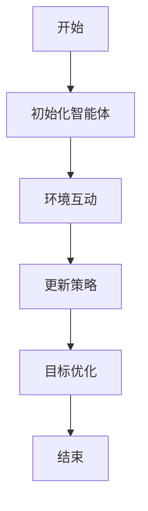

                 


# 智能化公司文化与财务表现关联分析：多智能体AI应用

## 关键词：公司文化、财务表现、多智能体AI、关联分析、系统架构

## 摘要：  
本文探讨了公司文化和财务表现之间的关联性，重点分析了多智能体AI在企业智能化管理中的应用。通过建立关联分析模型，揭示公司文化对财务表现的影响机制，并提供基于多智能体AI的解决方案，助力企业实现智能化转型。

---

## 第一部分: 智能化公司文化与财务表现关联分析的背景与核心概念

### 第1章: 问题背景与核心概念

#### 1.1 问题背景

##### 1.1.1 公司文化与财务表现的关联性  
公司文化是企业战略执行和绩效表现的重要驱动力。良好的文化能够促进团队协作和创新，从而提升财务表现。然而，不同文化特征对财务的影响差异显著，需要深入分析。

##### 1.1.2 多智能体AI在企业管理中的应用潜力  
多智能体AI通过模拟人类协作，优化决策流程，已在企业资源分配、风险管理等领域展现潜力，为企业智能化转型提供技术支持。

##### 1.1.3 当前企业智能化转型的挑战与机遇  
企业在智能化转型中面临数据孤岛、文化适配等问题，但多智能体AI的应用为企业提供了新的解决方案，帮助提升效率和绩效。

#### 1.2 核心概念与定义

##### 1.2.1 智能化公司文化的定义与特征  
智能化公司文化：以数据驱动和技术创新为核心，强调协作与学习的文化。

| 特征       | 描述               |
|------------|--------------------|
| 数据驱动   | 依赖数据做出决策   |
| 技术驱动   | 利用新技术提升效率 |
| 协作驱动   | 强调团队协作       |

##### 1.2.2 财务表现的核心指标与分析维度  
财务表现指标：收入、利润、现金流等，分析维度包括增长性、稳定性、风险性。

##### 1.2.3 多智能体AI的定义与技术特点  
多智能体AI：多个智能体协作完成任务，具备分布式决策和学习能力。

#### 1.3 问题描述与目标

##### 1.3.1 公司文化与财务表现关联性的问题描述  
探讨文化特征如何影响财务指标，建立关联模型。

##### 1.3.2 多智能体AI在关联分析中的应用目标  
利用AI技术量化文化与财务表现的关系，提供优化建议。

##### 1.3.3 研究的边界与外延  
限定于分析文化对财务的影响，不涉及其他外部因素。

#### 1.4 核心概念的关系与结构

##### 1.4.1 核心概念的属性特征对比  
通过对比分析，识别文化对财务的关键影响因素。

##### 1.4.2 ER实体关系图架构  
```mermaid
erd
    公司文化
    --> (关联关系) -->
    财务表现
```

### 第2章: 多智能体AI的核心原理与算法

#### 2.1 多智能体AI的原理

##### 2.1.1 多智能体系统的基本结构  
智能体、环境、通信机制。

##### 2.1.2 智能体之间的协作机制  
通过通信与协商，实现任务分配和协作。

##### 2.1.3 多智能体系统的优化算法  
基于强化学习，优化全局收益。

#### 2.2 多智能体AI的算法实现

##### 2.2.1 强化学习算法的原理  
智能体通过与环境互动，学习最优策略。

##### 2.2.2 多智能体协作的数学模型  
$$ V = \sum_{i=1}^{n} v_i $$
其中，$v_i$ 表示每个智能体的收益。

##### 2.2.3 联合优化的数学公式  
$$ \text{优化目标} = \arg \max_{x} \sum_{i=1}^{n} f_i(x) $$

#### 2.3 算法流程图  


### 第3章: 智能化公司文化与财务表现的关联分析模型

#### 3.1 数据采集与预处理

##### 3.1.1 数据源的选择与获取  
包括财务数据、文化评估问卷等。

##### 3.1.2 数据清洗与特征提取  
去除异常值，提取关键特征。

#### 3.2 关联分析的算法设计

##### 3.2.1 基于多智能体的关联分析模型  
模型通过多智能体协作，识别文化对财务的关键影响因素。

##### 3.2.2 模型的训练与优化  
利用强化学习优化模型参数。

#### 3.3 模型的验证与评估

##### 3.3.1 模型的验证方法  
通过交叉验证评估模型的准确性。

##### 3.3.2 模型的评估指标  
包括准确率、召回率等。

### 第4章: 系统架构与实现方案

#### 4.1 系统功能设计

##### 4.1.1 数据采集模块  
负责数据的收集与处理。

##### 4.1.2 关联分析模块  
实现文化与财务的关联分析。

##### 4.1.3 结果展示模块  
以可视化形式呈现分析结果。

#### 4.2 系统架构设计

##### 4.2.1 分层架构设计  
数据层、分析层、展示层。

##### 4.2.2 模块之间的交互设计  
通过接口实现模块间的通信。

#### 4.3 接口与交互设计

##### 4.3.1 数据接口设计  
定义数据输入和输出接口。

##### 4.3.2 用户交互设计  
提供用户友好的操作界面。

### 第5章: 项目实战与案例分析

#### 5.1 项目环境与工具安装

##### 5.1.1 开发环境配置  
安装Python、TensorFlow等工具。

##### 5.1.2 必要工具安装  
安装数据处理和可视化工具。

#### 5.2 核心代码实现

##### 5.2.1 数据处理代码  
```python
import pandas as pd
data = pd.read_csv('data.csv')
```

##### 5.2.2 模型训练代码  
```python
import tensorflow as tf
model = tf.keras.Sequential([...])
```

##### 5.2.3 结果展示代码  
```python
import matplotlib.pyplot as plt
plt.plot(result)
plt.show()
```

#### 5.3 案例分析与解读

##### 5.3.1 案例背景介绍  
分析某公司的文化对财务表现的影响。

##### 5.3.2 数据分析与结果解读  
揭示关键文化因素对财务的影响。

##### 5.3.3 案例总结与经验分享  
总结经验，提出优化建议。

### 第6章: 最佳实践与总结

#### 6.1 最佳实践 Tips

##### 6.1.1 数据处理的注意事项  
确保数据准确性和完整性。

##### 6.1.2 模型优化的技巧  
选择合适的算法和参数。

#### 6.2 项目小结

##### 6.2.1 项目成果总结  
成功建立关联分析模型。

##### 6.2.2 项目中的问题与解决方案  
解决数据不足的问题，通过数据增强优化模型。

#### 6.3 未来研究方向  
探索更复杂的文化因素，提升模型的泛化能力。

---

作者：AI天才研究院  
日期：2023年10月

