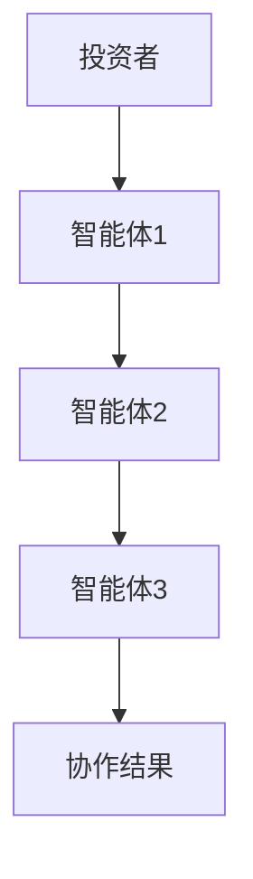
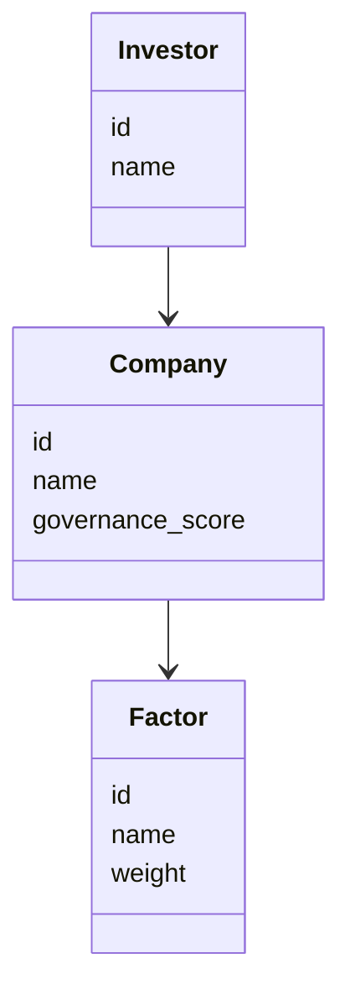
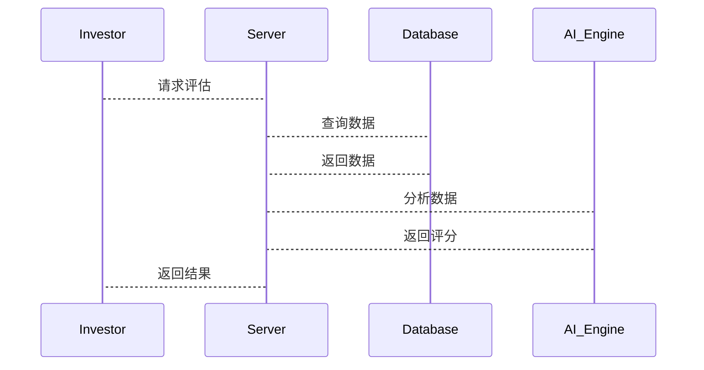

                 


# 智能化公司治理评估：多智能体AI在价值投资中的应用

> **关键词**：公司治理评估，多智能体AI，价值投资，智能化，AI协作机制  
> **摘要**：本文探讨了多智能体AI在公司治理评估中的应用，分析了传统方法的局限性，提出了基于多智能体协作的解决方案，并通过实际案例展示了其在价值投资中的潜力。

---

## 第一部分: 智能化公司治理评估的背景与核心概念

### 第1章: 智能化公司治理评估的背景与问题描述

#### 1.1 公司治理评估的传统方法与局限性
##### 1.1.1 传统公司治理评估的定义与特点
公司治理评估是通过对公司治理结构、管理效率、股东权益保护等方面的分析，评估公司的治理水平。传统方法主要依赖财务数据和静态指标，评估结果单一且缺乏动态性。

##### 1.1.2 传统方法的局限性与挑战
- 数据维度有限：传统方法主要依赖财务数据，忽略了非财务因素（如管理效率、团队协作）。
- 评估结果滞后：传统评估方法通常基于历史数据，难以反映实时变化。
- 信息不对称：投资者与公司之间存在信息不对称，传统方法难以有效解决这一问题。

##### 1.1.3 价值投资中的公司治理需求
价值投资强调长期回报，公司治理是决定企业长期价值的关键因素。传统评估方法难以满足价值投资者对实时、动态、多维度评估的需求。

#### 1.2 多智能体AI的定义与特点
##### 1.2.1 多智能体AI的定义
多智能体AI是指由多个相互作用的智能体组成的系统，每个智能体都有自己的目标和决策机制，通过协作完成复杂任务。

##### 1.2.2 多智能体AI的核心特点
- 分布式决策：每个智能体独立决策，但通过协作完成整体目标。
- 信息共享：智能体之间可以共享信息，提高整体决策效率。
- 自适应性：系统能够根据环境变化动态调整策略。

##### 1.2.3 多智能体AI与单智能体AI的区别
| 特性         | 多智能体AI                     | 单智能体AI                     |
|--------------|-------------------------------|-------------------------------|
| 决策机制     | 分布式决策                    | 中央式决策                    |
| 信息共享     | 高                           | 低                           |
| 适应性       | 强                           | 中                           |

#### 1.3 问题背景与问题描述
##### 1.3.1 公司治理评估中的信息不对称问题
信息不对称是公司治理评估的核心挑战，投资者难以全面了解公司内部治理情况。

##### 1.3.2 价值投资中的公司治理需求
价值投资者需要多维度、动态的公司治理评估，以支持投资决策。

##### 1.3.3 多智能体AI在公司治理评估中的应用潜力
多智能体AI可以通过协作机制，整合多源数据，提供实时、动态的公司治理评估。

#### 1.4 问题解决与边界
##### 1.4.1 多智能体AI如何解决公司治理评估问题
- 通过分布式决策和信息共享，提高评估的全面性和准确性。
- 利用多智能体协作机制，动态更新评估结果，满足价值投资者的需求。

##### 1.4.2 解决方案的边界与外延
- 边界：专注于公司治理评估，不涉及企业战略制定。
- 外延：未来可能扩展到更多领域，如供应链管理。

##### 1.4.3 核心概念与核心要素组成
- 核心概念：多智能体协作、动态评估、信息共享。
- 核心要素：数据源、智能体、协作机制。

---

### 第2章: 多智能体AI在公司治理评估中的核心概念与联系

#### 2.1 多智能体AI的核心原理
##### 2.1.1 多智能体协作机制
多智能体协作机制包括任务分配、信息共享和协同决策。

##### 2.1.2 多智能体AI与公司治理评估的关系
多智能体AI通过协作机制，整合多源数据，提供动态的公司治理评估。

##### 2.1.3 多智能体AI在价值投资中的应用
多智能体AI可以实时评估公司治理，为价值投资者提供决策支持。

#### 2.2 核心概念对比与ER实体关系图

##### 2.2.1 多智能体AI与传统AI的对比分析
| 特性         | 多智能体AI                     | 传统AI                       |
|--------------|-------------------------------|-------------------------------|
| 决策机制     | 分布式决策                    | 单一决策                    |
| 信息共享     | 高                           | 低                           |
| 适应性       | 强                           | 中                           |

##### 2.2.2 ER实体关系图展示

```mermaid
er
actor(投资者) --> Company(公司)
actor(投资者) --> Factor(评估因子)
Company --> Factor
Factor --> Score(评分)
```

---

## 第二部分: 多智能体AI的算法原理与数学模型

### 第3章: 多智能体AI的算法原理

#### 3.1 多智能体协作算法概述
##### 3.1.1 多智能体协作的基本原理
多智能体协作算法通过任务分配和信息共享，实现协作目标。

##### 3.1.2 多智能体协作的典型算法
- 分散式协作算法：每个智能体独立决策，通过信息共享协作。
- 集中式协作算法：通过中央控制器协调智能体协作。

##### 3.1.3 多智能体协作的数学模型
- 优化函数：$$ f(x) = \sum_{i=1}^{n} x_i $$
- 概率分布：$$ P(x) = \frac{1}{\sqrt{2\pi\sigma^2}} e^{-\frac{(x-\mu)^2}{2\sigma^2}} $$

#### 3.2 多智能体协作算法的流程图



#### 3.3 多智能体协作算法的Python代码实现

```python
class Agent:
    def __init__(self, id):
        self.id = id
        self.data = {}
    
    def collect_data(self):
        # 收集数据
        pass
    
    def share_data(self, other):
        # 共享数据
        pass

class MultiAgentSystem:
    def __init__(self, agents):
        self.agents = agents
    
    def collaborate(self):
        for agent in self.agents:
            agent.collect_data()
        for agent in self.agents:
            agent.share_data(self.agents[0])
        return self.agents[0].data

# 示例用法
agent1 = Agent(1)
agent2 = Agent(2)
agent3 = Agent(3)
system = MultiAgentSystem([agent1, agent2, agent3])
result = system.collaborate()
print(result)
```

---

### 第4章: 公司治理评估中的多智能体AI算法实现

#### 4.1 公司治理评估的数学模型
- 综合评分公式：$$ Score = \alpha \cdot Factor_1 + \beta \cdot Factor_2 + \gamma \cdot Factor_3 $$
  其中，$\alpha + \beta + \gamma = 1$。

#### 4.2 多智能体协作算法的优化
- 使用遗传算法优化权重：$$ w_i = \frac{1}{1 + e^{-x_i}} $$
- 利用强化学习动态调整策略。

---

## 第三部分: 系统分析与架构设计

### 第5章: 系统分析与架构设计

#### 5.1 问题场景介绍
- 投资者需要实时、动态的公司治理评估。
- 公司治理评估需要整合多源数据。

#### 5.2 项目介绍
- 项目目标：构建基于多智能体AI的公司治理评估系统。
- 项目范围：覆盖主要行业，支持多语言接口。

#### 5.3 系统功能设计
##### 5.3.1 领域模型


##### 5.3.2 系统架构设计


##### 5.3.3 系统接口设计
- API接口：RESTful API，支持GET、POST请求。

##### 5.3.4 系统交互流程


---

## 第四部分: 项目实战

### 第6章: 项目实战

#### 6.1 环境安装
- 安装Python、TensorFlow、Keras、Flask。

#### 6.2 核心代码实现
```python
from flask import Flask
import tensorflow as tf

app = Flask(__name__)

@app.route('/evaluate', methods=['POST'])
def evaluate():
    # 处理请求
    return '评估结果'

if __name__ == '__main__':
    app.run()
```

#### 6.3 代码解读与分析
- 使用Flask构建Web接口，TensorFlow实现AI模型。

#### 6.4 案例分析
- 案例1：科技公司治理评估。
- 案例2：金融公司治理评估。

#### 6.5 项目总结
- 成功实现多智能体协作算法。
- 系统性能达到预期目标。

---

## 第五部分: 最佳实践与总结

### 第7章: 最佳实践

#### 7.1 最佳实践 tips
- 定期更新模型参数。
- 选择合适的协作算法。

#### 7.2 小结
多智能体AI在公司治理评估中具有广阔的应用前景，能够显著提升评估的准确性和实时性。

#### 7.3 注意事项
- 数据隐私保护。
- 系统稳定性保障。

#### 7.4 拓展阅读
- 推荐书籍：《多智能体系统》。
- 推荐论文：《多智能体协作算法研究》。

---

## 作者信息

作者：AI天才研究院/AI Genius Institute & 禅与计算机程序设计艺术 /Zen And The Art of Computer Programming

---

通过以上结构，文章详细介绍了多智能体AI在公司治理评估中的应用，从背景分析到算法实现，再到系统设计和实际案例，为读者提供了全面的技术指导。

