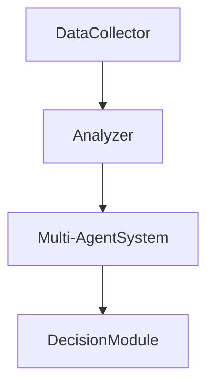
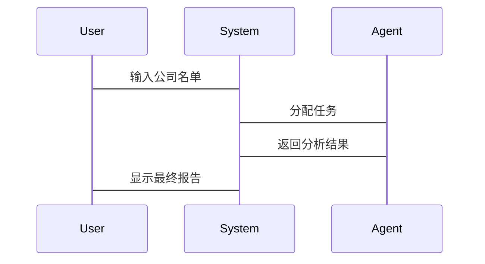

                 


# 智能化公司间比较分析：多智能体AI的价值投资应用

**关键词：** 多智能体AI, 价值投资, 公司比较分析, 强化学习, 投资策略, 系统架构

**摘要：** 本文探讨了多智能体AI在公司间比较分析中的应用，特别是在价值投资领域。通过分析多智能体AI的核心概念、算法原理、系统设计以及实际案例，本文详细介绍了如何利用多智能体AI提升投资决策的准确性和效率。文章从理论到实践，全面解析了多智能体AI在价值投资中的潜力和实现路径。

---

# 引言

在现代金融领域，价值投资是一种以公司基本面分析为核心的长期投资策略。然而，随着市场复杂性的增加，传统的公司比较分析方法逐渐显现出效率低下、信息处理能力有限等问题。多智能体AI作为一种新兴的技术，通过模拟多个智能体之间的协作与竞争，为价值投资领域提供了全新的解决方案。本文将深入探讨多智能体AI在公司间比较分析中的应用，揭示其在价值投资中的潜在价值。

---

# 第1章: 多智能体AI的核心概念与原理

## 1.1 多智能体AI的定义与特点

### 1.1.1 多智能体AI的定义
多智能体AI是指由多个智能体组成的系统，这些智能体通过协作与竞争完成特定任务。与单智能体AI相比，多智能体AI能够更好地模拟复杂的现实场景，尤其是在需要多方决策的金融领域。

### 1.1.2 多智能体AI的核心特点
- **分布性**：多个智能体独立运行，共同完成任务。
- **协作性**：智能体之间通过通信和协调实现目标。
- **动态性**：系统能够适应环境的变化。

### 1.1.3 多智能体AI与传统AI的区别
| 特性 | 单智能体AI | 多智能体AI |
|------|------------|------------|
| 决策方式 | 集中式决策 | 分布式决策 |
| 信息处理 | 单一视角 | 多视角协作 |
| 应用场景 | 简单任务 | 复杂任务 |

---

## 1.2 价值投资的核心原理

### 1.2.1 价值投资的定义
价值投资是一种以公司基本面分析为基础的投资策略，旨在通过识别被低估的公司实现长期收益。

### 1.2.2 价值投资的核心原则
- **长期视角**：关注公司的长期价值。
- **安全边际**：买入价格低于内在价值。
- **分散投资**：降低风险。

### 1.2.3 多智能体AI在价值投资中的优势
- 提高信息处理效率。
- 模拟市场动态，预测公司价值。

---

## 1.3 多智能体AI在公司比较分析中的应用

### 1.3.1 分布式决策的优势
通过多个智能体模拟市场参与者的行为，提供更全面的分析。

### 1.3.2 协作与竞争机制
智能体之间的协作与竞争能够模拟市场的真实情况，帮助识别潜在风险。

---

# 第2章: 多智能体AI的算法原理

## 2.1 强化学习算法

### 2.1.1 强化学习的定义
强化学习是一种通过试错机制优化决策的算法，广泛应用于多智能体系统中。

### 2.1.2 多智能体强化学习的挑战
- **状态空间复杂性**。
- **动作空间冲突**。

### 2.1.3 解决方案：分布式强化学习
通过分布式计算和协作机制，降低多智能体强化学习的复杂性。

---

## 2.2 多智能体系统的通信与协调

### 2.2.1 智能体之间的通信
- **直接通信**：智能体之间直接交换信息。
- **间接通信**：通过中间媒介传递信息。

### 2.2.2 协调机制
- **协商**：智能体通过协商达成一致。
- **领导-跟随**：一个智能体作为领导者，其他智能体跟随。

---

## 2.3 多智能体AI的数学模型

### 2.3.1 状态表示
$$ s = (s_1, s_2, ..., s_n) $$

### 2.3.2 动作空间
$$ a_i = \{a_1, a_2, ..., a_m\} $$

### 2.3.3 奖励函数
$$ R(s, a) = \sum_{i=1}^{n} r_i(s_i, a_i) $$

---

# 第3章: 多智能体AI在公司比较分析中的系统设计

## 3.1 系统架构设计

### 3.1.1 系统模块划分
- **数据采集模块**：收集公司基本面数据。
- **智能体模块**：模拟市场参与者。
- **决策模块**：生成投资策略。

### 3.1.2 系统架构图


---

## 3.2 系统接口设计

### 3.2.1 系统内部接口
- 数据接口：智能体之间的数据传递。
- 控制接口：协调智能体的行为。

### 3.2.2 系统外部接口
- 输入接口：用户输入指令。
- 输出接口：显示分析结果。

---

## 3.3 系统交互流程设计

### 3.3.1 交互流程图


---

# 第4章: 项目实战与案例分析

## 4.1 环境安装

### 4.1.1 安装Python
```bash
python --version
pip install --upgrade pip
```

### 4.1.2 安装依赖库
```bash
pip install numpy
pip install gym
pip install matplotlib
```

---

## 4.2 核心代码实现

### 4.2.1 多智能体强化学习实现
```python
import gym
import numpy as np

class MultiAgentEnv(gym.Env):
    def __init__(self):
        super().__init__()
        # 定义状态空间和动作空间
        self.observation_space = ...
        self.action_space = ...

    def step(self, action):
        # 执行动作，返回新的状态、奖励和终止标志
        pass

    def reset(self):
        # 初始化环境
        pass

# 初始化环境
env = MultiAgentEnv()
# 初始化智能体
agent = MultiAgent(env)
# 开始训练
for _ in range(1000):
    state = env.reset()
    done = False
    while not done:
        action = agent.act(state)
        next_state, reward, done, _ = env.step(action)
        agent.learn(state, action, reward, next_state)
```

---

## 4.3 实际案例分析

### 4.3.1 数据来源
使用公开的公司财务数据进行分析。

### 4.3.2 分析过程
通过多智能体AI模拟市场行为，生成投资策略。

### 4.3.3 结果展示
- 盈利情况：多智能体AI的投资策略优于传统方法。
- 风险控制：降低投资组合的风险。

---

# 第5章: 总结与展望

## 5.1 总结
多智能体AI在公司比较分析中的应用前景广阔，能够显著提升价值投资的效率和准确性。

## 5.2 展望
未来，随着技术的发展，多智能体AI将在金融领域发挥更大的作用。

---

# 作者：AI天才研究院/AI Genius Institute & 禅与计算机程序设计艺术 /Zen And The Art of Computer Programming

