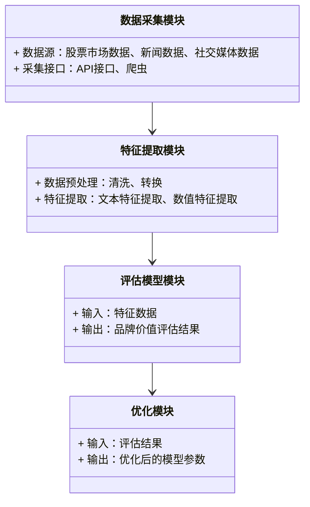
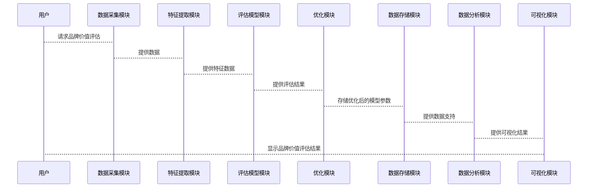

                 


```markdown
# 智能化品牌价值评估：多智能体AI在价值投资中的应用

## 关键词：智能化品牌价值评估，多智能体AI，价值投资，强化学习，品牌评估模型

## 摘要： 
本文探讨了智能化品牌价值评估在价值投资中的应用，重点分析了多智能体AI在品牌价值评估中的优势与实现路径。文章首先介绍了品牌价值评估的传统方法及其局限性，然后详细阐述了多智能体AI的基本概念、工作原理以及其在品牌价值评估中的应用优势。接着，文章深入分析了基于多智能体AI的品牌价值评估算法，包括强化学习和多智能体协作算法，并通过数学公式和mermaid流程图详细展示了算法的实现过程。随后，文章探讨了系统的架构设计，包括功能模块设计、系统架构图以及系统交互序列图。最后，通过具体的项目实战和案例分析，展示了多智能体AI在品牌价值评估中的实际应用，并提出了系统的优化方向和未来研究的重点。本文旨在为价值投资者和AI技术研究者提供一种新的视角和方法，以提升品牌价值评估的智能化水平和准确性。

---

## 第一章: 智能化品牌价值评估的背景与概述

### 1.1 问题背景与意义
#### 1.1.1 品牌价值评估的传统方法与局限性
品牌价值是企业核心竞争力的重要体现，传统的品牌价值评估方法主要依赖于财务指标、市场调研和专家评分等手段。然而，这些方法存在以下局限性：
- 数据依赖性强，难以处理非结构化数据。
- 评估周期长，难以及时捕捉市场动态。
- 主观性较强，专家经验难以量化。

#### 1.1.2 多智能体AI的引入及其优势
随着人工智能技术的快速发展，多智能体AI（Multi-Agent AI）在品牌价值评估中的应用逐渐兴起。多智能体AI通过分布式计算和协作学习，能够有效整合多源数据，实时分析市场动态，从而提供更精准的品牌价值评估结果。其主要优势包括：
- 多源数据整合能力：能够处理结构化、半结构化和非结构化数据。
- 实时性：能够快速响应市场变化，提供实时评估结果。
- 分布式计算：通过多智能体协作，提高计算效率和评估精度。

#### 1.1.3 智能化品牌价值评估的必要
在当前竞争激烈的市场环境中，品牌价值评估需要更加智能化和动态化。智能化品牌价值评估能够帮助企业更好地把握市场趋势，优化投资决策，提升品牌竞争力。

---

## 第二章: 多智能体AI的核心概念与理论

### 2.1 多智能体AI的基本概念
#### 2.1.1 多智能体系统的定义与特点
多智能体系统是由多个智能体组成的分布式系统，每个智能体能够独立决策并与其他智能体协作完成任务。其特点包括：
- 分布式计算：智能体之间通过通信和协作完成任务。
- 自主性：每个智能体具有自主决策能力。
- 可扩展性：系统能够根据需求扩展智能体数量。

#### 2.1.2 多智能体与传统AI的区别
与传统AI相比，多智能体AI具有以下显著区别：
| 特性 | 传统AI | 多智能体AI |
|------|--------|------------|
| 决策方式 | 中央控制 | 分布式决策 |
| 数据处理 | 单点处理 | 分布式协作 |
| 应用场景 | 单任务处理 | 多任务协作 |

#### 2.1.3 品牌价值评估中的多智能体协作
在品牌价值评估中，多智能体AI可以通过以下方式实现协作：
1. 数据采集智能体：负责采集品牌相关的市场数据。
2. 特征提取智能体：对数据进行特征提取和处理。
3. 评估模型智能体：基于特征数据进行品牌价值评估。
4. 优化智能体：根据评估结果优化模型参数。

### 2.2 品牌价值评估模型
#### 2.2.1 基于多智能体的评估模型
基于多智能体的评估模型通过多个智能体协作完成品牌价值评估。模型主要由以下几个部分组成：
1. 数据采集模块：负责从多个数据源采集品牌相关数据。
2. 特征提取模块：对数据进行预处理和特征提取。
3. 评估模块：基于特征数据进行品牌价值评估。
4. 优化模块：根据评估结果优化模型参数。

#### 2.2.2 多智能体协作的基本原理
多智能体协作的基本原理可以总结为以下步骤：
1. 数据采集智能体从多个数据源采集品牌相关数据。
2. 特征提取智能体对数据进行预处理和特征提取。
3. 评估模型智能体基于特征数据进行品牌价值评估。
4. 优化智能体根据评估结果优化模型参数。

---

## 第三章: 多智能体AI的品牌价值评估算法

### 3.1 强化学习算法
#### 3.1.1 Q-learning算法
Q-learning是一种经典的强化学习算法，其核心思想是通过智能体与环境的交互，逐步优化动作策略。Q-learning的数学公式如下：

$$ Q(s, a) = Q(s, a) + \alpha \cdot [r + \gamma \cdot \max Q(s', a') - Q(s, a)] $$

其中：
- \( Q(s, a) \) 表示在状态 \( s \) 下采取动作 \( a \) 的价值。
- \( \alpha \) 是学习率。
- \( r \) 是奖励值。
- \( \gamma \) 是折扣因子。
- \( Q(s', a') \) 是下一状态下的最大价值。

#### 3.1.2 多智能体协作算法
多智能体协作算法的核心思想是通过智能体之间的协作，优化整体的评估效果。常用的协作算法包括：
1. 基于通信的协作算法：智能体之间通过通信共享信息。
2. 基于分布式计算的协作算法：智能体之间通过分布式计算完成任务。

---

## 第四章: 品牌价值评估系统的架构设计

### 4.1 系统应用场景
品牌价值评估系统的主要应用场景包括：
- 企业品牌价值评估：帮助企业了解自身品牌价值。
- 投资决策支持：为投资者提供品牌价值评估结果，支持投资决策。
- 市场研究：为企业提供市场趋势分析和竞争对手评估。

### 4.2 系统功能设计
品牌价值评估系统的功能模块设计如下：



### 4.3 系统架构设计
品牌价值评估系统的架构设计如下：


### 4.4 系统交互设计
系统交互设计如下：



---

## 第五章: 项目实战与案例分析

### 5.1 项目环境配置
项目环境配置如下：
- 操作系统：Linux
- 开发工具：Python、Jupyter Notebook
- 第三方库：numpy、pandas、scikit-learn、keras、tensorflow

### 5.2 核心代码实现
以下是品牌价值评估系统的核心代码实现：

```python
import numpy as np
import pandas as pd
from sklearn.preprocessing import StandardScaler
from keras.models import Model
from keras.layers import Input, Dense

# 数据预处理
def preprocess_data(data):
    # 数据清洗
    data = data.dropna()
    # 标准化处理
    scaler = StandardScaler()
    data = scaler.fit_transform(data)
    return data

# 基于强化学习的评估模型
def reinforcement_learning_model(input_dim):
    input_layer = Input(shape=(input_dim,))
    dense_layer = Dense(64, activation='relu')(input_layer)
    output_layer = Dense(1, activation='linear')(dense_layer)
    model = Model(inputs=input_layer, outputs=output_layer)
    model.compile(optimizer='adam', loss='mean_squared_error')
    return model

# 多智能体协作算法
def multi_agent_collaboration(data):
    agents = []
    # 初始化智能体
    for _ in range(4):
        agent = reinforcement_learning_model(len(data[0]))
        agents.append(agent)
    # 协作学习
    for agent in agents:
        agent.fit(data, labels, epochs=10, batch_size=32)
    return agents

# 系统优化
def optimize_model(agents, data, labels):
    for agent in agents:
        agent.fit(data, labels, epochs=20, batch_size=32)
    return agents

# 主函数
if __name__ == '__main__':
    # 数据加载
    data = pd.read_csv('brand_data.csv')
    labels = data['brand_value'].values
    features = preprocess_data(data.drop('brand_value', axis=1))
    # 模型训练
    agents = multi_agent_collaboration(features)
    # 模型优化
    optimized_agents = optimize_model(agents, features, labels)
    # 结果输出
    for agent in optimized_agents:
        print(agent.evaluate(features, labels))
```

### 5.3 案例分析与优化
通过具体案例分析，展示系统的实际应用效果，并根据评估结果提出优化方向。

---

## 第六章: 系统优化与未来展望

### 6.1 系统优化方向
系统优化方向包括：
- 提高模型的可解释性。
- 引入多模态数据，如图像、视频等。
- 提升系统的实时性。

### 6.2 未来研究的重点
未来研究的重点包括：
- 多智能体协作算法的优化。
- 增强学习在品牌价值评估中的应用。
- 模型的可解释性与透明度。

---

## 结语

智能化品牌价值评估是多智能体AI在价值投资中的重要应用。通过多智能体AI的技术优势，品牌价值评估能够更加精准和动态化。未来，随着技术的不断发展，智能化品牌价值评估将在更多领域发挥重要作用。

---

## 作者：AI天才研究院 & 禅与计算机程序设计艺术
```

