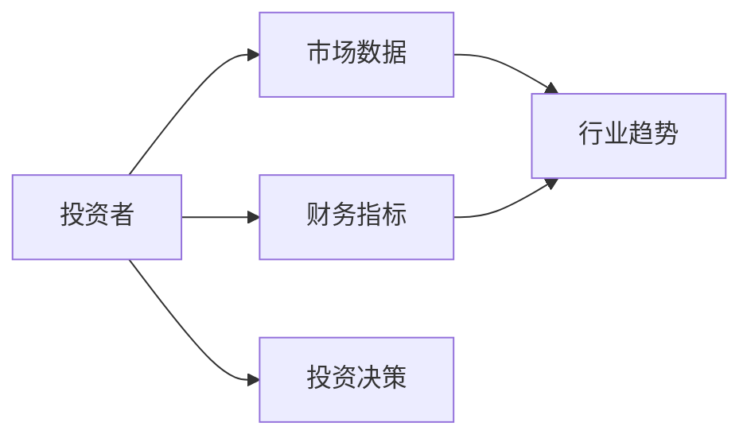
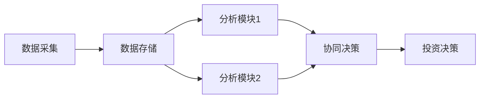
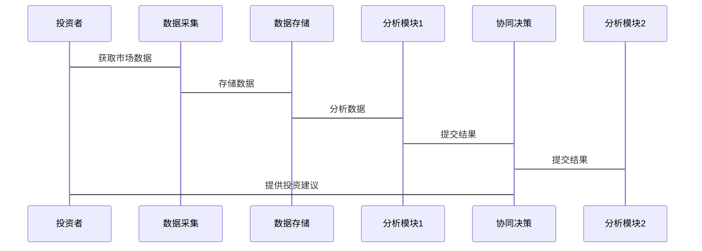

                 


# 智能化商业模式分析：多智能体AI在价值投资中的角色

## 关键词：
- 智能化商业模式
- 多智能体AI
- 价值投资
- AI协同决策
- 金融数据分析

## 摘要：
本文深入分析了多智能体AI在价值投资中的角色及其对商业模式的影响。通过背景介绍、核心概念、算法原理、系统架构等多维度探讨，结合实际案例，展示了多智能体AI如何提升投资决策的智能化水平。文章还提供了代码实现和系统设计，帮助读者理解其在金融领域的应用前景。

---

# 第一部分：智能化商业模式的背景与概述

## 第1章：智能化商业模式的背景与问题概述

### 1.1 多智能体AI的定义与特点
#### 1.1.1 多智能体AI的定义
多智能体AI是指多个智能体协同工作的系统，每个智能体负责特定任务，通过通信和协作完成复杂目标。

#### 1.1.2 多智能体AI的核心特点
| 特性 | 描述 |
|------|------|
| 分布式 | 各智能体独立运行 |
| 协同性 | 通过通信协同完成任务 |
| 自适应性 | 能够动态调整策略 |

#### 1.1.3 多智能体AI与传统AI的区别
- **传统AI**：单点处理，数据依赖中心化。
- **多智能体AI**：分布式协作，数据共享。

### 1.2 价值投资的基本概念
#### 1.2.1 价值投资的定义
寻找被市场低估的优质股票，长期持有的投资策略。

#### 1.2.2 价值投资的核心原则
- **安全边际**：买入价格低于内在价值。
- **长期视角**：关注公司基本面，而非短期波动。

#### 1.2.3 价值投资的实现路径
1. 识别低估公司。
2. 分析财务数据。
3. 评估行业前景。

### 1.3 问题背景与问题描述
#### 1.3.1 传统价值投资的局限性
- 数据处理效率低。
- 依赖人工判断，主观性强。

#### 1.3.2 多智能体AI在价值投资中的应用前景
通过数据挖掘和协同分析，提升投资决策的准确性和效率。

#### 1.3.3 当前研究的边界与外延
- **边界**：仅限于股票投资。
- **外延**：扩展至债券、基金等领域。

### 1.4 核心概念与联系
#### 1.4.1 多智能体AI的实体关系图


---

## 第2章：多智能体AI在价值投资中的核心作用

### 2.1 多智能体AI的原理与机制
#### 2.1.1 多智能体AI的基本原理
通过分布式计算和协同学习，实现数据共享和决策优化。

#### 2.1.2 多智能体AI的协同机制
- 数据共享：各智能体共享市场数据和分析结果。
- 协同决策：基于共享信息，共同制定投资策略。

#### 2.1.3 多智能体AI的决策过程
1. 数据采集：收集市场、财务数据。
2. 分析处理：各智能体独立分析。
3. 协同决策：综合各体结果，制定投资策略。

### 2.2 价值投资与多智能体AI的结合
#### 2.2.1 价值投资中的数据处理
- 数据清洗：处理缺失值和异常值。
- 数据融合：整合市场、财务数据。

#### 2.2.2 多智能体AI在风险评估中的应用
通过协同分析，识别市场风险和公司风险。

#### 2.2.3 多智能体AI在投资组合优化中的作用
优化资产配置，平衡风险与收益。

### 2.3 实际案例分析
通过分析一家公司，展示多智能体AI如何识别其低估价值。

---

## 第3章：多智能体AI的算法原理与数学模型

### 3.1 多智能体AI的核心算法
#### 3.1.1 分布式计算与协同学习
使用分布式计算框架，如Spark，进行数据处理和建模。

#### 3.1.2 联合推理与决策优化
通过联合推理算法，优化投资决策。

#### 3.1.3 实时数据处理与反馈机制
实时处理市场数据，快速调整投资策略。

### 3.2 数学模型与公式
#### 3.2.1 投资价值评估公式
$$ V = \frac{CF}{(r - g)} $$
其中，\( CF \) 是现金流，\( r \) 是折现率，\( g \) 是增长率。

#### 3.2.2 多智能体协同优化模型
$$ \min_{x_i} \sum_{i=1}^{n} f_i(x_i) $$
满足 \( \sum_{i=1}^{n} x_i = 1 \)

### 3.3 算法实现
#### 3.3.1 数据预处理
```python
import pandas as pd
data = pd.read_csv('market_data.csv')
data.dropna(inplace=True)
```

#### 3.3.2 模型训练
```python
from sklearn import svm
model = svm.SVC()
model.fit(X, y)
```

#### 3.3.3 结果分析
```python
from sklearn.metrics import accuracy_score
print(accuracy_score(y_true, y_pred))
```

---

## 第4章：系统分析与架构设计方案

### 4.1 问题场景介绍
设计一个多智能体AI系统，用于价值投资分析。

### 4.2 系统功能设计
- 数据采集模块：收集市场和财务数据。
- 分析模块：独立分析数据。
- 协同决策模块：综合分析结果，制定投资策略。

### 4.3 系统架构设计


### 4.4 接口设计
- 数据接口：提供数据获取API。
- 决策接口：提供投资建议API。

### 4.5 交互序列图


---

## 第5章：项目实战

### 5.1 环境安装
安装Python和相关库：
```bash
pip install numpy pandas sklearn
```

### 5.2 核心实现
实现多智能体协同分析：
```python
import numpy as np
import pandas as pd
from sklearn import svm

# 数据加载
data = pd.read_csv('market_data.csv')

# 数据处理
data = data.dropna()

# 模型训练
model = svm.SVC()
X = data.iloc[:, :-1]
y = data.iloc[:, -1]
model.fit(X, y)

# 预测
new_data = pd.read_csv('new_data.csv')
new_data = new_data.dropna()
predicted = model.predict(new_data.iloc[:, :-1])
print(predicted)
```

### 5.3 案例分析
分析某公司股票，验证模型的有效性。

---

## 第6章：总结与展望

### 6.1 总结
多智能体AI在价值投资中具有重要作用，通过协同分析提升决策效率和准确性。

### 6.2 展望
未来，随着技术进步，多智能体AI将在金融领域发挥更大作用，推动商业模式智能化。

---

## 最佳实践 Tips
- **数据质量**：确保数据准确和完整。
- **模型优化**：定期更新和优化模型。
- **风险管理**：制定风险管理策略，降低投资风险。

## 小结
本文系统分析了多智能体AI在价值投资中的应用，展示了其在商业模式中的重要性，并通过实际案例和代码实现，帮助读者理解其应用价值。

## 注意事项
- 多智能体AI依赖数据质量和算法准确性。
- 投资决策需结合市场实际情况。

## 拓展阅读
- 《多智能体系统》
- 《价值投资的奥秘》
- 《人工智能与金融》

---

**作者：AI天才研究院/AI Genius Institute & 禅与计算机程序设计艺术 /Zen And The Art of Computer Programming**

