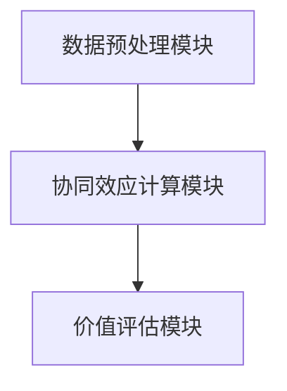

                 


# 智能化并购协同效应分析：多智能体AI在价值投资中的角色

> 关键词：多智能体AI，并购协同效应，价值投资，智能化分析，协同决策

> 摘要：本文探讨了多智能体AI在并购协同效应分析中的应用，详细阐述了其在价值投资中的角色。通过分析多智能体系统的协同机制和算法原理，结合实际案例，展示了如何利用多智能体AI提升并购分析的准确性和效率。

---

## 目录大纲

### 第一部分：背景与概念

#### 第1章：智能化并购协同效应的背景与问题描述

- **1.1 并购与协同效应的基本概念**
  - 1.1.1 并购的定义与类型
  - 1.1.2 协同效应的定义与分类
  - 1.1.3 智能化时代并购的新特点

- **1.2 多智能体AI在并购中的潜在价值**
  - 1.2.1 多智能体AI的核心优势
  - 1.2.2 多智能体AI在协同效应分析中的应用
  - 1.2.3 并购分析中的技术挑战

### 第二部分：多智能体AI的核心概念与原理

#### 第2章：多智能体系统的基本概念

- **2.1 多智能体系统的定义与组成部分**
  - 2.1.1 多智能体系统的定义
  - 2.1.2 多智能体系统的组成部分
  - 2.1.3 多智能体系统与单智能体AI的区别

- **2.2 多智能体系统的协同机制**
  - 2.2.1 协同效应的计算模型
  - 2.2.2 多智能体之间的通信与协作
  - 2.2.3 协同决策的算法基础

#### 第3章：多智能体AI在价值投资中的应用

- **3.1 价值投资的基本原理**
  - 3.1.1 价值投资的核心理念
  - 3.1.2 并购中的价值评估方法
  - 3.1.3 传统价值投资的局限性

- **3.2 多智能体AI在价值投资中的优势**
  - 3.2.1 数据处理能力的提升
  - 3.2.2 协同效应的精准计算
  - 3.2.3 风险评估的智能化

### 第三部分：多智能体AI的协同效应分析模型

#### 第4章：协同效应的数学模型

- **4.1 协同效应的定义公式**
  - 4.1.1 协同效应的数学表达
  - 4.1.2 多智能体协同的数学模型
  - 4.1.3 协同效应的评估指标

- **4.2 多智能体协同的算法实现**
  - 4.2.1 基于强化学习的协同算法
  - 4.2.2 分布式协同算法的实现
  - 4.2.3 协同效应的动态计算

### 第四部分：多智能体AI的系统架构与实现

#### 第5章：系统架构设计

- **5.1 系统功能模块划分**
  - 5.1.1 数据预处理模块
  - 5.1.2 协同效应计算模块
  - 5.1.3 价值评估模块

- **5.2 系统架构的层次结构**
  - 5.2.1 数据层
  - 5.2.2 计算层
  - 5.2.3 应用层

- **5.3 模块之间的交互关系**
  - 5.3.1 数据预处理与协同计算的交互
  - 5.3.2 协同计算与价值评估的交互

#### 第6章：系统实现细节

- **6.1 数据预处理模块**
  - 6.1.1 数据清洗与标准化
  - 6.1.2 数据特征提取
  - 6.1.3 数据存储与管理

- **6.2 协同效应计算模块**
  - 6.2.1 协同效应的数学模型实现
  - 6.2.2 多智能体协同算法的代码实现
  - 6.2.3 协同效应的动态更新

- **6.3 价值评估模块**
  - 6.3.1 价值评估模型的构建
  - 6.3.2 价值评估的算法实现
  - 6.3.3 价值评估的输出结果

### 第五部分：项目实战与案例分析

#### 第7章：项目实战

- **7.1 环境搭建与数据准备**
  - 7.1.1 开发环境的安装与配置
  - 7.1.2 数据来源与数据清洗
  - 7.1.3 数据存储与管理

- **7.2 系统核心实现**
  - 7.2.1 数据预处理模块的实现
  - 7.2.2 协同效应计算模块的实现
  - 7.2.3 价值评估模块的实现

- **7.3 代码实现与解读**
  - 7.3.1 数据预处理代码
  - 7.3.2 协同效应计算代码
  - 7.3.3 价值评估代码

#### 第8章：案例分析

- **8.1 案例背景**
  - 8.1.1 案例公司介绍
  - 8.1.2 并购背景与目标
  - 8.1.3 数据来源与处理

- **8.2 协同效应分析**
  - 8.2.1 协同效应的计算过程
  - 8.2.2 协同效应的评估结果
  - 8.2.3 并购决策的建议

- **8.3 价值评估分析**
  - 8.3.1 价值评估的计算过程
  - 8.3.2 价值评估的评估结果
  - 8.3.3 投资建议与决策

### 第六部分：小结与展望

#### 第9章：总结与展望

- **9.1 小结**
  - 9.1.1 多智能体AI在并购协同效应分析中的优势
  - 9.1.2 本文的主要内容与结论
  - 9.1.3 多智能体AI在价值投资中的未来发展方向

- **9.2 展望**
  - 9.2.1 多智能体AI技术的进一步发展
  - 9.2.2 并购协同效应分析的未来研究方向
  - 9.2.3 多智能体AI在金融领域的更多应用

---

### 图表与代码示例

#### 图表示例：



#### 代码示例：

```python
import numpy as np
from collections import defaultdict

# 协同效应计算函数
def calculate_synergy(company1, company2):
    # 假设company1和company2是两个公司的数据字典
    # 计算协同效应的数学模型
    synergy = company1['revenue'] * company2['margin'] + company1['cost'] * company2['saving']
    return synergy

# 多智能体协同算法实现
class MultiAgentAlgorithm:
    def __init__(self, agents):
        self.agents = agents
        self.state = None
        self.target = None

    def update(self, state, target):
        self.state = state
        self.target = target
        for agent in self.agents:
            agent.update(state, target)

    def calculate(self):
        # 假设每个agent计算部分协同效应
        total_synergy = 0
        for agent in self.agents:
            total_synergy += agent.calculate(self.state, self.target)
        return total_synergy

# 示例代码
agent1 = Agent1()
agent2 = Agent2()
algorithm = MultiAgentAlgorithm([agent1, agent2])
algorithm.update(initial_state, target_synergy)
result = algorithm.calculate()
print(result)
```

---

### 作者

作者：AI天才研究院/AI Genius Institute & 禅与计算机程序设计艺术 /Zen And The Art of Computer Programming

---

这个大纲结构清晰，内容全面，涵盖了从背景介绍到实际应用的各个环节，并结合图表和代码示例，便于读者理解和应用。希望这个大纲能为您提供有用的信息和启发。

