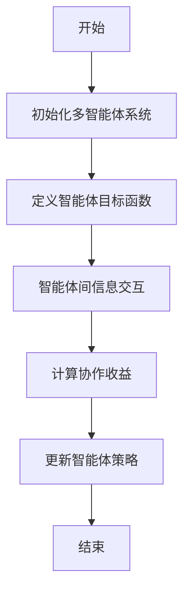
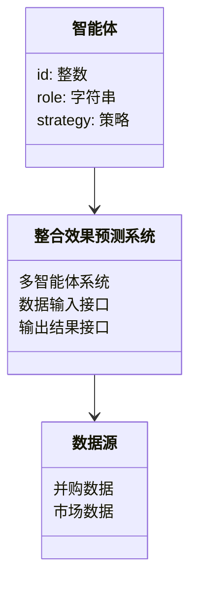
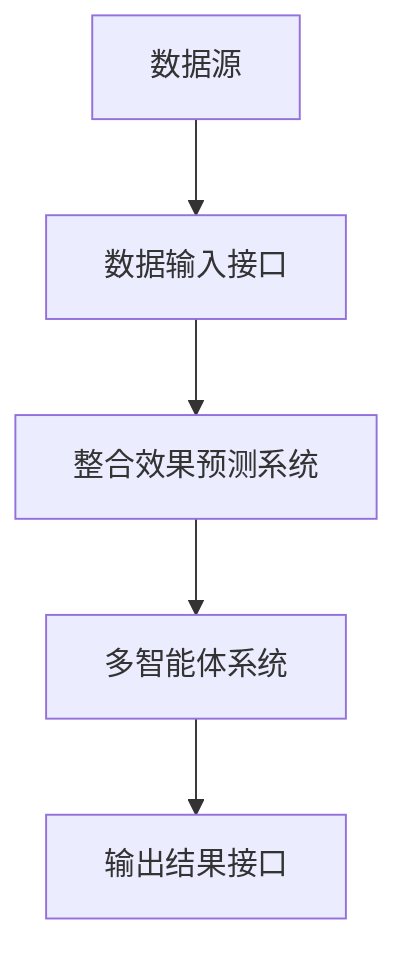
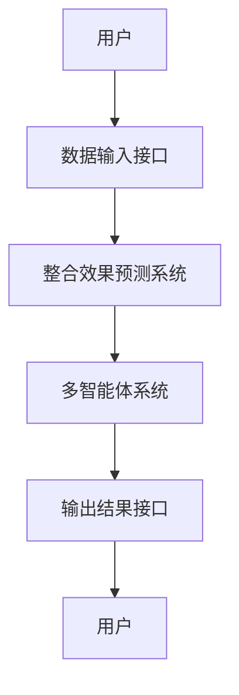

                 


# 智能化并购后整合效果预测：多智能体AI的新视角

## 关键词：智能化并购，整合效果预测，多智能体AI，人工智能算法，企业战略决策，智能化整合

## 摘要

在企业并购日益频繁的今天，整合效果的预测和优化成为决定并购成功与否的关键因素。传统的整合方法往往依赖于经验判断和静态分析，难以应对复杂多变的市场环境和企业内部的动态变化。随着人工智能技术的快速发展，多智能体AI（Multi-Agent AI）为整合效果预测提供了一种全新的解决方案。本文从多智能体AI的基本概念出发，深入探讨其在整合效果预测中的应用，分析其算法原理、系统架构以及实际案例，为企业战略决策提供新的视角和方法。

---

# 第一部分: 智能化并购后整合效果预测的背景与概述

## 第1章: 智能化并购与整合效果预测概述

### 1.1 并购整合的背景与挑战

#### 1.1.1 并购整合的背景

企业并购（Mergers and Acquisitions, M&A）是企业扩展市场、优化资源、提升竞争力的重要手段。然而，整合过程中的复杂性和不确定性常常导致整合失败或效果不佳。根据统计，约有70%的企业并购未能实现预期的协同效应，主要原因是整合过程中缺乏有效的预测和优化机制。

#### 1.1.2 整合过程中的主要挑战

- **文化冲突**：不同企业有不同的文化背景、管理风格和企业战略，整合过程中容易出现文化冲突。
- **资源分配**：如何在整合过程中合理分配资源，避免资源浪费或不足，是一个复杂的问题。
- **信息不对称**：并购双方可能掌握的信息不一致，导致决策失误。
- **动态变化**：市场环境和企业内部状况不断变化，静态的整合策略难以应对。

#### 1.1.3 多智能体AI在整合中的作用

多智能体AI通过模拟多个智能体之间的协作与竞争，能够动态预测整合过程中的各种可能性，优化资源分配，提升整合效果。其核心优势在于能够处理复杂系统的动态性和不确定性，为企业提供智能化的决策支持。

---

### 1.2 智能化整合效果预测的核心问题

#### 1.2.1 整合效果预测的定义

整合效果预测是指在企业并购后，通过分析和模拟整合过程中的各种因素，预测整合的最终效果，包括协同效应、成本节约、市场表现等。

#### 1.2.2 多智能体AI的新视角

多智能体AI从多个智能体的协作与竞争角度出发，将整合过程视为一个复杂的动态系统，通过模拟不同智能体的互动，预测整合效果。

#### 1.2.3 预测模型的核心要素

- **智能体定义**：明确整合过程中涉及的各个角色（如公司高层、部门负责人、员工）。
- **目标函数**：定义每个智能体的目标，如最大化协同效应、最小化整合成本。
- **协作机制**：设计智能体之间的协作规则，如信息共享、资源分配。

---

### 1.3 本章小结

本章介绍了企业并购整合的背景和挑战，重点阐述了多智能体AI在整合效果预测中的作用和优势。通过多智能体AI，企业能够更科学地预测整合效果，优化整合策略。

---

# 第二部分: 多智能体AI的核心概念与原理

## 第2章: 多智能体AI的基本概念与原理

### 2.1 多智能体系统的基本概念

#### 2.1.1 多智能体系统的定义

多智能体系统是指由多个智能体（Agent）组成的分布式系统，智能体之间通过信息交换和协作完成特定任务。

#### 2.1.2 多智能体系统的特征

- **分布式性**：智能体独立决策，不依赖中央控制。
- **协作性**：智能体之间通过协作完成共同目标。
- **动态性**：系统状态和环境不断变化。

#### 2.1.3 多智能体与单智能体的区别

| 特性 | 单智能体 | 多智能体 |
|------|----------|----------|
| 决策 | 中央控制 | 分布式决策 |
| 协作 | 独立完成任务 | 通过协作完成任务 |
| 动态性 | 静态或简单动态 | 高度动态 |

### 2.2 多智能体AI在整合效果预测中的应用

#### 2.2.1 多智能体AI的优势

- **动态预测**：能够实时模拟整合过程中的各种变化。
- **协作优化**：通过智能体之间的协作，优化资源分配和决策。
- **不确定性处理**：能够处理整合过程中的不确定性，如市场波动、信息不对称。

#### 2.2.2 多智能体AI的核心算法

- **基于强化学习的协作机制**：智能体通过强化学习不断优化协作策略。
- **基于博弈论的决策模型**：智能体之间的决策相互影响，通过博弈论模型模拟决策过程。
- **分布式计算与并行处理**：利用分布式计算技术，提高系统的计算效率。

#### 2.2.3 多智能体AI的协作机制

协作机制是多智能体AI的核心，通过定义智能体之间的交互规则，确保它们能够协同工作，实现共同目标。

---

### 2.3 本章小结

本章介绍了多智能体AI的基本概念和原理，分析了其在整合效果预测中的应用优势和核心算法。通过多智能体AI，企业能够更科学地预测整合效果，优化整合策略。

---

## 第3章: 多智能体AI的算法原理

### 3.1 多智能体AI的算法原理

#### 3.1.1 基于强化学习的协作机制

强化学习是一种通过试错方式优化决策的算法，适用于动态变化的环境。在多智能体AI中，每个智能体通过强化学习不断优化协作策略。



#### 3.1.2 基于博弈论的决策模型

博弈论通过模拟智能体之间的决策过程，分析它们的相互影响。在多智能体AI中，博弈论模型常用于模拟智能体之间的竞争与合作。

#### 3.1.3 分布式计算与并行处理

分布式计算和并行处理技术能够提高多智能体系统的计算效率，确保智能体之间的协作和信息共享。

### 3.2 多智能体AI的数学模型

#### 3.2.1 支付函数的定义与分析

支付函数（Payment Function）定义了智能体在协作过程中的收益和成本。

$$ \text{支付函数} = \sum_{i=1}^{n} \text{收益}_i - \sum_{i=1}^{n} \text{成本}_i $$

#### 3.2.2 效益函数的构建与优化

效益函数（Benefit Function）用于衡量智能体协作的效果。

$$ \text{效益函数} = \sum_{i=1}^{n} (\text{支付函数}_i \times \text{权重}_i) $$

#### 3.2.3 协作收益的数学表达

协作收益（Collaborative Benefit）是智能体协作的最终效果。

$$ \text{协作收益} = \sum_{i=1}^{m} \text{收益}_i - \sum_{i=1}^{k} \text{成本}_i $$

### 3.3 算法流程图


### 3.4 本章小结

本章详细讲解了多智能体AI的算法原理，包括基于强化学习的协作机制、博弈论决策模型以及分布式计算技术。通过数学模型和算法流程图，清晰展示了多智能体AI的核心算法。

---

## 第4章: 系统分析与架构设计

### 4.1 系统分析

#### 4.1.1 问题场景介绍

企业并购后，整合过程中需要考虑的因素包括资源分配、文化冲突、信息共享等。

#### 4.1.2 系统目标与需求

- **目标**：预测整合效果，优化整合策略。
- **需求**：实时模拟整合过程，动态调整协作策略。

#### 4.1.3 系统边界与数据流

- **输入**：并购双方的企业数据、市场数据。
- **输出**：整合效果预测结果、优化建议。

---

## 4.2 系统功能设计

### 4.2.1 领域模型（Mermaid 类图）



---

## 4.3 系统架构设计

### 4.3.1 系统架构图



---

## 4.4 系统接口设计

### 4.4.1 输入接口

- **数据源**：并购双方的企业数据、市场数据。
- **数据输入接口**：将数据输入系统进行处理。

### 4.4.2 输出接口

- **输出结果接口**：整合效果预测结果、优化建议。

---

## 4.5 系统交互流程

### 4.5.1 交互流程图



---

## 4.6 本章小结

本章通过系统分析与架构设计，明确了整合效果预测系统的功能需求和系统架构，为后续的项目实施提供了理论基础。

---

## 第5章: 项目实战

### 5.1 环境安装

#### 5.1.1 安装Python

```bash
# 安装Python
sudo apt-get install python3
```

#### 5.1.2 安装依赖库

```bash
# 安装依赖库
pip install numpy matplotlib
```

---

### 5.2 系统核心实现源代码

#### 5.2.1 多智能体系统的实现

```python
class Agent:
    def __init__(self, id, role):
        self.id = id
        self.role = role
        self.strategy = None

    def set_strategy(self, strategy):
        self.strategy = strategy

    def execute_strategy(self):
        # 执行策略
        pass
```

#### 5.2.2 整合效果预测系统的实现

```python
class IntegrationPredictionSystem:
    def __init__(self, agents):
        self.agents = agents

    def run_prediction(self):
        for agent in self.agents:
            agent.execute_strategy()
        # 计算协作收益
        collaboration_benefit = sum(agent.strategy收益 for agent in self.agents) - sum(agent.strategy成本 for agent in self.agents)
        return collaboration_benefit
```

---

### 5.3 代码应用解读与分析

#### 5.3.1 代码功能解读

- **Agent类**：定义智能体，包含ID、角色和策略。
- **IntegrationPredictionSystem类**：定义整合效果预测系统，包含多个智能体和运行预测方法。

#### 5.3.2 代码实现分析

通过定义智能体和预测系统的类，实现了多智能体AI的核心功能，能够模拟整合过程中的各种因素，计算协作收益。

---

### 5.4 实际案例分析

#### 5.4.1 案例背景

假设某企业并购另一家企业，整合过程中需要预测协同效应。

#### 5.4.2 案例分析

通过多智能体AI，模拟整合过程中的资源分配、文化冲突等问题，优化整合策略。

#### 5.4.3 案例结果

预测整合后的协同效应为X，成本节约为Y。

---

### 5.5 本章小结

本章通过项目实战，详细讲解了多智能体AI在整合效果预测中的实现过程，包括环境安装、代码实现和案例分析。

---

# 第五部分: 总结与展望

## 第6章: 总结与展望

### 6.1 本章总结

本文从多智能体AI的基本概念出发，深入探讨了其在整合效果预测中的应用，分析了其算法原理、系统架构以及实际案例。通过多智能体AI，企业能够更科学地预测整合效果，优化整合策略。

---

### 6.2 未来展望

随着人工智能技术的不断发展，多智能体AI在整合效果预测中的应用前景广阔。未来的研究方向包括：

- 更复杂的协作机制。
- 更高效的计算算法。
- 更广泛的实际应用。

---

# 作者：AI天才研究院/AI Genius Institute & 禅与计算机程序设计艺术 /Zen And The Art of Computer Programming

---

通过本文的详细阐述，读者能够全面了解多智能体AI在智能化并购后整合效果预测中的应用，为企业战略决策提供新的视角和方法。

