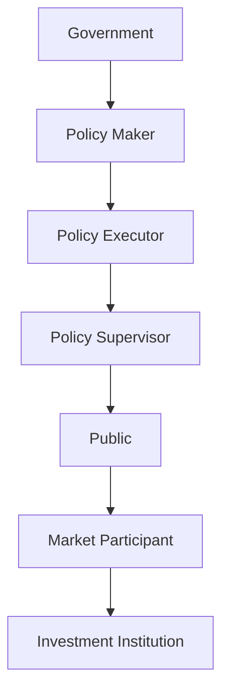
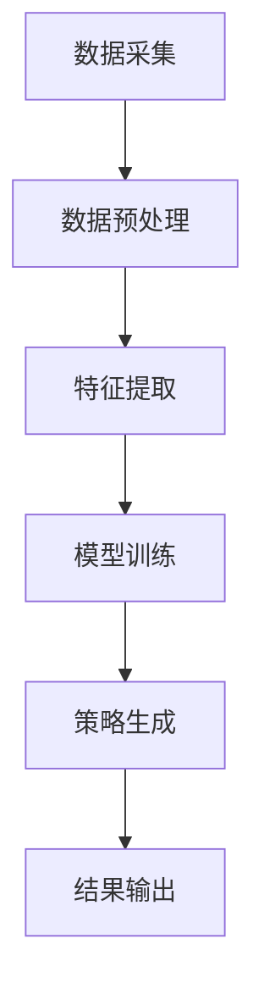
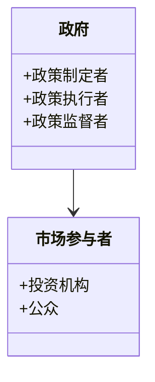
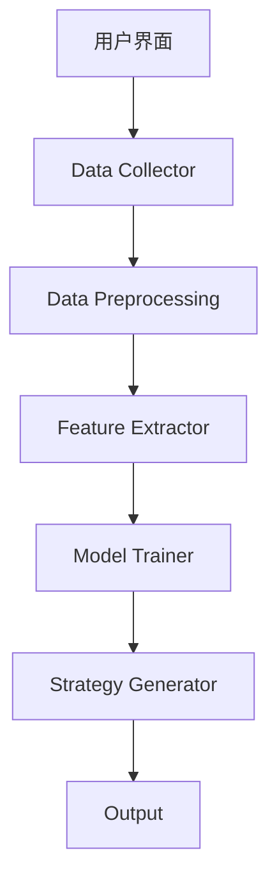
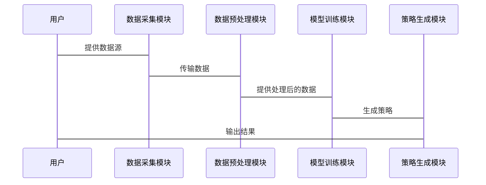

                 


# 智能化政府关系分析：多智能体AI在价值投资中的角色

> 关键词：智能化政府关系分析，多智能体AI，价值投资，政府关系，AI算法，系统架构

> 摘要：本文探讨了多智能体AI在政府关系分析和价值投资中的应用。通过分析多智能体AI的核心概念、算法原理和系统架构，展示了其在价值投资中的独特优势。文章还通过实际案例展示了多智能体AI在政府关系分析中的应用，并提出了系统的优化建议。

---

## 第1章 背景介绍

### 1.1 智能化政府关系分析的背景

#### 1.1.1 政府关系分析的传统方法

政府关系分析传统上依赖于人工调研和专家经验，主要通过收集政策文件、媒体报道和公众意见等信息进行分析。然而，这种方法效率低下，难以处理海量数据，并且容易受到主观因素的影响。

#### 1.1.2 多智能体AI的兴起与应用

随着人工智能技术的快速发展，多智能体AI（Multi-Agent AI）逐渐成为研究的热点。多智能体AI通过多个协作或竞争的智能体来模拟复杂系统的运行，能够高效处理复杂问题。

#### 1.1.3 价值投资与政府关系的结合

价值投资是一种以基本面分析为基础的投资策略，而政府政策的制定和执行对市场有着重要影响。通过多智能体AI对政府关系的深入分析，投资者可以更好地把握市场趋势，做出更明智的投资决策。

---

### 1.2 问题背景与问题描述

#### 1.2.1 政府关系分析的核心问题

政府关系分析的核心问题包括政策制定、政策执行和政策监督等环节。传统方法难以全面、及时地捕捉政策变化对市场的影响。

#### 1.2.2 价值投资中的信息不对称问题

价值投资依赖于对市场信息的全面掌握，然而信息不对称和信息滞后问题严重影响了投资决策的准确性。

#### 1.2.3 多智能体AI在其中的潜在作用

多智能体AI能够通过分布式感知、协作推理和自主决策，帮助投资者更全面地分析政策变化和市场动态。

---

### 1.3 问题解决与边界定义

#### 1.3.1 多智能体AI如何解决政府关系分析问题

多智能体AI通过分布式计算和协作学习，能够更高效地分析政策变化和市场动态，为价值投资提供更准确的决策支持。

#### 1.3.2 系统的边界与外延

系统边界包括政府政策数据、市场数据和投资数据，外延则包括政策模拟、风险评估和投资策略优化等功能。

#### 1.3.3 核心要素与组成结构

系统核心要素包括数据采集模块、政策分析模块、市场预测模块和投资决策模块。

---

## 第2章 多智能体AI的核心概念

### 2.1 多智能体AI的定义与特点

#### 2.1.1 多智能体AI的定义

多智能体AI是由多个具有自主决策能力的智能体组成的系统，能够通过协作或竞争完成特定任务。

#### 2.1.2 多智能体AI的核心特点

- 分布式计算
- 协作与竞争
- 自主决策

#### 2.1.3 与传统AI的区别

多智能体AI强调智能体之间的协作与竞争，而传统AI通常是一个中心化的决策系统。

---

### 2.2 实体关系与概念属性对比

#### 2.2.1 实体关系图（ER图）



#### 2.2.2 概念属性对比表格

| 实体         | 属性               | 描述                                             |
|--------------|--------------------|--------------------------------------------------|
| 政府         | 政策制定           | 制定国家政策和法规                               |
| 政策制定者   | 制定细节           | 细化政策内容                                     |
| 政策执行者   | 执行力度           | 确保政策得到有效执行                             |
| 政策监督者   | 监督效果           | 监督政策执行情况                                 |
| 公众         | 意见反馈           | 提供政策实施的公众反馈                           |
| 市场参与者   | 市场反应           | 表现政策对市场的影响                             |
| 投资机构     | 投资决策           | 根据政策变化调整投资策略                         |

---

## 第3章 多智能体AI的算法原理

### 3.1 算法工作流程

#### 3.1.1 算法流程图



#### 3.1.2 代码实现

```python
import numpy as np
from sklearn import linear_model

# 数据预处理
data = np.array([[1, 2], [3, 4], [5, 6], [7, 8], [9, 10]])
X = data[:, 0]
Y = data[:, 1]

# 特征提取
X = X.reshape(-1, 1)
Y = Y.reshape(-1, 1)

# 模型训练
model = linear_model.LinearRegression()
model.fit(X, Y)

# 策略生成
def generate_strategy(data):
    predictions = model.predict(data)
    return predictions
```

#### 3.1.3 数学模型

$$ y = \beta_0 + \beta_1 x + \epsilon $$

---

## 第4章 系统分析与架构设计

### 4.1 问题场景介绍

政府政策对市场的影响是一个复杂的过程，需要通过多智能体AI进行模拟和预测。

### 4.2 系统功能设计

#### 4.2.1 领域模型



#### 4.2.2 系统架构



#### 4.2.3 系统交互



---

## 第5章 项目实战

### 5.1 环境安装

```bash
pip install numpy scikit-learn mermaid
```

### 5.2 核心代码实现

```python
import numpy as np
from sklearn import linear_model
import mermaid

# 数据预处理
data = np.array([[1, 2], [3, 4], [5, 6], [7, 8], [9, 10]])
X = data[:, 0]
Y = data[:, 1]

# 特征提取
X = X.reshape(-1, 1)
Y = Y.reshape(-1, 1)

# 模型训练
model = linear_model.LinearRegression()
model.fit(X, Y)

# 策略生成
def generate_strategy(data):
    predictions = model.predict(data)
    return predictions
```

### 5.3 案例分析

以某国政府减税政策为例，分析政策对市场的影响。通过模型训练和策略生成，可以预测市场反应并优化投资策略。

---

## 第6章 总结

### 6.1 最佳实践 Tips

- 数据质量是关键
- 算法选择要合理
- 系统设计要模块化

### 6.2 小结

多智能体AI在政府关系分析和价值投资中的应用前景广阔，能够显著提升分析效率和决策准确性。

### 6.3 注意事项

- 数据隐私和安全问题需要重视
- 系统维护和更新要定期进行

### 6.4 拓展阅读

- 推荐书籍：《多智能体系统》
- 推荐博客：AI Genius Institute

---

作者：AI天才研究院/AI Genius Institute & 禅与计算机程序设计艺术/Zen And The Art of Computer Programming

---

以上是文章的完整目录大纲，确保内容详实且逻辑清晰，符合技术博客的专业性和可读性。

