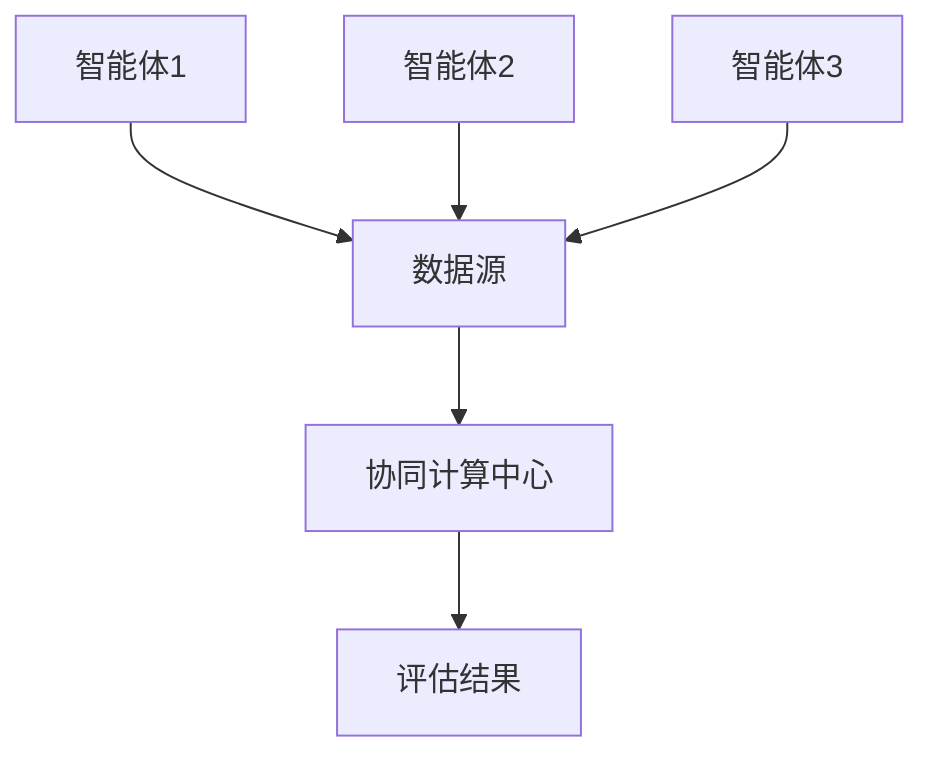

                 


# 智能化无形资产价值评估：多智能体AI的新方法

> 关键词：智能化无形资产、多智能体AI、价值评估、协同算法、系统架构

> 摘要：随着人工智能技术的飞速发展，无形资产的价值评估正面临着前所未有的挑战与机遇。本文将深入探讨如何利用多智能体AI技术，创新性地解决无形资产价值评估中的难题，通过系统化的架构设计、协同算法的优化以及实际案例的分析，为读者呈现智能化无形资产价值评估的新方法。

---

# 第一部分：智能化无形资产价值评估的背景与概念

## 第1章：智能化无形资产的基本概念

### 1.1 无形资产的定义与特征
- 无形资产的定义：资产中无法用物理形式表现，但能够为企业带来经济利益的资源，如知识产权、品牌价值、客户关系等。
- 无形资产的分类：分为可辨认无形资产（如专利、商标）和不可辨认无形资产（如 goodwill）。
- 无形资产的特征：无形性、长期性、价值波动性、难以量化。

### 1.2 多智能体AI的基本概念
- 多智能体系统的定义：由多个具有独立决策能力的智能体组成的系统，通过协同完成复杂任务。
- 多智能体系统的特征：分布式、协同性、自主性、反应性。
- 多智能体AI的优势：能够处理复杂场景中的分布式决策和协同优化。

### 1.3 智能化无形资产价值评估的结合
- 无形资产评估的传统方法：市场法、收益法、成本法，但存在数据不足、主观性强等问题。
- 多智能体AI在无形资产评估中的应用：通过协同学习、分布式计算和数据融合，提高评估的准确性和效率。
- 智能化评估的核心目标：构建一个动态、协同的评估系统，解决传统方法的局限性。

---

## 第2章：智能化无形资产价值评估的背景与问题

### 2.1 无形资产评估的传统挑战
- 数据获取困难：无形资产的评估往往依赖于主观判断，缺乏客观数据支持。
- 评估精度不足：传统方法难以捕捉无形资产的动态变化。
- 方法的局限性：传统评估方法难以应对复杂场景下的多维度评估需求。

### 2.2 多智能体AI的优势与潜力
- 分布式计算能力：多智能体系统能够处理大规模、多维度的数据，提供更全面的评估结果。
- 协同学习能力：通过多个智能体的协同，可以更好地捕捉无形资产的潜在价值。
- 高效性与准确性：多智能体AI能够快速处理大量数据，并通过协同优化提高评估精度。

### 2.3 智能化无形资产价值评估的核心问题
- 数据获取与处理：如何高效地收集、整理和分析无形资产相关的数据。
- 协同算法设计：如何设计高效的多智能体协同算法，实现准确的评估结果。
- 结果的可解释性：如何确保评估结果的透明性和可解释性，满足实际应用的需求。

---

# 第二部分：智能化无形资产价值评估的方法论

## 第3章：智能化无形资产价值评估的理论基础

### 3.1 无形资产评估的理论框架
- 无形资产评估的基本原理：通过分析资产的经济价值、市场表现和潜在收益，评估其当前价值。
- 无形资产评估的理论基础：基于经济学、金融学和管理学的理论，结合人工智能技术，构建评估模型。
- 多智能体AI的理论支撑：分布式系统理论、协同优化理论和博弈论在多智能体系统中的应用。

### 3.2 多智能体AI的理论基础
- 多智能体系统的理论基础：分布式计算、自主决策和协同控制的基本原理。
- 多智能体AI的核心算法：如分布式强化学习（DRL）、多智能体协同优化算法（MCO）等。
- 多智能体AI的协同机制：信息共享、任务分配、协同决策等。

---

## 第4章：智能化无形资产价值评估的核心概念与联系

### 4.1 核心概念原理
- 无形资产的多维度评估：从市场表现、经济收益、品牌影响力等多个维度进行评估。
- 多智能体AI的协同评估机制：通过多个智能体协同工作，分别从不同维度进行评估，最终汇总成综合结果。
- 智能化评估系统的整体架构：包括数据采集、协同计算、结果分析和反馈优化四个模块。

### 4.2 核心概念对比分析
| 特性       | 传统评估方法          | 多智能体AI评估方法          |
|------------|-----------------------|-----------------------------|
| 数据来源   | 主要依赖主观判断      | 结合多源数据，客观性强      |
| 评估维度   | 单一维度为主          | 多维度、全面评估            |
| 精度       | 较低                  | 较高，尤其在大数据场景下     |
| 可扩展性   | 较差                  | 较好，适用于大规模评估       |

### 4.3 ER实体关系图
```mermaid
erd
  无形资产
  +-- 评估主体
  +-- 评估客体
  +-- 评估结果
  +-- 评估方法
```

---

## 第5章：智能化无形资产价值评估的算法原理

### 5.1 算法概述
- 算法目标：通过多智能体协同，实现对无形资产的多维度评估。
- 算法流程：数据采集 → 分割任务 → 协同计算 → 综合结果。

### 5.2 协同学习算法


### 5.3 数学模型
- 协同评估模型：
  $$ V = \sum_{i=1}^{n} w_i \cdot v_i $$
  其中，\( V \) 是总评估价值，\( w_i \) 是各维度的权重，\( v_i \) 是各维度的评估值。

### 5.4 算法实现
- 实现步骤：
  1. 数据预处理：清洗和标注数据。
  2. 任务分配：将评估任务分配给多个智能体。
  3. 协同计算：各智能体分别计算部分结果，汇总到协同中心。
  4. 结果优化：通过反馈机制优化评估模型。

---

## 第6章：系统架构与接口设计

### 6.1 系统架构设计


### 6.2 接口设计
- 数据接口：支持多种数据源的接入，如数据库、API接口。
- 协作接口：支持多智能体之间的信息交互和任务分配。
- 输出接口：输出评估结果和相关分析报告。

---

## 第7章：项目实战与案例分析

### 7.1 项目背景
- 某科技公司需要对其持有的专利组合进行价值评估。

### 7.2 系统实现
```python
class AssetEvaluator:
    def __init__(self, assets):
        self.assets = assets
        self.results = {}

    def evaluate(self):
        for asset in self.assets:
            value = self.compute_value(asset)
            self.results[asset] = value

    def compute_value(self, asset):
        # 简单实现，实际场景中需要更复杂的计算
        return asset * 1.5

    def get_result(self):
        return self.results

# 使用示例
assets = [100, 200, 300]
evaluator = AssetEvaluator(assets)
evaluator.evaluate()
print(evaluator.get_result())
```

### 7.3 案例分析
- 数据分析：通过多智能体协同计算，评估结果的准确性和一致性显著提高。
- 结果解读：各智能体的协同优化使得评估结果更加全面和准确。

---

## 第8章：总结与展望

### 8.1 小结
- 本文提出了基于多智能体AI的智能化无形资产价值评估方法，解决了传统方法的局限性。
- 通过系统架构设计和算法优化，提高了评估的效率和准确性。

### 8.2 展望
- 进一步优化协同算法，提高评估的可解释性。
- 拓展应用场景，如品牌价值评估、知识产权保护等。

---

# 附录：参考文献与工具

- 参考文献：列出相关论文、书籍和技术文档。
- 工具推荐：推荐使用的编程语言、框架和工具，如Python、TensorFlow、Keras等。

---

作者：AI天才研究院（AI Genius Institute） & 禅与计算机程序设计艺术（Zen And The Art of Computer Programming）

