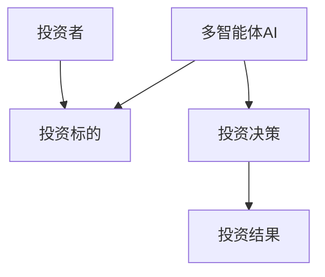
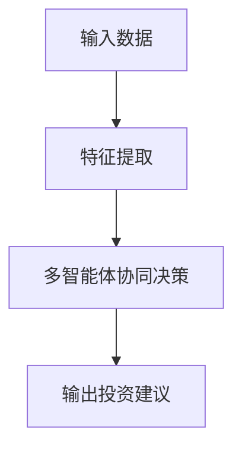
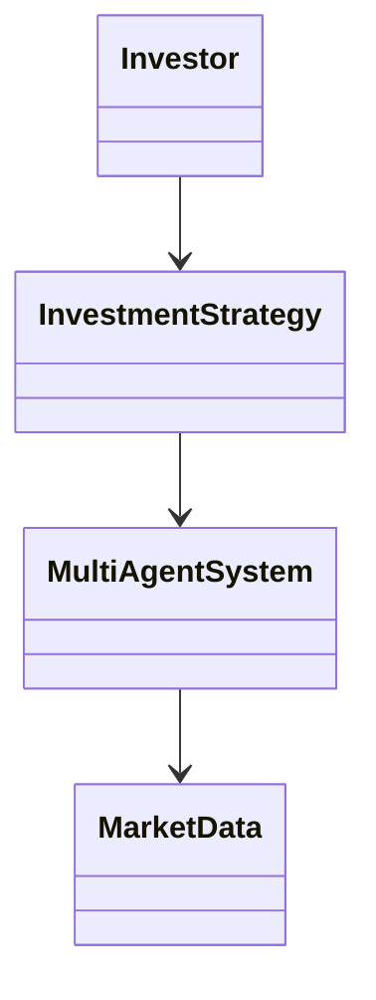

                 


# 智能化行业转型机会识别：多智能体AI在价值投资中的新方法

> **关键词**：智能化转型，多智能体AI，价值投资，算法原理，系统架构

> **摘要**：随着人工智能技术的迅速发展，多智能体AI在价值投资中的应用为行业转型提供了新的可能性。本文从智能化转型的背景出发，详细探讨了多智能体AI的核心概念、算法原理、系统架构以及实际应用场景，展示了如何利用多智能体AI优化投资决策，抓住行业转型中的新机会。

---

## 第一部分：智能化行业转型的背景与挑战

### 第1章：智能化行业转型的背景与趋势

#### 1.1 问题背景与问题描述

随着全球经济的快速发展，传统的价值投资模式逐渐暴露出效率低下、决策滞后等问题。特别是在金融市场的复杂性和不确定性增加的情况下，传统的基于人工经验的投资方法难以应对日益复杂的市场环境。与此同时，人工智能技术的快速发展为投资领域带来了新的可能性。多智能体AI作为一种新兴的技术，能够通过协同决策和分布式计算，为价值投资提供更加高效和精准的解决方案。

#### 1.2 问题解决与边界

多智能体AI通过模拟人类投资者的决策过程，能够在复杂的市场环境中快速响应和优化投资策略。与传统AI相比，多智能体AI具有以下特点：

- **协同性**：多个智能体之间可以协同合作，共同完成复杂的决策任务。
- **分布式计算**：智能体之间可以通过分布式计算，提高系统的计算效率和决策能力。
- **适应性**：系统能够根据市场环境的变化动态调整投资策略。

通过多智能体AI的应用，投资者可以更加精准地识别市场机会，优化投资组合，降低投资风险，从而实现更高的投资收益。

---

## 第二部分：多智能体AI的核心概念与原理

### 第2章：多智能体AI的定义与特点

#### 2.1 核心概念原理

多智能体AI是一种由多个智能体组成的系统，这些智能体能够通过协同合作完成复杂的决策任务。与传统AI相比，多智能体AI具有以下核心特点：

- **分布式智能**：智能体之间通过分布式计算，能够更加高效地完成任务。
- **协同决策**：多个智能体可以协同合作，共同完成复杂的决策任务。
- **动态适应**：系统能够根据环境的变化动态调整智能体的行为和决策策略。

#### 2.2 概念属性特征对比表格

| 概念         | 特征                           |
|--------------|--------------------------------|
| 单智能体AI    | 单个决策主体，独立运行         |
| 多智能体AI    | 多个决策主体，协同合作         |
| 价值投资     | 基于基本面分析的投资策略       |

#### 2.3 ER实体关系图



### 第3章：多智能体AI的算法原理

#### 3.1 算法原理流程图



#### 3.2 算法数学模型

$$ V(s) = \max_{a} [ r + V(s') ] $$

其中：
- \( s \) 表示当前状态
- \( a \) 表示动作
- \( r \) 表示奖励
- \( s' \) 表示下一个状态

#### 3.3 代码实现

```python
import numpy as np

def multi_agent_decision(state_space):
    # 初始化多个智能体
    agents = [Agent() for _ in range(n_agents)]
    # 协同决策
    decisions = [agent.decide(state) for agent in agents]
    return decisions
```

---

## 第三部分：系统分析与架构设计

### 第4章：系统功能设计

#### 4.1 问题场景介绍

在价值投资中，投资者需要根据市场环境的变化调整投资策略。传统的投资方法依赖于人工分析，效率较低且容易受到主观因素的影响。而多智能体AI可以通过协同合作，快速分析市场数据，优化投资组合，从而提高投资效率和收益。

#### 4.2 领域模型类图



---

## 第四部分：项目实战

### 第5章：项目实战与案例分析

#### 5.1 环境安装与配置

为了实现多智能体AI在价值投资中的应用，首先需要安装以下环境：

- Python编程语言
- 相关的深度学习框架（如TensorFlow、PyTorch）
- 数据处理工具（如Pandas、NumPy）

#### 5.2 系统核心实现源代码

```python
class Agent:
    def __init__(self, id):
        self.id = id
        self.state = None
        self.action = None
    
    def decide(self, state):
        self.state = state
        # 智能体根据当前状态做出决策
        action = self._get_action(state)
        return action
    
    def _get_action(self, state):
        # 具体的决策逻辑可以根据实际情况进行调整
        return 'buy' if state['value'] > 0.5 else 'sell'
```

#### 5.3 代码应用解读与分析

上述代码定义了一个简单的智能体类，智能体可以根据当前市场状态做出买入或卖出的决策。通过多个智能体的协同合作，可以实现更加复杂的投资策略。

#### 5.4 实际案例分析

以股票投资为例，假设我们有多个智能体分别关注不同的市场指标（如市盈率、市净率等）。每个智能体根据自己的关注点做出决策，最终通过协同合作得出一个综合的投资建议。

---

## 第五部分：总结与展望

### 第6章：总结与展望

#### 6.1 最佳实践 tips

- 在实际应用中，需要根据具体的投资目标和市场环境调整智能体的数量和决策逻辑。
- 数据的质量和及时性对多智能体AI的投资效果有重要影响。
- 需要定期对系统进行监控和优化，以应对市场的变化。

#### 6.2 小结

多智能体AI作为一种新兴的技术，为价值投资带来了新的可能性。通过协同合作和分布式计算，多智能体AI能够更加高效地分析市场数据，优化投资策略，从而帮助投资者抓住行业转型中的新机会。

#### 6.3 未来展望

随着人工智能技术的不断发展，多智能体AI在价值投资中的应用前景广阔。未来，可以通过进一步优化算法和增加智能体的数量，实现更加智能化和个性化的投资决策。

---

## 作者

**作者：AI天才研究院/AI Genius Institute & 禅与计算机程序设计艺术 /Zen And The Art of Computer Programming**

---

希望这篇技术博客文章能够为读者提供关于多智能体AI在价值投资中的新方法的深入理解和启发。

