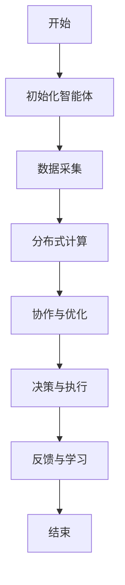
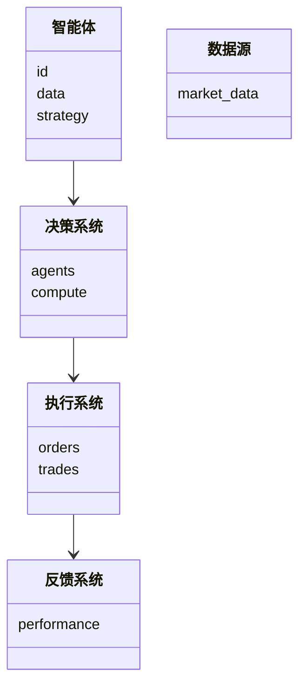
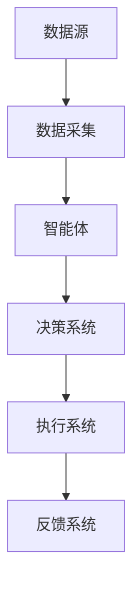
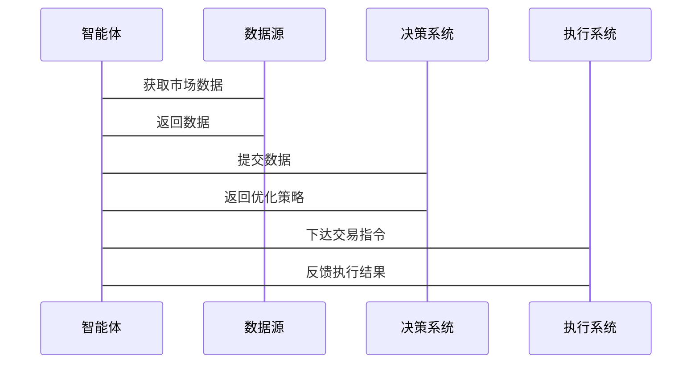

                 


```markdown
# 智能化资本配置效率分析：多智能体AI的新方法

> 关键词：多智能体AI，资本配置效率，智能化配置，分布式计算，博弈论

> 摘要：本文探讨了如何利用多智能体AI技术来提高资本配置效率。通过分析多智能体AI的核心原理、算法设计、系统架构以及实际应用案例，本文为资本配置领域提供了新的视角和解决方案。结合理论与实践，本文详细阐述了多智能体AI在资本配置中的具体应用场景和实施方法，为读者提供了从理论到实践的全面指导。

---

## 第一部分: 背景介绍

### 第1章: 智能化资本配置效率分析的背景与意义

#### 1.1 问题背景
##### 1.1.1 资本配置的基本概念
资本配置是指将资金分配到不同的资产或项目中，以实现收益最大化或风险最小化的过程。传统资本配置方法通常依赖于历史数据分析和人工决策，存在效率低、主观性强的问题。

##### 1.1.2 传统资本配置的局限性
- 数据分析依赖历史数据，无法应对实时变化的市场环境。
- 人工决策容易受到主观因素和市场情绪的影响。
- 难以处理多目标、多约束条件下的复杂优化问题。

##### 1.1.3 智能化资本配置的必要性
随着金融市场日益复杂化，传统的资本配置方法已无法满足现代投资需求。智能化资本配置通过引入AI技术，能够实时分析市场数据，优化投资组合，提高配置效率。

#### 1.2 问题描述
##### 1.2.1 资本配置效率的定义
资本配置效率是指在给定风险和收益目标下，资源被最优分配的程度。高效配置能够最大化收益或最小化风险。

##### 1.2.2 当前资本配置中的主要问题
- 数据量大且复杂，难以快速处理。
- 投资决策依赖于经验，缺乏系统性和科学性。
- 缺乏动态调整能力，无法应对市场快速变化。

##### 1.2.3 多智能体AI在资本配置中的应用潜力
多智能体AI能够通过分布式计算和协作机制，实现对市场数据的实时分析和动态优化，为资本配置提供更高效的解决方案。

#### 1.3 问题解决
##### 1.3.1 多智能体AI的核心优势
- 分布式计算能力，能够并行处理大量数据。
- 协作机制，通过智能体之间的协作实现全局优化。
- 自适应性，能够实时调整策略应对市场变化。

##### 1.3.2 多智能体AI如何提升资本配置效率
通过实时数据分析、动态优化和智能决策，多智能体AI能够显著提高资本配置的效率和准确性。

##### 1.3.3 多智能体AI在资本配置中的具体应用场景
- 实时市场监控与预测
- 投资组合优化
- 风险管理与控制

#### 1.4 边界与外延
##### 1.4.1 多智能体AI的边界条件
- 数据来源和质量
- 计算资源限制
- 市场环境的可预测性

##### 1.4.2 资本配置效率的边界条件
- 投资目标和约束
- 市场波动性
- 数据更新频率

##### 1.4.3 多智能体AI在资本配置中的外延应用
- 多资产类别配置
- 全球化投资策略
- 个性化投资建议

#### 1.5 核心概念与结构
##### 1.5.1 核心概念的组成要素
- 智能体：具备感知、决策和执行能力的独立实体。
- 分布式计算：多智能体协同完成任务的计算方式。
- 协作机制：智能体之间通过信息共享和协作实现目标的方式。

##### 1.5.2 核心概念的结构化分析
通过层次化结构分析，明确多智能体AI在资本配置中的角色和作用。

##### 1.5.3 核心概念之间的关系
- 智能体之间的协作关系
- 分布式计算与资本配置效率的关系
- 协作机制与投资策略的关系

---

## 第二部分: 多智能体AI的核心概念与联系

### 第2章: 多智能体AI的原理与特征

#### 2.1 多智能体AI的原理
##### 2.1.1 多智能体系统的定义
多智能体系统是由多个智能体组成的分布式系统，智能体之间通过协作和竞争完成任务。

##### 2.1.2 多智能体系统的核心原理
- 分布式计算：任务分解和并行处理
- 协作机制：信息共享与协同决策
- 自适应性：动态调整策略

##### 2.1.3 多智能体系统的关键技术
- 通信协议：智能体之间的信息交互
- 协作算法：任务分配与协调
- 学习机制：经验积累与优化

#### 2.2 多智能体AI的特征
##### 2.2.1 分布式计算
智能体独立计算，通过通信协作完成任务。

##### 2.2.2 协作与竞争
智能体之间既有协作也有竞争，共同优化整体目标。

##### 2.2.3 自适应性与学习能力
智能体能够根据环境变化调整策略，并通过学习提升性能。

#### 2.3 多智能体AI与资本配置的关系
##### 2.3.1 多智能体AI在资本配置中的角色
- 数据分析与预测
- 投资组合优化
- 风险控制

##### 2.3.2 多智能体AI如何优化资本分配
通过实时数据分析和智能决策，优化资产配置。

##### 2.3.3 多智能体AI对资本效率的提升作用
- 提高决策速度
- 优化资源配置
- 减少人为错误

### 第3章: 多智能体AI的核心概念与联系

#### 3.1 多智能体AI的核心概念
##### 3.1.1 智能体的定义与属性
智能体具备感知、决策和执行能力。

##### 3.1.2 多智能体系统中的角色分配
- 数据采集智能体
- 分析智能体
- 决策智能体

##### 3.1.3 多智能体系统中的通信机制
- 信息传递
- 协作协议
- 决策同步

#### 3.2 多智能体AI的核心概念对比
##### 3.2.1 不同AI方法的对比
| 方法 | 描述 | 优缺点 |
|------|------|--------|
| 单智能体AI | 中央决策 | 高效但缺乏灵活性 |
| 多智能体AI | 分布式决策 | 灵活但复杂度高 |

#### 3.3 多智能体系统的ER实体关系图
```mermaid
er
    actor 投资者
    actor 管理者
    actor 风险评估师
    actor 交易员
    actor 数据分析师
    actor 系统管理员
    actor 投资顾问
    actor 投资组合经理
    actor 市场分析师
    actor 财务规划师
```

---

## 第三部分: 算法原理讲解

### 第4章: 算法原理与实现

#### 4.1 多智能体AI算法原理
##### 4.1.1 算法概述
多智能体AI通过分布式计算和协作机制实现任务目标。

##### 4.1.2 算法步骤
1. 初始化智能体
2. 数据采集与处理
3. 分布式计算与协作
4. 决策与执行
5. 反馈与优化

##### 4.1.3 算法流程图


#### 4.2 Python实现
##### 4.2.1 核心代码示例
```python
import numpy as np
import pandas as pd

# 初始化智能体
class Agent:
    def __init__(self, id):
        self.id = id
        self.data = None

# 数据采集与处理
def collect_data():
    # 从数据源获取市场数据
    # 返回处理后的数据
    pass

# 分布式计算与协作
def distributed_compute(agents, data):
    # 并行处理数据
    # 返回计算结果
    pass

# 决策与执行
def decide_and_execute(results):
    # 根据计算结果制定投资策略
    pass

# 反馈与优化
def feedback(results):
    # 根据市场反馈优化算法
    pass

# 主函数
def main():
    agents = [Agent(i) for i in range(5)]
    data = collect_data()
    results = distributed_compute(agents, data)
    decide_and_execute(results)
    feedback(results)

if __name__ == "__main__":
    main()
```

#### 4.3 算法数学模型
##### 4.3.1 博弈论中的纳什均衡
$$ 纳什均衡：每个智能体在给定其他智能体策略的情况下，选择最优策略 $$

##### 4.3.2 投资组合优化模型
$$ max \sum_{i=1}^{n} w_i r_i - \lambda \sum_{i=1}^{n} w_i^2 $$
其中：
- \( w_i \)：资产 \( i \) 的权重
- \( r_i \)：资产 \( i \) 的预期收益
- \( \lambda \)：风险惩罚系数

---

## 第四部分: 系统分析与架构设计

### 第5章: 系统分析与架构设计

#### 5.1 项目场景介绍
##### 5.1.1 项目目标
实现一个多智能体AI系统，用于优化资本配置效率。

##### 5.1.2 项目范围
- 实时市场数据监控
- 投资组合优化
- 风险管理与控制

#### 5.2 系统功能设计
##### 5.2.1 领域模型


#### 5.3 系统架构设计
##### 5.3.1 系统架构图


#### 5.4 系统接口设计
##### 5.4.1 接口定义
- 数据接口：数据采集与处理
- 通信接口：智能体之间的信息交互
- 决策接口：投资策略制定

##### 5.4.2 接口交互流程图


---

## 第五部分: 项目实战

### 第6章: 项目实战与案例分析

#### 6.1 环境安装与配置
##### 6.1.1 安装依赖
```bash
pip install numpy pandas mermaid
```

#### 6.2 核心代码实现
##### 6.2.1 数据采集与处理
```python
import requests
import json

def get_market_data():
    response = requests.get('http://market-data.com/api')
    return json.loads(response.text)
```

##### 6.2.2 分布式计算与协作
```python
import threading

class Agent:
    def __init__(self, id):
        self.id = id
        self.data = None

    def compute(self):
        # 处理数据并返回结果
        pass

def distributed_compute(agents):
    threads = []
    for agent in agents:
        thread = threading.Thread(target=agent.compute)
        threads.append(thread)
    for thread in threads:
        thread.start()
    for thread in threads:
        thread.join()
```

#### 6.3 案例分析与解读
##### 6.3.1 实际案例
- 数据采集与处理：从多个市场数据源获取实时数据。
- 分布式计算：多个智能体协同完成数据分析。
- 投资决策：根据计算结果制定投资策略。

##### 6.3.2 案例解读
通过实际案例分析，验证多智能体AI在资本配置中的有效性。

#### 6.4 项目小结
总结项目实施过程中的经验与教训，提出改进建议。

---

## 第六部分: 最佳实践与总结

### 第7章: 最佳实践与总结

#### 7.1 最佳实践
##### 7.1.1 系统设计建议
- 明确智能体的角色和职责
- 设计高效的通信机制
- 优化协作算法

##### 7.1.2 开发注意事项
- 确保数据安全与隐私
- 处理多智能体之间的通信延迟
- 应对市场环境的不确定性

#### 7.2 小结
总结全文内容，强调多智能体AI在资本配置中的重要性。

#### 7.3 注意事项
- 数据质量对系统性能的影响
- 算法优化对系统效率的提升
- 系统扩展性与可维护性

#### 7.4 拓展阅读
推荐相关领域的书籍和论文，供读者进一步学习。

---

## 作者信息

作者：AI天才研究院/AI Genius Institute & 禅与计算机程序设计艺术 /Zen And The Art of Computer Programming
```

