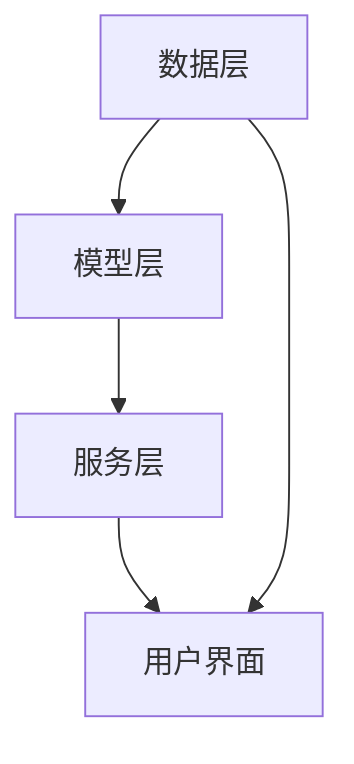

                 

# 智能医疗诊断AI Agent：LLM在临床决策支持中的应用

## 关键词：智能医疗诊断、AI Agent、大语言模型（LLM）、临床决策支持、医疗数据处理

## 摘要：  
随着人工智能技术的飞速发展，大语言模型（LLM）在医疗领域的应用越来越广泛。本文将深入探讨LLM在智能医疗诊断AI Agent中的核心原理、系统架构以及实际应用。通过分析LLM的训练过程、推理机制以及在临床决策支持中的具体应用场景，结合实际案例，为读者提供全面而深入的技术解读。本文还详细介绍了AI Agent的系统架构设计、接口交互设计以及实现过程中的关键技术点，帮助读者更好地理解如何利用LLM构建高效的医疗诊断系统。

---

# 第1章: 智能医疗诊断与AI Agent的背景

## 1.1 智能医疗诊断的定义与背景

### 1.1.1 医疗诊断的现状与挑战  
医疗诊断是医学领域中的核心环节，传统的诊断方式主要依赖医生的经验和知识。然而，随着医疗数据的爆炸式增长，医生需要处理大量的病历、检查报告和医学文献，这对医生的能力提出了更高的要求。传统诊断方式存在以下问题：  
- **数据量大**：医生需要处理大量的非结构化数据，如病历记录、影像数据等。  
- **诊断时间有限**：医生需要在有限的时间内完成诊断，容易出现误诊或漏诊。  
- **知识更新速度快**：医学知识不断更新，医生需要持续学习以保持专业水平。  

### 1.1.2 AI在医疗诊断中的作用与优势  
AI技术的引入为医疗诊断带来了革命性的变化。AI可以通过处理大量数据，辅助医生快速、准确地进行诊断。以下是AI在医疗诊断中的主要作用与优势：  
- **快速处理数据**：AI能够快速分析大量的医疗数据，提取关键信息，帮助医生做出更精准的诊断。  
- **提高诊断准确性**：通过学习海量的医疗数据，AI可以识别出人类难以察觉的模式，降低误诊率。  
- **24/7可用性**：AI系统可以全天候为医生提供支持，缓解医疗资源紧张的问题。  

### 1.1.3 智能医疗诊断的未来发展趋势  
随着技术的进步，智能医疗诊断将朝着更个性化、更精准的方向发展。未来的诊断系统将不仅仅依赖于单一的数据源，而是通过整合多种数据（如基因数据、生活习惯数据等）提供更全面的诊断建议。此外，AI诊断系统还将与物联网设备结合，实现远程监测和实时诊断。

---

## 1.2 大语言模型（LLM）的基本概念

### 1.2.1 什么是大语言模型  
大语言模型（Large Language Model，LLM）是一种基于深度学习的自然语言处理模型，旨在理解和生成人类语言。LLM的核心是基于Transformer架构的神经网络，通过大量的文本数据进行预训练，从而掌握语言的语法、语义和上下文关系。

### 1.2.2 LLM的核心特点与技术优势  
LLM具有以下特点：  
- **大规模预训练**：通过处理海量的文本数据，LLM能够掌握语言的复杂性。  
- **上下文理解能力**：LLM能够根据上下文理解语义，生成连贯的文本。  
- **多任务处理能力**：LLM可以应用于多种任务，如文本生成、机器翻译、问答系统等。  

### 1.2.3 LLM与传统医疗诊断工具的对比  
与传统的医疗诊断工具相比，LLM在以下方面具有明显优势：  
- **数据处理能力**：LLM能够处理非结构化数据，如病历记录和自由文本。  
- **知识覆盖范围**：LLM通过预训练掌握了大量的医学知识，能够提供全面的诊断建议。  
- **灵活性**：LLM可以根据输入的文本动态生成诊断建议，适应不同的医疗场景。

---

## 1.3 AI Agent在医疗诊断中的应用前景

### 1.3.1 AI Agent的基本概念  
AI Agent（智能体）是一种能够感知环境、自主决策并执行任务的智能系统。在医疗领域，AI Agent可以作为医生的辅助工具，帮助医生完成诊断、治疗方案制定等任务。

### 1.3.2 AI Agent在医疗诊断中的应用场景  
AI Agent在医疗诊断中的应用场景包括：  
- **病历分析**：通过分析患者的病历记录，提取关键信息，辅助医生制定诊断方案。  
- **疾病预测**：基于患者的症状和病史，预测可能的疾病，并提供诊断建议。  
- **用药推荐**：根据患者的病情和用药历史，推荐合适的药物和剂量。  

### 1.3.3 AI Agent的优势与挑战  
**优势**：  
- **高效性**：AI Agent能够快速处理大量数据，提高诊断效率。  
- **准确性**：通过学习海量数据，AI Agent能够提供更准确的诊断建议。  

**挑战**：  
- **数据隐私**：医疗数据涉及患者的隐私，如何确保数据的安全性是一个重要问题。  
- **模型可解释性**：AI的决策过程需要透明，以便医生能够理解并信任AI的建议。  

---

# 第2章: LLM在临床决策支持中的核心原理

## 2.1 大语言模型的原理与技术特点

### 2.1.1 基于Transformer的模型结构  
Transformer是一种基于注意力机制的深度学习模型，由编码器和解码器组成。编码器负责将输入的文本转化为向量表示，解码器则根据编码器的输出生成目标文本。

### 2.1.2 大规模数据的预训练过程  
LLM的预训练过程包括以下步骤：  
1. **数据采集**：收集大量的文本数据，包括书籍、网页、学术论文等。  
2. **遮蔽词任务**：随机遮蔽部分词，要求模型根据上下文预测被遮蔽的词。  
3. **预测任务**：模型需要预测句子的下一个词或完成句子的生成任务。  

### 2.1.3 微调与适应医疗领域数据  
为了适应医疗领域的需求，LLM需要进行微调。微调过程包括：  
1. **医疗数据收集**：收集医疗领域的文本数据，如病历记录、医学文献等。  
2. **任务适应**：针对特定的医疗任务（如疾病诊断、用药推荐）对模型进行微调。  

### 2.1.4 LLM在医疗领域中的独特优势  
1. **多模态数据处理能力**：LLM可以处理多种数据类型，如文本、图像和语音。  
2. **知识库构建与实时更新**：通过预训练，LLM能够构建和更新医疗知识库。  
3. **自然语言理解与生成能力**：LLM能够理解和生成自然语言，与医生和患者进行有效沟通。  

---

## 2.2 大语言模型的推理机制

### 2.2.1 解码过程与生成式AI  
解码过程是LLM生成输出的核心步骤。模型通过解码器逐步生成目标文本，每一步都根据当前的上下文和已生成的文本生成下一个词。

### 2.2.2 注意力机制在医疗诊断中的应用  
注意力机制可以帮助模型聚焦于重要的上下文信息。在医疗诊断中，注意力机制可以用于识别关键的诊断信息，如患者的症状和病史。

### 2.2.3 概率推理与决策支持  
LLM可以通过概率推理生成多个可能的诊断结果，并根据概率大小为医生提供优先级建议。

---

## 2.3 LLM在医疗领域中的应用优势

### 2.3.1 知识覆盖范围  
LLM通过预训练掌握了大量的医疗知识，能够提供全面的诊断建议。

### 2.3.2 实时更新能力  
LLM可以实时更新医疗知识库，确保诊断建议的准确性和时效性。

### 2.3.3 自然语言交互能力  
LLM能够与医生和患者进行自然语言交互，提高诊断过程的效率和准确性。

---

# 第3章: 智能医疗诊断AI Agent的系统架构与实现

## 3.1 系统整体架构

### 3.1.1 数据层  
数据层包括医疗数据的采集、存储和处理。  
- **数据采集**：通过电子病历系统、医疗影像系统等采集医疗数据。  
- **数据存储**：将医疗数据存储在数据库中，如关系型数据库或分布式数据库。  
- **数据处理**：对数据进行清洗、标注和预处理，确保数据的质量和一致性。  

### 3.1.2 模型层  
模型层包括大语言模型的部署和调用。  
- **模型部署**：将预训练好的LLM部署到医疗诊断系统中。  
- **模型调用**：通过API接口调用模型，获取诊断建议和决策支持。  

### 3.1.3 服务层  
服务层包括AI Agent的功能实现和服务接口设计。  
- **功能实现**：AI Agent根据输入的病历信息生成诊断建议。  
- **服务接口设计**：设计API接口，方便其他系统调用AI Agent的服务。  

---

## 3.2 系统功能模块设计

### 3.2.1 病历分析模块  
病历分析模块负责分析患者的病历记录，提取关键信息，如症状、病史和用药记录。

### 3.2.2 疾病诊断建议模块  
疾病诊断建议模块根据病历分析结果生成诊断建议，包括可能的疾病和诊断概率。

### 3.2.3 用药推荐模块  
用药推荐模块根据患者的诊断结果推荐合适的药物和剂量。

### 3.2.4 风险评估模块  
风险评估模块评估患者的病情风险，帮助医生制定个性化的治疗方案。

---

## 3.3 系统架构的Mermaid图

---

## 3.4 系统接口与交互设计

### 3.4.1 系统接口设计  
1. **API接口定义**：定义API接口，如`POST /api/诊断建议`。  
2. **接口调用流程**：  
   - 发送病历数据到API接口。  
   - 系统调用LLM生成诊断建议。  
   - 返回诊断建议给用户。  

### 3.4.2 交互设计  
1. **用户与AI Agent的交互流程**：  
   - 用户输入病历信息。  
   - AI Agent生成诊断建议。  
   - 用户确认或修改诊断建议。  

2. **交互中的自然语言处理技术**：  
   - 使用自然语言理解技术理解用户的输入。  
   - 使用自然语言生成技术生成诊断建议。  

---

## 3.5 项目实战：构建智能医疗诊断AI Agent

### 3.5.1 环境安装  
1. 安装Python和必要的Python包（如TensorFlow、Keras、Flask）。  
2. 安装大语言模型（如GPT-3、PaLM）。  

### 3.5.2 数据准备  
1. 收集医疗领域的文本数据，包括病历记录和医学文献。  
2. 对数据进行清洗和预处理，确保数据质量。  

### 3.5.3 模型训练与微调  
1. 使用预训练的LLM进行微调，适应医疗领域的数据。  
2. 调整模型参数，优化诊断准确率。  

### 3.5.4 接口开发  
1. 开发API接口，提供诊断建议服务。  
2. 使用Flask框架搭建Web界面，方便用户交互。  

---

## 3.6 总结与展望

### 3.6.1 本章总结  
通过本章的介绍，我们了解了智能医疗诊断AI Agent的系统架构与实现过程。从数据层到服务层，每个部分都发挥了重要作用，共同构建了一个高效的医疗诊断系统。

### 3.6.2 未来展望  
随着技术的进步，智能医疗诊断AI Agent将更加智能化和个性化。未来的诊断系统将能够整合更多的数据源，提供更精准的诊断建议，并与物联网设备结合，实现远程医疗和实时监测。

---

# 第4章: 总结与展望

## 4.1 本章总结  
本文全面介绍了智能医疗诊断AI Agent的核心原理和系统架构。通过分析LLM的训练过程、推理机制以及在临床决策支持中的具体应用，我们了解了AI在医疗诊断中的巨大潜力。

## 4.2 未来展望  
随着AI技术的不断发展，智能医疗诊断AI Agent将变得更加智能化和个性化。未来的诊断系统将能够整合更多的数据源，提供更精准的诊断建议，并与物联网设备结合，实现远程医疗和实时监测。

---

# 作者：AI天才研究院/AI Genius Institute & 禅与计算机程序设计艺术 /Zen And The Art of Computer Programming

