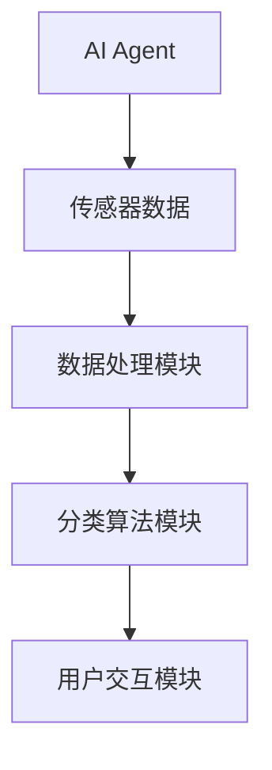

                 


# 智能厨房垃圾桶：AI Agent的厨余分类指导

## 关键词：AI Agent, 厨余分类, 智能垃圾桶, 物联网传感器, 垃圾分类算法, 图像识别

## 摘要：  
随着人工智能和物联网技术的快速发展，智能厨房垃圾桶逐渐成为智能家居的重要组成部分。本文将详细探讨AI Agent在厨余分类中的应用，从传感器技术、图像识别算法到系统架构设计，逐步解析其实现原理和实际应用。通过本文，读者可以全面了解AI Agent如何帮助我们更高效地进行厨余垃圾分类，从而减少环境污染并促进资源回收利用。

---

## 第1章：AI Agent与厨余分类概述

### 1.1 AI Agent的定义与核心功能  
AI Agent（人工智能代理）是一种能够感知环境、自主决策并执行任务的智能系统。在智能厨房垃圾桶中，AI Agent的主要功能包括：  
- 实时感知垃圾桶中的垃圾种类和状态  
- 通过图像识别技术自动分类厨余垃圾  
- 提供用户交互界面，指导用户进行垃圾分类  

与传统垃圾桶相比，AI Agent能够通过传感器和算法实现智能化的垃圾分类，从而提高分类效率并减少错误率。

### 1.2 厨余分类的背景与挑战  
厨余分类是城市管理中的重要环节，但传统的人工分类效率低、成本高且容易出错。AI Agent的引入可以显著解决以下问题：  
- **分类效率低**：AI Agent通过图像识别技术快速分类垃圾。  
- **错误率高**：AI Agent能够准确识别垃圾种类，减少分类错误。  
- **环境污染**：通过智能分类，厨余垃圾可以被高效回收利用，减少对环境的污染。  

### 1.3 AI Agent在厨余分类中的应用价值  
AI Agent在厨余分类中的应用不仅提高了分类效率，还能够：  
- 促进资源的高效回收利用。  
- 降低垃圾分类的成本。  
- 提高居民的生活质量。  

---

## 第2章：AI Agent的传感器与物联网技术

### 2.1 垃圾分类传感器技术  
传感器是AI Agent感知环境的关键设备，常见的传感器包括：  
- **重量传感器**：用于检测垃圾桶的负载状态。  
- **图像传感器**：用于采集垃圾的图像数据。  
- **湿度传感器**：用于检测厨余垃圾的湿度。  

这些传感器协同工作，为AI Agent提供实时的环境数据。

#### 2.1.1 传感器的工作原理  
以图像传感器为例，其工作原理如下：  
1. 感光元件捕捉垃圾的图像信息。  
2. 图像数据通过模数转换器（ADC）传输到处理器。  
3. 处理器对图像进行分析，提取垃圾的特征信息。  

### 2.2 物联网技术在垃圾桶中的应用  
物联网技术通过传感器和通信模块实现数据的实时传输和处理。在智能垃圾桶中，物联网技术主要应用于：  
- **数据传输**：传感器数据通过Wi-Fi或蓝牙传输到云端。  
- **云端处理**：数据在云端进行分类和分析。  
- **边缘计算**：部分数据在本地设备上进行实时处理。  

---

## 第3章：AI Agent的核心算法

### 3.1 图像识别算法  
图像识别是AI Agent实现垃圾分类的核心技术。常用的算法包括卷积神经网络（CNN）和朴素贝叶斯（Naive Bayes）。  

#### 3.1.1 CNN的数学模型  
CNN的数学模型如下：  
$$ \text{输出} = \text{输入} \times \text{卷积核} + \text{偏置} $$  
其中，卷积核用于提取图像的特征，偏置用于调整输出。  

#### 3.1.2 图像分类算法的代码实现  
以下是一个简单的图像分类算法的Python代码示例：  

```python
import tensorflow as tf
from tensorflow.keras import layers

model = tf.keras.Sequential([
    layers.Conv2D(32, (3, 3), activation='relu', input_shape=(64, 64, 3)),
    layers.MaxPooling2D((2, 2)),
    layers.Conv2D(64, (3, 3), activation='relu'),
    layers.MaxPooling2D((2, 2)),
    layers.Flatten(),
    layers.Dense(128, activation='relu'),
    layers.Dense(10, activation='softmax')
])

model.compile(optimizer='adam', loss='sparse_categorical_crossentropy', metrics=['accuracy'])
model.fit(x_train, y_train, epochs=10, batch_size=32)
```

---

## 第4章：AI Agent的系统架构设计

### 4.1 系统架构概述  
智能厨房垃圾桶的系统架构包括以下模块：  
1. 数据采集模块：负责采集传感器数据。  
2. 数据处理模块：对数据进行预处理和特征提取。  
3. 分类算法模块：对垃圾进行分类。  
4. 用户交互模块：提供人机交互界面。  

#### 4.1.1 系统架构图  
以下是一个简单的系统架构图：  



---

## 第5章：AI Agent的系统实现

### 5.1 环境搭建  
要实现AI Agent，首先需要搭建以下环境：  
- **硬件设备**：包括传感器、处理器和通信模块。  
- **软件环境**：包括Python、TensorFlow和物联网开发框架。  

### 5.2 代码实现  
以下是一个简单的AI Agent代码示例：  

```python
import numpy as np
import tensorflow as tf
from tensorflow.keras import layers
from sensor import get_sensor_data

# 数据预处理
def preprocess_data(data):
    return data / 255.0

# 模型训练
def train_model():
    model = tf.keras.Sequential([
        layers.Conv2D(32, (3, 3), activation='relu', input_shape=(64, 64, 3)),
        layers.MaxPooling2D((2, 2)),
        layers.Conv2D(64, (3, 3), activation='relu'),
        layers.MaxPooling2D((2, 2)),
        layers.Flatten(),
        layers.Dense(128, activation='relu'),
        layers.Dense(10, activation='softmax')
    ])

    model.compile(optimizer='adam', loss='sparse_categorical_crossentropy', metrics=['accuracy'])
    model.fit(x_train, y_train, epochs=10, batch_size=32)
    return model

# 系统运行
def main():
    data = get_sensor_data()
    processed_data = preprocess_data(data)
    model = train_model()
    prediction = model.predict(processed_data)
    print("预测结果：", prediction)

if __name__ == "__main__":
    main()
```

---

## 第6章：AI Agent的系统优化与展望

### 6.1 系统优化  
AI Agent的优化主要从以下几个方面进行：  
- **算法优化**：改进图像识别算法，提高分类准确率。  
- **硬件优化**：提升传感器的灵敏度和响应速度。  
- **系统优化**：优化数据处理流程，减少延迟。  

### 6.2 未来展望  
未来，AI Agent在厨余分类中的应用将更加智能化和高效化。随着技术的发展，AI Agent将与区块链、5G等技术结合，实现更加智能化的垃圾分类系统。

---

## 结语  
通过本文的详细介绍，我们可以看到AI Agent在厨余分类中的巨大潜力。从传感器技术到算法实现，再到系统设计，AI Agent为厨余分类提供了全新的解决方案。未来，随着技术的进一步发展，AI Agent将在智能家居中发挥更加重要的作用。

---

## 作者：AI天才研究院/AI Genius Institute & 禅与计算机程序设计艺术 /Zen And The Art of Computer Programming

