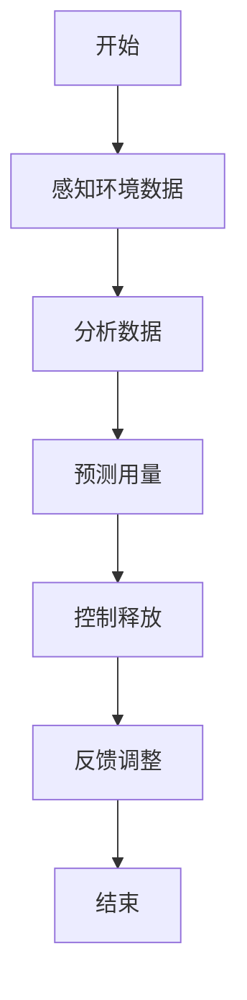
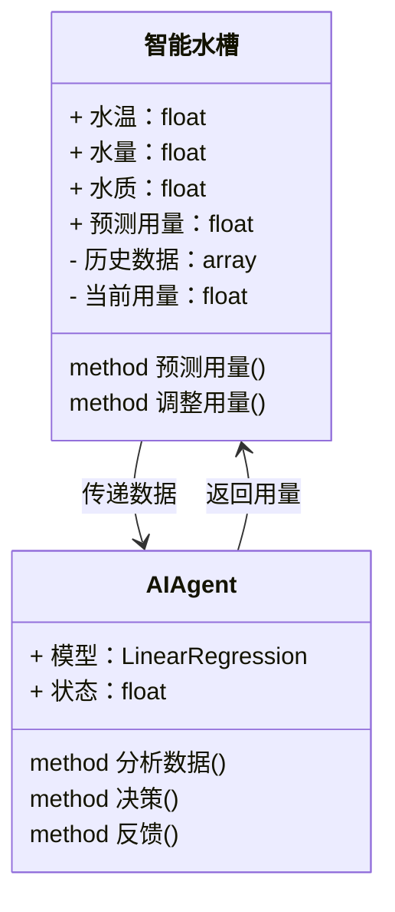
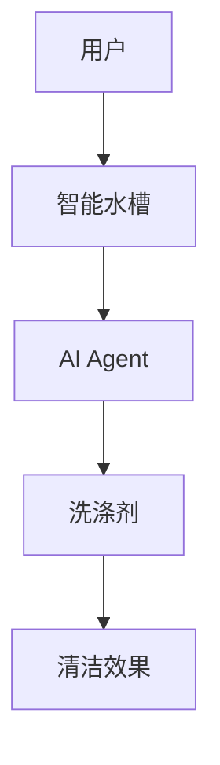

                 


# 智能厨房水槽：AI Agent的洗涤剂用量优化

## 关键词：智能厨房水槽，AI Agent，洗涤剂用量优化，动态调整算法，系统架构设计，数学模型

## 摘要：本文探讨了在智能厨房水槽中利用AI Agent优化洗涤剂用量的原理、算法设计、系统架构以及实际应用。通过动态调整算法和数学模型，AI Agent能够根据水质、水量和洗涤剂特性智能调节用量，提升洗涤效率并减少资源浪费，同时降低环境污染。文章详细介绍了优化算法、系统设计和项目实现，为智能厨房水槽的洗涤剂优化提供了理论基础和实践指导。

---

## 第1章 问题背景与描述

### 1.1 智能厨房水槽的发展背景

#### 1.1.1 智能家居的发展趋势
随着科技的进步，智能家居设备逐渐普及，厨房作为家居生活的重要部分，智能化需求日益增长。智能厨房水槽通过集成传感器、AI技术和物联网，能够实现智能化洗涤控制。

#### 1.1.2 厨房水槽智能化的必要性
传统水槽洗涤过程中，洗涤剂用量难以精确控制，导致资源浪费和环境污染。智能化水槽通过AI技术优化洗涤剂用量，提升洗涤效率，减少环境负担。

#### 1.1.3 洗涤剂用量优化的重要性
洗涤剂用量过少可能导致洗涤效果不佳，而过多则浪费资源并增加成本。优化洗涤剂用量不仅能提高洗涤效率，还能减少对环境的负面影响。

### 1.2 洗涤剂用量优化的问题描述

#### 1.2.1 洗涤剂用量过量的问题
洗涤剂过量使用会导致水资源浪费、环境污染，并增加使用成本。

#### 1.2.2 洗涤剂用量不足的问题
用量不足会导致洗涤效果差，影响清洁效果。

#### 1.2.3 洗涤剂种类多样性的挑战
不同洗涤剂适用于不同污渍类型，选择合适的洗涤剂种类和用量是优化的关键。

### 1.3 AI Agent在洗涤剂用量优化中的作用

#### 1.3.1 AI Agent的基本概念
AI Agent是一种智能体，能够感知环境、分析数据并做出决策，执行任务以实现目标。

#### 1.3.2 AI Agent在智能水槽中的应用
AI Agent通过传感器数据和洗涤历史，分析水质、水量和污渍情况，动态调整洗涤剂用量。

#### 1.3.3 AI Agent优化洗涤剂用量的原理
AI Agent通过实时监测和历史数据分析，预测最优洗涤剂用量，确保高效清洁。

### 1.4 问题解决与边界条件

#### 1.4.1 问题解决的总体思路
通过AI Agent分析数据，优化洗涤剂用量，提升洗涤效率，减少浪费。

#### 1.4.2 边界条件与限制
考虑洗涤剂种类、水质、水量、污渍类型等因素，设定合理的优化边界条件。

#### 1.4.3 优化目标与性能指标
优化目标为最小化洗涤剂用量，最大化清洁效率。性能指标包括用量准确性、清洁效果、响应速度等。

### 1.5 核心概念与外延

#### 1.5.1 核心概念的定义
洗涤剂用量优化是指通过智能技术调整洗涤剂用量，使其达到最佳清洁效果。

#### 1.5.2 核心概念的属性特征对比
| 属性 | 描述 |
|------|------|
| 洗涤剂种类 | 不同洗涤剂适用于不同污渍类型 |
| 用水量 | 水量影响洗涤剂溶解和反应 |
| 水质 | 水的硬度影响洗涤效果 |
| 温度 | 温度影响洗涤剂活性 |
| 污渍类型 | 不同污渍需要不同处理方式 |

#### 1.5.3 外延与相关领域的联系
洗涤剂用量优化与环保、智能家居、物联网等领域密切相关，通过优化洗涤剂用量，提升智能家居的绿色属性。

---

## 第2章 核心概念与联系

### 2.1 AI Agent的核心原理

#### 2.1.1 感知与识别
AI Agent通过传感器感知水温、水量、水质等参数，识别洗涤需求。

#### 2.1.2 数据分析与决策
利用机器学习算法分析数据，预测最优洗涤剂用量。

#### 2.1.3 自动控制与反馈
根据决策结果，控制洗涤剂释放量，并实时反馈优化结果。

### 2.2 洗涤剂用量优化的数学模型

#### 2.2.1 模型的构建与变量定义
数学模型用于描述洗涤剂用量与洗涤效果的关系，变量包括洗涤剂用量、水质、水量、温度等。

#### 2.2.2 模型的假设与约束条件
假设洗涤剂用量与洗涤效果呈非线性关系，约束条件包括洗涤剂最大用量、最小用量等。

#### 2.2.3 模型的优化目标
最大化清洁效果，最小化洗涤剂用量。

### 2.3 ER实体关系图

```mermaid
erDiagram
    actor 用户{}{
        名称
        洗涤历史
    }
    智能水槽{}{
        水温
        水量
        水质
    }
    洗涤剂{}{
        种类
        浓度
    }
    清洁效果{}{
        时间
        成功率
    }
    用户 --> 智能水槽 : 指令
    智能水槽 --> 洗涤剂 : 控制用量
    洗涤剂 --> 清洁效果 : 反馈
```

---

## 第3章 算法原理讲解

### 3.1 动态调整算法

#### 3.1.1 算法的总体思路
根据实时数据动态调整洗涤剂用量，优化洗涤效果。

#### 3.1.2 算法的步骤分解
1. 感知环境数据（水温、水量、水质）。
2. 分析数据，预测最优用量。
3. 控制洗涤剂释放，实时反馈调整。

#### 3.1.3 算法的优化策略
基于历史数据和实时反馈，不断优化预测模型。

### 3.2 数学模型与公式

#### 3.2.1 洗涤剂用量的计算公式
$$ 用量 = \alpha \cdot 温度 + \beta \cdot 水量 + \gamma \cdot 水质 $$

#### 3.2.2 优化目标的数学表达
$$ \min \sum (用量) $$
$$ \text{约束}：用量 \geq 最小用量，用量 \leq 最大用量 $$

#### 3.2.3 约束条件的数学描述
$$ 温度 \in [T_{\text{min}}, T_{\text{max}}] $$
$$ 水量 \in [V_{\text{min}}, V_{\text{max}}] $$
$$ 水质 \in [H_{\text{min}}, H_{\text{max}}] $$

### 3.3 算法实现的Python代码

#### 3.3.1 环境安装与配置
安装必要的库：
```bash
pip install numpy scikit-learn
```

#### 3.3.2 核心代码实现
```python
import numpy as np
from sklearn.linear_model import LinearRegression

# 示例数据
X = np.array([[25, 5], [30, 6], [28, 4], [22, 3]])
y = np.array([2, 3, 2.5, 1.5])

# 训练模型
model = LinearRegression()
model.fit(X, y)

# 预测用量
new_data = np.array([[24, 5]])
predicted_usage = model.predict(new_data)
print("预测用量:", predicted_usage[0])
```

#### 3.3.3 代码的功能解读
利用线性回归模型，根据水温和水量预测洗涤剂用量，实现动态调整。

### 3.4 优化流程的Mermaid图



---

## 第4章 系统分析与架构设计

### 4.1 项目背景与目标

#### 4.1.1 项目背景介绍
智能厨房水槽项目旨在通过AI技术优化洗涤剂用量，提升洗涤效率。

#### 4.1.2 项目目标设定
实现洗涤剂用量动态优化，提升洗涤效果，减少浪费。

### 4.2 系统功能设计

#### 4.2.1 领域模型图



#### 4.2.2 系统架构图



#### 4.2.3 接口和交互设计
洗涤剂用量控制接口：接收用量指令，调整释放量。

### 4.3 项目实战

#### 4.3.1 环境安装与配置
安装必要的库：numpy、scikit-learn。

#### 4.3.2 核心代码实现
实现AI Agent的预测和调整功能，代码示例如前所述。

#### 4.3.3 代码的功能解读
通过训练模型，AI Agent能够根据环境数据预测最优洗涤剂用量，实现动态调整。

#### 4.3.4 案例分析
通过实际案例，展示AI Agent如何优化洗涤剂用量，提升洗涤效果。

### 4.4 最佳实践 tips

#### 4.4.1 小结
AI Agent优化洗涤剂用量能够显著提升洗涤效率，减少资源浪费。

#### 4.4.2 注意事项
确保传感器数据的准确性，定期更新优化模型。

#### 4.4.3 拓展阅读
阅读相关AI优化算法，深入了解动态调整模型的应用。

---

## 第5章 最佳实践

### 5.1 小结
本文详细介绍了智能厨房水槽中AI Agent优化洗涤剂用量的核心原理、算法设计和系统架构。通过动态调整算法和数学模型，AI Agent能够有效优化洗涤剂用量，提升洗涤效率，减少资源浪费。

### 5.2 注意事项
- 确保传感器数据的准确性。
- 定期更新优化模型，适应不同环境条件。
- 考虑洗涤剂种类的多样性，优化不同场景下的用量。

### 5.3 拓展阅读
- 《人工智能在智能家居中的应用》
- 《动态优化算法在洗涤剂用量控制中的应用》

---

## 作者：AI天才研究院/AI Genius Institute & 禅与计算机程序设计艺术 /Zen And The Art of Computer Programming

---

感谢您的阅读，希望这篇文章能够帮助您深入了解智能厨房水槽中AI Agent优化洗涤剂用量的原理和实现方法。如需进一步探讨，欢迎随时联系！

