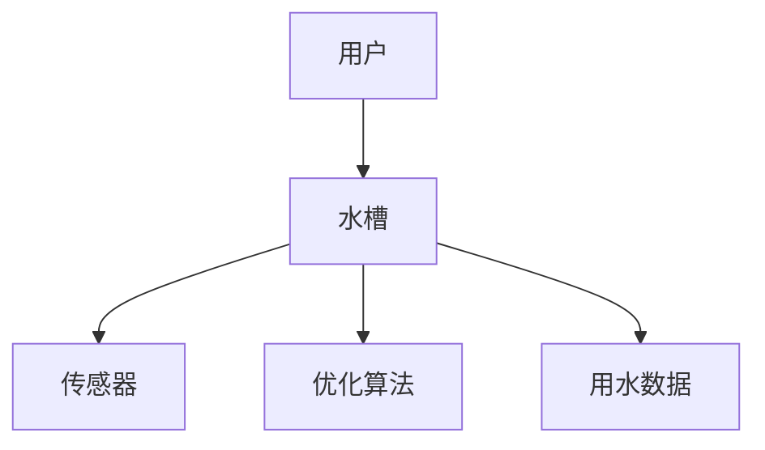
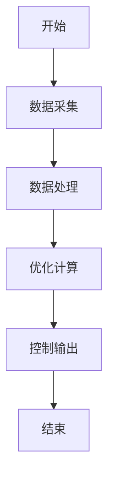
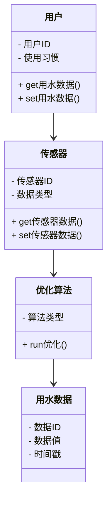
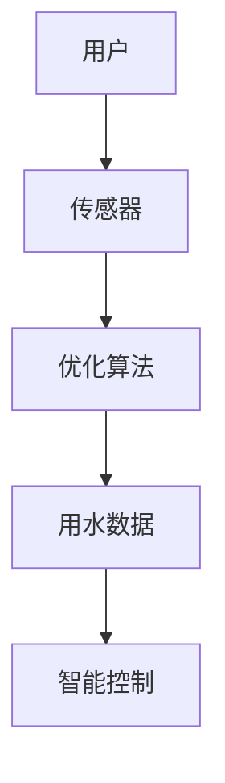
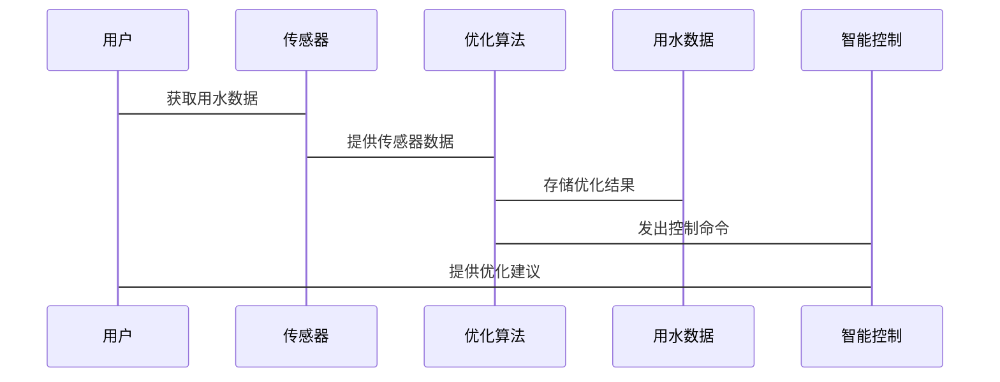

                 


# 智能厨房水槽：AI Agent的用水优化控制

> 关键词：智能厨房水槽，AI Agent，用水优化，智能传感器，优化算法，系统架构

> 摘要：本文探讨了智能厨房水槽在用水优化中的应用，通过AI Agent实现智能化控制，分析其核心概念、算法原理、系统架构及实际案例，展示了如何利用AI技术提升用水效率。

---

## 第1章: 背景介绍

### 1.1 问题背景与描述
#### 1.1.1 水资源浪费的现状
随着全球水资源短缺问题日益严重，家庭用水效率的提升变得尤为重要。传统水槽的用水方式往往不够智能，导致水资源浪费。

#### 1.1.2 智能厨房水槽的提出
智能厨房水槽通过集成AI技术，能够实时监测用水情况，并优化用水量，从而减少浪费。

#### 1.1.3 用水优化的必要性
通过优化用水量，不仅能够节省水资源，还能降低水费开支，对环保和经济都有重要意义。

### 1.2 智能厨房水槽的核心概念
#### 1.2.1 AI Agent的基本定义
AI Agent是一种能够感知环境、做出决策并执行动作的智能体，能够帮助水槽实现智能化控制。

#### 1.2.2 智能水槽的优化目标
优化目标包括减少水资源浪费、降低用水成本、提升用户体验等。

#### 1.2.3 用水优化的边界与外延
用水优化的边界包括水槽的使用场景和功能限制，外延则扩展到与其他智能家居设备的联动。

---

## 第2章: 核心概念与联系

### 2.1 AI Agent的原理与特征
#### 2.1.1 感知层：传感器数据采集
通过传感器实时采集水槽的用水数据，如水流速度、水温等。

#### 2.1.2 决策层：优化算法
使用遗传算法或模拟退火算法对数据进行分析，制定最优的用水策略。

#### 2.1.3 执行层：智能控制
根据优化算法的结果，调整水槽的运行状态，实现用水量的优化。

### 2.2 智能水槽与传统水槽对比
#### 2.2.1 功能对比
智能水槽具备智能感知和优化控制功能，而传统水槽仅提供基本的储水和排水功能。

#### 2.2.2 性能对比
智能水槽在用水效率和资源节约方面表现更优。

#### 2.2.3 使用体验对比
智能水槽提供更便捷、更环保的使用体验。

### 2.3 ER实体关系图


---

## 第3章: 算法原理讲解

### 3.1 优化算法概述
#### 3.1.1 遗传算法
通过模拟生物进化过程，选择最优解。

#### 3.1.2 模拟退火算法
通过逐步降温，找到全局最优解。

#### 3.1.3 其他优化算法
如粒子群算法等。

### 3.2 算法流程图


### 3.3 数学模型与公式
#### 3.3.1 目标函数
$$ \text{目标函数} = \sum_{i=1}^{n} w_i x_i $$

#### 3.3.2 约束条件
$$ \sum_{i=1}^{n} x_i \leq C $$

---

## 第4章: 系统分析与架构设计

### 4.1 问题场景介绍
家庭日常用水中，水槽的使用占据了较大比例，优化其用水效率对整体节水意义重大。

### 4.2 项目介绍
智能厨房水槽项目旨在通过AI技术实现用水优化控制。

### 4.3 系统功能设计
#### 4.3.1 领域模型


### 4.4 系统架构设计
#### 4.4.1 系统架构图


### 4.5 系统接口设计
设计系统接口，确保各模块之间的数据传递和控制命令的执行。

### 4.6 系统交互流程
使用序列图展示系统交互流程：


---

## 第5章: 项目实战

### 5.1 环境安装
#### 5.1.1 安装Python
安装Python和必要的库，如numpy和scipy。

### 5.2 系统核心实现源代码
#### 5.2.1 优化算法实现
```python
import numpy as np
import random

def genetic_algorithm(population, fitness, num_generations):
    for _ in range(num_generations):
        population = [mutate(individual) for individual in population]
        population = select_next_generation(population, fitness)
    return population[0]

def mutate(individual):
    # 突变逻辑
    return individual

def select_next_generation(population, fitness):
    # 选择逻辑
    return population
```

#### 5.2.2 传感器数据处理
```python
def process_sensor_data(data):
    # 数据处理逻辑
    return processed_data
```

### 5.3 代码应用解读与分析
详细解读代码功能，分析其在系统中的作用。

### 5.4 实际案例分析
通过实际案例展示系统优化效果，例如：
- 某家庭通过智能水槽节省了30%的用水量。

### 5.5 项目小结
总结项目实现的关键点和成功经验。

---

## 第6章: 总结与展望

### 6.1 最佳实践 Tips
- 定期更新传感器和算法，提升优化效果。
- 结合其他智能家居设备，打造全方位的节水系统。

### 6.2 小结
智能厨房水槽通过AI Agent实现了用水的智能化优化，为家庭节水提供了有效解决方案。

### 6.3 注意事项
- 确保传感器数据的准确性。
- 定期维护系统，避免故障影响使用。

### 6.4 拓展阅读
推荐阅读相关领域的书籍和论文，如《智能优化算法》、《智能家居系统设计》等。

---

## 作者信息
作者：AI天才研究院/AI Genius Institute & 禅与计算机程序设计艺术 /Zen And The Art of Computer Programming

