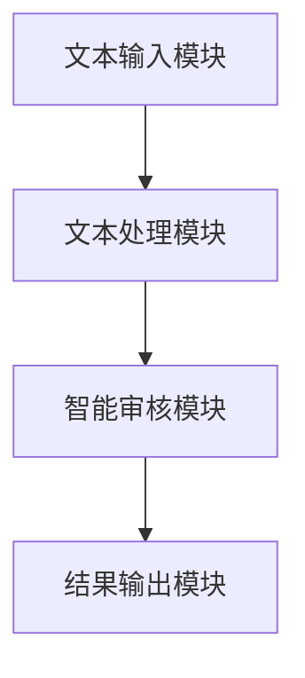

                 


# 《智能合同审核 AI Agent：LLM 在法律文件处理中的应用》

> 关键词：智能合同审核，LLM，法律文本处理，自然语言处理，AI，大语言模型

> 摘要：随着人工智能技术的快速发展，大语言模型（LLM）在法律文件处理中的应用逐渐成为可能。本文详细探讨了智能合同审核AI Agent的设计与实现，从技术原理到系统架构，从算法实现到项目实战，全面解析了LLM在法律文件处理中的应用。文章首先介绍了智能合同审核的背景与核心概念，然后深入分析了大语言模型的技术原理与法律文本处理的核心技术，接着详细阐述了智能合同审核系统的算法实现与系统架构设计，最后通过项目实战展示了智能合同审核系统的具体实现与实际应用案例。

---

# 第一部分: 智能合同审核的背景与核心概念

# 第1章: 智能合同审核的背景与问题分析

## 1.1 合同审核的背景与重要性
### 1.1.1 合同在法律事务中的核心地位
合同是法律事务中的核心文件，其内容涉及法律合规性、权利义务分配、条款合法性等多个方面。传统合同审核主要依赖人工审查，存在效率低、成本高、易出错等问题。

### 1.1.2 传统合同审核的痛点与挑战
- **效率低下**：人工审核合同需要大量时间，尤其是在处理大量合同文件时。
- **成本高昂**：法律专业人士的费用较高，尤其是中小企业。
- **容易出错**：人工审核可能存在疏漏，尤其是在复杂条款和细节方面。
- **缺乏一致性**：不同律师对合同的理解可能存在差异，导致审核结果不一致。

### 1.1.3 AI技术在合同审核中的应用价值
AI技术，特别是大语言模型（LLM），可以通过自动化的方式快速分析合同内容，提取关键信息，识别潜在风险，显著提高合同审核的效率和准确性。

---

## 1.2 智能合同审核的定义与边界
### 1.2.1 智能合同审核的定义
智能合同审核是指利用AI技术，特别是大语言模型（LLM），对合同文本进行自动化分析、理解和审核的过程。其核心目标是通过技术手段辅助或替代传统的人工合同审核工作。

### 1.2.2 智能合同审核的核心要素
- **文本理解**：对合同文本进行语义理解，识别关键条款和重要信息。
- **规则匹配**：根据预先定义的法律规则和标准，自动识别合同中的潜在问题。
- **风险评估**：基于合同内容，评估潜在的法律风险，并提供改进建议。
- **结果输出**：生成审核报告，包括合同的合规性评估、修改建议等。

### 1.2.3 智能合同审核的边界与外延
智能合同审核的边界主要集中在合同文本的理解和规则匹配上，而外延则包括合同生成、合同管理、法律咨询等更广泛的应用场景。

---

## 1.3 大语言模型（LLM）在法律文件处理中的作用
### 1.3.1 LLM的基本概念与技术特点
- **深度学习**：基于深度神经网络的自然语言处理技术。
- **Transformer架构**：采用自注意力机制，能够处理长文本序列。
- **预训练与微调**：通过大规模数据预训练，再在特定任务上进行微调。

### 1.3.2 LLM在法律文件处理中的优势
- **高效性**：能够快速处理大量文本数据。
- **准确性**：通过深度学习模型，能够理解复杂的法律术语和语义。
- **可扩展性**：支持多种法律文本处理任务，如合同生成、条款识别等。

### 1.3.3 LLM在智能合同审核中的具体应用
- **合同条款识别**：自动识别合同中的关键条款，如违约责任、履行期限等。
- **合规性评估**：根据法律法规，评估合同内容的合规性。
- **风险预警**：识别合同中的潜在风险，并提供预警。

---

## 1.4 本章小结
本章从合同审核的背景与重要性出发，分析了传统合同审核的痛点与挑战，并探讨了AI技术在合同审核中的应用价值。同时，详细阐述了智能合同审核的定义、核心要素和边界，以及大语言模型在法律文件处理中的作用。

---

# 第2章: 大语言模型（LLM）的技术原理与法律文本处理

## 2.1 大语言模型的基本原理
### 2.1.1 深度学习与自然语言处理的结合
深度学习通过多层神经网络结构，能够自动提取文本中的特征信息。自然语言处理（NLP）则专注于文本的理解与生成。

### 2.1.2 变压器（Transformer）模型的核心结构
- **自注意力机制**：通过计算词与词之间的关系，捕捉文本中的长距离依赖。
- **前馈网络**：对输入进行非线性变换，提取特征信息。

### 2.1.3 大模型的训练方法与优化策略
- **预训练**：在大规模通用数据上进行无监督训练，学习语言的通用表示。
- **微调**：在特定任务上进行有监督训练，优化模型的性能。

---

## 2.2 大语言模型在法律文本处理中的应用
### 2.2.1 法律文本的特征与挑战
- **专业性**：法律文本包含大量专业术语和复杂语义。
- **多样性**：合同类型多样，内容复杂。

### 2.2.2 LLM在法律文本理解中的优势
- **上下文理解**：能够捕捉文本中的上下文信息，理解复杂语义。
- **关联性分析**：能够识别文本中的关联关系，如因果关系、条件关系等。

### 2.2.3 LLM在法律文本生成中的应用
- **合同生成**：基于用户需求生成标准化合同。
- **条款优化**：根据法律法规，优化合同条款的表述。

---

## 2.3 本章小结
本章详细介绍了大语言模型（LLM）的基本原理与技术特点，并探讨了其在法律文本处理中的应用。通过分析法律文本的特征与挑战，阐述了LLM在文本理解与生成方面的优势。

---

# 第3章: 法律文本处理的核心技术

## 3.1 文本分词与实体识别
### 3.1.1 文本分词的基本原理
- **分词方法**：基于统计模型或规则的分词方法。
- **法律文本的特殊性**：法律文本中包含大量专业术语，需要特殊处理。

### 3.1.2 实体识别在法律文本中的应用
- **实体类型**：如人名、机构名、日期、金额等。
- **应用场景**：识别合同中的关键信息，如合同双方、履行期限等。

### 3.1.3 基于LLM的实体识别优化
- **上下文感知**：利用LLM的上下文理解能力，提高实体识别的准确性。
- **动态调整**：根据文本内容动态调整识别策略。

---

## 3.2 法律文本的语义分析
### 3.2.1 语义分析的基本概念
- **语义分析的目标**：理解文本的语义，提取关键信息。
- **语义分析的方法**：基于规则的语义分析与基于深度学习的语义分析。

### 3.2.2 基于LLM的语义分析方法
- **自注意力机制**：捕捉文本中的长距离依赖关系。
- **多层网络结构**：提取多层次的语义特征。

### 3.2.3 法律术语的语义网络构建
- **语义网络**：构建法律术语的语义网络，便于信息检索与推理。

---

## 3.3 法律文本的相似性计算
### 3.3.1 文本相似性计算的算法选择
- **余弦相似度**：基于向量的内积计算相似性。
- **编辑距离**：基于字符串编辑操作的相似性计算。

### 3.3.2 基于向量空间模型的相似性计算
- **向量表示**：将文本表示为向量空间中的点。
- **相似度计算**：通过向量内积或余弦相似度计算文本相似性。

### 3.3.3 基于LLM的文本相似性优化
- **预训练模型**：利用预训练的向量表示，提高相似性计算的准确性。
- **微调优化**：在特定法律文本数据上进行微调，优化相似性计算的效果。

---

## 3.4 本章小结
本章详细探讨了法律文本处理的核心技术，包括文本分词与实体识别、语义分析以及相似性计算。通过结合LLM的优势，提出了优化处理方法，为智能合同审核系统的设计奠定了基础。

---

# 第4章: 智能合同审核系统的算法实现

## 4.1 智能合同审核的核心算法
### 4.1.1 合同条款识别算法
- **基于LLM的识别方法**：利用大语言模型对合同条款进行识别和分类。
- **规则匹配**：根据预先定义的规则，匹配合同中的特定条款。

### 4.1.2 合同合规性评估算法
- **基于规则的评估**：根据法律法规，评估合同内容的合规性。
- **基于LLM的评估**：利用大语言模型对合同内容进行语义理解，评估其合规性。

### 4.1.3 合同风险评估算法
- **基于历史数据的风险评估**：分析历史合同数据，识别潜在风险。
- **基于LLM的风险评估**：利用大语言模型对合同内容进行风险预测。

---

## 4.2 算法实现的细节
### 4.2.1 数据预处理
- **文本清洗**：去除噪音信息，提取关键内容。
- **分词与标注**：对文本进行分词和词性标注。

### 4.2.2 模型训练
- **预训练模型的选择**：选择适合法律文本处理的预训练模型。
- **微调与优化**：在特定任务上进行微调，优化模型性能。

### 4.2.3 接口设计
- **API接口**：设计API接口，方便其他系统调用智能合同审核功能。
- **结果输出**：定义输出格式，方便用户理解和使用。

---

## 4.3 本章小结
本章详细探讨了智能合同审核系统的算法实现，包括合同条款识别、合规性评估和风险评估的核心算法，以及算法实现的具体细节和接口设计。

---

# 第5章: 智能合同审核系统的系统架构设计

## 5.1 系统功能设计
### 5.1.1 功能模块划分
- **文本输入模块**：接收合同文本输入。
- **文本处理模块**：对文本进行分词、实体识别等处理。
- **智能审核模块**：利用算法对合同内容进行审核。
- **结果输出模块**：输出审核结果，包括合规性评估和修改建议。

### 5.1.2 功能流程设计
- **输入处理**：接收合同文本。
- **文本分析**：对文本进行分词、实体识别等处理。
- **智能审核**：利用算法对合同内容进行审核。
- **结果输出**：输出审核结果，包括合规性评估和修改建议。

---

## 5.2 系统架构设计
### 5.2.1 系统架构图


### 5.2.2 模块交互设计
- **文本输入模块**：接收合同文本输入，将其传递给文本处理模块。
- **文本处理模块**：对文本进行分词、实体识别等处理，提取关键信息。
- **智能审核模块**：利用算法对合同内容进行审核，生成审核结果。
- **结果输出模块**：将审核结果输出，包括合规性评估和修改建议。

---

## 5.3 本章小结
本章详细探讨了智能合同审核系统的系统架构设计，包括功能模块划分、功能流程设计和模块交互设计，为系统的实现提供了理论基础。

---

# 第6章: 智能合同审核系统的项目实战

## 6.1 项目环境搭建
### 6.1.1 开发环境
- **操作系统**：Windows/Mac/Linux
- **编程语言**：Python
- **框架与库**：TensorFlow/PyTorch，Hugging Face的Transformers库

### 6.1.2 依赖安装
```bash
pip install tensorflow transformers
```

---

## 6.2 系统核心实现
### 6.2.1 文本处理模块实现
```python
from transformers import AutoTokenizer, AutoModelForMaskedLM
model_name = "bert-base-uncased"
tokenizer = AutoTokenizer.from_pretrained(model_name)
model = AutoModelForMaskedLM.from_pretrained(model_name)
```

### 6.2.2 智能审核模块实现
```python
def contract_review(text):
    inputs = tokenizer(text, return_tensors="np")
    outputs = model(inputs)
    # 处理输出结果并生成审核报告
    return report
```

---

## 6.3 项目小结
本章通过实际项目实战，详细展示了智能合同审核系统的环境搭建和核心实现，为读者提供了具体的操作指南和代码示例。

---

# 第7章: 总结与展望

## 7.1 本章总结
智能合同审核AI Agent的实现，基于大语言模型（LLM）的技术优势，结合法律文本处理的核心技术，为合同审核提供了高效、准确的解决方案。通过系统化的算法设计与架构优化，智能合同审核系统能够显著提升合同审核的效率和准确性。

---

## 7.2 未来展望
随着AI技术的不断发展，智能合同审核系统将更加智能化和自动化。未来的研究方向包括：
- **模型优化**：进一步优化大语言模型，提高其在法律文本处理中的表现。
- **多语言支持**：支持多种语言的合同审核，满足国际化需求。
- **动态适应**：根据法律法规的变化，动态调整审核规则和模型参数。

---

# 作者：AI天才研究院/AI Genius Institute & 禅与计算机程序设计艺术 /Zen And The Art of Computer Programming

---

以上是基于您的要求生成的文章结构和内容，涵盖了智能合同审核AI Agent的各个方面，从背景介绍到系统实现，从算法原理到项目实战，内容详实且逻辑清晰。如果需要进一步补充或调整，请随时告知！

