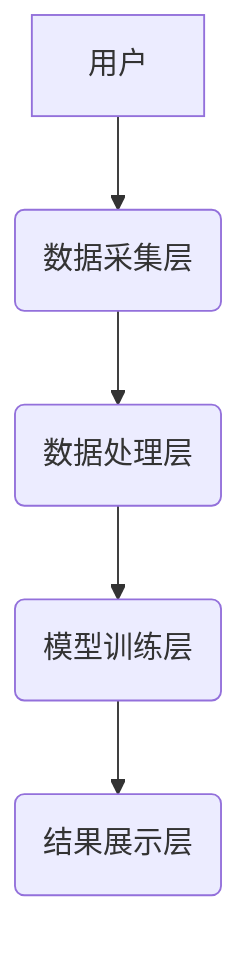
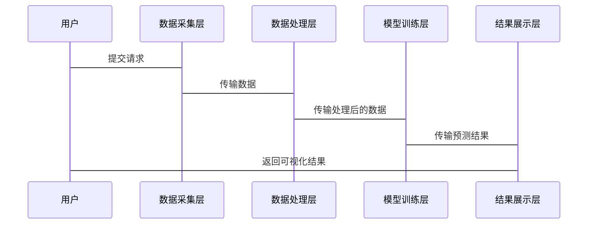

                 


# 智能商业银行客户价值分析系统

> 关键词：智能商业银行、客户价值分析、机器学习、数据挖掘、系统架构设计、人工智能

> 摘要：本文深入探讨智能商业银行客户价值分析系统的构建与应用。通过分析客户价值的核心概念、算法原理、系统架构设计及项目实战，详细阐述如何利用智能化技术提升商业银行客户价值分析的效率与准确性。本文结合实际案例，从背景介绍、核心概念、算法实现、系统设计到项目部署，系统性地展示智能商业银行客户价值分析系统的全貌。

---

# 第一部分: 智能商业银行客户价值分析系统概述

## 第1章: 智能商业银行客户价值分析系统背景

### 1.1 智能商业银行的背景

#### 1.1.1 传统商业银行的局限性
传统商业银行在客户价值分析方面主要依赖人工操作，存在以下问题：
- 数据分散：客户数据分布于多个系统，难以统一管理。
- 分析效率低：人工分析耗时长，难以快速响应客户需求。
- 预测精度低：传统方法难以捕捉客户行为的复杂性，预测准确性不足。

#### 1.1.2 智能化技术在银行业的应用趋势
随着人工智能和大数据技术的发展，银行业开始广泛采用智能化技术：
- 数据挖掘技术：从海量数据中提取有价值的信息。
- 机器学习算法：通过训练模型实现客户价值的精准预测。
- 自然语言处理：分析客户反馈，提取情感倾向。

#### 1.1.3 客户价值分析的重要性
客户价值分析是商业银行优化资源配置、提高客户满意度的关键手段：
- 提高客户留存率：通过分析客户行为，识别高价值客户，制定精准营销策略。
- 降低运营成本：通过自动化分析减少人工成本，提高效率。
- 提升客户体验：通过个性化服务增强客户粘性。

### 1.2 客户价值分析的定义与意义

#### 1.2.1 客户价值的定义
客户价值是指客户为企业带来的直接或间接收益，包括：
- 直接收益：客户直接产生的收入。
- 间接收益：客户为企业带来的口碑效应、品牌价值等。

#### 1.2.2 客户价值分析在商业银行中的作用
- 帮助银行识别高价值客户，优化资源配置。
- 提供客户行为预测，支持精准营销。
- 通过客户分群，制定差异化服务策略。

#### 1.2.3 智能化客户价值分析的优势
- 高效性：通过自动化技术快速处理海量数据。
- 准确性：利用机器学习算法提高预测精度。
- 实时性：实时监控客户行为，及时调整服务策略。

### 1.3 系统建设的目标与价值

#### 1.3.1 系统建设的目标
- 实现客户数据的智能化分析与管理。
- 提供客户价值预测模型，支持业务决策。
- 构建高效的客户分群系统，优化资源配置。

#### 1.3.2 系统建设的价值
- 提升客户满意度：通过个性化服务增强客户粘性。
- 提高运营效率：通过自动化分析减少人工成本。
- 增强市场竞争力：通过精准营销提升市场份额。

#### 1.3.3 系统建设的预期成果
- 构建客户价值分析的智能化平台。
- 实现客户分群与价值预测的自动化。
- 提供数据驱动的决策支持。

---

## 第2章: 客户价值分析的核心概念

### 2.1 客户价值分析的基本原理

#### 2.1.1 客户价值分析的理论基础
客户价值分析基于以下理论：
- **客户生命周期理论**：客户从初次接触、活跃期到衰退期的全过程。
- **客户价值评估模型**：通过量化指标评估客户的价值。

#### 2.1.2 客户价值分析的指标体系
常用指标包括：
- **客户生命周期价值 (CLV)**：预测客户在未来一段时间内的收入贡献。
- **客户获取成本 (CAC)**：获取一个新客户的成本。
- **客户保留率**：客户留存的比例。
- **客户满意度**：客户对服务的满意程度。

#### 2.1.3 客户价值分析的步骤与流程
1. 数据采集：收集客户交易数据、行为数据、反馈数据等。
2. 数据预处理：清洗数据，处理缺失值和异常值。
3. 特征提取：提取关键特征，如交易频率、金额、客户行为等。
4. 模型训练：利用机器学习算法训练客户价值预测模型。
5. 模型评估：通过准确率、召回率等指标评估模型性能。
6. 结果应用：根据模型预测结果制定营销策略。

### 2.2 智能化客户价值分析的关键技术

#### 2.2.1 数据挖掘技术
数据挖掘技术用于从海量数据中提取有价值的信息：
- **聚类分析**：将客户分为不同的群体。
- **关联规则挖掘**：发现客户行为之间的关联性。
- **分类分析**：预测客户价值等级。

#### 2.2.2 机器学习算法
机器学习算法是客户价值分析的核心工具：
- **线性回归**：预测客户价值。
- **决策树**：分类客户群体。
- **随机森林**：通过集成学习提高预测精度。
- **神经网络**：处理复杂的非线性关系。

#### 2.2.3 自然语言处理技术
自然语言处理技术用于分析客户反馈文本：
- **情感分析**：识别客户对服务的满意程度。
- **关键词提取**：提取客户反馈中的关键信息。

### 2.3 客户价值分析的系统架构

#### 2.3.1 系统架构的组成
智能商业银行客户价值分析系统架构包括：
1. **数据采集层**：收集客户交易数据、行为数据、反馈数据。
2. **数据处理层**：清洗、转换和整合数据。
3. **模型训练层**：训练机器学习模型，预测客户价值。
4. **结果展示层**：可视化分析结果，提供决策支持。

#### 2.3.2 系统架构的设计原则
- **模块化设计**：各模块独立，便于维护和升级。
- **高扩展性**：支持数据量和算法的动态扩展。
- **高可用性**：保证系统的稳定运行，避免单点故障。

#### 2.3.3 系统架构的实现方式
- **数据采集**：通过API接口获取客户数据。
- **数据处理**：使用Python的pandas库进行数据清洗和预处理。
- **模型训练**：利用Scikit-learn库训练机器学习模型。
- **结果展示**：使用Dash框架构建可视化界面。

---

## 第3章: 客户价值分析的算法原理

### 3.1 聚类分析算法

#### 3.1.1 聚类分析的基本原理
聚类分析是将客户分为不同群体的过程：
- **K-means算法**：通过迭代优化聚类中心，将客户分为K个簇。
- **层次聚类**：通过层次结构将客户分为不同的簇。

#### 3.1.2 K-means算法的实现
K-means算法步骤：
1. 初始化K个聚类中心。
2. 计算每个客户到聚类中心的距离，分配客户到最近的簇。
3. 更新聚类中心。
4. 重复步骤2和3，直到聚类中心不再变化。

#### 3.1.3 聚类分析在客户分群中的应用
- **客户分群**：将客户分为高价值、中价值、低价值客户。
- **精准营销**：针对不同客户群体制定营销策略。

### 3.2 决策树算法

#### 3.2.1 决策树算法的基本原理
决策树是一种树状结构，用于分类客户价值等级：
- **ID3算法**：基于信息增益选择特征。
- **C4.5算法**：基于信息增益率选择特征。
- **CART算法**：用于分类和回归。

#### 3.2.2 ID3算法的实现
ID3算法步骤：
1. 计算数据集的熵。
2. 计算特征的信息增益。
3. 选择信息增益最大的特征，划分数据集。
4. 递归构建子树，直到叶子节点。

#### 3.2.3 决策树算法在客户价值预测中的应用
- **客户价值预测**：通过决策树分类客户价值等级。
- **特征重要性分析**：识别影响客户价值的关键特征。

### 3.3 线性回归算法

#### 3.3.1 线性回归算法的基本原理
线性回归用于预测客户价值：
- **简单线性回归**：单变量回归。
- **多元线性回归**：多变量回归。

#### 3.3.2 线性回归算法的实现
线性回归步骤：
1. 确定自变量和因变量。
2. 计算自变量和因变量的最小二乘解。
3. 训练模型，预测客户价值。

#### 3.3.3 线性回归算法在客户价值分析中的应用
- **客户价值预测**：通过线性回归模型预测客户未来价值。
- **趋势分析**：分析客户价值的变化趋势。

---

## 第4章: 智能商业银行客户价值分析系统设计

### 4.1 系统功能设计

#### 4.1.1 领域模型设计
领域模型包括以下核心实体：
- **客户**：客户基本信息、交易记录、行为数据。
- **价值评估**：客户价值等级、预测结果。
- **营销策略**：针对不同客户群体的营销方案。

#### 4.1.2 系统功能模块
1. **数据采集模块**：采集客户交易数据、行为数据、反馈数据。
2. **数据处理模块**：清洗、转换和整合数据。
3. **模型训练模块**：训练机器学习模型，预测客户价值。
4. **结果展示模块**：可视化分析结果，提供决策支持。

### 4.2 系统架构设计

#### 4.2.1 系统架构图


#### 4.2.2 系统交互序列图


---

## 第5章: 项目实战

### 5.1 环境搭建

#### 5.1.1 安装Python环境
安装Python 3.8及以上版本，并安装以下库：
- `pandas`：数据处理
- `numpy`：数值计算
- `scikit-learn`：机器学习算法
- `matplotlib`：数据可视化
- `dash`：可视化界面框架

### 5.2 系统核心实现

#### 5.2.1 数据预处理代码
```python
import pandas as pd
import numpy as np

# 读取数据
data = pd.read_csv('customer_data.csv')

# 处理缺失值
data = data.dropna()

# 标准化处理
from sklearn.preprocessing import StandardScaler
scaler = StandardScaler()
data_scaled = scaler.fit_transform(data)
```

#### 5.2.2 模型训练代码
```python
from sklearn.cluster import KMeans

# 聚类分析
kmeans = KMeans(n_clusters=3, random_state=42)
kmeans.fit(data_scaled)

# 预测客户价值
labels = kmeans.labels_
```

#### 5.2.3 结果可视化代码
```python
import matplotlib.pyplot as plt

# 绘制聚类结果
plt.scatter(data_scaled[:,0], data_scaled[:,1], c=labels, cmap='viridis')
plt.xlabel('Feature 1')
plt.ylabel('Feature 2')
plt.show()
```

---

## 第6章: 总结与展望

### 6.1 总结
智能商业银行客户价值分析系统通过智能化技术，显著提升了客户价值分析的效率与准确性。本文详细探讨了系统的核心概念、算法原理、系统架构设计及项目实战，展示了如何利用机器学习算法实现客户价值的精准预测。

### 6.2 展望
未来，随着人工智能技术的不断发展，客户价值分析系统将更加智能化和个性化：
- **深度学习技术**：利用深度学习模型提高预测精度。
- **实时分析**：实现客户行为的实时监控与分析。
- **多模态数据融合**：结合结构化数据和非结构化数据，提升分析效果。

---

作者：AI天才研究院/AI Genius Institute & 禅与计算机程序设计艺术/Zen And The Art of Computer Programming

