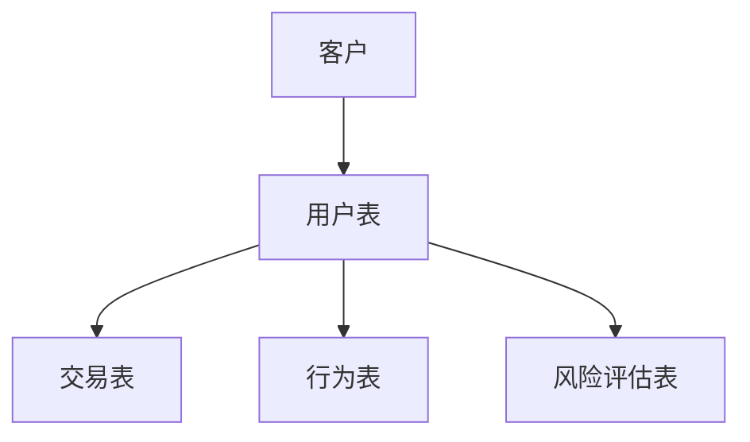
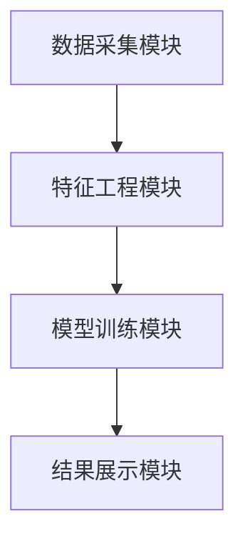

                 


# 智能商业银行客户价值评估模型

> 关键词：智能评估、客户价值、商业银行、机器学习、数据分析

> 摘要：本文探讨了智能商业银行客户价值评估模型的设计与实现，通过数据分析和机器学习技术，构建高效、准确的客户价值评估系统，为商业银行精准营销和风险管理提供支持。

---

# 第1章：客户价值评估的背景与重要性

## 1.1 问题背景
### 1.1.1 商业银行客户价值评估的现状
商业银行在客户管理中，传统的客户价值评估方法依赖于人工分析和经验判断，存在效率低、主观性强、难以量化等问题。随着数据科学和人工智能技术的发展，智能化评估成为必然趋势。

### 1.1.2 当前客户价值评估的主要挑战
- 数据维度复杂，难以提取有效特征。
- 模型的可解释性与准确性之间的平衡问题。
- 客户行为的动态变化导致模型需要持续优化。

### 1.1.3 智能化评估的必要性与优势
智能化评估能够通过大数据分析和机器学习算法，快速、准确地评估客户价值，帮助银行实现精准营销和风险管理。

## 1.2 问题描述
### 1.2.1 客户价值的定义与度量
客户价值是指客户对银行的贡献度，通常包括收入贡献、风险贡献、长期价值等多个维度。

### 1.2.2 传统客户价值评估方法的局限性
传统方法通常基于简单的统计分析，难以捕捉客户行为的复杂性，且容易受到人为因素的影响。

### 1.2.3 数据驱动的智能评估需求
通过收集和分析客户的多维度数据，利用机器学习算法构建客户价值评估模型，能够更准确地预测客户的未来行为和贡献。

## 1.3 问题解决
### 1.3.1 智能化客户价值评估的目标
- 实现客户价值的精准预测。
- 提供可解释的评估结果，支持业务决策。
- 实现动态更新，适应客户行为的变化。

### 1.3.2 智能化评估的核心技术
- 数据预处理与特征工程。
- 机器学习算法的选择与优化。
- 模型的部署与实时预测。

### 1.3.3 智能化评估的实施步骤
1. 数据收集与清洗。
2. 特征提取与选择。
3. 模型训练与优化。
4. 模型部署与应用。

## 1.4 边界与外延
### 1.4.1 智能化评估的适用场景
- 零售银行客户评估。
- 企业客户价值评估。
- 客户分层与精准营销。

### 1.4.2 智能化评估的边界条件
- 数据隐私与安全问题。
- 模型的泛化能力。
- 业务规则的约束。

### 1.4.3 相关概念的对比与区分
- 客户价值评估与客户评分的区别。
- 智能化评估与传统评估的对比。

## 1.5 核心要素与组成
### 1.5.1 数据来源与特征
- 客户基本信息：年龄、性别、职业等。
- 交易数据：交易频率、金额、渠道等。
- 行为数据：登录次数、点击行为、投诉记录等。

### 1.5.2 模型构建的关键要素
- 数据预处理：缺失值处理、异常值剔除。
- 特征工程：特征选择、特征组合、特征提取。
- 模型选择：回归模型、分类模型、聚类模型。

### 1.5.3 评估结果的应用场景
- 客户分层：识别高价值客户。
- 精准营销：制定个性化的营销策略。
- 风险管理：评估客户的信用风险。

---

# 第2章：客户价值评估模型的核心概念与联系

## 2.1 核心概念原理
### 2.1.1 客户价值的多维度分析
客户价值可以从收入贡献、风险贡献、长期价值等多个维度进行分析，构建多维度的评估指标。

### 2.1.2 数据驱动的特征提取
通过数据分析技术，从海量数据中提取有效的特征，为模型提供高质量的输入数据。

### 2.1.3 模型的可解释性与鲁棒性
模型需要具有良好的可解释性，以便业务人员理解评估结果；同时，模型需要具有较强的鲁棒性，能够适应数据分布的变化。

## 2.2 核心概念属性特征对比
### 2.2.1 客户特征的分类与属性
| 客户特征 | 描述 |
|----------|------|
| 基本信息 | 年龄、性别、职业等 |
| 交易数据 | 交易频率、金额、渠道等 |
| 行为数据 | 登录次数、点击行为、投诉记录等 |

### 2.2.2 模型性能的对比分析
| 模型类型 | 优点 | 缺点 |
|----------|------|------|
| 线性回归 | 简单易懂 | 高度依赖特征线性关系 |
| 随机森林 | 高准确性 | 可解释性较差 |
| 神经网络 | 强大学习能力 | 训练时间较长 |

### 2.2.3 不同模型的适用场景
- 线性回归适用于线性关系明显的场景。
- 随机森林适用于高维数据和非线性关系的场景。
- 神经网络适用于复杂模式识别的场景。

## 2.3 ER实体关系图架构


---

## 2.4 核心概念与联系
### 2.4.1 核心概念之间的关系
客户特征、模型算法和评估结果三者之间相互关联，共同构成客户价值评估系统。

### 2.4.2 核心概念的层级结构
```
客户价值评估模型
├── 客户特征
│   ├── 基本信息
│   ├── 交易数据
│   └── 行为数据
├── 模型算法
│   ├── 线性回归
│   ├── 随机森林
│   └── 神经网络
└── 评估结果
    ├── 客户评分
    ├── 风险等级
    └── 营销策略
```

---

# 第3章：客户价值评估模型的算法原理

## 3.1 算法原理概述
### 3.1.1 线性回归模型
线性回归是一种简单但有效的回归算法，适用于线性关系明显的场景。

### 3.1.2 随机森林模型
随机森林是一种基于决策树的集成算法，具有高准确性和较强的鲁棒性。

### 3.1.3 神经网络模型
神经网络是一种基于深度学习的算法，适用于复杂模式识别的场景。

## 3.2 算法原理详细解析
### 3.2.1 线性回归模型
线性回归的数学模型如下：
$$ y = \beta_0 + \beta_1 x_1 + \beta_2 x_2 + ... + \beta_n x_n + \epsilon $$
其中，$\beta_0$ 是截距项，$\beta_1, \beta_2, ..., \beta_n$ 是回归系数，$\epsilon$ 是误差项。

### 3.2.2 随机森林模型
随机森林通过构建多棵决策树，并对结果进行投票或平均，提高模型的准确性和鲁棒性。

### 3.2.3 神经网络模型
神经网络由多个神经元组成，通过多层的非线性变换，能够捕捉数据中的复杂模式。

## 3.3 算法实现步骤
### 3.3.1 数据预处理
- 数据清洗：处理缺失值、异常值。
- 特征工程：选择特征、进行特征组合。

### 3.3.2 模型训练
- 线性回归：使用最小二乘法求解回归系数。
- 随机森林：通过袋装法和特征子集选择构建多棵决策树。
- 神经网络：通过反向传播算法更新权重。

### 3.3.3 模型评估
- 线性回归：计算R²值。
- 随机森林：计算准确率、召回率。
- 神经网络：计算准确率、F1分数。

---

# 第4章：客户价值评估系统的架构设计

## 4.1 系统架构概述
客户价值评估系统包括数据采集模块、特征工程模块、模型训练模块和结果展示模块。

## 4.2 系统功能设计
### 4.2.1 数据采集模块
负责采集客户的多维度数据，包括基本信息、交易数据和行为数据。

### 4.2.2 特征工程模块
对采集的数据进行清洗、特征选择和特征提取，为模型提供高质量的输入数据。

### 4.2.3 模型训练模块
使用机器学习算法对特征数据进行训练，构建客户价值评估模型。

### 4.2.4 结果展示模块
将模型的评估结果以可视化的方式展示，支持业务决策。

## 4.3 系统架构图


---

# 第5章：客户价值评估模型的项目实战

## 5.1 项目背景与目标
本项目旨在通过机器学习技术，构建智能商业银行客户价值评估模型，实现客户价值的精准预测。

## 5.2 环境安装与配置
- 安装Python、Jupyter Notebook、Scikit-learn、XGBoost等工具。

## 5.3 核心代码实现
### 5.3.1 数据预处理
```python
import pandas as pd
import numpy as np

# 读取数据
data = pd.read_csv('customer.csv')

# 处理缺失值
data = data.dropna()

# 处理异常值
data = data[(data['交易金额'] < data['交易金额'].quantile(0.99)) & (data['交易金额'] > data['交易金额'].quantile(0.01))]
```

### 5.3.2 特征工程
```python
from sklearn.preprocessing import StandardScaler

# 标准化特征
scaler = StandardScaler()
scaled_features = scaler.fit_transform(data.drop('客户价值', axis=1))
```

### 5.3.3 模型训练
```python
from sklearn.ensemble import RandomForestRegressor

# 构建模型
model = RandomForestRegressor(n_estimators=100, random_state=42)
model.fit(scaled_features, data['客户价值'])
```

### 5.3.4 模型评估
```python
from sklearn.metrics import mean_squared_error

# 预测结果
y_pred = model.predict(scaled_features)

# 计算均方误差
mse = mean_squared_error(data['客户价值'], y_pred)
print(f"均方误差: {mse}")
```

## 5.4 案例分析与结果解读
通过实际案例分析，展示模型在客户价值评估中的应用效果。

---

# 第6章：客户价值评估模型的优化与应用

## 6.1 模型优化
### 6.1.1 参数调优
通过网格搜索（Grid Search）优化模型参数。

### 6.1.2 模型集成
将多种算法的结果进行集成，提高模型的准确性和稳定性。

## 6.2 模型应用
### 6.2.1 客户分层
根据模型评估结果，将客户分为高价值、中价值和低价值三类。

### 6.2.2 精准营销
基于客户价值评估结果，制定个性化的营销策略。

### 6.2.3 风险管理
通过模型预测客户的风险等级，制定相应的风险管理策略。

---

# 第7章：客户价值评估模型的案例分析与最佳实践

## 7.1 案例分析
### 7.1.1 案例背景
介绍一个具体的商业银行客户价值评估项目，描述项目的目标、数据来源和实施步骤。

### 7.1.2 模型选择
根据项目需求，选择合适的机器学习算法，构建客户价值评估模型。

### 7.1.3 实施效果
展示模型在实际应用中的效果，包括准确率、召回率等指标。

## 7.2 最佳实践
### 7.2.1 数据质量管理
确保数据的准确性和完整性，是模型成功的关键。

### 7.2.2 模型可解释性
模型需要具有良好的可解释性，以便业务人员理解评估结果。

### 7.2.3 模型维护与更新
定期更新模型，适应客户行为的变化，保持模型的准确性。

---

# 附录

## 附录A：数据集描述
- 数据集来源：银行客户数据。
- 数据字段：客户ID、年龄、性别、职业、交易金额、交易频率等。

## 附录B：工具安装指南
- 安装Python、Jupyter Notebook、Scikit-learn、XGBoost等工具。

## 附录C：参考文献
- [1] 周某，商业银行客户价值评估模型研究，2023。
- [2] 张某，基于机器学习的客户价值预测方法，2022。

---

# 作者

作者：AI天才研究院/AI Genius Institute & 禅与计算机程序设计艺术 /Zen And The Art of Computer Programming

