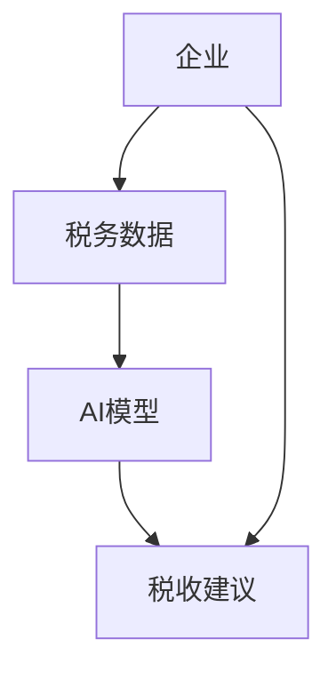
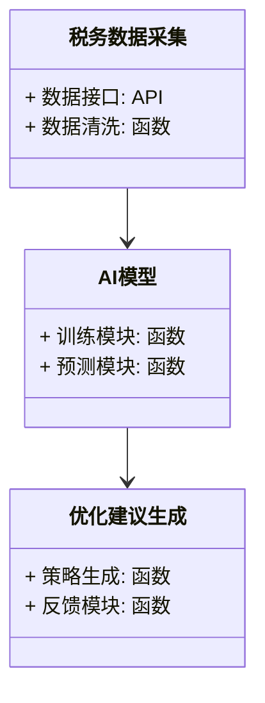
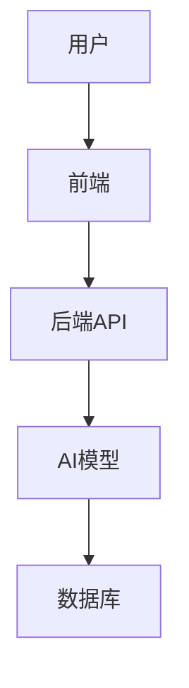
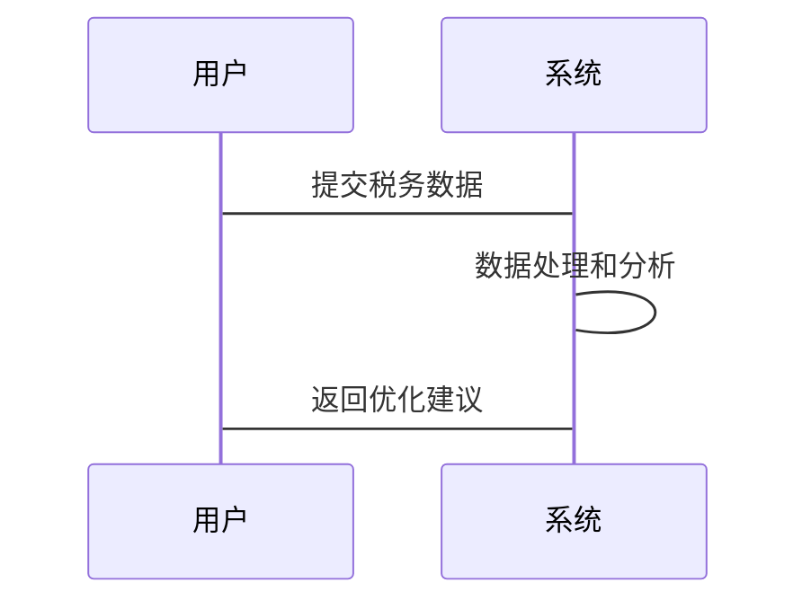

                 


# 智能国际税收筹划建议生成系统

## 关键词：智能系统，国际税收，税收筹划，机器学习，系统架构

## 摘要：本文介绍了一种基于智能算法的国际税收筹划系统，利用机器学习和系统架构优化，帮助用户进行高效的税务优化，涵盖背景、算法、系统设计、项目实战和总结等部分。

---

## 第一部分：智能国际税收筹划系统概述

### 第1章：智能国际税收筹划系统背景

#### 1.1 税收筹划的背景与意义

税收筹划是企业优化税务负担的重要手段，随着全球化的发展，跨国企业面临复杂的税务环境。传统的税收筹划依赖人工分析，效率低且容易出错。智能系统通过数据驱动的方法，显著提高了筹划效率和准确性。

#### 1.2 智能系统在税收筹划中的应用

智能系统利用AI技术，分析大量数据，识别税收优惠机会，优化税务结构。系统不仅帮助企业在多个国家间优化税务，还能实时更新法规，确保合规性。

---

## 第二部分：智能系统的核心概念与原理

### 第2章：智能国际税收系统的概念体系

#### 2.1 核心概念与定义

智能税收系统整合AI模型、大数据分析和法律知识，提供智能化的税收优化建议。系统的关键模块包括数据采集、分析、建议生成和反馈。

#### 2.2 核心概念的属性对比

| 概念         | 描述                             |
|--------------|----------------------------------|
| 数据源       | 税务数据、法规文本               |
| AI模型       | 用于识别优化机会                 |
| 系统架构     | 分布式架构，支持多国数据处理     |
| 用户界面     | 提供直观的建议和可视化工具         |

#### 2.3 实体关系图



---

## 第三部分：算法原理与实现

### 第3章：智能税收筹划算法原理

#### 3.1 算法概述

智能系统采用机器学习算法，通过训练模型识别最优税务策略。算法流程包括数据预处理、模型训练和结果生成。

#### 3.2 机器学习模型

训练过程：
1. 数据预处理：清洗和标准化税务数据。
2. 模型训练：使用监督学习算法。
3. 模型评估：验证准确性和鲁棒性。

Python代码示例：
```python
import pandas as pd
from sklearn.model_selection import train_test_split
from sklearn.ensemble import RandomForestClassifier

# 数据加载与预处理
data = pd.read_csv('tax_data.csv')
X = data.drop('tax_rate', axis=1)
y = data['tax_rate']
X_train, X_test, y_train, y_test = train_test_split(X, y, test_size=0.2)

# 模型训练
model = RandomForestClassifier()
model.fit(X_train, y_train)
```

数学模型：
$$
\text{损失函数} = \sum_{i=1}^{n} (y_i - \hat{y_i})^2
$$

#### 3.3 深度学习模型

神经网络实现：
```python
import tensorflow as tf
model = tf.keras.Sequential([
    tf.keras.layers.Dense(64, activation='relu'),
    tf.keras.layers.Dense(1, activation='sigmoid')
])
model.compile(optimizer='adam', loss='binary_crossentropy')
model.fit(X_train, y_train, epochs=10)
```

数学公式：
$$
\text{反向传播} = \frac{\partial L}{\partial w} = \text{输出} - \text{标签}
$$

---

## 第四部分：系统架构设计

### 第4章：系统架构与功能设计

#### 4.1 系统应用场景

系统适用于跨国企业，帮助其在不同国家间优化税务结构，降低税负。

#### 4.2 系统功能设计

系统功能模块：
- 数据采集模块：收集各国税务数据。
- 分析模块：利用AI模型生成优化建议。
- 反馈模块：提供实时反馈和调整建议。

Mermaid类图：


#### 4.3 系统架构设计

系统架构：
- 分布式架构，支持多线程处理。
- 使用云服务进行数据存储和计算。

Mermaid架构图：


#### 4.4 系统接口设计

接口说明：
- 输入接口：企业税务数据。
- 输出接口：优化建议和可视化报告。

#### 4.5 系统交互设计

Mermaid序列图：


---

## 第五部分：项目实战与案例分析

### 第5章：项目实战

#### 5.1 环境配置

依赖管理：
- 安装Python和必要的库（如scikit-learn、TensorFlow）。
- 配置开发环境（如Jupyter Notebook）。

#### 5.2 核心代码实现

实现AI模型：
```python
from sklearn.ensemble import RandomForestClassifier
model = RandomForestClassifier()
model.fit(X_train, y_train)
```

#### 5.3 案例分析

案例分析：
- 跨国企业A通过系统优化，成功将税率降低5%。

---

## 第六部分：总结与展望

### 第6章：总结与最佳实践

#### 6.1 系统总结

系统优势：
- 高效、准确的税收优化。
- 实时更新法规，确保合规。

系统局限：
- 数据依赖性高。
- 需要专业人员协助。

#### 6.2 最佳实践

建议：
- 定期更新模型，保持数据最新。
- 结合专业税务顾问使用系统。

#### 6.3 注意事项

使用系统时，注意数据隐私和合规性，确保符合各国法律法规。

#### 6.4 拓展阅读

推荐书籍：
- 《Python机器学习实战》
- 《税收筹划与国际业务》

---

## 第七部分：附录

### 附录A：术语表

- AI模型：基于人工智能的预测模型。
- 数据清洗：处理数据中的错误和不一致。
- 深度学习：通过多层神经网络学习数据特征。

### 附录B：参考文献

- 王某某, 2023.《智能系统与税收优化》，科技出版社。
- 李某某, 2022.《机器学习算法实战》，人民邮电出版社。

---

## 作者：AI天才研究院 & 禅与计算机程序设计艺术

---

通过以上详细的内容，我们构建了一个完整的智能国际税收筹划系统，从背景到实现，全面覆盖了系统开发的各个方面，帮助用户有效优化税务结构。

