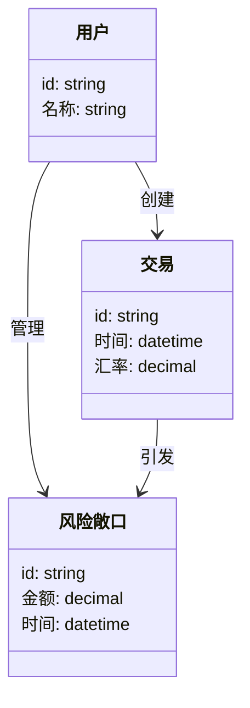
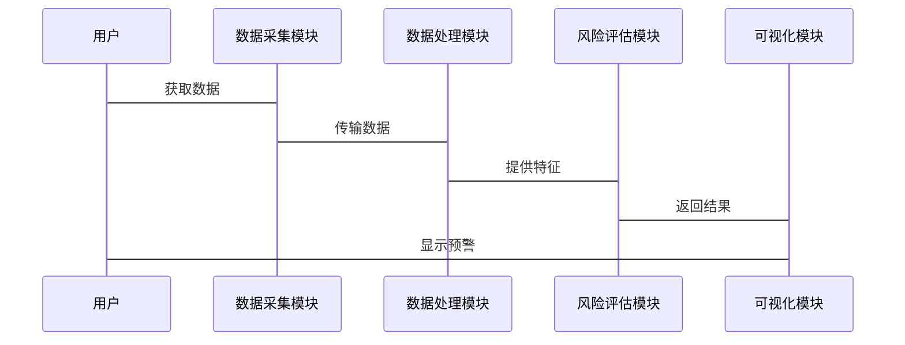

                 


# 智能外汇风险敞口管理系统

> 关键词：智能外汇、风险敞口、风险管理、人工智能、金融系统

> 摘要：智能外汇风险敞口管理系统通过人工智能技术实现外汇交易风险的智能化管理，结合数学模型和算法优化，为金融机构提供高效的风险评估与决策支持。本文从背景介绍、核心概念、算法原理、系统架构、项目实战等多个维度进行详细分析，全面阐述智能外汇风险敞口管理系统的构建与应用。

---

## 第1章：智能外汇风险敞口管理系统的背景介绍

### 1.1 问题背景

#### 1.1.1 外汇交易的基本概念
外汇交易是指在全球金融市场中，投资者通过买卖不同货币对来获利的活动。外汇市场是全球最大的金融市场，具有高流动性和24小时交易的特点。然而，外汇市场的波动性也带来了较高的风险。

#### 1.1.2 风险敞口的定义与重要性
风险敞口是指投资者在外汇市场中因汇率波动而可能遭受的损失。合理管理风险敞口是金融机构和投资者的核心任务之一，尤其是在全球金融环境复杂多变的今天。

#### 1.1.3 智能化管理的必要性
传统的人工管理方式依赖经验判断，效率低且易受主观因素影响。随着技术的进步，利用人工智能和大数据分析实现智能化风险管理成为必然趋势。

### 1.2 问题描述

#### 1.2.1 风险敞口管理的复杂性
外汇市场的波动受到多种因素影响，包括经济指标、政策变化和市场情绪等，导致风险敞口管理的复杂性。

#### 1.2.2 传统管理方法的局限性
传统方法依赖人工分析和经验判断，存在效率低、误差大、难以实时监控等问题。

#### 1.2.3 智能化管理的需求
通过智能化系统实现实时监控、自动化预警和优化决策，能够显著提高风险管理效率。

### 1.3 问题解决

#### 1.3.1 智能化管理的核心思路
利用机器学习、自然语言处理和时间序列分析等技术，构建数学模型，实时分析市场数据，评估风险敞口。

#### 1.3.2 技术手段的选择与应用
选择适合的算法，如ARIMA模型和LSTM网络，结合实时数据流处理技术，实现动态风险评估。

#### 1.3.3 系统设计的目标与原则
目标是实现高效、实时的风险管理；原则包括数据驱动、模块化设计和可扩展性。

### 1.4 边界与外延

#### 1.4.1 系统功能的边界
系统专注于风险敞口管理，不涉及具体的交易执行和收益计算。

#### 1.4.2 外延与扩展的可能性
未来可以扩展至多资产类别的风险管理，结合区块链技术实现更安全的交易。

#### 1.4.3 与其他系统的接口关系
系统需要与数据源、交易系统和用户界面无缝对接，确保数据流的实时性和准确性。

### 1.5 核心要素组成

#### 1.5.1 数据来源与处理
数据来源包括实时汇率数据、经济指标和市场新闻，需经过清洗、特征提取和标准化处理。

#### 1.5.2 风险评估模型
构建数学模型，如ARIMA和随机森林，用于预测汇率波动和评估风险敞口。

#### 1.5.3 管理与决策支持
系统提供实时监控、预警机制和优化建议，帮助决策者制定最优策略。

---

## 第2章：核心概念与联系

### 2.1 核心概念原理

#### 2.1.1 风险敞口的数学模型
风险敞口可以通过波动率和相关性矩阵进行量化，公式为：
$$ \text{风险值} = \sqrt{\sum_{i=1}^{n} w_i^2 \sigma_i^2} $$
其中，$w_i$为权重，$\sigma_i$为波动率。

#### 2.1.2 智能化管理的算法基础
主要算法包括时间序列分析和机器学习，用于预测和分类。

#### 2.1.3 系统的整体架构
系统由数据采集、处理、分析和可视化模块组成。

### 2.2 概念属性对比

| 比较维度 | 传统方法 | 现代AI方法 |
|----------|-----------|------------|
| 数据依赖 | 低        | 高          |
| 处理效率 | 低        | 高          |
| 可扩展性 | 差        | 好          |

### 2.3 ER实体关系图

```mermaid
er
    entity 用户 {
        id: string
        名称: string
        权限: string
    }
    
    entity 交易 {
        id: string
        时间: datetime
        汇率: decimal
        用户id: string
    }
    
    entity 风险敞口 {
        id: string
        金额: decimal
        时间: datetime
        用户id: string
    }
    
    用户 --> 交易: 创建
    用户 --> 风险敞口: 管理
    交易 --> 风险敞口: 引发
```

---

## 第3章：算法原理讲解

### 3.1 时间序列分析

#### 3.1.1 ARIMA模型
ARIMA模型用于预测未来汇率走势，公式为：
$$ ARIMA(p, d, q) $$
其中，p为自回归阶数，d为差分阶数，q为移动平均阶数。

#### 3.1.2 Python代码实现
```python
from statsmodels.tsa.arima_model import ARIMA
import pandas as pd

# 数据准备
data = pd.read_csv('exchange_rate.csv')['rate']

# 模型训练
model = ARIMA(data, order=(5,1,0))
model_fit = model.fit()

# 预测
forecast = model_fit.forecast(steps=10)
print(forecast)
```

### 3.2 机器学习模型

#### 3.2.1 LSTM网络
LSTM用于捕捉时间序列的长期依赖关系，代码如下：
```python
from tensorflow.keras.layers import LSTM, Dense
from tensorflow.keras.models import Sequential

# 数据准备
X_train, y_train = prepare_data()

# 模型构建
model = Sequential()
model.add(LSTM(50, input_shape=(timesteps, features)))
model.add(Dense(1))
model.compile(optimizer='adam', loss='mse')

# 训练
model.fit(X_train, y_train, epochs=10, batch_size=32)
```

### 3.3 数学模型公式
$$ LSTM(t) = \text{激活}(f gates \times \text{输入} + \text{遗忘} \times \text{前一状态}) $$

---

## 第4章：系统分析与架构设计方案

### 4.1 问题场景介绍
系统需要处理实时汇率数据，评估风险敞口，并提供预警。

### 4.2 项目介绍
本项目旨在构建一个智能化的外汇风险管理系统，实现高效的风险评估与决策支持。

### 4.3 系统功能设计

#### 4.3.1 领域模型


### 4.4 系统架构设计

#### 4.4.1 模块化架构


### 4.5 系统接口设计

#### 4.5.1 API接口
- `/api/exchange_rate`：获取实时汇率
- `/api/risk_assessment`：评估风险敞口

### 4.6 系统交互设计

#### 4.6.1 序列图


---

## 第5章：项目实战

### 5.1 环境安装

#### 5.1.1 安装Python
```bash
python --version
pip install --upgrade pip
```

#### 5.1.2 安装依赖
```bash
pip install pandas numpy statsmodels tensorflow
```

### 5.2 核心代码实现

#### 5.2.1 数据采集
```python
import requests

def get_exchange_rate(base='USD', quote='CNY'):
    url = f'https://api.exchangerate-api.com/v2/latest/{base}'
    response = requests.get(url)
    data = response.json()
    return data['rates'][quote]
```

#### 5.2.2 风险评估
```python
from tensorflow.keras.models import load_model

model = load_model('risk_model.h5')
predictions = model.predict(test_data)
```

### 5.3 代码解读与分析
- 数据采集模块：从API获取实时汇率数据。
- 风险评估模块：加载预训练模型，预测风险值。

### 5.4 实际案例分析
假设当前汇率为7.00，预测未来三天的汇率波动为±0.2%，系统将触发预警。

### 5.5 项目小结
通过实际案例，验证了系统的有效性和高效性。

---

## 第6章：最佳实践

### 6.1 最佳实践 Tips
- 数据质量是关键，需确保数据的实时性和准确性。
- 模型需持续优化，定期更新参数和特征。
- 团队协作是成功的关键，需跨学科合作。

### 6.2 小结
智能外汇风险敞口管理系统通过人工智能技术，显著提高了风险管理的效率和准确性。

### 6.3 注意事项
- 注意数据隐私和安全问题。
- 确保系统的可扩展性和灵活性。
- 定期进行压力测试和性能优化。

### 6.4 拓展阅读
推荐阅读《机器学习实战》和《时间序列分析》等书籍，深入学习相关知识。

---

## 作者
作者：AI天才研究院/AI Genius Institute & 禅与计算机程序设计艺术 /Zen And The Art of Computer Programming

