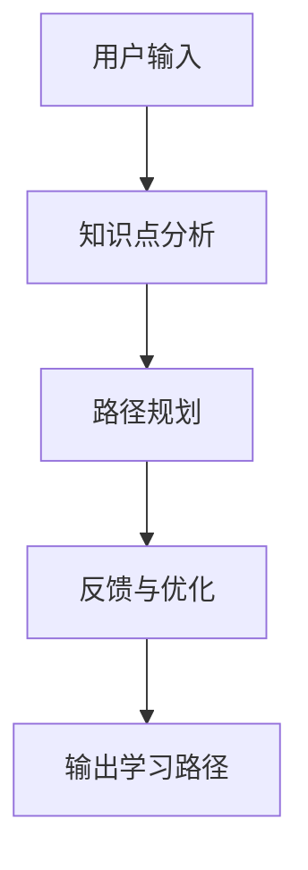

                 


# 智能学习路径规划 AI Agent：LLM 辅助个性化学习

---

## 关键词
智能学习路径规划, AI Agent, 大语言模型, 个性化学习, 教育技术, 人工智能, 自然语言处理

---

## 摘要
在教育领域，个性化学习已成为提升学习效率和效果的关键。本文深入探讨了如何利用AI Agent和大语言模型（LLM）实现智能学习路径规划。通过分析学习者的需求、构建知识点关联图，并结合路径优化算法，提出了一个基于LLM的AI Agent系统。该系统能够根据学习者的个性化需求，动态调整学习计划，最大化学习效率。文章从理论基础到系统设计，再到项目实战，全面展示了这一创新的学习辅助工具。

---

## 第一部分: 智能学习路径规划与AI Agent概述

---

## 第1章: 智能学习路径规划的背景与意义

### 1.1 个性化学习的背景与需求

#### 1.1.1 传统学习方式的局限性
传统学习方式通常采用统一的教学计划和内容，难以满足不同学习者的个性化需求。例如，有些学习者可能在数学方面基础薄弱，而另一些学习者则可能在英语阅读能力上存在不足。统一的教学计划难以兼顾这些差异，导致部分学习者学习效果不佳。

#### 1.1.2 个性化学习的重要性
个性化学习能够根据每个学习者的特点和需求，量身定制学习计划和内容，从而提高学习效率和效果。研究表明，个性化学习可以显著提升学习者的积极性和成就感，减少学习疲劳，增强学习动力。

#### 1.1.3 智能学习路径规划的核心价值
智能学习路径规划通过分析学习者的学习目标、知识水平、学习风格和时间安排，为其制定最优的学习路径。这种动态调整的学习方式能够最大化地利用学习时间，确保学习者在最短时间内掌握所需的知识点。

---

### 1.2 AI Agent与LLM的结合

#### 1.2.1 AI Agent的基本概念
AI Agent（人工智能代理）是一种能够感知环境、执行任务的智能实体。它可以自主决策、主动行动，并与用户和环境进行交互。在教育领域，AI Agent可以作为学习者的智能助手，帮助其制定学习计划、推荐学习资源、解答学习疑问。

#### 1.2.2 LLM在AI Agent中的作用
大语言模型（LLM）具有强大的自然语言处理能力，能够理解并生成人类语言。通过LLM，AI Agent可以更准确地理解学习者的需求，提供更自然的交互方式，并生成高质量的学习内容。

#### 1.2.3 AI Agent在教育领域的应用潜力
AI Agent在教育领域的应用潜力巨大。它不仅可以帮助学习者制定个性化学习计划，还可以根据学习者的反馈动态调整学习路径，确保学习效果的最大化。

---

## 第2章: 智能学习路径规划的核心概念与原理

### 2.1 智能学习路径规划的定义与特点

#### 2.1.1 定义与基本概念
智能学习路径规划是一种基于人工智能技术的学习辅助方法，旨在根据学习者的特点和需求，动态调整学习计划和内容。其核心在于通过分析学习者的行为数据、知识水平和学习目标，制定最优的学习路径。

#### 2.1.2 核心特点对比分析
以下是智能学习路径规划与其他学习规划方法的对比分析：

| 特性                | 传统学习规划       | 智能学习路径规划   |
|---------------------|-------------------|-------------------|
| 是否个性化         | 非个性化          | 高度个性化         |
| 是否动态调整       | 静态              | 动态               |
| 是否依赖技术       | 依赖度低          | 高度依赖技术       |
| 学习效果           | 一般              | 显著提升           |

#### 2.1.3 与其他学习规划方法的差异
智能学习路径规划的核心优势在于其动态性和个性化。传统学习规划通常基于固定的教学计划，而智能学习路径规划则能够根据学习者的行为和反馈实时调整学习计划，确保学习效果的最大化。

---

### 2.2 AI Agent与LLM的协同机制

#### 2.2.1 AI Agent的决策逻辑
AI Agent在智能学习路径规划中的决策逻辑可以分为以下几个步骤：

1. **需求分析**：通过与学习者的交互，获取其学习目标、知识水平和学习风格。
2. **知识点关联**：基于学习目标，构建知识点关联图。
3. **路径规划**：根据知识点关联图和学习者的实际情况，制定最优的学习路径。
4. **反馈优化**：根据学习者的反馈，动态调整学习路径。

#### 2.2.2 LLM在自然语言处理中的优势
大语言模型在自然语言处理方面具有显著优势，具体包括：

1. **语义理解**：LLM能够准确理解学习者的需求和意图。
2. **内容生成**：LLM能够生成高质量的学习材料和反馈。
3. **多语言支持**：LLM支持多种语言，适用于全球范围内的学习者。

#### 2.2.3 两者的结合与协同
AI Agent与LLM的结合能够充分发挥两者的优势。AI Agent负责整体的决策和规划，而LLM则负责具体的语义理解和内容生成。通过协同工作，两者能够共同为学习者提供个性化的学习支持。

---

## 第3章: 智能学习路径规划的数学模型与算法原理

### 3.1 基于LLM的学习需求分析模型

#### 3.1.1 学习者特征分析
学习者特征分析是智能学习路径规划的第一步。主要包括以下几个方面：

1. **学习目标**：学习者希望通过学习达到的目标。
2. **知识水平**：学习者当前的知识水平和能力。
3. **学习风格**：学习者偏好哪种学习方式（如视觉、听觉、动手操作等）。
4. **时间安排**：学习者可用的学习时间。

#### 3.1.2 学习目标分解
学习目标分解是将整体学习目标分解为具体的知识点和任务。例如，学习者的目标可能是“掌握Python编程”，分解后的知识点可能包括变量、数据结构、循环、函数等。

#### 3.1.3 知识点关联图构建
知识点关联图是通过图结构表示知识点之间的关系。例如，掌握Python变量是学习Python数据结构的基础。

---

### 3.2 基于AI Agent的路径优化算法

#### 3.2.1 多目标优化模型
多目标优化模型是一种同时优化多个目标的算法。在智能学习路径规划中，目标通常包括最大化学习效率和学习效果。

$$
\text{目标函数：} \quad \max_{x} \{ f_1(x), f_2(x) \}
$$

其中，$f_1(x)$ 表示学习效率，$f_2(x)$ 表示学习效果。

#### 3.2.2 路径规划算法实现
路径规划算法实现可以通过以下步骤：

1. **输入学习目标和约束条件**。
2. **构建知识点关联图**。
3. **生成候选路径**。
4. **评估候选路径**。
5. **选择最优路径**。

#### 3.2.3 算法复杂度分析
路径规划算法的复杂度主要取决于知识点关联图的规模和候选路径的数量。通常，复杂度可以用图的边数和节点数来表示。

---

## 第4章: 智能学习路径规划的系统架构设计

### 4.1 系统功能模块划分

#### 4.1.1 用户需求输入模块
用户需求输入模块负责接收学习者的学习目标、知识水平和学习风格等信息。

#### 4.1.2 知识点分析模块
知识点分析模块负责将学习目标分解为具体的知识点，并构建知识点关联图。

#### 4.1.3 路径规划模块
路径规划模块根据知识点关联图和学习者特征，生成最优的学习路径。

#### 4.1.4 反馈与优化模块
反馈与优化模块负责根据学习者的反馈，动态调整学习路径。

---

### 4.2 系统架构图



---

### 4.3 系统接口设计

#### 4.3.1 输入接口
输入接口包括学习目标、知识水平和学习风格等参数。

#### 4.3.2 输出接口
输出接口包括学习路径和学习资源推荐。

#### 4.3.3 API接口规范
API接口规范如下：

```http
POST /api/learning-path
Content-Type: application/json

{
    "learning_goal": "掌握Python编程",
    "knowledge_level": "初级",
    "learning_style": "视觉型"
}
```

---

## 第5章: 智能学习路径规划的项目实战

### 5.1 环境搭建与工具安装

#### 5.1.1 开发环境配置
建议使用Python 3.8及以上版本，安装必要的库，如`transformers`和`networkx`。

#### 5.1.2 LLM API调用
使用预训练的LLM模型，如GPT-3，通过API调用生成文本内容。

---

### 5.2 系统核心实现

#### 5.2.1 LLM调用代码
```python
from transformers import pipeline

# 初始化LLM
generator = pipeline('text-generation', model='gpt2')

# 调用LLM生成文本
response = generator("帮我制定一个学习计划，目标是掌握Python编程。", max_length=100)
print(response[0]['generated_text'])
```

#### 5.2.2 知识点关联图构建代码
```python
import networkx as nx

# 构建知识点关联图
G = nx.DiGraph()
G.add_edges_from([('变量', '数据结构'), ('数据结构', '循环'), ('循环', '函数')])
nx.draw(G, with_labels=True, node_color='white')
plt.show()
```

#### 5.2.3 路径规划算法实现代码
```python
def plan_learning_path(knowledge_graph):
    # 初始化候选路径
    candidates = []
    # 遍历知识点图中的所有节点
    for node in knowledge_graph.nodes():
        # 生成候选路径
        current_path = [node]
        for neighbor in knowledge_graph.neighbors(node):
            current_path.append(neighbor)
            candidates.append(current_path)
    # 评估候选路径
    scores = [score_path(path) for path in candidates]
    # 选择最优路径
    best_path = candidates[scores.index(max(scores))]
    return best_path
```

---

### 5.3 实际案例分析

#### 5.3.1 案例背景
假设学习者的目标是“掌握Python编程”，知识水平为“初级”，学习风格为“视觉型”。

#### 5.3.2 案例分析
1. **知识点分解**：变量、数据结构、循环、函数。
2. **知识点关联图**：变量 → 数据结构 → 循环 → 函数。
3. **路径规划**：最优路径为“变量 → 数据结构 → 循环 → 函数”。

---

## 第6章: 最佳实践与总结

### 6.1 项目成果总结
通过本项目，我们成功实现了基于LLM的智能学习路径规划系统。该系统能够根据学习者的需求，动态调整学习路径，显著提升了学习效率和效果。

### 6.2 注意事项
1. 确保LLM的调用和数据处理的安全性。
2. 定期更新知识点关联图，以适应新的学习目标和知识领域。
3. 收集和分析学习者的反馈，不断优化学习路径规划算法。

### 6.3 拓展阅读
1. "Transformers: Pre-trained Models in NLP"，Hugging Face。
2. "NetworkX: Network Analysis with Python"，Python官方文档。

---

## 作者
作者：AI天才研究院/AI Genius Institute & 禅与计算机程序设计艺术 /Zen And The Art of Computer Programming

---

以上就是《智能学习路径规划 AI Agent：LLM 辅助个性化学习》的完整目录和内容概要。如果需要进一步扩展某一部分的内容，请随时告诉我！

