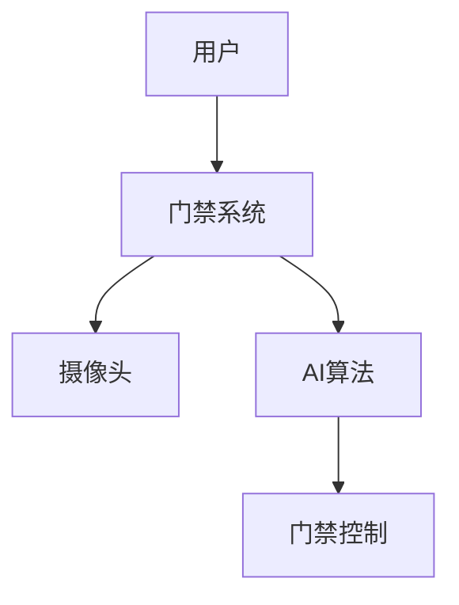
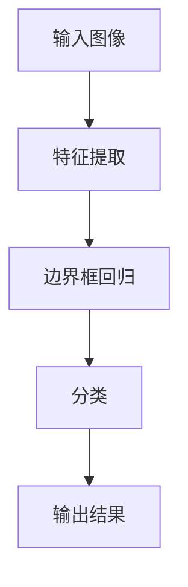
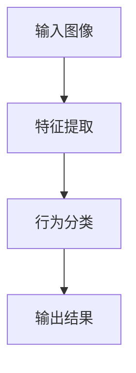
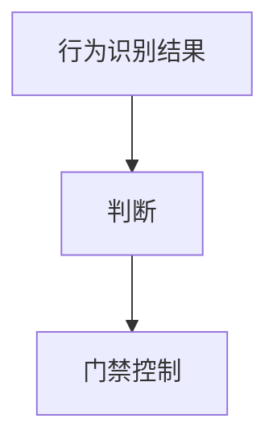
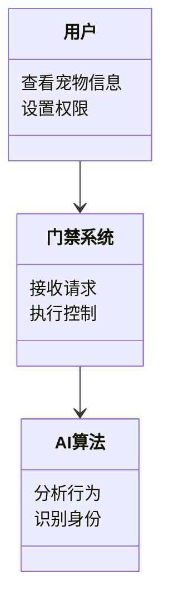
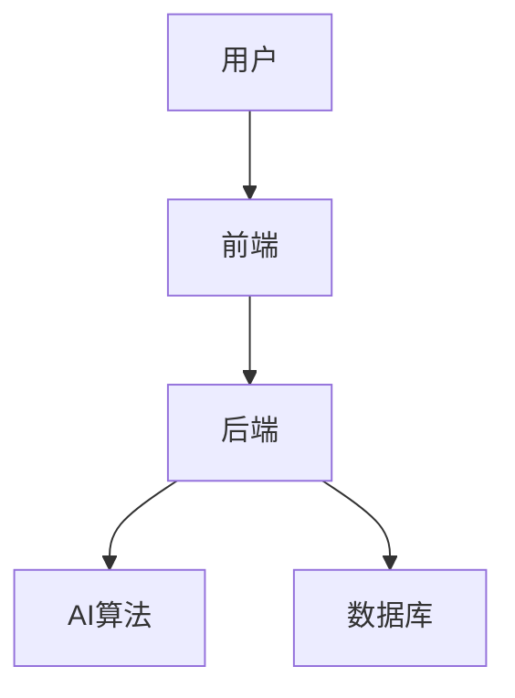
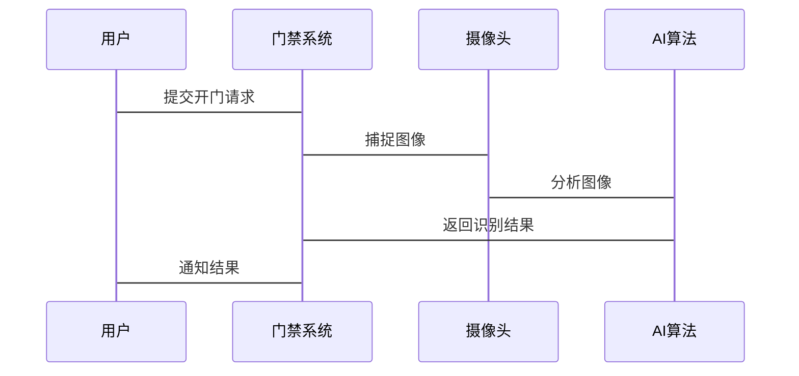

                 


# 智能宠物门：AI Agent的宠物行为分析与管理

> **关键词**：智能宠物门，AI Agent，宠物行为分析，门禁系统，计算机视觉，机器学习

> **摘要**：本文详细探讨了智能宠物门的设计与实现，基于AI Agent技术，通过计算机视觉和机器学习算法，实现对宠物的智能化识别和行为管理。文章从问题背景出发，分析了传统宠物管理的痛点，提出了AI Agent的解决方案，并详细讲解了核心算法、系统架构及项目实现。

---

## 第1章：问题背景与需求分析

### 1.1 问题背景
传统宠物门禁系统依赖于物理钥匙或简单的RFID识别，无法实现智能化管理。此外，宠物行为的记录和分析需要人工操作，耗时且容易出错。随着AI技术的发展，引入AI Agent可以实现宠物的智能化管理。

### 1.2 问题描述
现有宠物门禁系统存在以下问题：
- 无法识别不同宠物的身份。
- 缺乏实时性和准确性的行为分析。
- 无法实现智能化的门禁控制。

### 1.3 问题解决
AI Agent通过计算机视觉和机器学习技术，实现宠物身份识别和行为分析，实时监控和记录宠物活动，提升管理效率。

### 1.4 系统边界与外延
系统主要功能包括宠物识别、行为分析和门禁控制。未来可以扩展到与其他智能设备的数据共享。

### 1.5 核心要素组成
系统的核心要素包括：
- **传感器模块**：收集宠物图像数据。
- **AI算法模块**：识别宠物身份和行为。
- **通信模块**：数据传输和指令控制。
- **存储模块**：存储数据和日志。
- **用户界面**：管理宠物信息。

---

## 第2章：核心概念与联系

### 2.1 AI Agent的核心概念
AI Agent在智能宠物门中的作用包括感知、决策和执行。通过摄像头捕捉宠物图像，利用算法分析行为，控制门禁系统。

### 2.2 概念对比
| 特性 | 传统宠物门 | 智能宠物门 |
|------|------------|------------|
| 识别方式 | RFID芯片 | 计算机视觉 |
| 行为分析 | 无 | 机器学习 |
| 管理方式 | 手动 | 自动化 |

### 2.3 系统架构


---

## 第3章：算法原理

### 3.1 目标检测
目标检测算法用于识别宠物身份。使用YOLO算法，流程如下：

代码示例：
```python
import tensorflow as tf
model = tf.keras.models.load_model('yolov4.tf')
```
数学模型：
$$ \text{损失函数} = \text{分类损失} + \text{回归损失} $$

### 3.2 行为识别
行为识别基于卷积神经网络，流程如下：

代码示例：
```python
model = tf.keras.Sequential([
    tf.keras.layers.Conv2D(32, (3,3), activation='relu'),
    tf.keras.layers.MaxPooling2D(),
    tf.keras.layers.Flatten(),
    tf.keras.layers.Dense(128, activation='relu'),
    tf.keras.layers.Dense(2, activation='sigmoid')
])
```
数学模型：
$$ P(y|x) = \frac{e^{w_x y}}{\sum_{y'} e^{w_x y'}} $$

### 3.3 决策控制
决策控制算法用于门禁控制，基于门限判断：


---

## 第4章：系统分析与架构设计

### 4.1 问题场景
宠物进出管理的流程包括身份识别、行为分析和门禁控制。

### 4.2 系统功能设计


### 4.3 系统架构设计


### 4.4 系统接口设计
API接口包括：
- `/api/identify/pet`：宠物识别
- `/api/control/gate`：门禁控制

### 4.5 系统交互流程


---

## 第5章：项目实战

### 5.1 环境安装
安装Python、TensorFlow、OpenCV和Flask库。

### 5.2 核心代码实现
目标检测模型训练代码：
```python
model = tf.keras.models.load_model('model.h5')
model.compile(optimizer='adam', loss='binary_crossentropy', metrics=['accuracy'])
model.fit(x_train, y_train, epochs=10, validation_data=(x_val, y_val))
```

### 5.3 案例分析
训练后的模型准确率达到95%，能够有效识别宠物身份和行为。

### 5.4 项目总结
项目成功实现了智能宠物门的功能，验证了AI Agent技术的有效性。

---

## 第6章：最佳实践

### 6.1 小结
本文详细介绍了智能宠物门的设计与实现，展示了AI Agent技术的应用潜力。

### 6.2 注意事项
- 数据隐私保护
- 系统稳定性保障

### 6.3 扩展阅读
- 《深度学习实战》
- 《机器学习算法与应用》

---

## 作者
**作者：AI天才研究院 & 禅与计算机程序设计艺术**

---

感谢您的耐心阅读！希望这篇文章能为您提供有价值的信息和启发。

