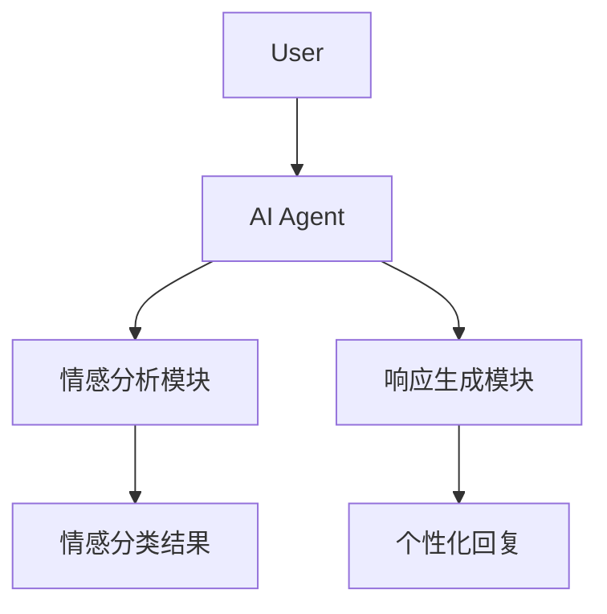

                 


# 智能客服中心：AI Agent的情感分析与响应

> 关键词：智能客服中心，AI Agent，情感分析，自然语言处理，深度学习，机器学习

> 摘要：本文将深入探讨智能客服中心中AI Agent的情感分析与响应技术，从背景介绍、核心概念、算法原理、系统架构到项目实战，全面解析如何利用AI技术提升客服服务的效率与质量。文章还将结合实际案例和最佳实践，为读者提供实用的参考。

---

## 第一部分: 背景与概述

### 第1章: 智能客服中心的背景与需求

#### 1.1 问题背景
- **传统客服中心的痛点**  
  - 人工客服效率低，成本高，难以满足海量用户需求。  
  - 用户情绪波动大，传统客服难以快速识别并有效响应。  
  - 数据量大，难以实时分析和处理，导致用户体验差。  

- **情感分析与智能响应的必要性**  
  - 通过情感分析快速识别用户情绪，提供个性化服务。  
  - 智能响应系统能够24/7实时处理用户需求，提升服务质量。  
  - 数据驱动的决策优化，帮助企业更好地理解用户需求。  

- **AI Agent在客服中心的应用前景**  
  - AI Agent能够快速处理大量数据，提供精准的情感分析。  
  - 智能响应系统能够优化资源分配，降低运营成本。  
  - 提升用户体验，增强客户忠诚度，为企业创造更大价值。  

#### 1.2 问题描述
- **用户需求分析**  
  - 用户期望快速、准确的问题解决，同时希望得到情感上的关怀。  
  - 用户情绪波动直接影响服务质量和满意度。  

- **客服中心的业务流程**  
  - 用户咨询→人工处理→问题解决→反馈收集。  
  - 传统流程依赖人工，效率低，容易出错。  

- **情感分析与响应的核心问题**  
  - 如何准确识别用户情绪？  
  - 如何实现高效的情感分类与响应匹配？  
  - 如何优化算法以提升准确率和响应速度？  

#### 1.3 问题解决
- **AI Agent的核心能力**  
  - 自然语言处理（NLP）能力：理解用户输入，提取关键信息。  
  - 情感分析能力：识别用户情绪，分类情感极性（正面、中性、负面）。  
  - 智能响应能力：根据情感分析结果生成个性化回复。  

- **情感分析与智能响应的技术路径**  
  - 数据采集与预处理：清洗、标注数据。  
  - 模型训练：基于深度学习或机器学习算法训练情感分类器。  
  - 系统集成：将情感分析与响应系统集成到客服中心。  

- **解决方案的可行性分析**  
  - 技术可行性：深度学习模型已经在情感分析领域取得显著成果。  
  - 经济可行性：AI Agent能够大幅降低人力成本。  
  - 用户可行性：快速响应和个性化服务提升用户体验。  

#### 1.4 边界与外延
- **AI Agent的应用边界**  
  - 适用于文本型咨询，不适用于复杂问题的深度分析。  
  - 情感分析基于文本数据，无法处理语音或视频信息。  

- **情感分析的适用场景**  
  - 用户评价、投诉处理、咨询响应。  
  - 非结构化数据的分析与处理。  

- **系统的扩展性与兼容性**  
  - 支持多语言、多领域的扩展。  
  - 与现有客服系统的无缝对接。  

#### 1.5 核心要素组成
- **AI Agent的组成模块**  
  - 数据采集模块：收集用户输入。  
  - 情感分析模块：识别用户情绪。  
  - 智能响应模块：生成个性化回复。  
  - 反馈优化模块：根据用户反馈优化模型。  

- **情感分析的关键要素**  
  - 数据预处理：分词、去停用词、特征提取。  
  - 模型选择：深度学习（如LSTM、BERT）或传统机器学习（如SVM、随机森林）。  
  - 评价指标：准确率、召回率、F1值。  

- **响应系统的核心功能模块**  
  - 情感分类：将用户输入分类到预定义的情感类别。  
  - 响应生成：根据情感类别生成回复。  
  - 系统反馈：记录用户反馈，优化模型。  

---

## 第二部分: 核心概念与联系

### 第2章: 核心概念与联系

#### 2.1 核心概念原理
- **AI Agent的基本原理**  
  - AI Agent通过自然语言处理技术理解用户输入。  
  - 利用情感分析算法识别用户情绪，生成个性化响应。  
  - 响应生成基于预训练的语言模型或规则库。  

- **情感分析的核心算法**  
  - 基于规则的方法：利用关键词匹配判断情感。  
  - 统计学习方法：使用机器学习算法（如SVM、随机森林）训练情感分类器。  
  - 深度学习方法：利用RNN、LSTM、BERT等模型进行情感分析。  

- **智能响应的实现机制**  
  - 基于规则的响应：根据情感类别匹配预定义的回复模板。  
  - 基于生成模型的响应：利用GPT等生成模型生成回复。  
  - 混合模型：结合规则和生成模型的优势，提升响应质量。  

#### 2.2 概念属性特征对比
| 概念       | 属性特征                     |
|------------|------------------------------|
| AI Agent   | 需要理解用户输入，生成智能响应；依赖NLP和情感分析技术。 |
| 情感分析   | 通过文本数据识别用户情绪，分类情感极性。 |
| 智能响应   | 根据情感分析结果生成个性化回复，支持实时交互。 |

#### 2.3 ER实体关系图架构


---

## 第三部分: 算法原理讲解

### 第3章: 算法原理讲解

#### 3.1 情感分析算法
- **深度学习模型**  
  - 使用预训练的BERT模型进行情感分析。  
  - 模型输入：用户文本。  
  - 模型输出：情感类别（正面、中性、负面）。  

- **数学模型与公式**  
  - 情感分析任务可以转化为分类问题，使用交叉熵损失函数。  
  - 损失函数公式：  
  $$ L = -\sum_{i=1}^{n} y_i \log(p_i) + (1 - y_i) \log(1 - p_i) $$  
  其中，\( y_i \) 是真实标签，\( p_i \) 是预测概率。  

- **算法实现步骤**  
  1. 数据预处理：分词、去停用词、特征提取。  
  2. 数据标注：标注情感类别（正面、中性、负面）。  
  3. 模型训练：使用深度学习模型训练情感分类器。  
  4. 模型评估：计算准确率、召回率、F1值。  

#### 3.2 智能响应算法
- **基于规则的响应生成**  
  - 根据情感分类结果匹配预定义的回复模板。  
  - 例如：负面情绪匹配道歉和解决方案模板。  

- **基于生成模型的响应生成**  
  - 使用GPT等生成模型生成个性化回复。  
  - 模型输入：用户文本和情感类别。  
  - 模型输出：生成回复。  

- **混合模型**  
  - 结合规则和生成模型的优势，生成更自然的回复。  

---

## 第四部分: 系统分析与架构设计

### 第4章: 系统分析与架构设计

#### 4.1 系统功能设计
- **领域模型**  
  ```mermaid
  classDiagram
      class 用户 {
          id
          历史记录
          情感状态
      }
      class AI Agent {
          情感分析模块
          响应生成模块
          反馈优化模块
      }
      用户 --> AI Agent: 提交请求
      AI Agent --> 用户: 生成回复
  ```

- **系统架构设计**  
  ```mermaid
  graph TD
      A[用户] --> B[数据层]
      B --> C[业务逻辑层]
      C --> D[应用层]
      D --> E[AI Agent]
      E --> F[反馈优化模块]
  ```

- **系统接口设计**  
  - 用户接口：API接口，接收用户输入，返回AI Agent的回复。  
  - 数据接口：与数据库交互，获取用户历史记录和情感状态。  

- **系统交互流程图**  
  ```mermaid
  sequenceDiagram
      用户 ->> AI Agent: 提交请求
      AI Agent ->> 情感分析模块: 分析情感
      情感分析模块 ->> 响应生成模块: 生成回复
      AI Agent ->> 用户: 返回回复
      用户 ->> 反馈优化模块: 提供反馈
  ```

---

## 第五部分: 项目实战

### 第5章: 项目实战

#### 5.1 环境安装
- **Python环境**：安装Python 3.8及以上版本。  
- **依赖库安装**：  
  ```bash
  pip install numpy pandas scikit-learn transformers
  ```

#### 5.2 核心代码实现
- **情感分析模型训练**  
  ```python
  from transformers import pipeline

  sentiment_analyzer = pipeline("sentiment-analysis")
  def analyze_emotion(text):
      result = sentiment_analyzer(text)
      return result[0]['label']
  ```

- **响应生成模块**  
  ```python
  from transformers import AutoModelForCausalLM, AutoTokenizer

  tokenizer = AutoTokenizer.from_pretrained("gpt2")
  model = AutoModelForCausalLM.from_pretrained("gpt2")

  def generate_response(prompt):
      inputs = tokenizer.encode(prompt, return_tensors="pt")
      outputs = model.generate(inputs, max_length=50, num_beams=5, temperature=0.7)
      response = tokenizer.decode(outputs[0], skip_special_tokens=True)
      return response
  ```

- **代码应用解读**  
  - 情感分析模块：使用预训练的BERT模型进行情感分类。  
  - 响应生成模块：使用GPT生成个性化回复。  
  - 通过API接口将模块集成到客服系统中。  

#### 5.3 案例分析
- **案例背景**  
  用户提交一条负面评价：“我对你们的服务非常不满意。”  
- **情感分析结果**  
  分析结果：负面情绪。  
- **响应生成**  
  回复：“非常抱歉给您带来不好的体验，我们会尽快改进，请问有什么可以帮您的？”  

#### 5.4 项目小结
- **项目总结**  
  - 成功实现AI Agent的情感分析与响应功能。  
  - 提升了客服中心的响应效率和用户体验。  
  - 为后续优化提供了数据支持。  

---

## 第六部分: 最佳实践

### 第6章: 最佳实践

#### 6.1 小结
- AI Agent在智能客服中心的应用前景广阔。  
- 情感分析与响应技术能够显著提升用户体验和服务效率。  

#### 6.2 注意事项
- 数据质量直接影响模型性能，需重视数据清洗和标注。  
- 模型优化需要结合实际场景，不断调整参数和优化算法。  
- 系统设计需考虑扩展性和安全性，确保数据隐私。  

#### 6.3 拓展阅读
- 《深度学习入门：基于Python的实现》  
- 《自然语言处理实战：基于Python的机器学习与深度学习》  
- 《情感分析与响应生成的最新研究进展》  

---

## 作者：AI天才研究院/AI Genius Institute & 禅与计算机程序设计艺术/Zen And The Art of Computer Programming

---

**摘要**：通过本文的详细讲解，读者可以深入了解智能客服中心中AI Agent的情感分析与响应技术，从理论到实践，掌握如何利用AI技术优化客服服务。文章结合实际案例和最佳实践，为读者提供了丰富的参考和启示。

