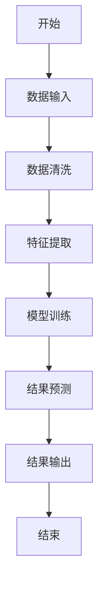
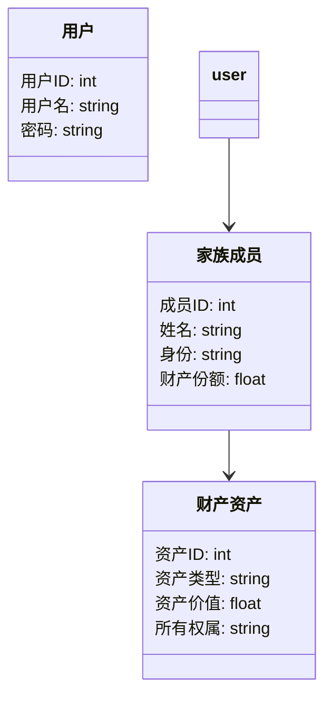
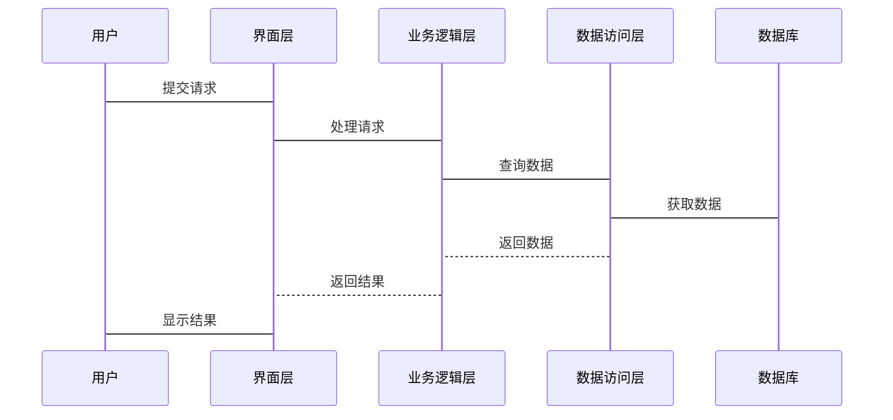

                 


# 智能家族财富传承规划助手

> 关键词：家族财富传承，人工智能，智能助手，规划系统，财富管理

> 摘要：智能家族财富传承规划助手是一种结合人工智能技术的数字化工具，旨在帮助用户制定和管理家族财富传承计划。本文详细探讨了该系统的背景、核心概念、算法原理、系统架构、项目实现及最佳实践，为读者提供全面的理论与实践指导。

---

# 第1章 智能家族财富传承规划助手的背景与概念

## 1.1 问题背景与描述

### 1.1.1 家族财富传承的传统挑战

家族财富传承是一个复杂而敏感的过程，涉及法律、税务、资产管理和家庭关系等多个方面。传统的财富传承方式主要依赖于律师、财务顾问等专业人士的手工规划，这种方式效率低下、成本高昂，且容易受到人为因素的影响。

### 1.1.2 数字化与智能化时代的机遇

随着人工智能、大数据和区块链等技术的快速发展，数字化工具为财富传承带来了新的可能性。智能助手能够通过数据分析和机器学习，提供个性化的传承方案，优化资产配置，降低风险。

### 1.1.3 问题的边界与外延

智能家族财富传承规划助手的目标是帮助用户制定和管理传承计划，但其边界不包括实际的法律执行和资产过户过程。该系统主要提供规划建议和风险管理。

## 1.2 智能家族财富传承规划助手的定义

### 1.2.1 核心概念与组成要素

智能家族财富传承规划助手通过收集和分析家族成员信息、资产配置、税务状况等数据，利用机器学习算法生成最优传承方案。

### 1.2.2 功能目标与用户需求

系统旨在实现传承方案的智能化制定、风险管理、资产监控等功能，满足用户对高效、精准财富管理的需求。

### 1.2.3 边界与应用场景

该系统适用于高净值家庭，帮助用户在家族财富传承中优化资产分配、降低税务负担，并确保传承过程的合法性和安全性。

## 1.3 本章小结

本章介绍了智能家族财富传承规划助手的背景、核心概念及功能目标，为后续章节的深入分析奠定了基础。

---

# 第2章 智能家族财富传承的核心概念与联系

## 2.1 核心概念原理

### 2.1.1 家族财富传承的多维度分析

财富传承涉及法律、税务、资产分配等多个维度，智能助手需要综合考虑这些因素，生成最优方案。

### 2.1.2 智能助手的决策逻辑

系统通过数据分析和机器学习，评估不同传承方案的风险和收益，推荐最佳策略。

### 2.1.3 数据驱动的规划模型

基于数据的规划模型能够动态调整传承方案，适应市场和家庭情况的变化。

## 2.2 核心概念属性对比

### 2.2.1 传统规划与智能规划的对比分析

| 特性          | 传统规划                | 智能规划                |
|---------------|-------------------------|-------------------------|
| 效率          | 低                     | 高                     |
| 精准度        | 受限于人为因素          | 数据驱动，精准度高       |
| 成本          | 高                     | 较低                   |

### 2.2.2 数据驱动与规则驱动的特征差异

数据驱动依赖于大量数据和机器学习，规则驱动基于预设规则，灵活性较差。

### 2.2.3 用户需求与系统响应的关联性

系统根据用户输入的需求，动态调整规划方案，实现个性化服务。

## 2.3 ER实体关系架构

```mermaid
er
  entity 家族成员 {
    key: ID
    attribute: 姓名, 身份, 财产份额
  }
  entity 财产资产 {
    key: 资产ID
    attribute: 资产类型, 资产价值, 所有权属
  }
  entity 遗嘱与协议 {
    key: 文档ID
    attribute: 文档类型, 文档内容, 生效日期
  }
  entity 系统用户 {
    key: 用户ID
    attribute: 用户角色, 用户权限
  }
  家族成员 -[拥有]- 财产资产
  家族成员 -[关联]- 遗嘱与协议
  系统用户 -[管理]- 遗嘱与协议
```

## 2.4 本章小结

本章通过对比和分析，揭示了智能家族财富传承的核心概念及其与传统方法的差异，为系统的实现提供了理论基础。

---

# 第3章 智能家族财富传承规划助手的算法原理

## 3.1 算法原理概述

### 3.1.1 数据预处理与特征提取

数据预处理包括清洗、标准化和特征选择，特征提取则关注关键变量，如资产类型、税务状况等。

### 3.1.2 机器学习模型的选择

采用决策树和随机森林等算法，通过交叉验证选择最优模型。

### 3.1.3 算法的适用场景与限制

适用于数据充足、目标明确的情况，但在处理复杂法律问题时需要结合专家意见。

## 3.2 算法流程图



## 3.3 算法实现代码

```python
def preprocess_data(data):
    # 数据清洗与特征提取
    data.dropna()
    data = data[["资产类型", "资产价值", "税务状况"]]
    return data

def train_model(features, labels):
    # 模型训练
    from sklearn.ensemble import RandomForestClassifier
    model = RandomForestClassifier()
    model.fit(features, labels)
    return model

# 示例数据
data = {
    "资产类型": ["房产", "股票", "现金"],
    "资产价值": [1000000, 500000, 200000],
    "税务状况": [0.3, 0.15, 0.05]
}
features = data[["资产类型", "资产价值"]]
labels = data["税务状况"]

model = train_model(features, labels)
```

---

# 第4章 系统分析与架构设计方案

## 4.1 问题场景介绍

## 4.2 项目介绍

## 4.3 系统功能设计

### 4.3.1 领域模型



## 4.4 系统架构设计

### 4.4.1 系统架构图

```mermaid
archi
    界面层 --> 业务逻辑层
    业务逻辑层 --> 数据访问层
    数据访问层 --> 数据库
```

## 4.5 系统接口设计

## 4.6 系统交互设计



---

# 第5章 项目实战

## 5.1 环境安装

## 5.2 核心代码实现

## 5.3 案例分析

## 5.4 项目小结

---

# 第6章 总结与展望

## 6.1 本章总结

## 6.2 未来展望

## 6.3 最佳实践 tips

## 6.4 注意事项

## 6.5 拓展阅读

---

# 作者

作者：AI天才研究院/AI Genius Institute & 禅与计算机程序设计艺术 /Zen And The Art of Computer Programming

