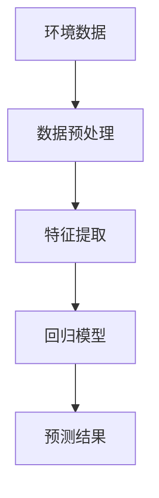
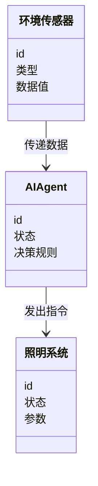

                 


# 智能工作灯：AI Agent的照明优化系统

## 关键词：智能工作灯、AI Agent、照明优化、系统设计、机器学习、物联网、实时反馈

## 摘要：  
本文探讨了AI Agent在智能工作灯照明优化系统中的应用，详细分析了系统的核心概念、算法原理、架构设计以及实际案例。通过结合AI技术与物联网，系统能够实时优化照明环境，提升用户体验和能效。文章从背景、概念、技术实现到项目实战，全面解析了这一创新系统的设计与实现。

---

# 第一部分：智能工作灯与AI Agent的背景介绍

## 第1章：问题背景与需求分析

### 1.1 照明系统优化的必要性

#### 1.1.1 传统照明系统的局限性  
传统照明系统通常基于固定的时间表或手动控制，无法根据环境变化（如光照强度、人员位置）动态调整。这种静态管理方式导致能源浪费，且无法满足现代工作环境对舒适性和效率的需求。

#### 1.1.2 智能化照明的需求驱动  
随着物联网和人工智能技术的发展，智能化照明成为趋势。现代工作环境对照明系统的要求包括：  
- 根据环境光照强度自动调节灯光亮度；  
- 感应人员位置，实现区域化照明；  
- 实时优化能耗，降低运营成本；  
- 提供个性化照明设置，提升用户体验。  

#### 1.1.3 现代工作环境对照明的要求  
现代工作环境强调舒适性和效率，员工工作效率与照明条件密切相关。智能工作灯需要具备以下特点：  
- 高效节能：通过AI优化算法降低能耗；  
- 实时感知：快速响应环境变化；  
- 个性化设置：满足不同用户的偏好；  
- 易用性：简单易用的交互界面。  

---

### 1.2 AI Agent在照明优化中的应用

#### 1.2.1 AI Agent的基本概念  
AI Agent（智能体）是指能够感知环境、做出决策并采取行动的智能系统。在智能工作灯中，AI Agent负责接收环境数据，分析并生成控制指令。

#### 1.2.2 AI Agent在智能工作灯中的角色  
AI Agent的主要职责包括：  
1. **数据采集**：通过传感器获取环境光照强度、人员位置等数据；  
2. **数据分析**：利用机器学习算法对数据进行分析，生成优化策略；  
3. **决策与控制**：根据分析结果，调整灯具的亮度、色温和开启状态。  

#### 1.2.3 照明优化的智能化趋势  
智能化照明是物联网和AI技术结合的典型应用。通过AI Agent的实时优化，照明系统能够显著提高能效，降低运营成本，同时提升用户体验。

---

### 1.3 问题描述与目标设定

#### 1.3.1 照明系统优化的核心问题  
传统照明系统的主要问题包括：  
- 能耗高：无法根据环境变化动态调整；  
- 体验差：无法满足个性化需求；  
- 维护难：手动管理复杂且效率低。  

#### 1.3.2 智能工作灯的设计目标  
智能工作灯的设计目标是：  
- 实现基于环境数据的动态调节；  
- 提供个性化的照明体验；  
- 最大化能效，降低运营成本。  

#### 1.3.3 边界条件与功能范围  
- 边界条件：仅优化灯具的亮度和色温，不涉及灯具的位置调整；  
- 功能范围：支持环境光照强度调节、人员位置感应、个性化设置等功能。  

---

### 1.4 核心概念与系统架构

#### 1.4.1 AI Agent与智能工作灯的关系  
AI Agent作为系统的“大脑”，负责接收环境数据、分析并生成控制指令。智能工作灯则是执行机构，负责实际的照明调整。

#### 1.4.2 系统的核心要素与组成  
系统由以下核心要素组成：  
1. 环境传感器：用于采集光照强度、人员位置等数据；  
2. AI Agent：负责数据分析与决策；  
3. 照明系统：执行AI Agent的控制指令。  

#### 1.4.3 系统的边界与外延  
- 系统边界：仅涵盖灯具和AI Agent，不涉及其他设备；  
- 系统外延：AI Agent可以通过API与其他系统（如智能家居）集成。  

---

## 第2章：AI Agent的核心原理与实现

### 2.1 AI Agent的基本原理

#### 2.1.1 AI Agent的定义与分类  
AI Agent可以根据智能水平分为简单反射Agent和基于模型的Agent。本文中，AI Agent采用基于模型的策略，通过环境数据进行实时优化。

#### 2.1.2 AI Agent的核心算法  
AI Agent的核心算法是基于机器学习的回归模型，用于预测最佳照明参数。  

#### 2.1.3 AI Agent的感知与决策机制  
AI Agent通过环境传感器获取数据，利用回归模型预测最优照明方案，并通过API控制灯具。

---

### 2.2 AI Agent在智能工作灯中的应用

#### 2.2.1 �照度数据的采集与处理  
环境传感器实时采集光照强度数据，通过预处理（去噪、归一化）后输入AI Agent。

#### 2.2.2 AI Agent的决策逻辑  
AI Agent根据环境数据和历史数据，利用回归模型预测最佳亮度值。

#### 2.2.3 系统的实时反馈与优化  
AI Agent根据实时反馈不断优化模型，提升预测精度。

---

## 第3章：AI Agent的算法实现

### 3.1 算法原理概述

#### 3.1.1 算法选择与优化  
采用线性回归模型，通过最小二乘法优化参数。

#### 3.1.2 数据预处理与特征提取  
对环境数据进行标准化处理，提取光照强度和时间特征。

---

### 3.2 算法实现

#### 3.2.1 算法流程图  


#### 3.2.2 线性回归模型  
回归模型公式：  
$$y = \beta_0 + \beta_1x + \epsilon$$  
其中，$y$为预测的亮度值，$x$为环境光照强度，$\beta_0$和$\beta_1$为回归系数。

---

### 3.3 代码实现

#### 3.3.1 数据预处理  
```python
import numpy as np
from sklearn.linear_model import LinearRegression

# 假设X为环境光照强度，y为实际亮度值
X = np.array([1, 2, 3, 4, 5]).reshape(-1, 1)
y = np.array([2, 4, 5, 6, 8])
```

#### 3.3.2 模型训练  
```python
model = LinearRegression()
model.fit(X, y)
print('回归系数：', model.coef_)
print('截距：', model.intercept_)
```

#### 3.3.3 预测与优化  
```python
# 预测新数据点
new_X = np.array([3]).reshape(-1, 1)
predicted_y = model.predict(new_X)
print('预测亮度值：', predicted_y)
```

---

## 第4章：系统分析与架构设计

### 4.1 问题场景介绍  
系统需要实时优化照明环境，支持多种传感器数据输入。

### 4.2 项目概述  
本项目旨在开发一个基于AI Agent的智能工作灯系统，实现动态照明优化。

### 4.3 系统功能设计

#### 4.3.1 领域模型  


---

### 4.4 系统架构设计

#### 4.4.1 系统架构图  


---

## 第5章：项目实战

### 5.1 环境搭建

#### 5.1.1 开发环境  
安装Python、NumPy、Scikit-learn、Mermaid工具。

---

### 5.2 核心功能实现

#### 5.2.1 数据采集模块  
编写代码采集环境数据。

#### 5.2.2 AI Agent实现  
实现AI Agent的决策逻辑。

---

### 5.3 案例分析

#### 5.3.1 典型案例  
分析一个典型场景下的优化过程。

---

## 第6章：最佳实践

### 6.1 小结  
总结系统的核心优势和实现要点。

---

### 6.2 注意事项  
- 确保传感器数据的准确性；  
- 定期更新回归模型以保持预测精度；  
- 处理好实时反馈与模型优化的关系。  

---

### 6.3 拓展阅读  
建议阅读相关领域的最新研究，关注AI在物联网中的更多应用。

---

## 作者  
作者：AI天才研究院 & 禅与计算机程序设计艺术

