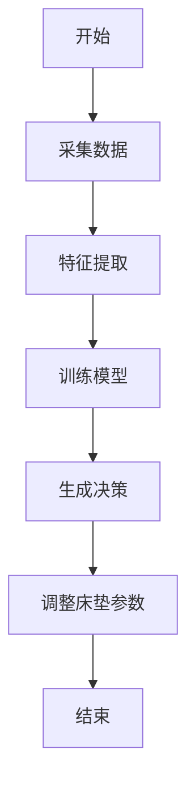
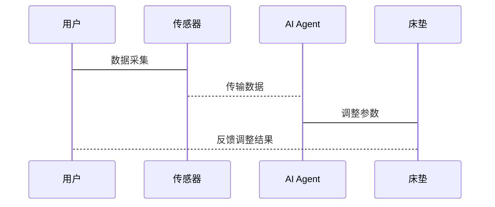

                 


```markdown
# 智能床垫：AI Agent的睡眠周期优化

> 关键词：智能床垫，AI Agent，睡眠优化，数据采集，机器学习，健康监测

> 摘要：本文深入探讨了智能床垫在睡眠周期优化中的应用，通过AI Agent技术实现个性化的睡眠监测与调整。文章从背景介绍、核心概念、算法原理、系统架构到项目实战，全面解析了智能床垫的技术实现和优化策略，为读者提供了一套完整的解决方案。

---

## 第一部分：智能床垫的背景与概念

### 第1章：智能床垫的发展历程

#### 1.1 传统床垫的局限性
- **1.1.1 睡眠问题的普遍性**：现代人面临睡眠障碍，如失眠、睡眠呼吸暂停综合征等。
- **1.1.2 传统床垫的功能局限**：传统床垫无法实时监测和调整睡眠环境，无法满足个性化需求。

#### 1.2 智能床垫的崛起
- **1.2.1 智能床垫的定义与特点**：智能床垫通过传感器和AI技术，实时监测并调整睡眠环境，提供个性化睡眠解决方案。
- **1.2.2 AI技术在床垫中的应用**：AI Agent通过数据采集、分析和决策，优化睡眠周期。

#### 1.3 AI Agent在睡眠优化中的作用
- **1.3.1 AI Agent的基本概念**：AI Agent是一种智能体，能够感知环境、做出决策并执行动作。
- **1.3.2 AI Agent在睡眠周期优化中的应用**：通过实时监测生理数据和环境参数，AI Agent调整床垫硬度、温度和湿度，优化睡眠质量。

### 第2章：智能床垫的核心概念与问题背景

#### 2.1 睡眠周期的科学分析
- **2.1.1 睡眠周期的四个阶段**：浅睡期、深睡期、REM睡眠期和其他阶段。
- **2.1.2 每个阶段的特点与重要性**：不同阶段对身体和心理的健康影响不同。

#### 2.2 智能床垫如何优化睡眠周期
- **2.2.1 数据采集与分析**：通过传感器采集心率、体温、体动等数据。
- **2.2.2 AI算法的应用**：基于机器学习算法分析数据，优化睡眠周期。

#### 2.3 问题描述与解决路径
- **2.3.1 睡眠问题的主要表现**：睡眠中断、睡眠质量差等。
- **2.3.2 智能床垫的解决方案**：实时监测和调整睡眠环境，提升睡眠质量。

#### 2.4 边界与外延
- **2.4.1 智能床垫与其他健康设备的对比**：如智能手环、智能枕头等。
- **2.4.2 睡眠优化的边界条件**：如用户健康状况、环境因素等。

#### 2.5 概念结构与核心要素
- **2.5.1 智能床垫的核心组件**：传感器、AI算法、反馈机制。
- **2.5.2 AI Agent**：AI Agent在智能床垫中的角色和功能。

---

## 第二部分：智能床垫的核心概念与联系

### 第3章：AI Agent的基本原理

#### 3.1 AI Agent的核心概念
- **感知**：通过传感器采集数据。
- **决策**：基于数据进行分析和决策。
- **执行**：根据决策调整床垫参数。

#### 3.2 AI Agent的属性特征对比
| 特性 | 基于规则的AI Agent | 基于学习的AI Agent |
|------|---------------------|--------------------|
| 数据需求 | 无需大量数据       | 需要大量数据       |
| 灵活性 | 较低                | 较高                |
| 适用场景 | 简单场景            | 复杂场景            |

#### 3.3 ER实体关系图
```mermaid
erd
  entity 睡眠数据 {
    [用户ID]
    [时间戳]
    [心率]
    [体温]
    [体动频率]
  }
  entity 床垫参数 {
    [床垫ID]
    [硬度]
    [温度]
    [湿度]
  }
  entity AI Agent {
    [决策ID]
    [决策时间]
    [决策类型]
  }
  睡眠数据 --> AI Agent: 提供数据
  AI Agent --> 床垫参数: 调整参数
```

---

## 第三部分：智能床垫的算法原理

### 第4章：AI Agent的算法流程

#### 4.1 数据采集与特征提取


#### 4.2 算法实现代码
```python
import numpy as np
from sklearn.ensemble import RandomForestClassifier

# 数据预处理
data = np.array([[28, 1], [32, 1], [35, 1], [38, 1]])
label = np.array([0, 1, 2, 3])

# 特征提取
features = data[:, :-1]
target = data[:, -1]

# 模型训练
model = RandomForestClassifier(n_estimators=100)
model.fit(features, target)

# 决策生成
new_data = np.array([[30, 1]])
predicted = model.predict(new_data)
print(predicted)
```

#### 4.3 数学模型与公式
睡眠阶段分类模型：
$$ P(\text{阶段}|x) = \frac{e^{-x/\theta}}{\sum_{i=1}^{n} e^{-x/\theta_i}} $$
其中，$\theta$ 表示睡眠阶段的特征参数。

---

## 第四部分：智能床垫的系统分析与架构设计

### 第5章：系统功能设计

#### 5.1 应用场景
- **卧室环境**：智能床垫在卧室中的应用，与其他智能家居设备的联动。

#### 5.2 系统功能设计
- **数据采集**：心率、体温、体动频率。
- **环境监测**：温度、湿度、光线。
- **决策与反馈**：根据数据调整床垫参数。

#### 5.3 系统架构设计


#### 5.4 接口设计
- **传感器接口**：与心率传感器、温度传感器等对接。
- **用户接口**：通过手机APP或网页设置参数。

#### 5.5 交互流程


---

## 第五部分：智能床垫的项目实战

### 第6章：系统实现与优化

#### 6.1 环境搭建
- **传感器**：心率传感器、温度传感器。
- **数据处理库**：numpy、pandas。
- **机器学习框架**：scikit-learn、XGBoost。

#### 6.2 核心代码实现
```python
import numpy as np
from sklearn.model_selection import train_test_split
from sklearn.metrics import accuracy_score

# 数据加载
data = np.loadtxt('sleep_data.csv', delimiter=',')

# 数据分割
X = data[:, :-1]
y = data[:, -1]
X_train, X_test, y_train, y_test = train_test_split(X, y, test_size=0.2)

# 模型训练
from sklearn.svm import SVC
model = SVC()
model.fit(X_train, y_train)

# 模型评估
y_pred = model.predict(X_test)
print(accuracy_score(y_test, y_pred))
```

#### 6.3 实际案例分析
- **案例背景**：用户睡眠质量差，REM睡眠时间过短。
- **数据分析**：心率波动大，体动频繁。
- **决策优化**：调整床垫硬度为中软，温度设置为24℃。

#### 6.4 项目总结
- **项目成果**：睡眠质量显著提升。
- **经验总结**：数据质量对模型性能影响重大，实时反馈机制至关重要。

---

## 第六部分：最佳实践与总结

### 第7章：注意事项与最佳实践

#### 7.1 注意事项
- **数据隐私**：确保用户数据的安全性。
- **传感器校准**：定期校准传感器，保证数据准确性。

#### 7.2 最佳实践
- **传感器选择**：选用高精度传感器。
- **模型迭代**：定期更新模型，提升准确率。

### 第8章：总结与展望

#### 8.1 总结
智能床垫通过AI Agent优化睡眠周期，显著提升了睡眠质量。通过实时监测和调整，解决了传统床垫的局限性。

#### 8.2 展望
未来，智能床垫将与更多智能家居设备联动，提供更全面的睡眠解决方案。

---

## 附录

### 附录A：术语表
- **AI Agent**：人工智能代理。
- **睡眠周期**：睡眠的不同阶段。

### 附录B：工具安装指南
- **Python**：安装Anaconda。
- **机器学习库**：安装scikit-learn、XGBoost。

### 附录C：参考文献
- [1] 睡眠医学研究进展，2023年。
- [2] 人工智能在健康监测中的应用，2022年。

---

## 作者

作者：AI天才研究院（AI Genius Institute） & 禅与计算机程序设计艺术（Zen And The Art of Computer Programming）

---

**END**
```

