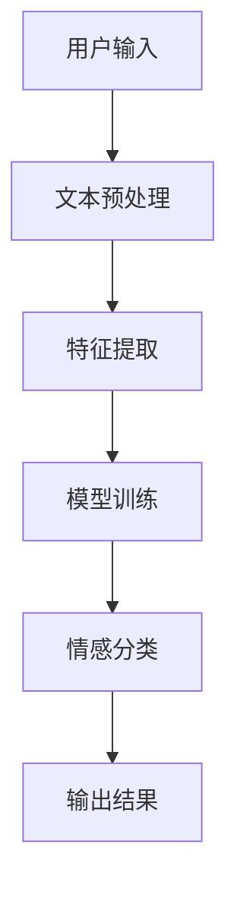

                 

# 智能情感陪伴 AI Agent：LLM 在心理健康领域的深度应用

> 关键词：智能情感陪伴、LLM、心理健康、AI代理、自然语言处理

> 摘要：本文深入探讨了大型语言模型（LLM）在心理健康领域的应用，特别是其在智能情感陪伴AI代理中的作用。文章从问题背景、技术原理、系统架构到项目实战，全面分析了如何利用LLM提供高效、个性化的心理健康支持，为未来的心理健康服务模式提供了新的思路。

---

## 第1章 背景介绍与问题背景

### 1.1 问题背景
#### 1.1.1 当前心理健康问题的现状
心理健康问题日益成为全球性的公共卫生挑战。根据世界卫生组织的数据，全球约有9.7亿人受到心理健康问题的影响。尤其是在现代社会，工作压力、人际关系紧张等因素导致焦虑和抑郁的发病率逐年上升。

#### 1.1.2 传统心理咨询的局限性
传统心理咨询依赖专业心理医生，存在资源有限、成本高昂、覆盖面窄等问题。此外，心理咨询的效果还受到咨询师经验和技巧的影响，难以实现个性化和精准化服务。

#### 1.1.3 AI技术在心理健康领域的潜力
AI技术的快速发展为心理健康支持提供了新的解决方案。通过自然语言处理（NLP）技术，AI代理可以实现情感分析、对话生成等功能，为用户提供24/7的智能情感陪伴。

### 1.2 问题描述
#### 1.2.1 情感陪伴的需求
人们在面对压力、孤独或情绪低落时，往往需要及时的情感支持。传统的面对面心理咨询无法满足随时性需求，而AI代理可以提供全天候的服务。

#### 1.2.2 心理健康支持的缺口
心理健康服务资源分布不均，尤其是在偏远地区，缺乏专业心理医生。AI代理可以弥补这一缺口，为更多人提供基础的心理支持。

#### 1.2.3 LLM在情感陪伴中的应用场景
LLM（大型语言模型）通过理解和生成自然语言，可以应用于情绪识别、情感支持、压力缓解等场景，帮助用户缓解负面情绪，提升心理健康水平。

### 1.3 问题解决思路
#### 1.3.1 AI Agent的核心目标
AI Agent的目标是通过自然语言处理技术，提供实时的情感支持和心理健康建议，帮助用户缓解负面情绪，提升心理健康水平。

#### 1.3.2 LLM在情感陪伴中的优势
LLM具备强大的文本理解和生成能力，能够进行多轮对话，理解用户的情感状态，并提供个性化的回应。

#### 1.3.3 技术实现的关键点
- 高精度的情感分析算法
- 自然语言生成模型的优化
- 用户隐私保护与数据安全

### 1.4 边界与外延
#### 1.4.1 情感陪伴的边界
AI Agent的情感陪伴仅提供基础的心理支持，不能替代专业心理医生的诊断和治疗。

#### 1.4.2 心理健康支持的范围
AI Agent可以识别情绪、提供倾听和建议，但在复杂心理问题上需要专业医生介入。

#### 1.4.3 LLM应用的限制
LLM的情感支持依赖于训练数据的质量和模型的泛化能力，存在对极端情况处理不当的风险。

### 1.5 核心要素与概念结构
#### 1.5.1 AI Agent的基本组成
- 用户输入模块
- 情感分析模块
- 对话生成模块
- 用户反馈模块

#### 1.5.2 LLM在情感陪伴中的角色
LLM作为AI Agent的核心引擎，负责理解和生成自然语言，实现情感支持功能。

#### 1.5.3 用户与系统交互的模式
- 单轮对话：用户提出问题，系统即时回应。
- 多轮对话：连续交互，逐步深入用户情感需求。

---

## 第2章 智能情感陪伴 AI Agent 的核心概念

### 2.1 AI Agent的基本原理
#### 2.1.1 AI Agent的定义
AI Agent是一种能够感知环境并执行任务的智能实体，通过与用户的交互，提供特定的服务。

#### 2.1.2 AI Agent的核心功能
- 情感分析
- 对话生成
- 用户行为分析

#### 2.1.3 AI Agent与传统聊天机器人的区别
AI Agent具备更强的自主学习能力和个性化服务功能，能够根据用户情绪和需求动态调整交互策略。

### 2.2 LLM在情感陪伴中的应用
#### 2.2.1 LLM的定义与特点
LLM是一种基于深度学习的自然语言处理模型，具备大规模文本理解和生成能力。

#### 2.2.2 LLM在情感陪伴中的优势
- 高精度的情感识别
- 自然流畅的对话生成
- 能够处理复杂的情感场景

#### 2.2.3 LLM与心理健康支持的结合
通过分析用户的语言和行为，LLM能够识别潜在的情绪问题，并提供相应的支持建议。

### 2.3 AI Agent与用户交互的模式
#### 2.3.1 单轮对话
用户提出问题，系统即时回应。例如：
- 用户：“我最近总是感到焦虑。”
- 系统：“这可能是因为工作压力太大，我们可以一起探讨一下原因。”

#### 2.3.2 多轮对话
连续交互，逐步深入用户情感需求。例如：
- 用户：“我最近总是睡不好。”
- 系统：“这可能与你的日常生活习惯有关，我们可以一起分析一下。”

#### 2.3.3 情境感知与情感分析
系统通过分析用户的语言和行为，识别其情感状态，并提供相应的支持。

---

## 第3章 情感陪伴 AI Agent 的算法原理

### 3.1 情感分析
#### 3.1.1 情感分析的算法流程
1. **文本预处理**：分词、去除停用词。
2. **特征提取**：使用词袋模型或词嵌入技术提取文本特征。
3. **模型训练**：使用深度学习模型（如LSTM、Transformer）进行训练。
4. **情感分类**：将文本分为正面、中性或负面情感。

#### 3.1.2 情感分析的数学模型
- 使用词嵌入（如Word2Vec）将文本转化为向量表示。
- 通过循环神经网络（RNN）或Transformer模型进行序列建模。
- 输出层使用Softmax函数进行分类。

#### 3.1.3 情感分析的流程图

---

通过以上步骤，我们逐步构建了AI Agent在心理健康领域的应用框架，详细介绍了其核心概念和算法原理。接下来的章节将深入探讨系统的具体实现和实际应用案例。

