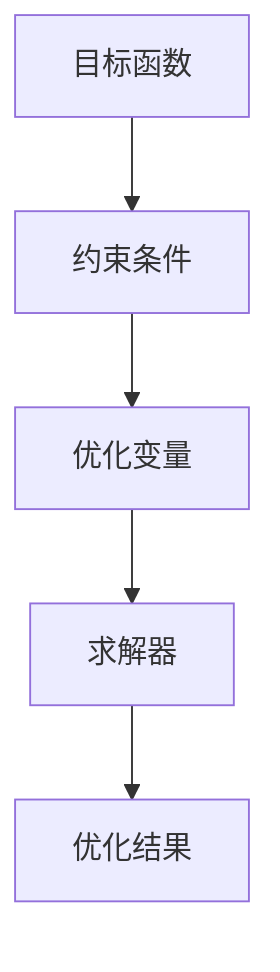
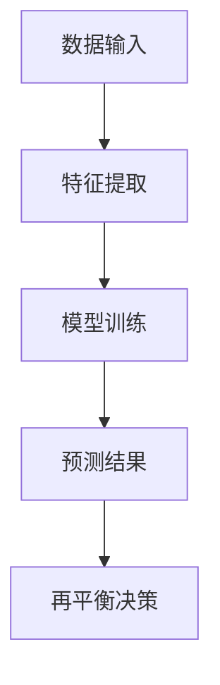
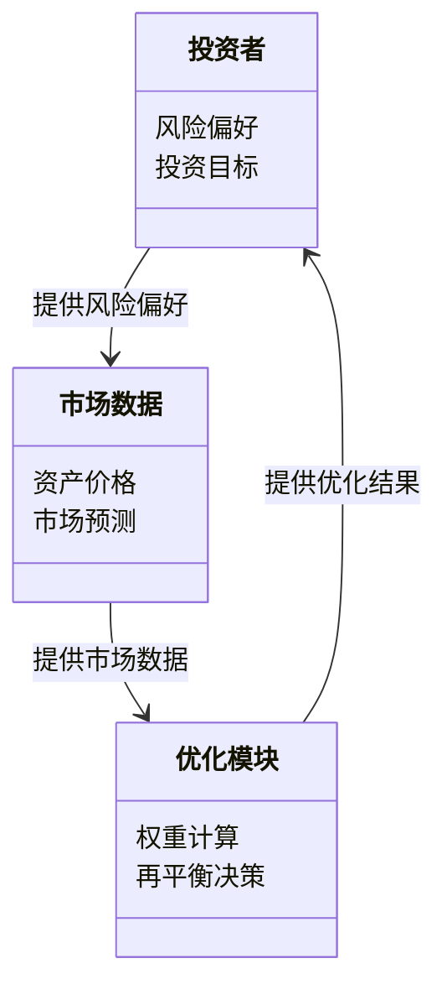

                 


# 智能投资组合再平衡技术

> 关键词：智能投资组合，再平衡技术，动态优化，机器学习，投资组合管理

> 摘要：本文系统地探讨了智能投资组合再平衡技术的核心原理、实现方法及其在金融领域的应用。通过分析传统与智能再平衡的对比，结合算法优化、机器学习预测模型和数学模型，本文为读者提供了全面的技术背景和实现细节。文章还通过实际案例和系统架构设计，展示了如何将智能再平衡技术应用于实际投资组合管理中。最后，本文总结了当前技术的优势与挑战，并展望了未来的发展方向。

---

# 第一部分: 智能投资组合再平衡技术概述

## 第1章: 智能投资组合再平衡技术的背景与概念

### 1.1 问题背景与定义

#### 1.1.1 投资组合再平衡的背景
投资组合管理是金融领域的重要组成部分，旨在通过合理配置资产以实现风险与收益的最优平衡。随着市场环境的变化（如资产价格波动、市场趋势变化等），投资组合的权重会偏离初始设定的目标权重，从而影响整体收益。为了维持投资组合的最优性，需要定期进行再平衡操作。

智能再平衡技术通过引入智能化算法，能够实时或定期动态调整投资组合的权重，以适应市场变化和投资者的动态需求。

#### 1.1.2 智能再平衡的定义与目标
智能投资组合再平衡技术是一种基于算法优化和机器学习的动态调整方法，旨在在市场变化和投资者目标变化时，自动调整投资组合的资产配置，以实现风险最小化和收益最大化的双重目标。

智能再平衡的核心目标包括：
1. **动态优化**：根据市场变化和投资者需求，实时或定期调整资产权重。
2. **风险控制**：通过优化算法降低投资组合的整体风险。
3. **收益最大化**：在控制风险的前提下，最大化投资组合的收益。

#### 1.1.3 技术基础与实现手段
智能再平衡技术的基础包括：
- **算法优化**：如遗传算法、模拟退火、梯度下降等。
- **机器学习**：如时间序列预测、回归分析等。
- **数学建模**：如线性规划、非线性规划等。

实现手段包括：
- 数据采集与处理。
- 模型构建与训练。
- 再平衡策略生成与执行。

---

### 1.2 核心概念与技术基础

#### 1.2.1 投资组合再平衡的基本原理
投资组合再平衡的目的是通过调整资产权重，使组合的风险收益比接近或优于初始设定的目标。传统再平衡方法通常基于固定的时间间隔（如每月、每季度）进行调整，而智能再平衡则可以根据实时市场数据和投资者目标动态调整。

#### 1.2.2 智能再平衡的核心技术特征
智能再平衡与传统再平衡的主要区别在于其智能化和动态性：
- **动态调整**：根据实时市场数据和投资者目标动态调整。
- **机器学习预测**：利用机器学习模型预测市场走势和资产收益。
- **多目标优化**：在风险与收益之间找到最优平衡点。

#### 1.2.3 传统再平衡与智能再平衡的对比分析
| 对比维度 | 传统再平衡 | 智能再平衡 |
|----------|-------------|-------------|
| 调整频率 | 固定时间间隔 | 动态实时调整 |
| 数据依赖 | 历史数据为主 | 实时数据为主 |
| 策略类型 | 固定策略 | 动态策略 |
| 风险控制 | 基于历史波动 | 基于实时预测 |

---

### 1.3 当前技术发展现状与趋势

#### 1.3.1 传统投资组合再平衡方法
传统再平衡方法通常基于固定的时间间隔进行调整，其优点是简单易行，但缺点是无法适应市场环境的快速变化。

#### 1.3.2 智能化再平衡技术的应用现状
智能再平衡技术已逐渐在金融领域得到广泛应用，尤其是在机构投资者和高端财富管理领域。其应用包括：
- 基于机器学习的市场预测。
- 动态风险控制。
- 自动化投资组合调整。

#### 1.3.3 未来发展趋势与挑战
未来，智能再平衡技术将朝着以下几个方向发展：
- **实时调整**：基于高频数据的实时优化。
- **多目标优化**：在收益、风险、流动性等多目标之间找到平衡。
- **个性化投资**：根据投资者的个性化需求进行定制化调整。
- **挑战**：数据依赖性强、模型过拟合、计算复杂度高等。

---

## 第2章: 智能投资组合再平衡的核心概念与原理

### 2.1 智能再平衡的原理与机制

#### 2.1.1 动态调整与优化机制
智能再平衡的核心是动态调整资产权重，以实现投资组合的最优配置。其优化机制包括以下几个步骤：
1. 数据采集：获取实时市场数据和投资者目标。
2. 预测分析：利用机器学习模型预测未来市场走势。
3. 优化计算：基于预测结果和投资者目标，计算最优资产权重。
4. 再平衡执行：根据优化结果调整资产配置。

#### 2.1.2 基于机器学习的预测模型
机器学习模型在智能再平衡中的作用主要体现在市场预测和风险评估。常用的模型包括：
- **时间序列预测**：如LSTM（长短期记忆网络）用于预测资产价格。
- **回归分析**：用于分析资产之间的关系。

#### 2.1.3 多目标优化与风险控制
智能再平衡需要在多个目标之间进行权衡，如最大化收益、最小化风险、最大化流动性等。多目标优化通常采用加权目标函数的方法，将多个目标转化为一个优化问题。

---

### 2.2 核心概念之间的关系

#### 2.2.1 实体关系图（ER图）


#### 2.2.2 核心概念属性对比表
| 概念 | 属性 | 描述 |
|------|------|------|
| 投资目标 | 风险收益比 | 确定投资组合的风险与收益目标 |
| 资产权重 | 分配比例 | 各资产在组合中的权重 |
| 优化算法 | 算法类型 | 使用的优化方法（如遗传算法、模拟退火） |
| 再平衡频率 | 调整周期 | 定期调整的时间间隔 |

---

## 第3章: 智能投资组合再平衡的算法原理

### 3.1 基于模型的优化算法

#### 3.1.1 算法流程


#### 3.1.2 数学模型与公式
目标函数：
$$ \text{目标函数} = \sum_{i=1}^{n} w_i r_i $$
约束条件：
$$ \sum_{i=1}^{n} w_i = 1 $$

---

### 3.2 基于机器学习的预测模型

#### 3.2.1 算法流程


#### 3.2.2 模型实现代码示例
```python
import numpy as np
from sklearn.linear_model import LinearRegressor

# 示例代码：简单线性回归模型
def predict_prices(X, y):
    model = LinearRegressor()
    model.fit(X, y)
    return model.predict(X)

# 示例数据
X = np.array([[1, 2], [3, 4], [5, 6]])
y = np.array([7, 8, 9])
predicted = predict_prices(X, y)
print(predicted)
```

---

## 第4章: 智能投资组合再平衡的数学模型与公式

### 4.1 数学模型的构建

#### 4.1.1 目标函数
$$ \text{目标函数} = \sum_{i=1}^{n} w_i r_i $$

#### 4.1.2 约束条件
1. 权重之和为1：
$$ \sum_{i=1}^{n} w_i = 1 $$
2. 风险约束：
$$ \sum_{i=1}^{n} w_i^2 \leq \sigma^2 $$

### 4.2 数学模型的求解

#### 4.2.1 线性规划求解
使用Python的`scipy.optimize`库进行线性规划求解：
```python
from scipy.optimize import minimize

def objective(weights):
    return -sum(weights * returns)

constraints = [
    {'type': 'eq', 'fun': lambda w: sum(w) - 1},
    {'type': 'ineq', 'fun': lambda w: sum(w**2) - 0.25}
]

result = minimize(objective, initial_weights, constraints)
optimal_weights = result.x
```

---

## 第5章: 智能投资组合再平衡的系统分析与架构设计

### 5.1 系统功能设计

#### 5.1.1 领域模型


---

## 第6章: 智能投资组合再平衡的项目实战

### 6.1 环境安装与配置

#### 6.1.1 环境依赖
- Python 3.8+
- NumPy
- Pandas
- Scikit-learn
- Matplotlib

---

### 6.2 核心代码实现

#### 6.2.1 数据预处理
```python
import pandas as pd
import numpy as np

# 示例数据：资产价格
data = pd.DataFrame({
    '资产A': [100, 105, 110, 115, 120],
    '资产B': [80, 85, 90, 95, 100],
    '资产C': [120, 115, 110, 105, 100]
})
```

---

## 第7章: 总结与展望

### 7.1 总结
智能投资组合再平衡技术通过结合算法优化和机器学习，能够显著提升投资组合的风险控制和收益优化能力。本文详细介绍了其核心原理、实现方法和系统架构，并通过实际案例展示了其应用价值。

### 7.2 展望
未来，智能再平衡技术将在以下几个方向进一步发展：
- **实时优化**：基于高频数据的实时调整。
- **个性化投资**：根据投资者的个性化需求进行定制化调整。
- **多目标优化**：在收益、风险、流动性等多目标之间找到最优平衡。

---

# 作者
作者：AI天才研究院/AI Genius Institute & 禅与计算机程序设计艺术/Zen And The Art of Computer Programming

