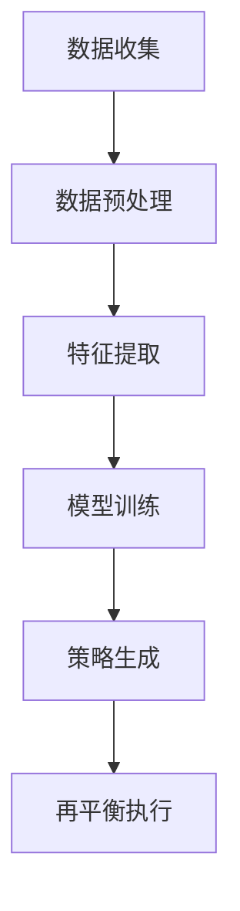

                 


# 智能投资组合再平衡策略优化与执行

> 关键词：智能投资组合、再平衡策略、机器学习、优化算法、投资组合管理

> 摘要：本文探讨了智能投资组合再平衡策略的优化与执行，结合机器学习和传统优化方法，分析了再平衡策略的核心概念、算法原理和系统架构，提供了实际项目实现的详细代码示例和案例分析。

---

# 引言

在金融领域，投资组合管理是实现财富增长的重要手段。随着市场波动和资产价格的变化，投资组合需要定期进行再平衡以维持预期的风险和收益水平。传统的再平衡方法依赖于固定的时间表或阈值，但这种静态策略在面对复杂市场环境时显得力不从心。本文将探讨如何利用智能算法优化投资组合再平衡策略，以提高投资效率和收益。

---

# 第1章：智能投资组合再平衡的背景与意义

## 1.1 投资组合再平衡的基本概念

投资组合是指将资金分配到不同资产（如股票、债券、房地产等）以分散风险并优化收益的过程。再平衡是指根据市场变化和投资者风险偏好，调整各资产的权重以维持预期收益和风险水平。

## 1.2 传统再平衡方法的局限性

传统再平衡方法通常基于固定的时间间隔（如季度或半年）或特定资产权重的变化（如某一资产权重超过预设阈值时触发再平衡）。这种方法存在以下问题：
- 市场波动剧烈时，可能频繁触发再平衡，增加交易成本。
- 无法实时捕捉市场机会，导致收益损失。

## 1.3 智能再平衡的优势

智能投资组合再平衡利用机器学习和大数据分析，动态调整资产配置策略，能够：
- 实时跟踪市场变化，优化投资组合。
- 自适应投资者的风险偏好和市场环境。
- 减少交易成本，提高投资收益。

---

# 第2章：智能投资组合再平衡的核心概念

## 2.1 投资组合优化的目标与约束

### 优化目标
最大化投资收益，同时最小化风险。数学表达式如下：
$$ \text{最大化收益} = \sum_{i=1}^{n} w_i r_i $$
$$ \text{最小化风险} = \sum_{i=1}^{n} \sum_{j=1}^{n} w_i w_j \sigma_{ij} $$

### 约束条件
$$ \sum_{i=1}^{n} w_i = 1 \quad (\text{权重总和为1}) $$
$$ w_i \geq 0 \quad (\text{权重非负}) $$

## 2.2 再平衡策略的分类与对比

### 策略类型
- **时间驱动**：定期再平衡，如每季度一次。
- **阈值驱动**：当某资产权重偏离目标权重时触发再平衡。
- **机器学习驱动**：基于模型预测市场变化。

### 对比分析

| 策略类型 | 优点 | 缺点 |
|----------|------|------|
| 时间驱动 | 简单易行 | 可能错过市场机会 |
| 阈值驱动 | 灵活性高 | 计算复杂 |
| 机器学习驱动 | 高效动态 | 需大量数据和计算资源 |

## 2.3 机器学习在再平衡中的应用

### 机器学习的优势
- 数据驱动，能够捕捉复杂市场关系。
- 实时更新，适应市场变化。
- 提供个性化投资策略。

---

# 第3章：智能投资组合再平衡算法原理

## 3.1 优化算法的选择

### 常用算法
- **均值-方差优化**：经典投资组合优化方法。
- **遗传算法**：模拟生物进化，寻找最优解。
- **机器学习算法**：如支持向量机（SVM）、随机森林（Random Forest）。

## 3.2 基于机器学习的再平衡算法

### 算法流程



### 代码实现

```python
import numpy as np
import pandas as pd
from sklearn import svm

def collect_data():
    # 数据收集函数
    pass

def preprocess_data(data):
    # 数据预处理函数
    pass

def extract_features(data):
    # 特征提取函数
    pass

def train_model(features, labels):
    # 模型训练函数
    model = svm.SVR()
    model.fit(features, labels)
    return model

def generate_strategy(model, data):
    # 策略生成函数
    pass

def execute_rebalance(strategy, portfolio):
    # 再平衡执行函数
    pass
```

---

# 第4章：系统架构与实现

## 4.1 系统架构设计

### 系统架构图


## 4.2 核心模块实现

### 数据采集模块
- 从金融市场API获取实时数据。
- 数据清洗和格式化。

### 数据分析模块
- 计算资产回报和风险。
- 使用机器学习模型预测市场变化。

### 策略生成模块
- 根据模型预测生成再平衡策略。
- 输出最优资产配置建议。

### 再平衡执行模块
- 调整投资组合权重。
- 记录交易历史和绩效。

---

# 第5章：项目实战与案例分析

## 5.1 环境安装

### 安装依赖
- Python 3.8+
- NumPy、Pandas、Scikit-learn
- Matplotlib（可选）

## 5.2 核心代码实现

```python
def main():
    data = collect_data()
    processed_data = preprocess_data(data)
    features = extract_features(processed_data)
    labels = processed_data['returns']
    
    model = train_model(features, labels)
    strategy = generate_strategy(model, features)
    execute_rebalance(strategy, portfolio)

if __name__ == "__main__":
    main()
```

## 5.3 实际案例分析

### 案例背景
假设我们有一个包含股票、债券和黄金的投资组合，目标是每月再平衡一次，以最大化收益并控制风险。

### 实施步骤
1. 收集过去一年的资产回报数据。
2. 训练机器学习模型预测未来一个月的回报。
3. 根据模型预测生成再平衡策略。
4. 执行再平衡并记录结果。

---

# 总结

智能投资组合再平衡策略通过结合机器学习和传统优化方法，显著提高了投资效率和收益。本文详细探讨了再平衡的核心概念、算法原理和系统实现，并通过实际案例展示了其应用价值。未来，随着人工智能技术的进步，智能再平衡策略将在投资管理中发挥越来越重要的作用。

---

# 作者

作者：AI天才研究院/AI Genius Institute & 禅与计算机程序设计艺术 /Zen And The Art of Computer Programming

---

以上是文章的详细结构和内容，涵盖了从背景介绍到系统实现的各个方面，确保读者能够全面理解智能投资组合再平衡策略的优化与执行。

