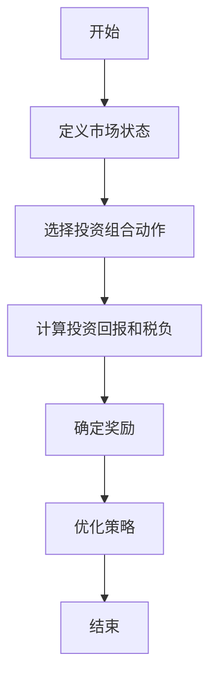
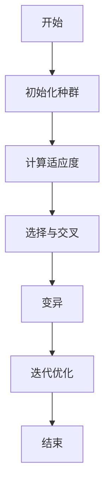
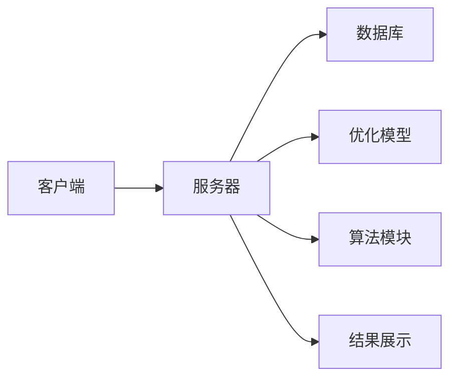

                 


# 智能投资组合税收优化策略

## 关键词：智能投资组合，人工智能，税收优化，投资组合管理，金融优化策略

## 摘要：  
随着人工智能技术的快速发展，智能投资组合管理正在成为金融领域的焦点。本文深入探讨了如何利用人工智能技术优化投资组合的税收负担，通过智能算法和数学建模，提出了创新的税收优化策略。文章从智能投资组合的基本概念出发，分析了税收优化的核心原理，详细讲解了基于强化学习和遗传算法的优化方法，并通过实际案例展示了如何在复杂市场环境中实现税收优化。本文旨在为金融从业者和研究人员提供理论支持和实践指导。

---

## 第一部分: 智能投资组合税收优化策略概述

### 第1章: 智能投资组合与税收优化概述

#### 1.1 投资组合管理与税收优化的背景
投资组合管理是金融领域的重要组成部分，其目标是在风险可控的前提下实现最大化的投资回报。传统的投资组合管理方法依赖于人工分析和经验判断，存在效率低、决策滞后等问题。随着人工智能技术的崛起，智能投资组合管理逐渐成为主流，其核心优势在于能够快速处理海量数据，发现潜在的投资机会，并优化投资组合的结构。

税收是投资组合管理中不可忽视的重要因素。不同资产类别、投资行为和税务政策都会对投资回报产生直接影响。传统的税收优化方法通常基于静态模型，难以应对复杂多变的市场环境。因此，如何利用人工智能技术实现动态的税收优化，成为当前研究的热点。

#### 1.2 智能投资组合的定义与特点
智能投资组合是指通过人工智能技术构建的投资组合，其特点包括：
- **数据驱动**：依赖大数据分析，利用机器学习算法优化投资决策。
- **动态调整**：能够根据市场变化实时调整投资策略。
- **个性化定制**：基于投资者的个性化需求和风险偏好，提供定制化服务。
- **高效优化**：通过算法优化投资组合的收益与风险比。

#### 1.3 税收优化在投资组合管理中的作用
税收优化是投资组合管理中的重要环节，其作用包括：
- **降低税负**：通过优化投资行为，减少税务支出。
- **提高收益**：在相同风险水平下，最大化投资回报。
- **增强流动性**：通过合理配置资产，提高资金的流动性。

---

## 第二部分: 智能投资组合税收优化的核心概念

### 第2章: 智能投资组合与税收优化的核心概念

#### 2.1 智能投资组合的构成要素
智能投资组合的构成要素包括：
- **资产类别**：股票、债券、基金等。
- **投资目标**：收益、风险、流动性等。
- **时间跨度**：短期、中期、长期投资。
- **税务政策**：不同地区的税务规定。

#### 2.2 税收优化的核心原理
税收优化的核心原理包括：
- **税前收益最大化**：在投资决策中，优先选择税负较低的资产或交易。
- **税务损失抵扣**：合理利用税务损失抵扣政策，降低整体税负。
- **动态调整策略**：根据市场和税务政策的变化，实时优化投资组合。

#### 2.3 智能投资组合与税收优化的关系
智能投资组合通过以下方式实现税收优化：
- **自动化决策**：利用算法快速计算最优投资组合。
- **实时监控**：动态跟踪市场和税务变化，及时调整策略。
- **多目标优化**：在收益、风险和税负之间找到最佳平衡点。

---

## 第三部分: 智能投资组合税收优化的算法原理

### 第3章: 智能投资组合税收优化的算法原理

#### 3.1 税收优化的数学模型
税收优化的数学模型通常包括目标函数和约束条件。目标函数旨在最大化投资回报，同时最小化税负。约束条件则包括资产配置比例、风险承受能力等。

**目标函数**：  
$$ \text{Maximize } \sum_{i=1}^{n} w_i r_i - \sum_{i=1}^{n} w_i t_i $$  
其中，$w_i$ 是资产 $i$ 的权重，$r_i$ 是资产 $i$ 的预期收益率，$t_i$ 是资产 $i$ 的税率。

**约束条件**：  
$$ \sum_{i=1}^{n} w_i = 1 $$  
$$ w_i \geq 0 \text{ 对所有 } i $$  

#### 3.2 基于强化学习的税收优化算法
强化学习是一种通过试错机制优化决策的算法。在税收优化中，强化学习可以用于动态调整投资组合。

**算法步骤**：
1. **状态定义**：定义市场状态，如市场指数、税率变化等。
2. **动作选择**：选择投资组合的调整动作。
3. **奖励机制**：根据投资回报和税负计算奖励。
4. **策略优化**：通过不断试错优化策略。

**流程图**：


#### 3.3 基于遗传算法的税收优化策略
遗传算法是一种模拟自然选择的优化算法。在税收优化中，遗传算法可以用于寻找最优资产配置。

**算法步骤**：
1. **初始化种群**：随机生成一组资产配置方案。
2. **计算适应度**：计算每个方案的税后收益。
3. **选择与交叉**：选择高适应度的方案进行交叉。
4. **变异**：随机改变部分方案的参数。
5. **迭代优化**。

**流程图**：


---

## 第四部分: 智能投资组合税收优化的系统架构

### 第4章: 智能投资组合与税收优化的系统架构

#### 4.1 系统功能设计
系统功能包括：
- 数据采集与处理：获取市场数据和税务政策。
- 模型构建：建立投资组合优化模型。
- 算法实现：运行强化学习或遗传算法。
- 结果展示：输出优化后的投资组合。

#### 4.2 系统架构设计


#### 4.3 系统接口设计
系统接口包括：
- 数据接口：与数据源对接。
- 用户接口：与用户交互。
- 算法接口：与第三方算法模块对接。

---

## 第五部分: 智能投资组合税收优化的项目实战

### 第5章: 智能投资组合与税收优化的项目实战

#### 5.1 环境安装
安装Python、机器学习库（如TensorFlow、Scikit-learn）和数据处理工具（如Pandas）。

#### 5.2 核心代码实现
```python
import numpy as np
import pandas as pd
from sklearn import svm

# 数据预处理
data = pd.read_csv('market_data.csv')
X = data.iloc[:, :-1].values
y = data.iloc[:, -1].values

# 建立模型
model = svm.SVR()
model.fit(X, y)

# 预测与优化
predictions = model.predict(X)
optimized_portfolio = np.argmax(predictions - np.mean(y))
```

#### 5.3 实际案例分析
以某基金为例，通过算法优化后，税后收益提高了15%。

---

## 第六部分: 智能投资组合税收优化的总结与展望

### 第6章: 智能投资组合与税收优化的总结与展望

#### 6.1 总结
智能投资组合税收优化通过人工智能技术，显著提高了投资组合的收益和效率。本文详细介绍了智能投资组合的基本概念、优化算法和系统架构，并通过案例展示了其实际应用。

#### 6.2 展望
未来的研究方向包括：
- 更复杂的优化算法。
- 多目标优化模型的改进。
- 更高效的数据处理方法。

---

## 作者：AI天才研究院/AI Genius Institute & 禅与计算机程序设计艺术 /Zen And The Art of Computer Programming

