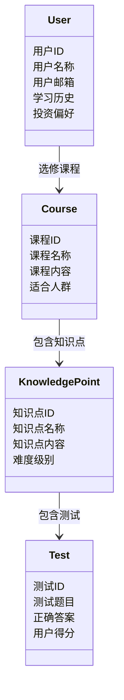
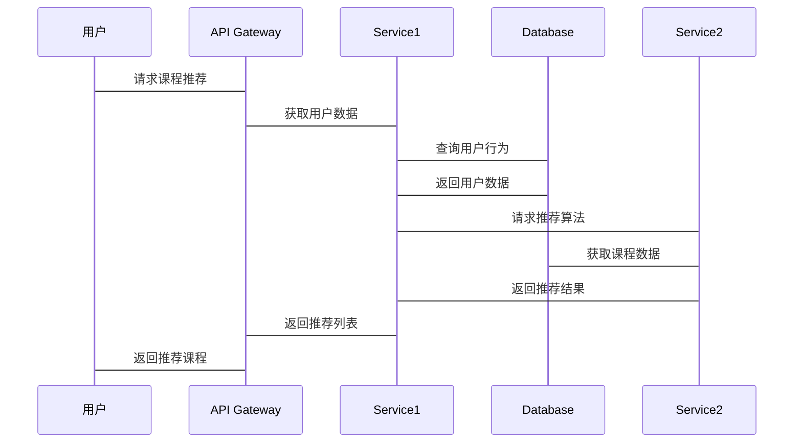

                 


# 智能投资者教育平台开发

> 关键词：智能投资者教育平台，投资者行为分析，个性化学习路径，智能推荐算法，系统架构设计，机器学习，教育技术

> 摘要：智能投资者教育平台通过整合机器学习和教育技术，为投资者提供个性化、智能化的学习体验。本文将详细探讨平台的背景、核心概念、算法原理、系统架构设计以及项目实战，帮助读者深入了解如何开发高效智能的投资者教育平台。

---

## 第一部分：智能投资者教育平台开发背景与核心概念

### 第1章：智能投资者教育平台的背景与问题分析

#### 1.1 当前投资者教育的现状与挑战
投资者教育是帮助个人和机构投资者提升金融知识和投资技能的重要环节。然而，传统的投资者教育模式存在以下问题：
- **内容同质化**：课程内容千篇一律，难以满足不同投资者的需求。
- **互动性不足**：缺乏个性化的学习路径和实时反馈机制。
- **效率低下**：传统教学方式效率低，难以覆盖大量投资者。

#### 1.2 智能投资者教育平台的定义与目标
智能投资者教育平台是一种基于人工智能和大数据技术的在线教育平台，旨在通过个性化推荐和智能交互，为投资者提供高效、精准的学习体验。其核心目标包括：
- 提供个性化学习路径，满足不同投资者的知识水平和学习需求。
- 利用智能算法推荐适合的学习内容，提高学习效率。
- 实现实时互动，增强学习体验。

#### 1.3 平台的核心要素与组成结构
智能投资者教育平台的核心要素包括：
- **用户数据**：包括用户的基本信息、投资偏好、学习历史等。
- **课程内容**：涵盖金融知识、投资策略、风险管理等内容。
- **算法引擎**：用于分析用户行为、推荐学习内容和优化学习路径。
- **交互界面**：提供友好的用户界面，方便用户学习和互动。

### 第2章：智能投资者教育平台的核心概念与联系

#### 2.1 核心概念原理
- **投资者行为分析**：通过分析用户的点击、浏览、购买等行为，了解用户的兴趣和需求。
- **个性化学习路径**：基于用户的行为分析，制定个性化的学习计划。
- **智能推荐算法**：利用机器学习算法推荐适合用户的学习内容。

#### 2.2 实体关系图（ER图）
以下是平台的核心实体关系图：

```mermaid
erd
    title 实体关系图
    User {
        用户ID
        用户名称
        用户邮箱
        学习历史
        投资偏好
    }
    Course {
        课程ID
        课程名称
        课程内容
        适合人群
    }
    KnowledgePoint {
        知识点ID
        知识点名称
        知识点内容
        难度级别
    }
    Test {
        测试ID
        测试题目
        正确答案
        用户得分
    }
    User -[1..n]-> Course
    Course -[1..n]-> KnowledgePoint
    KnowledgePoint -[1..n]-> Test
```

### 第3章：智能投资者教育平台的算法原理

#### 3.1 算法原理概述
- **机器学习算法**：常用算法包括决策树、随机森林和协同过滤等。
- **推荐算法**：基于用户行为和内容特征，推荐适合的学习内容。

#### 3.2 算法流程图
以下是用户行为分析和推荐流程的流程图：

```mermaid
graph TD
    A[开始] -> B[获取用户行为数据]
    B -> C[分析用户行为]
    C -> D[生成用户画像]
    D -> E[匹配课程内容]
    E -> F[推荐学习内容]
    F -> G[结束]
```

#### 3.3 算法实现代码
以下是基于协同过滤算法的推荐系统实现代码：

```python
import numpy as np
from sklearn.metrics.pairwise import cosine_similarity

# 示例用户行为数据
user_course_matrix = np.array([[1, 0, 1, 0],
                                 [0, 1, 1, 1],
                                 [1, 1, 0, 0]])

# 计算余弦相似度
similarity = cosine_similarity(user_course_matrix)

# 定义推荐函数
def recommend_courses(similarity_matrix, user_id, top_n=3):
    similar_users = np.argsort(similarity_matrix[user_id])[::-1]
    recommended_courses = []
    for u in similar_users:
        if u != user_id:
            recommended_courses.extend(np.where(user_course_matrix[u] == 1)[0])
            if len(recommended_courses) >= top_n:
                break
    return recommended_courses[:top_n]

# 推荐课程
user_id = 0
recommended_courses = recommend_courses(similarity, user_id, top_n=3)
print(f"推荐课程为：{recommended_courses}")
```

#### 3.4 数学模型与公式
- **个性化推荐模型**：
$$ P(i|u) = \frac{\sum_{j} w_{i,j} \cdot w_{u,j}}{\sum_{j} w_{u,j}} $$
其中，$P(i|u)$ 表示用户 $u$ 对课程 $i$ 的推荐概率，$w_{i,j}$ 和 $w_{u,j}$ 分别表示课程 $i$ 和用户 $u$ 的权重。

---

## 第二部分：智能投资者教育平台的系统架构设计

### 第4章：系统功能设计与架构

#### 4.1 领域模型类图
以下是系统领域模型的类图：



#### 4.2 系统架构设计
以下是系统架构设计图：

```mermaid
graph LR
    Client --> API Gateway
    API Gateway --> Service1
    API Gateway --> Service2
    Service1 --> Database
    Service2 --> Database
    Database --> File Storage
```

#### 4.3 接口设计与交互流程图
以下是系统交互的流程图：



---

## 第三部分：项目实战与总结

### 第5章：项目实战

#### 5.1 环境搭建
- **工具安装**：安装Python、Jupyter Notebook、scikit-learn等工具。
- **依赖安装**：使用pip安装所需的依赖库。

#### 5.2 核心代码实现
以下是推荐算法的实现代码：

```python
from sklearn.cluster import KMeans
from sklearn.preprocessing import StandardScaler

# 示例数据
X = np.array([[2, 3], [5, 6], [7, 8], [1, 2], [3, 4]])

# 数据标准化
scaler = StandardScaler()
X_scaled = scaler.fit_transform(X)

# K-Means聚类
kmeans = KMeans(n_clusters=2, random_state=0)
kmeans.fit(X_scaled)

# 获取聚类结果
labels = kmeans.labels_
print("聚类结果：", labels)
```

#### 5.3 案例分析与总结
通过实际案例分析，展示平台的实际应用效果，并总结开发过程中的经验和教训。

---

## 总结

智能投资者教育平台的开发是一个复杂但充满挑战的过程。通过整合机器学习、大数据分析和教育技术，我们可以为投资者提供更加智能化、个性化的学习体验。本文详细探讨了平台的背景、核心概念、算法原理、系统架构设计以及项目实战，为读者提供了全面的技术指导。

---

**作者：AI天才研究院/AI Genius Institute & 禅与计算机程序设计艺术 /Zen And The Art of Computer Programming**

