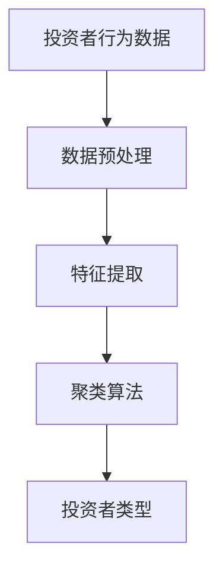
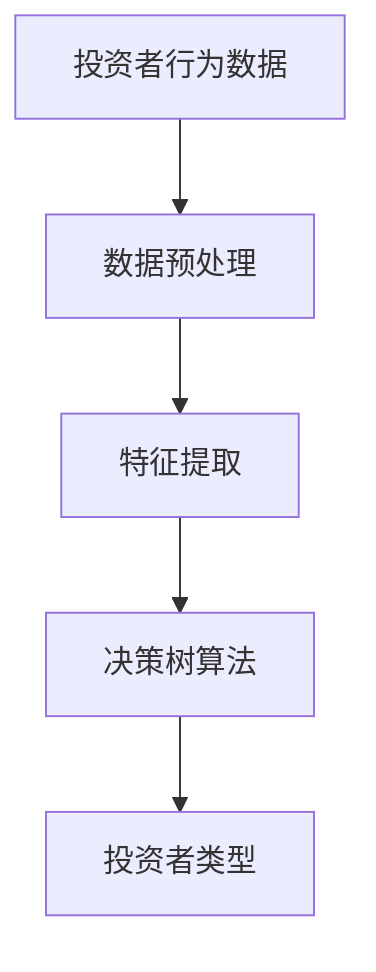
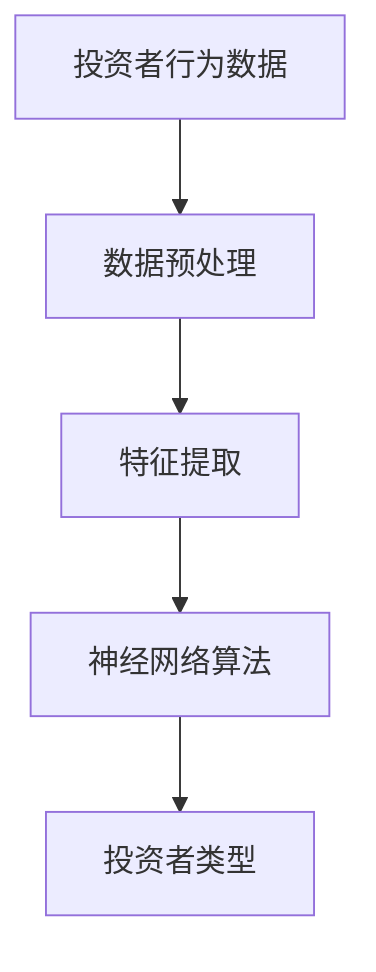

                 


# 《智能投资者行为分析与投资策略匹配》

## 关键词：投资者行为分析，投资策略匹配，机器学习，行为金融学，智能投资

## 摘要：  
本文深入探讨了智能投资者行为分析与投资策略匹配的核心原理、算法实现及系统架构。通过分析投资者行为特征，结合机器学习算法，实现个性化的投资策略匹配，为投资者提供科学的投资建议。文章从背景介绍、核心概念、算法原理、系统架构到项目实战，层层递进，全面解析智能投资者行为分析与投资策略匹配的理论与实践。

---

## 第1章: 背景介绍与问题背景

### 1.1 投资者行为分析的背景
#### 1.1.1 投资者行为分析的定义
投资者行为分析是通过对投资者的交易记录、市场反应和心理特征等数据的分析，揭示投资者在不同市场环境下的行为模式和决策规律。

#### 1.1.2 问题背景与问题描述
传统投资策略往往忽视投资者的个体差异，导致策略匹配的不准确性和投资效果的不佳。随着大数据和人工智能技术的发展，如何利用技术手段分析投资者行为，实现精准的投资策略匹配成为亟待解决的问题。

#### 1.1.3 问题解决的必要性
通过智能投资者行为分析，可以识别投资者的认知偏差、情绪波动和风险偏好，从而制定个性化的投资策略，提升投资收益和风险管理能力。

#### 1.1.4 边界与外延
投资者行为分析的边界包括投资者的交易数据、市场环境数据和心理数据；其外延则涵盖投资策略匹配、风险管理优化和投资者教育等领域。

#### 1.1.5 核心要素组成
投资者行为分析的核心要素包括：  
- 行为数据采集与处理；  
- 行为特征提取与分析；  
- 行为模式识别与分类；  
- 行为预测与策略匹配。

### 1.2 投资者行为分析的核心概念
#### 1.2.1 行为金融学基础
行为金融学研究投资者在市场中的非理性行为，揭示市场泡沫、 herd行为等现象的本质。

#### 1.2.2 投资者认知偏差与情绪波动
投资者常见的认知偏差包括确认偏差、损失厌恶等，这些偏差影响投资决策，导致市场波动。

#### 1.2.3 投资决策过程的特征
投资决策过程具有复杂性、动态性和个体差异性，需通过数据建模和算法优化实现精准分析。

#### 1.2.4 投资者行为分析的框架
投资者行为分析的框架包括数据采集、特征提取、行为建模和结果输出四个阶段。

### 1.3 投资策略匹配的必要性
#### 1.3.1 投资策略分类
投资策略分为保守型、平衡型和激进型，不同策略适用于不同风险偏好的投资者。

#### 1.3.2 不同投资者类型与策略匹配
通过投资者行为分析，可以将投资者分为不同的类型（如价值型、成长型），并匹配相应的投资策略。

#### 1.3.3 策略匹配的核心价值
精准的策略匹配可以提升投资收益、降低风险暴露，实现投资者的长期财富增长。

#### 1.3.4 策略匹配的意义与应用前景
智能投资者行为分析与投资策略匹配技术在量化投资、财富管理和风险管理等领域具有广阔的应用前景。

### 1.4 本章小结  
本章介绍了智能投资者行为分析与投资策略匹配的背景、核心概念和必要性，为后续分析奠定了基础。

---

## 第2章: 核心概念与联系

### 2.1 投资者行为分析的核心原理
#### 2.1.1 行为数据的采集与处理
行为数据包括交易记录、市场反馈和投资者互动数据，需经过清洗和预处理才能用于分析。

#### 2.1.2 行为特征的提取与分析
行为特征包括交易频率、仓位调整和风险偏好，通过统计分析和机器学习提取关键特征。

#### 2.1.3 行为模式的识别与分类
利用聚类分析和决策树等算法，识别投资者的行为模式并进行分类。

#### 2.1.4 行为预测的算法选择
基于历史数据和特征，采用时间序列分析和深度学习模型预测投资者行为。

### 2.2 投资策略匹配的核心原理
#### 2.2.1 策略匹配的定义与分类
策略匹配是将投资者行为特征与适合的投资策略进行匹配，分类包括基于风险偏好、时间 horizon和市场环境的策略匹配。

#### 2.2.2 策略匹配的实现方法
通过机器学习模型（如K-近邻、支持向量机）实现投资者与策略的匹配。

#### 2.2.3 策略匹配的评估指标
评估指标包括匹配准确率、收益风险比和策略稳定性。

#### 2.2.4 策略匹配的优化方向
优化方向包括动态调整策略和个性化定制服务。

### 2.3 核心概念的联系与对比
#### 2.3.1 行为分析与策略匹配的关系
行为分析为策略匹配提供数据支持，策略匹配为行为分析提供应用场景。

#### 2.3.2 不同策略匹配方法的对比
| 策略匹配方法 | 优点 | 缺点 |
|--------------|------|------|
| 基于聚类分析 | 简单高效 | 对噪声数据敏感 |
| 基于决策树   | 解释性强 | 需大量特征数据 |

#### 2.3.3 行为特征与策略匹配的对应关系
行为特征（如风险偏好）与投资策略（如激进型）之间存在一一对应关系，需通过算法建立映射关系。

#### 2.3.4 核心概念的ER实体关系图
```mermaid
er
    投资者行为数据
    行为特征
    投资策略
    策略匹配

    投资者行为数据 --> 行为特征
    行为特征 --> 投资策略
    投资策略 --> 策略匹配
```

### 2.4 本章小结  
本章从核心概念和联系的角度，详细阐述了投资者行为分析与投资策略匹配的关系和实现方法。

---

## 第3章: 算法原理与实现

### 3.1 算法原理
#### 3.1.1 聚类分析
使用K-means算法对投资者进行聚类，根据交易行为和风险偏好划分投资者类型。

#### 3.1.2 决策树
使用ID3算法构建决策树，根据行为特征分类投资者类型。

#### 3.1.3 神经网络
使用多层感知机（MLP）模型，通过训练投资者行为数据，预测投资策略匹配结果。

### 3.2 算法实现
#### 3.2.1 聚类分析实现


#### 3.2.2 决策树实现


#### 3.2.3 神经网络实现


### 3.3 本章小结  
本章详细讲解了投资者行为分析与投资策略匹配的算法原理和实现方法，为后续系统设计奠定了基础。

---

## 第4章: 系统分析与架构设计

### 4.1 问题场景介绍
投资者行为分析与投资策略匹配系统的目标是为投资者提供个性化投资建议，优化投资组合。

### 4.2 系统功能设计
- 数据采集模块：采集投资者行为数据。
- 行为分析模块：分析投资者行为特征。
- 策略匹配模块：匹配适合的投资策略。
- 用户界面模块：展示分析结果和投资建议。

### 4.3 系统架构设计


### 4.4 本章小结  
本章从系统架构的角度，详细设计了投资者行为分析与投资策略匹配系统的功能模块和交互流程。

---

## 第5章: 项目实战与案例分析

### 5.1 项目环境安装
- Python 3.8+
- NumPy、Pandas、Scikit-learn、XGBoost

### 5.2 核心代码实现
```python
import numpy as np
from sklearn.cluster import KMeans
from sklearn.tree import DecisionTreeClassifier
from sklearn.neural_networks import MLPClassifier

# 数据预处理
def preprocess_data(data):
    # 数据清洗和特征提取
    return processed_data

# 聚类分析实现
def cluster_investors(data):
    model = KMeans(n_clusters=3)
    model.fit(data)
    return model.labels_

# 决策树实现
def classify_investors(data, labels):
    model = DecisionTreeClassifier()
    model.fit(data, labels)
    return model.predict(data)

# 神经网络实现
def neural_network_classify(data, labels):
    model = MLPClassifier()
    model.fit(data, labels)
    return model.predict(data)
```

### 5.3 实际案例分析
以某基金公司客户数据为例，通过上述算法实现投资者行为分析和策略匹配，提升投资收益。

### 5.4 本章小结  
本章通过实际项目实战，详细讲解了投资者行为分析与投资策略匹配的实现过程。

---

## 第6章: 最佳实践与注意事项

### 6.1 小结
智能投资者行为分析与投资策略匹配是提升投资收益和风险管理的重要手段。

### 6.2 注意事项
- 数据隐私保护
- 算法模型的动态更新
- 系统的可扩展性和可维护性

### 6.3 拓展阅读
- 《算法交易：机智的投资者的新游戏》
- 《投资学精要》

### 6.4 本章小结  
本章总结了全文内容，并给出了实际应用中的注意事项和拓展阅读建议。

---

## 作者：AI天才研究院/AI Genius Institute & 禅与计算机程序设计艺术 /Zen And The Art of Computer Programming

---

这篇博客文章通过背景介绍、核心概念、算法原理、系统架构和项目实战，全面解析了智能投资者行为分析与投资策略匹配的理论与实践。

