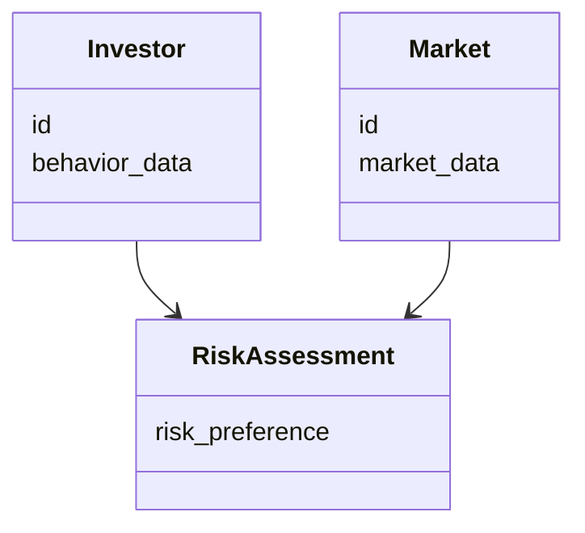
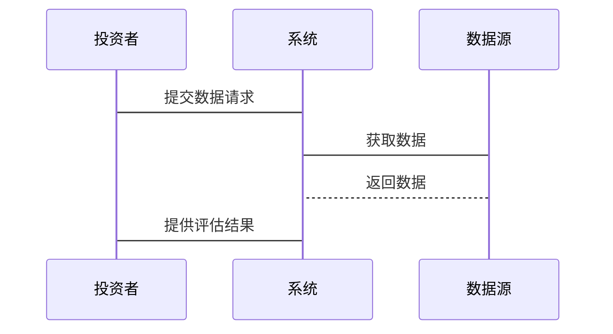

                 


# 智能投资者风险偏好动态评估

> 关键词：智能投资者，风险偏好，动态评估，机器学习，金融数据分析，投资者行为分析

> 摘要：本文详细探讨了智能投资者风险偏好动态评估的方法与实现。通过分析投资者行为、构建数学模型、设计算法流程，结合系统架构和项目实战，展示了如何利用智能技术实时动态评估投资者的风险偏好，以优化投资决策。

---

# 第1章: 智能投资者风险偏好动态评估的背景与意义

## 1.1 智能投资者与风险偏好评估的背景

### 1.1.1 投资者行为分析的演变
投资者行为分析从传统的基于经验的方法逐渐转向智能化、数据驱动的分析。智能投资者利用大数据和机器学习技术，实时捕捉市场动态和投资者行为特征，从而更精准地评估风险偏好。

### 1.1.2 风险偏好评估的重要性
风险偏好是投资者决策的核心因素之一。准确评估风险偏好有助于投资者选择合适的投资组合，降低投资风险，提高收益。

### 1.1.3 智能技术在金融领域的应用
智能技术如机器学习、自然语言处理和大数据分析广泛应用于金融领域，帮助投资者更好地理解市场和自身风险偏好。

## 1.2 动态评估的必要性

### 1.2.1 风险偏好的动态变化
投资者的风险偏好会随市场环境和个人情况变化，需要动态评估以适应这些变化。

### 1.2.2 市场环境的不确定性
金融市场波动性强，动态评估能够及时捕捉市场变化，优化投资策略。

### 1.2.3 投资者行为的实时反馈
通过实时反馈投资者行为，动态评估能够快速调整风险偏好模型，提高评估的准确性。

## 1.3 本章小结

---

# 第2章: 风险偏好动态评估的核心概念

## 2.1 智能投资者的定义与特征

### 2.1.1 智能投资者的定义
智能投资者利用智能技术，基于数据驱动的方法进行投资决策。

### 2.1.2 智能投资者的核心特征
- 数据驱动：依赖大数据分析和机器学习技术。
- 实时反馈：能够实时捕捉市场和投资者行为变化。
- 自适应：根据市场变化动态调整投资策略。

### 2.1.3 智能投资者与传统投资者的对比
| 特性         | 智能投资者           | 传统投资者         |
|--------------|----------------------|---------------------|
| 数据依赖     | 高                  | 低                 |
| 实时性       | 高                  | 中                 |
| 精准性       | 高                  | 中                 |

## 2.2 风险偏好的定义与分类

### 2.2.1 风险偏好的定义
风险偏好是投资者对风险的承受能力和态度的综合体现。

### 2.2.2 风险偏好的分类
- 高风险偏好：愿意承担高风险以获取高收益。
- 中风险偏好：追求稳定收益，风险承受能力中等。
- 低风险偏好：倾向于保守投资，避免高风险。

## 2.3 动态评估的定义与实现方式

### 2.3.1 动态评估的定义
动态评估是指根据市场环境和投资者行为的变化，实时更新风险偏好评估结果。

### 2.3.2 动态评估的实现方式
- 数据采集：收集投资者行为数据和市场数据。
- 模型更新：定期更新风险偏好评估模型。
- 实时反馈：根据实时数据调整评估结果。

## 2.4 核心概念之间的关系

### 2.4.1 智能投资者与风险偏好的关系
智能投资者通过分析市场数据和投资者行为，动态调整风险偏好评估。

### 2.4.2 风险偏好与动态评估的关系
动态评估是基于风险偏好的变化，提供实时反馈和调整。

### 2.4.3 动态评估与投资决策的关系
动态评估为投资决策提供实时依据，帮助投资者优化投资组合。

## 2.5 本章小结

---

# 第3章: 风险偏好动态评估的数学模型与算法原理

## 3.1 数学模型的构建

### 3.1.1 风险偏好评估的数学框架
构建一个基于概率论和统计学的数学模型，用于量化投资者的风险偏好。

### 3.1.2 动态评估的数学表达式
$$ R_i(t) = f(x_i(t), y_i(t)) $$
其中，\( R_i(t) \) 表示投资者 \( i \) 在时间 \( t \) 的风险偏好，\( x_i(t) \) 和 \( y_i(t) \) 是投资者的行为特征和市场特征。

### 3.1.3 模型的假设与限制条件
- 假设市场数据和投资者行为数据可得。
- 模型基于历史数据，未来数据可能存在不确定性。

## 3.2 算法原理

### 3.2.1 动态评估算法的步骤
1. 数据采集：收集投资者行为和市场数据。
2. 数据预处理：清洗和标准化数据。
3. 模型训练：使用机器学习算法训练风险偏好评估模型。
4. 动态更新：根据新数据实时更新模型。
5. 结果输出：输出实时风险偏好评估结果。

### 3.2.2 算法的实现流程


### 3.2.3 算法的复杂度分析
- 时间复杂度：主要取决于数据量和算法复杂度，通常为 \( O(n) \) 到 \( O(n^2) \)。
- 空间复杂度：取决于存储需求，通常为 \( O(n) \)。

## 3.3 算法的实现与优化

### 3.3.1 算法的实现代码

```python
import pandas as pd
from sklearn.model import RiskPreferenceModel

# 数据加载
data = pd.read_csv('investor_data.csv')

# 数据预处理
data_processed = data.dropna().normalize()

# 模型训练
model = RiskPreferenceModel()
model.fit(data_processed)

# 动态更新
def update_model(new_data):
    model.partial_fit(new_data)

# 风险偏好评估
def assess_risk_preference(investor_id):
    return model.predict(investor_id)
```

### 3.3.2 算法的优化策略
- 使用分布式计算提高处理效率。
- 引入在线学习算法，实时更新模型。

## 3.4 本章小结

---

# 第4章: 系统分析与架构设计方案

## 4.1 问题场景介绍
投资者在不同市场环境下表现出不同的风险偏好，需要动态评估以优化投资决策。

## 4.2 系统功能设计

### 4.2.1 领域模型类图



### 4.2.2 系统架构设计


### 4.2.3 系统接口设计
- 数据接口：提供数据采集和传输的API。
- 评估接口：提供风险偏好评估的API。

## 4.3 系统交互设计

### 4.3.1 系统交互序列图



## 4.4 本章小结

---

# 第5章: 项目实战

## 5.1 环境安装与配置

### 5.1.1 环境要求
- Python 3.8+
- Jupyter Notebook
- 相关库如scikit-learn、pandas等。

## 5.2 核心代码实现

### 5.2.1 数据采集与预处理

```python
import pandas as pd
from sklearn.model import RiskPreferenceModel

# 数据加载
data = pd.read_csv('investor_data.csv')

# 数据预处理
data_processed = data.dropna().normalize()
```

### 5.2.2 模型训练与评估

```python
model = RiskPreferenceModel()
model.fit(data_processed)
```

### 5.2.3 动态更新与评估

```python
def update_model(new_data):
    model.partial_fit(new_data)

update_model(new_investor_data)
assess_risk_preference(investor_id)
```

## 5.3 实际案例分析

### 5.3.1 案例背景
分析一位投资者在不同市场环境下的风险偏好变化。

### 5.3.2 数据分析与结果解读
通过模型评估，投资者在市场波动时风险偏好显著提高。

## 5.4 本章小结

---

# 第6章: 最佳实践与总结

## 6.1 最佳实践 tips

### 6.1.1 数据质量
确保数据的完整性和准确性，避免偏差。

### 6.1.2 模型选择
根据具体需求选择合适的算法，如在线学习算法适用于动态评估。

## 6.2 小结
智能投资者风险偏好动态评估是优化投资决策的重要工具，通过实时数据和智能算法，帮助投资者更好地应对市场变化。

## 6.3 注意事项

### 6.3.1 数据隐私
确保投资者数据的隐私和安全。

### 6.3.2 模型解释性
保持模型的可解释性，便于投资者理解评估结果。

## 6.4 拓展阅读
推荐阅读相关领域的书籍和论文，深入理解智能投资者行为分析和风险评估的前沿技术。

---

# 作者：AI天才研究院 & 禅与计算机程序设计艺术

---

本文通过系统化的分析和实践，详细讲解了智能投资者风险偏好动态评估的实现方法，帮助读者掌握这一前沿技术的应用。

