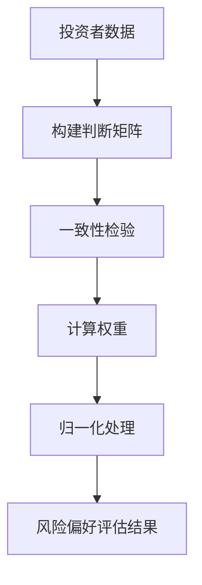
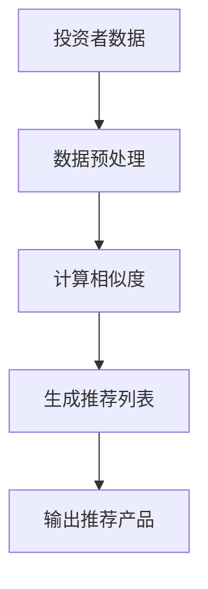
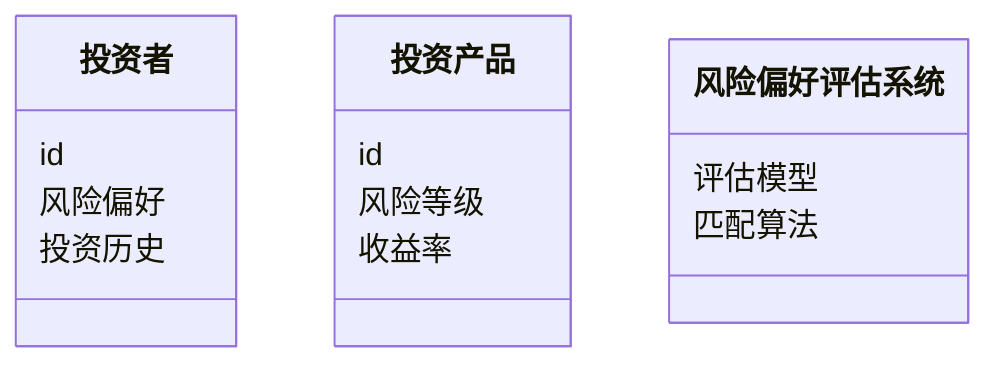
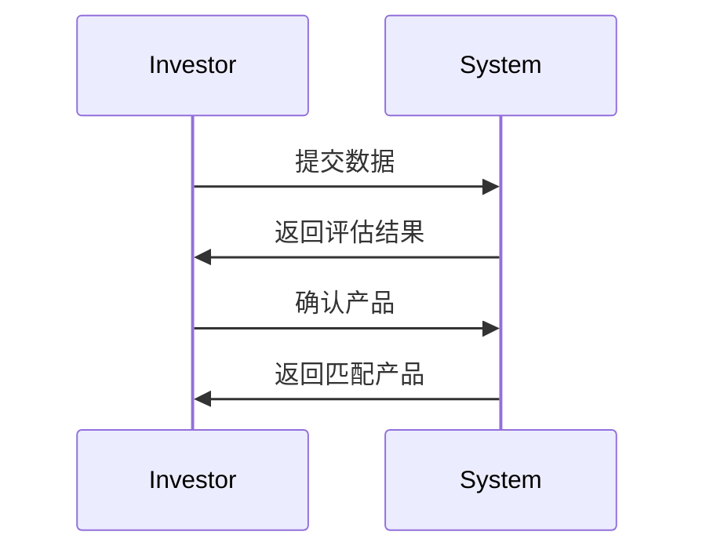

                 


# 智能投资者风险偏好动态评估与产品匹配

## 关键词：
- 智能投资者
- 风险偏好
- 动态评估
- 产品匹配
- 人工智能
- 金融系统
- 智能推荐

## 摘要：
本文探讨了智能投资者风险偏好动态评估与产品匹配的核心问题，提出了基于人工智能的解决方案。通过层次分析法和协同过滤推荐系统，实现投资者风险偏好评估和产品匹配的智能化。文章详细分析了算法原理、系统架构，并通过案例展示了实际应用，强调了动态评估的必要性和智能匹配的优势。

---

## 第1章: 智能投资者风险偏好动态评估与产品匹配概述

### 1.1 投资者风险偏好评估的背景与意义

#### 1.1.1 投资者行为分析的必要性
投资者的行为受多种因素影响，如市场波动、个人情绪等。通过分析投资者的行为，可以揭示其风险偏好，帮助制定个性化的投资策略。

#### 1.1.2 风险偏好评估的传统方法与局限性
传统方法依赖投资者的自我报告或历史数据，存在主观性和滞后性。随着市场的动态变化，静态评估难以捕捉投资者的实时偏好。

#### 1.1.3 智能评估的优势与应用场景
智能评估利用机器学习和大数据分析，实时捕捉投资者行为数据，动态调整风险偏好评估，适用于个性化投资建议和风险管理。

### 1.2 问题背景与描述

#### 1.2.1 投资者决策中的不确定性
市场不确定性增加，投资者需要灵活调整策略，传统静态评估难以满足需求。

#### 1.2.2 风险偏好动态变化的特征
投资者的风险偏好会随市场环境和个人情况变化，需动态评估。

#### 1.2.3 产品匹配的核心问题
如何根据投资者的动态风险偏好推荐合适的产品，是当前面临的主要挑战。

### 1.3 问题解决与边界

#### 1.3.1 智能评估的核心目标
通过实时数据分析，动态评估投资者风险偏好，优化产品匹配。

#### 1.3.2 边界与外延
系统仅关注投资者的财务数据和行为，不涉及其他个人信息。

#### 1.3.3 核心要素与组成结构
系统包括数据采集、评估模型、匹配算法和反馈机制四个部分。

---

## 第2章: 智能投资者风险偏好评估的核心概念

### 2.1 智能投资者的定义与特征

#### 2.1.1 智能投资者的定义
智能投资者利用AI技术优化决策，实现投资组合的动态调整。

#### 2.1.2 智能投资者的核心特征
- 数据驱动：依赖实时数据进行决策。
- 自适应性：根据市场变化调整策略。
- 个性化：提供定制化投资方案。

### 2.2 风险偏好的属性与特征

#### 2.2.1 风险偏好的属性分析
- 风险厌恶程度
- 风险中性和风险寻求程度

#### 2.2.2 风险偏好的特征对比
| 特征 | 风险厌恶 | 风险中性 | 风险寻求 |
|------|----------|----------|----------|
| 投资偏好 | 低风险 | 中风险 | 高风险 |

### 2.3 产品匹配的实体关系图

```mermaid
er
actor: 投资者
actor: 风险偏好评估系统
actor: 投资产品
```

---

## 第3章: 智能投资者风险偏好动态评估与产品匹配的核心算法

### 3.1 层次分析法（AHP）评估风险偏好

#### 3.1.1 AHP的基本原理
通过构建判断矩阵，计算权重，评估风险偏好。

#### 3.1.2 计算步骤
1. 构建判断矩阵。
2. 计算一致性检验。
3. 计算权重并归一化。

#### 3.1.3 算法流程图



### 3.2 协同过滤推荐系统

#### 3.2.1 协同过滤的原理
基于用户行为数据，计算相似性，推荐产品。

#### 3.2.2 相似度计算
使用余弦相似度。

#### 3.2.3 推荐算法流程图



### 3.3 算法实现的Python代码

```python
import numpy as np

def calculate_preference(matrix):
    # 计算一致性检验
    n = len(matrix)
    max_values = np.max(matrix, axis=1)
    consistency = np.sum(max_values) / n
    return consistency

# 示例判断矩阵
preference_matrix = np.array([[1, 2, 3],
                                [1/2, 1, 2],
                                [1/3, 1/2, 1]])

consistency = calculate_preference(preference_matrix)
print("一致性检验结果:", consistency)
```

---

## 第4章: 数学模型与公式

### 4.1 层次分析法的数学模型

$$一致性检验：CR = (最大特征值 - n) / (n - 1)$$

### 4.2 协同过滤的数学模型

$$相似度计算：cos(theta) = \frac{\sum x_i y_i}{\sqrt{\sum x_i^2} \sqrt{\sum y_i^2}}$$

### 4.3 预测评分公式

$$\hat{r}_{u,i} = \bar{r} + (r_u - \bar{r}) \cdot \frac{k}{k + |N(u) \cap N(i)|}$$

---

## 第5章: 系统分析与架构设计

### 5.1 系统场景介绍

#### 5.1.1 数据来源
- 市场数据：股票、基金等。
- 用户行为数据：交易记录、互动数据。

### 5.2 系统功能设计

#### 5.2.1 领域模型设计



### 5.3 系统架构设计


### 5.4 接口设计与交互流程

#### 5.4.1 API接口

```http
GET /api/preferences?id=123
POST /api/match-products
```

#### 5.4.2 交互流程图



---

## 第6章: 项目实战

### 6.1 环境安装

#### 6.1.1 安装Python和库
```bash
pip install numpy scikit-learn
```

### 6.2 核心代码实现

#### 6.2.1 评估模型实现

```python
from sklearn.metrics.pairwise import cosine_similarity

def calculate_similarity(matrix):
    return cosine_similarity(matrix)

# 示例数据
data = np.array([[1, 0, 0], [0, 1, 0], [0, 0, 1]])
similarity_matrix = calculate_similarity(data)
print(similarity_matrix)
```

### 6.3 实际案例分析

#### 6.3.1 案例介绍
投资者张三，过去的投资行为显示风险厌恶，但近期市场波动加大，其风险偏好可能变化。

#### 6.3.2 系统评估与匹配
系统动态调整张三的评估，推荐中风险产品。

---

## 第7章: 总结与展望

### 7.1 方法创新性与实用性
智能评估方法提高了风险偏好评估的准确性和及时性，优化了产品匹配效率。

### 7.2 当前挑战与未来方向
数据隐私、模型优化、实时性提升是未来需要解决的问题。

### 7.3 小结
本文提出了基于人工智能的智能投资者风险偏好动态评估与产品匹配的方法，具有重要的理论和实践意义。

---

## 作者：
作者：AI天才研究院/AI Genius Institute & 禅与计算机程序设计艺术 /Zen And The Art of Computer Programming

---

这篇文章详细探讨了智能投资者风险偏好动态评估与产品匹配的核心问题，通过理论分析、算法实现和实际案例，展示了如何利用人工智能技术优化投资决策。希望对读者有所帮助！

