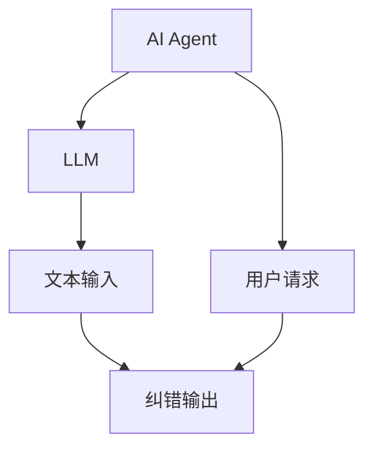
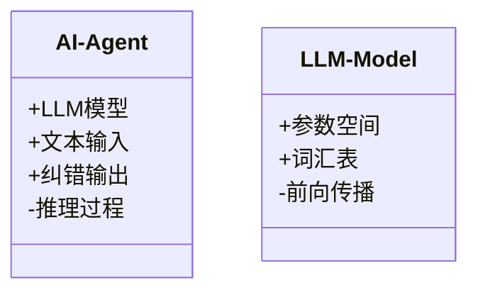
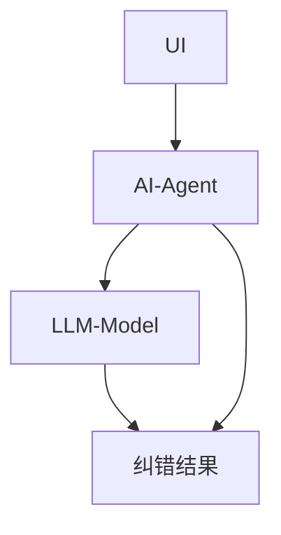

                 


# 目录大纲：《智能文本纠错 AI Agent：LLM 驱动的语法检查系统》

---

## 第一部分：背景介绍

### 第1章：智能文本纠错与AI Agent概述

#### 1.1 问题背景
- 1.1.1 自然语言处理中的文本纠错问题
- 1.1.2 AI Agent在文本纠错中的作用

#### 1.2 问题描述
- 1.2.1 文本纠错的核心挑战
- 1.2.2 AI Agent在语法检查中的应用范围

#### 1.3 问题解决
- 1.3.1 LLM驱动的文本纠错方法
- 1.3.2 AI Agent如何辅助语法检查

#### 1.4 边界与外延
- 1.4.1 文本纠错的边界条件
- 1.4.2 AI Agent的外延应用

#### 1.5 核心概念结构与组成
- 1.5.1 LLM与AI Agent的关系
- 1.5.2 系统的核心要素分析

---

## 第二部分：核心概念与联系

### 第2章：AI Agent与LLM的核心原理

#### 2.1 AI Agent的基本原理
- 2.1.1 AI Agent的定义与特点
- 2.1.2 AI Agent的决策机制

#### 2.2 LLM的基本原理
- 2.2.1 大语言模型的定义与特点
- 2.2.2 LLM的训练与推理过程

#### 2.3 AI Agent与LLM的关系
- 2.3.1 LLM作为AI Agent的核心驱动力
- 2.3.2 AI Agent如何利用LLM进行文本纠错

#### 2.4 核心概念对比分析
- 2.4.1 AI Agent与传统文本纠错工具的对比
- 2.4.2 LLM与其他NLP模型的对比

#### 2.5 实体关系图


---

## 第三部分：算法原理

### 第3章：LLM驱动的文本纠错算法

#### 3.1 LLM的训练过程
- 3.1.1 基于Transformer的模型结构
- 3.1.2 预训练任务与损失函数
  $$ \text{Loss} = -\sum_{i=1}^{n} \text{log} p(y_i|x_i) $$

#### 3.2 文本纠错的算法流程
- 3.2.1 输入预处理
- 3.2.2 模型推理
- 3.2.3 输出后处理

#### 3.3 数学模型与公式
- 3.3.1 概率语言模型
- 3.3.2 编辑距离计算
  $$ \text{Edit Distance}(s_1, s_2) = \min(\text{替换}, \text{插入}, \text{删除}) $$

---

## 第四部分：系统分析与架构设计

### 第4章：系统架构设计

#### 4.1 系统工作流程
- 4.1.1 用户输入文本
- 4.1.2 AI Agent接收请求
- 4.1.3 LLM进行文本纠错
- 4.1.4 返回结果

#### 4.2 系统功能设计
- 4.2.1 领域模型类图


#### 4.3 系统架构图


#### 4.4 系统接口设计
- 4.4.1 接口定义
- 4.4.2 接口交互流程
```mermaid
sequenceDiagram
    用户->>+AI-Agent: 提交文本
    AI-Agent->>LLM-Model: 请求纠错
    LLM-Model->>-AI-Agent: 返回结果
    AI-Agent->>-用户: 显示结果
```

---

## 第五部分：项目实战

### 第5章：LLM驱动的语法检查系统实现

#### 5.1 环境安装
- 5.1.1 安装Python
- 5.1.2 安装相关库（如Transformers、Flask）

#### 5.2 核心代码实现
- 5.2.1 导入库和模型
  ```python
  from transformers import AutoTokenizer, AutoModelForCausalLM
  model_name = "gpt2"
  tokenizer = AutoTokenizer.from_pretrained(model_name)
  model = AutoModelForCausalLM.from_pretrained(model_name)
  ```
- 5.2.2 定义纠错函数
  ```python
  def text_correction(text):
      inputs = tokenizer(text, return_tensors="pt")
      outputs = model.generate(inputs.input_ids, max_length=50)
      return tokenizer.decode(outputs[0], skip_special_tokens=True)
  ```

#### 5.3 代码解读与分析
- 5.3.1 输入预处理
- 5.3.2 模型推理
- 5.3.3 输出后处理

#### 5.4 案例分析
- 5.4.1 实际案例
- 5.4.2 解读结果

#### 5.5 项目小结
- 5.5.1 项目总结
- 5.5.2 可能遇到的问题及解决方案

---

## 第六部分：最佳实践

### 第6章：智能文本纠错系统的优化与应用

#### 6.1 小结
- 6.1.1 核心知识点回顾
- 6.1.2 系统设计的关键点

#### 6.2 注意事项
- 6.2.1 模型选择的重要性
- 6.2.2 数据预处理的注意事项
- 6.2.3 系统性能优化

#### 6.3 拓展阅读
- 6.3.1 推荐的书籍和论文
- 6.3.2 相关技术博客和资源

---

## 作者：AI天才研究院 & 禅与计算机程序设计艺术

---

通过以上目录大纲，读者可以系统地学习从理论到实践的智能文本纠错AI Agent的开发与应用过程，涵盖技术原理、系统架构、项目实现等多个方面，帮助读者深入理解并掌握相关技术。

