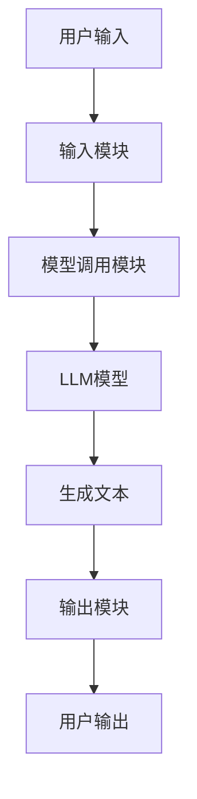
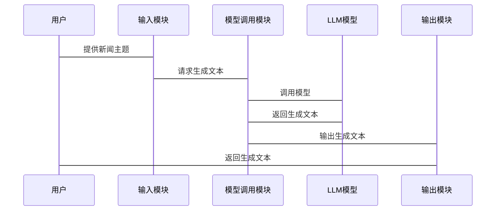

                 


# 智能新闻写作 AI Agent：LLM 辅助新闻报道生成

---

## 关键词
智能新闻写作, LLM, 新闻生成, 自然语言处理, AI写作工具, 大语言模型

---

## 摘要
随着人工智能技术的迅速发展，新闻行业正在经历一场深刻的变革。传统的新闻写作依赖于人类记者的创造力和专业知识，但效率和质量的瓶颈日益显现。大语言模型（LLM，Large Language Model）的出现为新闻行业带来了新的可能性。本文将探讨如何利用LLM辅助新闻报道的生成，分析其核心原理、系统架构以及实际应用，帮助读者全面理解智能新闻写作AI Agent的技术本质和价值。

---

## 第一部分：智能新闻写作的背景与挑战

### 第1章：智能新闻写作的背景与问题背景

#### 1.1 传统新闻写作的挑战
- **新闻写作的基本流程与特点**
  - 新闻写作是一个复杂的过程，包括选题、采访、素材收集、内容组织和语言表达。
  - 传统新闻写作依赖记者的经验和判断，容易受到主观因素的影响。
  - 人工写作的效率有限，尤其是在高频率、多领域的新闻报道中，难以满足市场需求。

- **LLM如何改变新闻行业**
  - LLM能够快速生成高质量的新闻内容，显著提高写作效率。
  - 通过自然语言处理技术，LLM可以自动提取关键信息并组织成文。
  - LLM的可扩展性使其能够支持多种语言和领域，满足全球化的新闻需求。

- **LLM辅助新闻写作的核心价值**
  - 提高新闻生产的效率和质量。
  - 降低新闻生产的人力成本。
  - 为记者提供辅助工具，帮助他们专注于深度报道和创意写作。

---

### 第2章：LLM辅助新闻写作的核心概念

#### 2.1 LLM的定义与特点
- **大语言模型的定义**
  - LLM是一种基于深度学习的自然语言处理模型，能够理解和生成人类语言。
  - 通过大规模的数据训练，LLM掌握了丰富的语言知识和语义信息。

- **LLM的特点**
  - **大规模训练**：基于海量数据的预训练，使得模型具有广泛的知识覆盖。
  - **生成能力**：能够根据输入生成连贯、合理的文本。
  - **可微调性**：通过微调（Fine-tuning），模型可以适应特定领域的任务需求。

- **LLM与新闻写作的契合点**
  - LLM擅长处理文本数据，适合新闻这种高度依赖语言的领域。
  - 新闻写作需要结构化的内容，LLM可以通过微调掌握新闻写作的模式。

---

## 第二部分：LLM辅助新闻写作的核心原理

### 第3章：LLM的训练与生成机制

#### 3.1 LLM的训练过程
- **预训练阶段**
  - 使用大规模通用数据进行无监督学习。
  - 目标是让模型掌握语言的基本规律和语义信息。

- **微调阶段**
  - 在预训练的基础上，针对特定任务（如新闻写作）进行有监督微调。
  - 通过新闻领域的数据进一步优化模型的生成能力。

- **生成机制**
  - **解码过程**：模型通过解码器将输入的提示生成输出文本。
  - **概率分布**：模型基于概率分布选择最可能的词，生成连贯的文本。
  - **采样策略**：通过温度和Top-k采样，控制生成结果的多样性和质量。

---

### 第4章：LLM在新闻写作中的应用

#### 4.1 新闻写作任务分解
- **标题生成**：根据新闻主题生成吸引人的标题。
- **导语写作**：基于新闻事实写出引人入胜的导语。
- **正文生成**：根据结构化数据生成详细的内容。
- **语言优化**：对生成的文本进行润色，使其更符合新闻风格。

#### 4.2 LLM的新闻写作模型设计
- **输入格式**：明确模型的输入格式，例如标题、关键词、事实数据等。
- **输出格式**：定义输出文本的结构，例如标题、导语、正文和结尾。
- **领域适应**：通过微调让模型适应新闻领域的语言风格和写作规范。

---

## 第三部分：系统架构与实现

### 第5章：智能新闻写作系统的架构设计

#### 5.1 系统功能设计
- **输入模块**：接收用户的输入，例如新闻主题、关键词和事实数据。
- **模型调用模块**：调用LLM进行文本生成。
- **输出模块**：将生成的文本输出，并提供给用户。

#### 5.2 系统架构图


#### 5.3 接口设计
- **API接口**：提供RESTful API，供其他系统调用。
- **输入格式**：支持JSON格式，包含新闻主题、关键词和事实数据。
- **输出格式**：支持JSON或文本格式，返回生成的新闻内容。

#### 5.4 交互流程


---

### 第6章：项目实战

#### 6.1 环境安装
```bash
pip install transformers
pip install torch
```

#### 6.2 核心实现代码
```python
from transformers import pipeline

# 初始化LLM模型
model = pipeline('text-generation', model='gpt2')
```

#### 6.3 代码解读
- **模型加载**：使用`transformers`库加载预训练的GPT-2模型。
- **文本生成**：通过`generate`方法生成新闻内容。

#### 6.4 案例分析
- **输入**：新闻主题“全球气候变化会议达成新协议”
- **生成**：模型生成详细的新闻正文，包括导语、正文和结尾。

---

## 第四部分：最佳实践与小结

### 第7章：最佳实践与注意事项

#### 7.1 最佳实践
- **选择合适的模型**：根据需求选择预训练模型或微调模型。
- **优化生成结果**：通过调整温度和Top-k参数，控制生成文本的质量。
- **结合人工审核**：生成的文本需要人工审核，确保准确性和客观性。

#### 7.2 注意事项
- **模型的局限性**：LLM可能会生成不准确或不合理的文本，需要结合事实验证。
- **数据隐私问题**：处理敏感信息时，需要注意数据的安全性和隐私性。

---

## 结语

智能新闻写作AI Agent的出现，标志着新闻行业正在向智能化方向迈进。通过LLM技术，我们可以显著提高新闻写作的效率和质量，同时降低人力成本。然而，AI写作工具并不是要取代人类记者，而是为他们提供强大的辅助工具，帮助他们更好地完成新闻报道。未来，随着技术的不断进步，智能新闻写作AI Agent将在新闻行业中发挥更大的作用。

---

## 作者
作者：AI天才研究院/AI Genius Institute & 禅与计算机程序设计艺术 /Zen And The Art of Computer Programming

