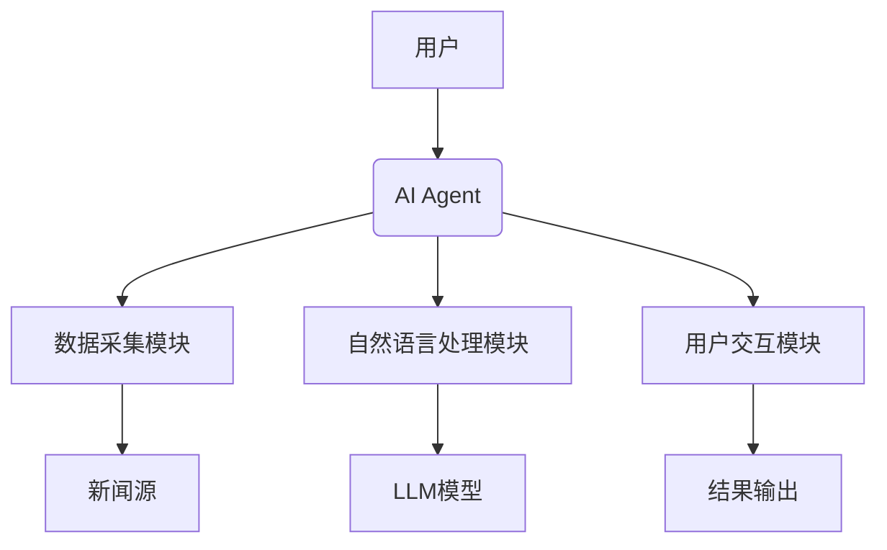

                 


# 智能新闻聚合AI Agent：LLM驱动的信息整合与分析

> **关键词**：智能新闻聚合，AI Agent，大语言模型（LLM），信息整合，新闻分析

> **摘要**：随着信息爆炸的时代到来，传统新闻聚合方式难以满足用户需求。基于大语言模型（LLM）的智能新闻聚合AI Agent，通过自然语言处理技术，实现高效的信息整合与分析。本文详细阐述了智能新闻聚合AI Agent的核心概念、算法原理、系统架构设计及实际应用案例，为读者提供全面的技术解析。

---

## 第一部分：智能新闻聚合的背景与概念

### 第1章：智能新闻聚合的背景与问题背景

#### 1.1 传统新闻聚合的局限性

新闻聚合是指将多个来源的信息整合到一个平台上，以便用户方便地获取所需信息。传统新闻聚合面临以下问题：

1. **信息过载**：用户面对海量信息，难以快速找到所需内容。
2. **内容质量参差不齐**：不同来源的信息可能存在重复或不一致的情况。
3. **缺乏个性化**：传统聚合方式难以根据用户偏好提供定制化内容。

#### 1.2 AI代理的兴起

AI代理是一种能够感知环境并采取行动以实现目标的智能系统。其在新闻聚合中的优势包括：

1. **自动化处理**：AI代理能够自动采集、分析和整合信息。
2. **智能推荐**：通过用户行为分析，提供个性化推荐。
3. **实时更新**：能够实时跟踪新闻动态，及时更新内容。

#### 1.3 LLM驱动的新闻聚合

大语言模型（LLM）通过深度学习技术，能够理解上下文并生成自然语言文本。其在新闻聚合中的应用包括：

1. **文本生成**：根据用户查询生成摘要或新闻稿。
2. **内容摘要**：自动提取新闻要点，提供简洁的摘要。
3. **内容分类与聚类**：基于主题或关键词对新闻进行分类。

---

## 第二部分：智能新闻聚合AI Agent的核心概念

### 第2章：智能新闻聚合AI Agent的核心概念

#### 2.1 智能新闻聚合AI Agent的定义

智能新闻聚合AI Agent是一种基于大语言模型的智能系统，能够自动采集、分析和整合新闻信息，并根据用户需求提供个性化服务。

**核心要素**：
- **数据采集模块**：负责从多个新闻源采集信息。
- **自然语言处理模块**：对采集的信息进行理解和分析。
- **用户交互模块**：根据用户需求提供定制化服务。

#### 2.2 AI Agent与LLM的协同工作

AI Agent通过调用大语言模型来实现文本生成、摘要和分类功能。两者的协同过程如下：

1. **数据输入**：用户输入查询或关键词。
2. **LLM处理**：LLM对输入进行分析，生成相关内容。
3. **结果输出**：AI Agent将生成的内容返回给用户。

#### 2.3 实体关系与概念结构

以下通过ER图展示智能新闻聚合系统中的实体关系：

```mermaid
er
actor: 用户
agent: AI Agent
news_source: 新闻源
news_article: 新闻文章
summary: 摘要
keywords: 关键词
```

用户通过AI Agent查询新闻，系统从新闻源采集文章，并生成摘要和关键词。

---

## 第三部分：智能新闻聚合AI Agent的算法原理

### 第3章：大语言模型（LLM）的算法原理

#### 3.1 LLM的基本原理

大语言模型基于Transformer架构，包括编码器和解码器两个部分：

1. **编码器**：将输入文本转换为上下文表示。
2. **解码器**：根据编码器的输出生成目标文本。

**注意力机制**是Transformer的核心，公式如下：

$$
\text{Attention}(Q, K, V) = \text{softmax}\left(\frac{QK^T}{\sqrt{d_k}}\right)V
$$

其中，$Q$、$K$、$V$分别是查询、键和值矩阵，$d_k$是键的维度。

#### 3.2 智能新闻聚合中的LLM应用

在新闻聚合中，LLM用于以下任务：

1. **文本生成**：根据用户输入生成新闻摘要。
2. **文本摘要**：提取新闻文章的关键信息。
3. **内容分类与聚类**：根据主题或关键词对新闻进行分类。

---

## 第四部分：智能新闻聚合AI Agent的系统分析与架构设计

### 第4章：系统分析与架构设计

#### 4.1 问题场景介绍

智能新闻聚合系统需要解决以下问题：

1. **多源数据采集**：从多个新闻源获取信息。
2. **高效处理**：快速分析大量数据并生成摘要。
3. **个性化服务**：根据用户需求提供定制化内容。

#### 4.2 系统功能设计

**系统功能模块**：

1. **数据采集模块**：负责从新闻网站、API等来源采集新闻数据。
2. **自然语言处理模块**：对采集的数据进行分词、实体识别等处理。
3. **用户交互模块**：根据用户输入生成摘要或推荐内容。

**功能流程**：

1. 用户输入查询关键词。
2. 系统从新闻源采集相关信息。
3. LLM对采集的信息进行处理并生成摘要。
4. 系统将结果返回给用户。

#### 4.3 系统架构设计

以下是系统的总体架构图：



---

## 第五部分：项目实战与优化建议

### 第5章：项目实战

#### 5.1 环境安装

安装所需的库：

```bash
pip install transformers
pip install requests
pip install beautifulsoup4
```

#### 5.2 核心代码实现

以下是数据采集和摘要生成的代码示例：

```python
from transformers import pipeline
import requests
from bs4 import BeautifulSoup

# 初始化模型
summarizer = pipeline("summarization", model="facebook/bart-large-cnn")

# 数据采集
def fetch_news(url):
    response = requests.get(url)
    soup = BeautifulSoup(response.text, 'html.parser')
    title = soup.title.text
    content = soup.find('div', {'class': 'article-content'}).text
    return title, content

# 摘要生成
def generate_summary(title, content):
    inputs = [f"标题：{title}\n内容：{content}"]
    summary = summarizer(inputs, max_length=100, min_length=50, do_xla=0)
    return summary[0]['summary_text']

title, content = fetch_news("http://example.com/news")
summary = generate_summary(title, content)
print(summary)
```

#### 5.3 案例分析

以某新闻网站为例，展示系统如何从多个来源采集信息并生成摘要。

---

## 第六部分：总结与展望

### 第6章：总结与展望

智能新闻聚合AI Agent通过大语言模型实现了高效的信息整合与分析，解决了传统聚合方式的诸多问题。未来，随着LLM技术的不断发展，智能新闻聚合系统将更加智能化和个性化，为用户提供更优质的服务。

---

**作者：AI天才研究院 & 禅与计算机程序设计艺术**

