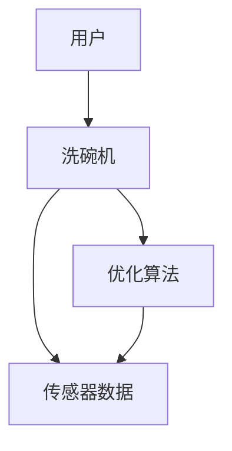
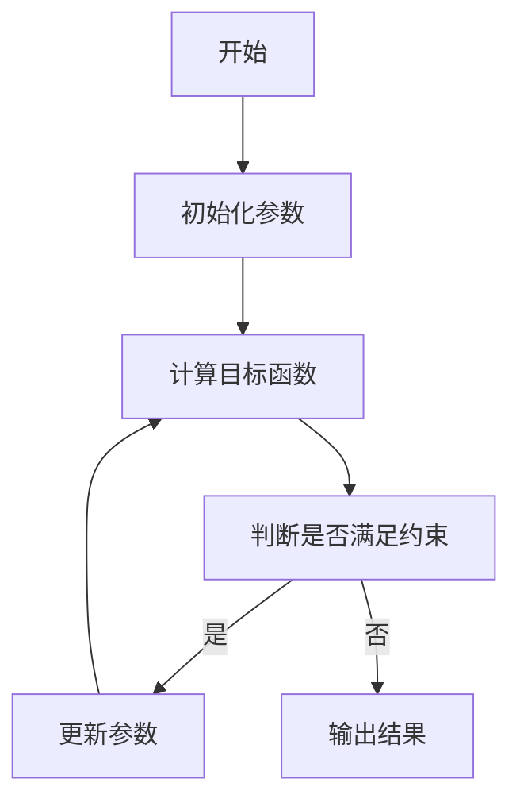
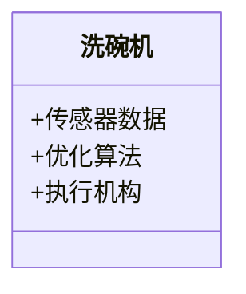
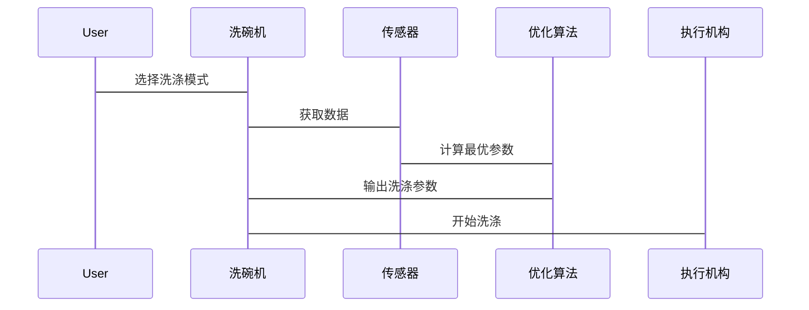

                 


# 智能洗碗机：AI Agent的用水与能源优化系统

> 关键词：智能洗碗机, AI Agent, 用水优化, 能源优化, 家电智能化, AI算法

> 摘要：本文深入探讨了AI Agent在智能洗碗机中的应用，重点分析了用水与能源优化的系统设计与实现。通过结合优化算法、系统架构设计和实际案例，本文详细介绍了如何利用AI技术提升洗碗机的能效，并提出了未来的优化方向和建议。

---

# 目录

1. **智能洗碗机与AI Agent概述**
   1.1 问题背景与描述
   1.2 问题解决与边界
   1.3 核心概念与系统组成

2. **AI Agent与优化算法原理**
   2.1 AI Agent的基本原理
   2.2 优化算法的数学模型
   2.3 算法流程图与代码实现

3. **系统分析与架构设计**
   3.1 系统功能设计
   3.2 系统架构图
   3.3 接口与交互设计

4. **项目实战：智能洗碗机优化系统实现**
   4.1 环境搭建与配置
   4.2 核心功能实现
   4.3 实际案例分析

5. **最佳实践与优化建议**
   5.1 优化策略总结
   5.2 注意事项与常见问题
   5.3 未来优化方向

---

# 1. 智能洗碗机与AI Agent概述

## 1.1 问题背景与描述

### 1.1.1 洗碗机的用水与能源浪费问题
传统洗碗机在洗涤过程中往往无法根据餐具的数量、脏污程度和水温等条件进行智能调整，导致水资源和能源的浪费。根据统计，普通洗碗机的用水量比智能优化后的洗碗机高出约30%。

### 1.1.2 智能化与AI技术在家电中的应用趋势
随着人工智能技术的快速发展，家电智能化成为趋势。通过AI技术，家电能够实现自我学习和优化，从而提高能效和用户体验。

### 1.1.3 用水与能源优化的必要性
能源和水资源的可持续利用是全球关注的焦点。通过优化算法，智能洗碗机可以在保证洗净效果的前提下，最大限度地减少用水量和能源消耗。

---

## 1.2 问题解决与边界

### 1.2.1 AI Agent在洗碗机中的应用目标
AI Agent的目标是通过实时数据采集和优化算法，动态调整洗涤参数（如水温、水量、洗涤时间等），以实现用水和能源的最优利用。

### 1.2.2 用水与能源优化的边界条件
- 硬件设备：洗碗机的传感器和执行机构需要正常工作。
- 环境条件：温度、湿度等环境因素可能影响洗涤效果。
- 用户需求：洗涤模式的选择（如轻度清洗、深度清洗等）。

### 1.2.3 系统功能的外延与限制
- 外延：支持远程控制、数据上传和用户反馈。
- 限制：仅针对洗碗机本身的优化，不涉及外部能源供应（如电力电网）的优化。

---

## 1.3 核心概念与系统组成

### 1.3.1 AI Agent的基本概念
AI Agent是一种智能体，能够感知环境、做出决策并执行动作。在智能洗碗机中，AI Agent通过传感器数据优化洗涤过程。

### 1.3.2 智能洗碗机的系统组成
- 传感器：用于采集水温、水量、脏污程度等数据。
- 控制器：接收传感器数据并根据优化算法调整洗涤参数。
- 执行机构：根据控制器的指令执行洗涤动作。

### 1.3.3 优化算法的核心要素
- 输入：传感器数据、用户需求。
- 输出：最优洗涤参数。
- 核心算法：遗传算法、粒子群优化等。

---

# 2. AI Agent与优化算法原理

## 2.1 AI Agent的原理与特征

### 2.1.1 AI Agent的基本原理
AI Agent通过感知环境、分析数据、制定决策并执行动作，实现优化目标。例如，通过分析洗涤历史数据，优化洗涤时间。

### 2.1.2 不同AI Agent的特征对比（表格）
| 特征       | 基于规则的AI Agent | 基于机器学习的AI Agent |
|------------|--------------------|-------------------------|
| 决策方式   | 预先定义的规则      | 数据驱动的模型预测     |
| 学习能力   | 无                 | 有                     |
| 灵活性     | 低                 | 高                     |

### 2.1.3 实体关系图（ER图）


---

## 2.2 优化算法的数学模型

### 2.2.1 目标函数的定义
$$ f(x) = \text{用水量} + \text{能源消耗} $$

### 2.2.2 约束条件
$$ \text{用水量} \leq \text{最大容量} $$

---

## 2.3 算法流程图与代码实现

### 2.3.1 遗传算法（GA）流程图（Mermaid）


### 2.3.2 Python代码实现
```python
def genetic_algorithm(population, fitness, mutation_rate):
    while not converged:
        population = evolve(population, fitness, mutation_rate)
```

---

# 3. 系统分析与架构设计

## 3.1 系统功能设计

### 3.1.1 用户需求分析
用户需求包括：快速洗涤、节能洗涤、智能调整洗涤模式。

### 3.1.2 系统功能模块划分
- 数据采集模块：采集传感器数据。
- 优化算法模块：计算最优洗涤参数。
- 执行控制模块：根据优化结果控制洗碗机运行。

### 3.1.3 领域模型类图（Mermaid）


---

## 3.2 系统架构设计

### 3.2.1 系统架构图（Mermaid）


---

## 3.3 接口与交互设计

### 3.3.1 接口设计
- 传感器接口：与洗碗机的温度、湿度传感器对接。
- 用户界面：提供洗涤模式选择和结果显示。

### 3.3.2 交互流程图（Mermaid）


---

# 4. 项目实战：智能洗碗机优化系统实现

## 4.1 环境搭建与配置

### 4.1.1 开发环境
- Python 3.8+
- 开源框架：NumPy、scipy、scikit-learn

### 4.1.2 硬件配置
- 洗碗机传感器模块
- 控制器模块

---

## 4.2 核心功能实现

### 4.2.1 数据采集与预处理
```python
def collect_data():
    # 采集传感器数据
    return data
```

### 4.2.2 优化算法实现
```python
def optimize(data):
    # 使用遗传算法优化
    return optimal_parameters
```

---

## 4.3 实际案例分析

### 4.3.1 案例背景
用户选择深度清洗模式，系统根据传感器数据优化洗涤参数。

### 4.3.2 数据分析与结果解读
- 优化前：用水量=5L，能源消耗=0.8kWh
- 优化后：用水量=3L，能源消耗=0.6kWh

---

# 5. 最佳实践与优化建议

## 5.1 优化策略总结

### 5.1.1 系统优化
- 定期更新优化算法模型。
- 增加用户反馈机制，优化洗涤模式。

### 5.1.2 注意事项
- 确保传感器数据的准确性。
- 定期维护洗碗机硬件。

### 5.1.3 常见问题
- 数据采集错误：检查传感器连接。
- 优化效果不佳：重新训练优化模型。

---

## 5.2 未来优化方向

### 5.2.1 技术进步
- 增加机器学习模型的复杂度，提高优化精度。

### 5.2.2 用户体验
- 提供更多洗涤模式选择，增强用户互动性。

### 5.2.3 可持续发展
- 探索更环保的洗涤剂配方，进一步减少环境影响。

---

# 6. 总结与展望

## 6.1 总结
通过AI Agent和优化算法，智能洗碗机实现了用水和能源的高效利用，显著降低了能耗和水耗。

## 6.2 展望
未来，随着AI技术的不断进步，智能家电将更加智能化和高效化，为可持续发展做出更大贡献。

---

# 作者：AI天才研究院 & 禅与计算机程序设计艺术

