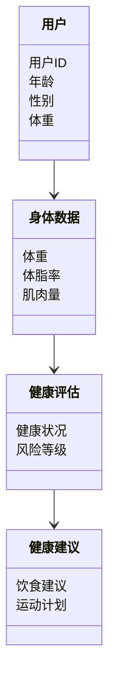
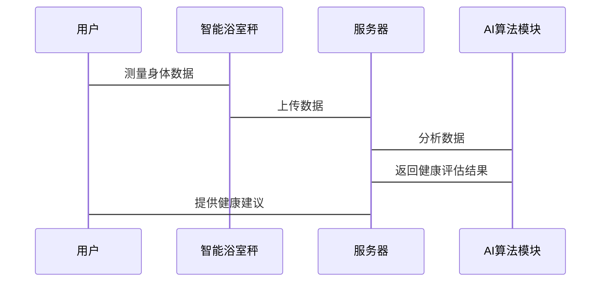

                 


# 智能浴室秤：AI Agent的身体成分分析与健康建议

> 关键词：智能浴室秤、AI Agent、身体成分分析、健康建议、机器学习

> 摘要：本文详细探讨了智能浴室秤与AI Agent的结合，分析了其在身体成分分析与健康建议中的应用。通过系统化的介绍，本文揭示了AI Agent在智能硬件中的潜力，以及其如何通过数据分析和机器学习算法为用户提供个性化的健康指导。

---

# 第一章: 背景介绍

## 1.1 智能浴室秤的发展历程

### 1.1.1 传统浴室秤的功能与局限性
传统浴室秤仅能测量体重，无法提供身体成分的详细信息。用户需要额外的设备和方法来获取体脂、肌肉量等数据，这种方式效率低下且不够精准。

### 1.1.2 智能浴室秤的出现与技术进步
随着物联网和AI技术的发展，智能浴室秤应运而生。它通过集成多种传感器和AI算法，能够测量体重、体脂、肌肉量、水分含量等身体成分数据，并通过无线连接将数据传输到手机或其他设备。

### 1.1.3 AI技术在智能硬件中的应用趋势
AI技术的快速发展推动了智能硬件的进步，智能浴室秤作为典型的智能硬件之一，通过AI技术实现了数据的智能化分析与健康建议的生成。

## 1.2 AI Agent的基本概念与特点

### 1.2.1 什么是AI Agent
AI Agent（人工智能代理）是一种智能实体，能够感知环境、自主决策并执行任务。它能够通过传感器获取数据，利用算法进行分析，并根据结果采取行动。

### 1.2.2 AI Agent的核心特征
AI Agent具有自主性、反应性、目标导向性和社交能力。它能够根据环境变化调整行为，并通过与用户或其他系统的交互提供智能化的服务。

### 1.2.3 AI Agent与传统软件的区别
传统软件依赖于固定的程序逻辑，而AI Agent能够学习和适应，具有更强的灵活性和智能化。

## 1.3 身体成分分析与健康建议的重要性

### 1.3.1 身体成分分析的基本原理
身体成分分析通过测量体重、体脂、肌肉量等指标，评估身体健康状况。这些数据能够帮助用户了解自身健康状况，并制定个性化的健康管理计划。

### 1.3.2 健康建议的必要性与价值
健康建议是基于身体成分分析数据，为用户提供个性化的饮食、运动和生活习惯建议。这些建议能够帮助用户改善身体状况，预防疾病。

### 1.3.3 智能浴室秤在健康管理中的独特地位
智能浴室秤通过AI Agent实现了数据的智能化分析与健康建议的生成，为用户提供便捷、高效的健康管理工具。

## 1.4 本章小结

---

# 第二章: 智能浴室秤与AI Agent的核心概念与联系

## 2.1 AI Agent在智能浴室秤中的应用原理

### 2.1.1 AI Agent的感知功能
智能浴室秤通过重量传感器、生物电阻传感器等设备获取用户的体重、体脂等数据。AI Agent通过这些数据感知用户的身体状况。

### 2.1.2 AI Agent的推理与决策机制
AI Agent利用机器学习算法对获取的数据进行分析，评估用户的健康状况，并根据评估结果制定健康建议。

### 2.1.3 AI Agent的执行与反馈
AI Agent通过用户界面将健康建议呈现给用户，并根据用户的反馈调整后续的分析与建议。

## 2.2 身体成分分析的数据模型与算法

### 2.2.1 数据采集与预处理
智能浴室秤通过传感器获取数据，并对数据进行清洗和标准化处理。

### 2.2.2 数据分析与特征提取
利用机器学习算法对数据进行分析，提取有用的特征，如体脂率、肌肉量等。

### 2.2.3 数据驱动的健康评估模型
基于机器学习模型，评估用户的健康状况，并生成个性化的健康建议。

## 2.3 AI Agent与健康建议系统的实体关系模型

```mermaid
er
    actor 用户
    entity 身体数据
    entity 健康评估
    entity 健康建议
    用户 --> 身体数据: 提供数据
    身体数据 --> 健康评估: 分析评估
    健康评估 --> 健康建议: 生成建议
```

---

# 第三章: 智能浴室秤的AI Agent算法原理

## 3.1 身体成分分析的算法原理

### 3.1.1 数据采集与特征提取
传感器获取的数据包括体重、体脂、肌肉量等，这些数据经过预处理后提取特征。

### 3.1.2 机器学习模型的选择
常用的模型包括线性回归、支持向量机（SVM）和随机森林。本文选择随机森林模型进行分析。

### 3.1.3 模型训练与优化
通过训练数据对模型进行训练，并利用验证集进行优化，以提高模型的准确性和鲁棒性。

## 3.2 健康建议生成的算法原理

### 3.2.1 健康目标的设定
根据用户的年龄、性别、体重等信息，设定个性化的健康目标，如减脂、增肌等。

### 3.2.2 数据驱动的健康建议生成规则
基于身体成分分析结果，利用规则引擎生成饮食、运动等建议。

### 3.2.3 基于反馈的动态调整算法
通过用户的反馈不断优化建议，提高用户体验。

## 3.3 算法实现的数学模型

### 3.3.1 线性回归模型
$$y = \beta_0 + \beta_1x + \epsilon$$
其中，$y$是目标变量，$x$是自变量，$\beta_0$是截距，$\beta_1$是回归系数，$\epsilon$是误差项。

### 3.3.2 随机森林模型
随机森林是一种基于决策树的集成算法，通过构建多棵决策树并进行投票或平均，提高模型的准确性和鲁棒性。

---

# 第四章: 系统分析与架构设计

## 4.1 系统功能设计

### 4.1.1 领域模型


### 4.1.2 系统架构设计


### 4.1.3 接口设计
系统提供API接口，支持HTTP请求，实现数据的上传、下载和查询功能。

### 4.1.4 交互流程


## 4.2 本章小结

---

# 第五章: 项目实战

## 5.1 环境搭建

### 5.1.1 安装Python环境
安装Python 3.8及以上版本，并安装必要的库，如scikit-learn、pandas、numpy等。

### 5.1.2 安装智能浴室秤
购买支持API接口的智能浴室秤，并下载相应的SDK。

## 5.2 核心实现

### 5.2.1 数据采集与预处理
编写代码采集身体数据，并进行数据清洗。

```python
import pandas as pd

# 数据采集
data = pd.read_csv('body_data.csv')

# 数据清洗
data.dropna(inplace=True)
data = data[['weight', 'fat', 'muscle']]
```

### 5.2.2 模型训练
利用随机森林模型训练健康评估模型。

```python
from sklearn.ensemble import RandomForestClassifier

# 训练数据
X = data[['weight', 'fat', 'muscle']]
y = data['health_status']

# 模型训练
model = RandomForestClassifier()
model.fit(X, y)
```

### 5.2.3 健康建议生成
基于模型结果生成个性化健康建议。

```python
import json

# 获取用户数据
user_data = {'weight': 70, 'fat': 20, 'muscle': 50}

# 预测健康状况
predicted_status = model.predict([[user_data['weight'], user_data['fat'], user_data['muscle']]])

# 生成健康建议
if predicted_status[0] == 'high_risk':
    suggestion = '建议增加运动量，减少脂肪摄入。'
elif predicted_status[0] == 'moderate_risk':
    suggestion = '保持当前状态，注意饮食均衡。'
else:
    suggestion = '健康状况良好，继续保持。'

print(suggestion)
```

## 5.3 项目小结

---

# 第六章: 总结与展望

## 6.1 本章总结
本文详细介绍了智能浴室秤与AI Agent的结合，分析了其在身体成分分析与健康建议中的应用。通过系统化的介绍，揭示了AI Agent在智能硬件中的潜力。

## 6.2 未来展望
随着AI技术的不断发展，智能浴室秤将变得更加智能化，能够提供更精准的健康评估与个性化的健康建议。

---

# 作者：AI天才研究院 & 禅与计算机程序设计艺术

