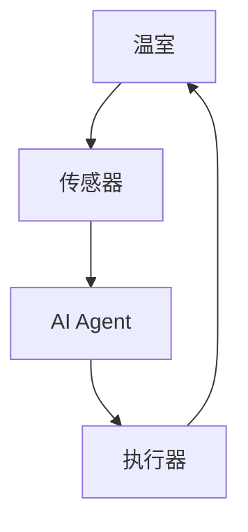
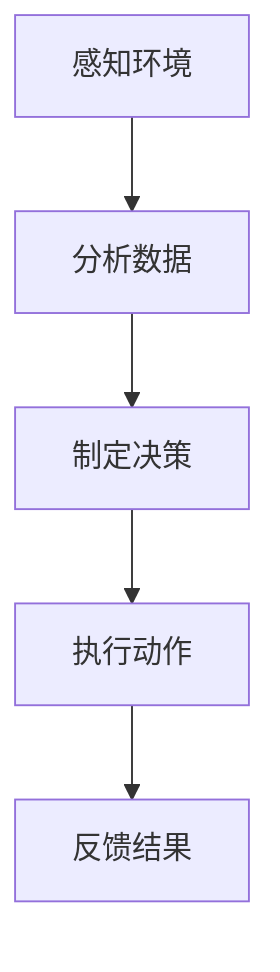
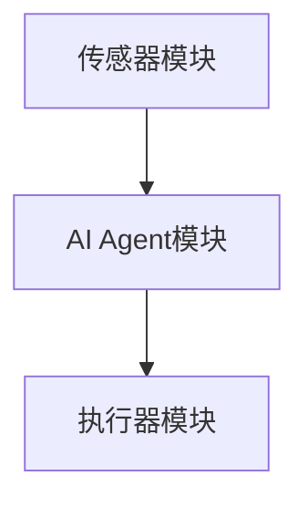
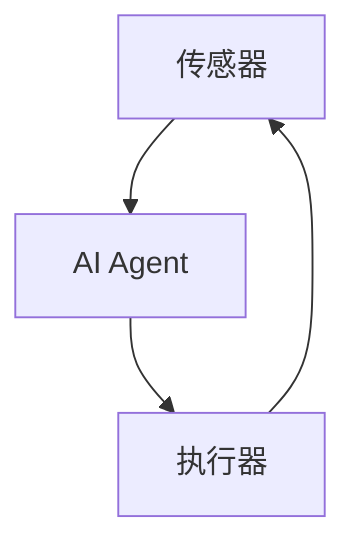

                 


# 智能温室：AI Agent的环境调节系统

## 关键词：智能温室、AI Agent、环境调节、传感器、决策模型、执行器

## 摘要：  
本文详细探讨了智能温室中AI Agent的环境调节系统，从背景、原理到实现，系统性地分析了AI Agent在温室环境调节中的应用。通过详细阐述AI Agent的工作原理、算法设计、系统架构以及实际案例，本文为读者提供了全面的技术指导和实践方案。

---

# 第1章: 智能温室的发展与AI Agent的引入

## 1.1 智能温室的发展历程

### 1.1.1 温室农业的起源与演变  
温室农业起源于古代，通过控制环境条件（如温度、湿度、光照）来提高作物产量和质量。随着科技的进步，温室逐渐从简单的物理结构发展为自动化控制系统。

### 1.1.2 智能温室的概念与特点  
智能温室是一种结合物联网、人工智能和自动化技术的现代温室系统，能够实时感知环境参数并自动调节，从而优化作物生长条件。

### 1.1.3 AI Agent在温室环境调节中的作用  
AI Agent（智能体）通过感知环境、分析数据、制定决策并执行动作，能够实现温室环境的智能化调节，提高温室的效率和可持续性。

---

## 1.2 AI Agent的基本概念

### 1.2.1 什么是AI Agent？  
AI Agent是一种能够感知环境、自主决策并执行任务的智能系统，具有目标导向性和适应性。

### 1.2.2 AI Agent的核心特征  
- **自主性**：无需外部干预，自主完成任务。  
- **反应性**：实时感知环境并做出反应。  
- **目标导向性**：以目标为导向，优化决策。  

### 1.2.3 AI Agent与传统自动控制系统的区别  
AI Agent能够自主学习和优化，而传统控制系统依赖预设规则，缺乏灵活性。

---

## 1.3 智能温室与AI Agent的结合

### 1.3.1 智能温室的环境调节需求  
温室环境调节需要实时感知温度、湿度、光照等参数，并根据作物需求动态调整。

### 1.3.2 AI Agent在环境调节中的优势  
AI Agent能够处理复杂环境数据，优化决策，实现精准调节。

### 1.3.3 智能温室AI Agent系统的发展前景  
随着AI技术的进步，智能温室AI Agent系统将在农业领域发挥越来越重要的作用。

---

# 第2章: 智能温室AI Agent的核心概念与联系

## 2.1 智能温室AI Agent的原理

### 2.1.1 状态感知与数据采集  
AI Agent通过传感器采集温室环境数据，如温度、湿度、光照等。

### 2.1.2 环境参数的分析与决策  
AI Agent基于感知数据，分析环境状态，制定调节策略。

### 2.1.3 执行与反馈  
AI Agent通过执行器（如风扇、加湿器）执行决策，并实时反馈调节效果。

---

## 2.2 核心概念对比分析

### 2.2.1 不同环境调节方法的对比  
| 方法 | 优点 | 缺点 |
|------|------|------|
| 手动调节 | 精准 | 费时费力 |
| 传统自动化 | 稳定 | 缺乏灵活性 |
| AI Agent | 精准高效 | 需要初始投资 |

### 2.2.2 AI Agent与传统控制系统的对比  
AI Agent能够自主学习和优化，而传统控制系统依赖预设规则。

### 2.2.3 智能温室系统中各模块的功能对比  
| 模块 | 功能 | 优缺点 |
|------|------|--------|
| 传感器 | 数据采集 | 精准但可能受环境干扰 |
| AI Agent | 数据分析与决策 | 灵活但需要处理复杂数据 |
| 执行器 | 调节环境 | 快速响应但需维护 |

---

## 2.3 系统实体关系图



---

# 第3章: 智能温室AI Agent的算法原理

## 3.1 算法原理概述

### 3.1.1 状态空间与感知模型  
AI Agent通过传感器感知环境状态，构建状态空间模型。

### 3.1.2 决策模型与优化算法  
基于感知数据，AI Agent使用优化算法（如强化学习）制定最优决策。

### 3.1.3 执行与反馈  
AI Agent根据决策执行动作，并通过反馈优化后续决策。

---

## 3.2 算法实现

### 3.2.1 强化学习算法  
AI Agent通过与环境交互，学习最优策略。

### 3.2.2 算法流程图



### 3.2.3 Python实现示例

```python
# 简单的AI Agent决策模型
class AIAgent:
    def __init__(self):
        self.temperature = 25  # 默认温度
        self.humidity = 50     # 默认湿度

    def感知环境(self, current_temp, current_humidity):
        self.temperature = current_temp
        self.humidity = current_humidity

    def 制定决策(self):
        # 根据当前环境制定决策
        if self.temperature > 30:
            return '打开风扇'
        elif self.humidity < 40:
            return '启动加湿器'
        else:
            return '保持现状'

    def 执行动作(self, action):
        print(f'执行动作：{action}')
```

---

## 3.3 数学公式与模型

### 3.3.1 环境参数优化公式  
$$ \text{最优温度} = \text{min}(T_{\text{max}}, \text{max}(T_{\text{min}}, T_{\text{current}})) $$

---

# 第4章: 智能温室AI Agent的系统架构设计

## 4.1 系统架构概述

### 4.1.1 模块划分  
智能温室AI Agent系统主要由传感器模块、AI Agent模块和执行器模块组成。

### 4.1.2 系统架构图



---

## 4.2 接口与交互设计

### 4.2.1 系统接口  
- **传感器接口**：提供环境数据。  
- **执行器接口**：接收控制指令。  

### 4.2.2 交互流程图



---

## 4.3 系统功能设计

### 4.3.1 数据采集功能  
AI Agent通过传感器实时采集环境数据。

### 4.3.2 数据分析与决策  
AI Agent基于历史数据和当前数据，制定最优调节策略。

### 4.3.3 系统控制功能  
AI Agent通过执行器调节温室环境。

---

# 第5章: 智能温室AI Agent的项目实战

## 5.1 项目背景与目标

### 5.1.1 项目背景  
本项目旨在实现一个基于AI Agent的智能温室环境调节系统。

### 5.1.2 项目目标  
实现温室环境的智能化调节，提高作物生长效率。

---

## 5.2 系统实现

### 5.2.1 环境搭建  
安装必要的库（如Python的传感器库、AI库）。

### 5.2.2 核心代码实现

```python
# AI Agent实现
class AIAgent:
    def __init__(self):
        self.temperature = 25
        self.humidity = 50

    def感知环境(self, temp, humidity):
        self.temperature = temp
        self.humidity = humidity

    def 制定决策(self):
        if self.temperature > 30:
            return '打开风扇'
        elif self.humidity < 40:
            return '启动加湿器'
        else:
            return '保持现状'

    def 执行动作(self, action):
        print(f'执行动作：{action}')
```

---

## 5.3 实际案例分析

### 5.3.1 案例分析  
根据光照强度自动调节遮阳帘。

### 5.3.2 数据分析与结果展示  
展示系统运行数据，验证调节效果。

---

## 5.4 项目总结与经验分享

### 5.4.1 项目成果  
成功实现智能温室环境调节系统。

### 5.4.2 经验分享  
传感器精度和系统实时性是关键。

---

# 第6章: 智能温室AI Agent的最佳实践

## 6.1 小结

### 6.1.1 核心内容回顾  
AI Agent在智能温室中的应用实现了高效环境调节。

---

## 6.2 注意事项

### 6.2.1 系统维护  
定期校准传感器，确保系统正常运行。

### 6.2.2 安全问题  
确保系统安全，防止恶意攻击。

---

## 6.3 拓展阅读

### 6.3.1 推荐书籍  
《智能控制系统设计》

### 6.3.2 技术博客  
AI Agent与智能温室的最新研究。

---

作者：AI天才研究院/AI Genius Institute & 禅与计算机程序设计艺术 /Zen And The Art of Computer Programming

