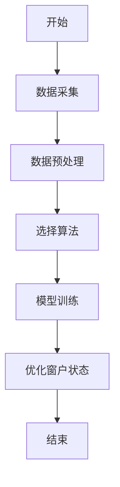
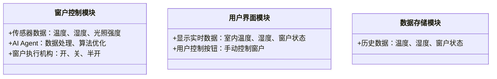
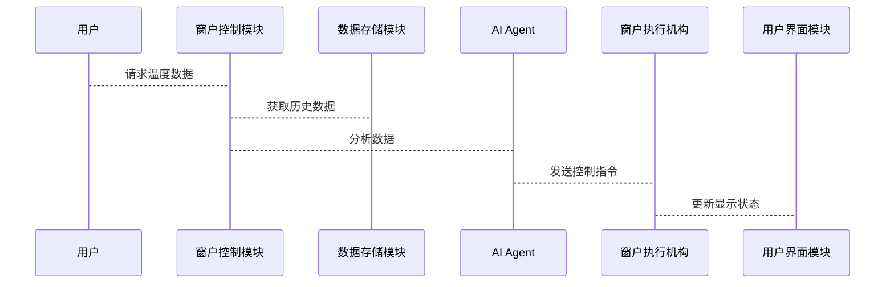

                 


# 智能窗户：AI Agent的室内温度优化控制

## 关键词：智能窗户、AI Agent、室内温度优化、物联网、机器学习、优化算法

## 摘要：  
本文探讨了智能窗户在AI Agent辅助下的室内温度优化控制技术。通过分析智能窗户的基本概念、AI Agent的核心原理，以及结合物联网和机器学习技术的优化算法，展示了如何利用这些技术实现室内温度的精准控制。文章还详细介绍了系统架构设计、项目实战案例以及最佳实践建议。

---

## 第一部分: 智能窗户与AI Agent的背景与概念

### 第1章: 智能窗户的基本概念

#### 1.1 智能窗户的定义与特点
- **1.1.1 智能窗户的定义**  
  智能窗户是一种集成传感器、物联网（IoT）技术和AI算法的智能设备，能够根据室内环境和外部天气条件自动调节窗户的开合状态，以优化室内温度、湿度和空气质量。

- **1.1.2 智能窗户的核心特点**  
  - 自动化控制：基于传感器数据和AI算法，自动调节窗户状态。  
  - 节能环保：通过优化室内环境，降低能源消耗。  
  - 多功能集成：支持温度、湿度、光照等多种环境参数的监测与调节。

- **1.1.3 智能窗户与传统窗户的区别**  
  传统窗户仅用于采光和通风，而智能窗户结合了智能化技术和AI算法，能够主动响应环境变化，提供更舒适的室内环境。

#### 1.2 室内温度优化控制的背景与意义
- **1.2.1 室内温度控制的重要性**  
  室内温度直接影响人们的舒适度和健康，尤其是在极端天气条件下（如高温或低温），合理控制室内温度至关重要。

- **1.2.2 当前室内温度控制技术的局限性**  
  - 传统空调系统能耗高，响应慢。  
  - 单一的温度控制方式无法兼顾湿度、空气质量等其他因素。  

- **1.2.3 AI Agent在温度优化中的作用**  
  AI Agent能够实时采集室内和室外环境数据，结合历史数据和预测模型，优化窗户的开合状态，从而实现更精准的温度控制。

#### 1.3 AI Agent的基本概念与功能
- **1.3.1 AI Agent的定义**  
  AI Agent是一种智能代理系统，能够感知环境、自主决策并执行任务。在智能窗户系统中，AI Agent负责数据采集、分析和控制。

- **1.3.2 AI Agent的核心功能**  
  - 数据采集：通过传感器获取室内温度、湿度、光照强度等数据。  
  - 数据分析：结合历史数据和天气预报，预测未来环境变化。  
  - 自主决策：根据预测结果优化窗户的开合状态，以达到最佳温度控制效果。

---

## 第二部分: 核心概念与联系

### 第2章: 核心概念与联系

#### 2.1 AI Agent的核心原理
- **2.1.1 感知与数据采集**  
  AI Agent通过传感器采集室内和室外环境数据，包括温度、湿度、光照强度等。

- **2.1.2 数据分析与预测**  
  利用机器学习算法对数据进行分析，预测未来环境变化趋势。

- **2.1.3 决策与执行**  
  根据预测结果，优化窗户的开合状态，调整室内温度。

#### 2.2 智能窗户与物联网技术的结合
- **2.2.1 物联网技术的定义**  
  IoT（物联网）是指通过传感器和网络连接，实现设备间的数据交换和远程控制。

- **2.2.2 物联网在智能窗户中的应用**  
  - 数据采集：通过传感器获取环境数据。  
  - 数据传输：通过无线网络将数据传输到云端或本地控制系统。  
  - 远程控制：用户可以通过手机或其他终端设备远程控制窗户状态。

#### 2.3 智能窗户与温度控制的关系
- **2.3.1 温度控制的核心目标**  
  通过调节窗户的开合状态，平衡室内温度，同时降低能源消耗。

- **2.3.2 温度控制的优化方向**  
  - 提高控制精度：通过AI算法优化窗户的开合策略。  
  - 降低能耗：通过智能调节窗户状态减少空调使用时间。  

---

## 第三部分: 算法原理

### 第3章: AI Agent的算法原理

#### 3.1 温度优化的机器学习模型
- **3.1.1 机器学习模型的输入与输出**  
  - 输入：室内温度、湿度、室外温度、光照强度等。  
  - 输出：窗户的开合状态（开、关、半开）。

- **3.1.2 机器学习算法的选择**  
  - 回归算法：用于预测窗户开合对温度的影响。  
  - 分类算法：用于判断窗户的最佳开合状态。

- **3.1.3 模型训练与优化**  
  通过历史数据训练模型，利用交叉验证优化模型参数。

#### 3.2 基于遗传算法的优化策略
- **3.2.1 遗传算法的基本原理**  
  遗传算法是一种模拟自然选择和遗传的优化算法，适用于寻找全局最优解。

- **3.2.2 遗传算法在窗户控制中的应用**  
  - 编码：将窗户的开合状态编码为二进制字符串。  
  - 适应度函数：定义窗户状态对温度优化的贡献度。  
  - 选择与交叉：根据适应度值选择优秀解，并进行交叉操作生成新解。  

#### 3.3 算法流程图（Mermaid）


---

## 第四部分: 系统分析与架构设计

### 第4章: 系统分析与架构设计

#### 4.1 问题场景介绍
- **4.1.1 用户需求**  
  用户希望实现智能窗户的温度优化控制，降低能耗，提高舒适度。

- **4.1.2 系统功能需求**  
  - 实时采集室内和室外环境数据。  
  - AI Agent分析数据并优化窗户状态。  
  - 提供用户界面查看实时数据和控制状态。

#### 4.2 系统功能设计（领域模型）


#### 4.3 系统架构设计（架构图）


#### 4.4 系统接口设计与交互流程图


---

## 第五部分: 项目实战

### 第5章: 项目实战

#### 5.1 环境安装
- **Python环境**：安装Python 3.8及以上版本。
- **传感器库**：安装`Adafruit_Python_GPIO`库。
- **机器学习库**：安装`scikit-learn`和`pymoo`。

#### 5.2 核心代码实现
```python
import numpy as np
from sklearn.linear_model import LinearRegression
from pymoo.algorithms.genetic import GA

# 数据采集
def get_sensor_data():
    # 从传感器获取数据
    return np.random.rand(4, 1)

# 优化算法
def optimize_window_state():
    # 使用遗传算法优化窗户状态
    problem = GA(...)

# 主函数
def main():
    data = get_sensor_data()
    model = LinearRegression().fit(data, target)
    optimize_window_state()

if __name__ == "__main__":
    main()
```

#### 5.3 代码解读与分析
- `get_sensor_data()`：从传感器获取环境数据。  
- `optimize_window_state()`：使用遗传算法优化窗户的开合状态。  
- `main()`：主函数，整合数据采集、模型训练和优化算法。

#### 5.4 实际案例分析
- 案例1：晴天时，AI Agent会根据光照强度调整窗户开合状态，以降低室内温度。  
- 案例2：雨天时，AI Agent会关闭窗户以防止雨水进入，同时调节湿度。

---

## 第六部分: 最佳实践

### 第6章: 最佳实践

#### 6.1 小结
- 通过AI Agent和物联网技术，智能窗户能够实现室内温度的精准优化控制。  
- 系统设计的关键在于数据采集、算法优化和用户交互。

#### 6.2 注意事项
- 确保传感器的精度和稳定性。  
- 定期更新AI模型，以适应环境变化。  
- 注意数据隐私和网络安全。

#### 6.3 拓展阅读
- 《机器学习实战》：深入理解机器学习算法。  
- 《物联网技术与应用》：了解物联网技术的最新发展。

---

## 作者：AI天才研究院/AI Genius Institute & 禅与计算机程序设计艺术 /Zen And The Art of Computer Programming

---

感谢您的阅读！希望这篇文章能为您提供关于智能窗户和AI Agent在室内温度优化控制方面的深入理解！

