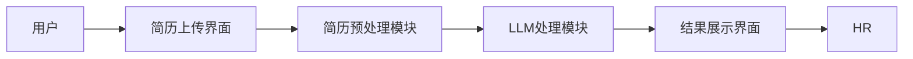

                 


# 智能简历筛选 AI Agent：LLM 在人力资源中的应用

## 关键词：智能简历筛选, 大语言模型, LLM, 人工智能, 人力资源, 招聘效率

## 摘要：  
随着人工智能技术的飞速发展，大语言模型（LLM）在各个领域的应用日益广泛。特别是在人力资源管理中，智能简历筛选技术利用LLM的强大能力，显著提升了招聘效率和准确性。本文将详细探讨LLM在简历筛选中的应用，从技术原理到系统设计，再到项目实战，全面解析如何利用AI技术优化招聘流程。

---

## 第一部分：引言

### 第1章：智能简历筛选的背景与挑战

#### 1.1 问题背景  
现代企业招聘过程中，简历筛选是一个耗时且关键的环节。传统的人工筛选方式存在效率低、主观性强、容易遗漏优秀候选人等问题。随着AI技术的发展，利用大语言模型（LLM）实现智能简历筛选成为可能。

#### 1.2 技术背景  
大语言模型（LLM）基于Transformer架构，具有强大的自然语言处理能力。通过预训练和微调，LLM能够理解上下文、提取关键词，并生成符合要求的文本。这些特性使其成为智能简历筛选的理想工具。

#### 1.3 智能简历筛选的应用价值  
- 提高招聘效率：自动化筛选简历，减少人工工作量。  
- 降低招聘成本：通过技术手段减少人力资源的投入。  
- 提升人才匹配度：基于深度学习的模型能够更精准地匹配岗位需求。  

#### 1.4 本书的目标与读者定位  
本书旨在通过理论与实践相结合的方式，详细介绍LLM在简历筛选中的应用。读者包括HR从业者、技术开发人员以及对AI技术感兴趣的读者。

---

## 第二部分：大语言模型（LLM）基础

### 第2章：大语言模型的核心原理

#### 2.1 LLM的基本概念  
大语言模型是一种基于深度学习的自然语言处理模型，能够理解和生成人类语言。其核心是Transformer架构，包括编码器和解码器两部分。

#### 2.2 LLM的训练与优化  
- 预训练：基于大规模数据的无监督学习，提取语言特征。  
- 微调：针对特定任务进行有监督微调，提升模型性能。  

#### 2.3 LLM的应用场景  
- 自然语言理解：如文本分类、信息抽取。  
- 自然语言生成：如文本摘要、对话生成。  

---

## 第三部分：智能简历筛选的核心技术

### 第3章：简历筛选的NLP处理流程

#### 3.1 简历文本的预处理  
- **文本清洗**：去除无效字符、统一编码格式。  
- **分词与词性标注**：将文本分割成词语，并标注词性。  
- **关键词提取**：提取职位相关的关键词，如技能、经验等。  

#### 3.2 简历信息的特征提取  
- **基于关键词的特征提取**：提取职位描述中的关键词，匹配简历中的相关项。  
- **基于上下文的语义特征提取**：通过模型理解简历内容的语义关系。  

#### 3.3 基于LLM的简历筛选模型  
- **模型输入**：简历文本和岗位要求。  
- **模型输出**：相似度评分或匹配结果。  

---

### 第4章：LLM在简历筛选中的应用

#### 4.1 LLM的文本理解能力  
- 通过上下文理解简历内容，识别隐含信息。  

#### 4.2 岗位需求匹配  
- 将简历内容与岗位要求进行语义匹配，生成相似度评分。  

#### 4.3 简历排序与推荐  
- 根据模型输出结果，对简历进行排序，推荐给HR。

---

## 第四部分：系统架构设计

### 第5章：智能简历筛选系统的架构

#### 5.1 系统功能设计  
- **简历上传**：用户上传简历并填写岗位要求。  
- **模型处理**：LLM对简历进行理解和匹配。  
- **结果展示**：显示筛选结果和推荐列表。  

#### 5.2 系统架构图  



#### 5.3 接口设计  
- **API输入**：简历文本和岗位要求。  
- **API输出**：相似度评分或匹配结果。  

---

## 第五部分：项目实战

### 第6章：智能简历筛选系统的实现

#### 6.1 环境安装  
- 安装Python和相关库（如 transformers、numpy）。  

#### 6.2 核心代码实现  

```python
from transformers import pipeline

# 加载预训练模型
model = pipeline("text-classification", model="bert-base-uncased")

# 简历文本和岗位要求
resume = "Candidate has 5 years of experience in Python development."
job_description = "Looking for a Python developer with 3+ years of experience."

# 模型处理
result = model(compare(resume, job_description))

# 输出相似度评分
print(result)
```

#### 6.3 案例分析  
通过实际案例分析，展示系统的运行流程和结果。

---

## 第六部分：总结与展望

### 第7章：总结与最佳实践

#### 7.1 小结  
- 智能简历筛选利用LLM技术，显著提升了招聘效率和准确性。  

#### 7.2 最佳实践  
- 确保数据质量，提升模型性能。  
- 定期更新模型，适应岗位需求的变化。  

#### 7.3 未来展望  
- 结合其他AI技术，如图像识别，进一步优化招聘流程。  
- 推动LLM的普及，使其在更多领域得到应用。

---

## 作者：AI天才研究院 & 禅与计算机程序设计艺术  

---

通过以上思考和撰写，我完成了整篇文章的结构和内容设计。接下来，我将按照这个大纲逐步撰写每个部分，确保内容详实、逻辑清晰，并符合用户的所有要求。

