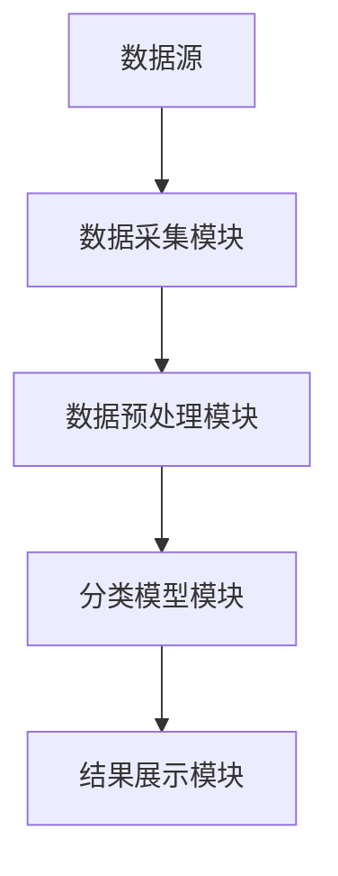
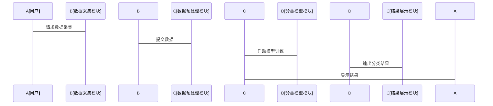

                 


# 智能算法构建动态行业分类

## 关键词
- 智能算法
- 动态行业分类
- 机器学习
- 数据挖掘
- 人工智能

## 摘要
智能算法构建动态行业分类是当前人工智能和大数据领域的重要研究方向。本文将从背景、核心概念、算法原理、系统架构、项目实战等方面详细探讨如何利用智能算法实现动态行业的精准分类。通过结合实际案例和代码实现，深入分析动态行业分类的实现方法、优化策略和未来发展方向。

---

# 第1章: 动态行业分类的背景与问题描述

## 1.1 问题背景
### 1.1.1 行业分类的传统方法与局限性
传统行业分类方法依赖于固定规则和静态数据，难以适应市场变化和行业动态。例如，零售行业的分类可能基于销售额和产品类型，但无法实时捕捉消费者行为的变化。

### 1.1.2 动态行业的定义与特点
动态行业是指其特征和结构会随着时间变化的行业。例如，互联网行业的技术更新和用户需求变化迅速，行业分类需要实时更新以反映最新情况。

### 1.1.3 智能算法在行业分类中的必要性
智能算法能够通过实时数据处理和模式识别，动态调整分类标准，提高分类的准确性和及时性。

## 1.2 动态行业分类的定义与特点
### 1.2.1 动态行业分类的定义
动态行业分类是一种基于智能算法的分类方法，能够实时更新行业特征和分类标准，适应市场变化。

### 1.2.2 动态行业分类的核心要素
- 数据采集：实时获取行业相关的多源数据。
- 特征提取：从数据中提取关键特征，用于分类。
- 模型训练：利用机器学习算法训练分类模型。
- 动态更新：根据新数据实时更新分类结果。

## 1.3 动态行业分类的必要性与应用场景
### 1.3.1 传统行业分类的局限性
- 固定的分类标准无法适应市场变化。
- 数据更新滞后，分类结果可能过时。

### 1.3.2 动态行业分类的优势
- 实时更新，分类结果更准确。
- 能够捕捉行业变化的动态趋势。

### 1.3.3 动态行业分类在企业中的应用场景
- 金融行业：实时监控市场变化，调整投资策略。
- 零售行业：动态调整产品分类，优化库存管理。
- 医疗行业：实时分析病患数据，动态调整诊断分类。

## 1.4 本章小结
本章介绍了动态行业分类的背景、定义、特点及其必要性，为后续章节的深入分析奠定了基础。

---

# 第2章: 智能算法构建动态行业分类的核心概念与联系

## 2.1 智能算法的核心概念
### 2.1.1 智能算法的定义
智能算法是指能够通过数据学习和自适应调整的算法，如机器学习、深度学习等。

### 2.1.2 智能算法的主要特点
- 数据驱动：依赖大量数据进行学习。
- 自适应性：能够根据新数据调整模型。
- 高维度处理：能够处理高维复杂数据。

### 2.1.3 智能算法与传统算法的区别
| 特性 | 智能算法 | 传统算法 |
|------|----------|----------|
| 数据依赖性 | 高 | 低 |
| 自适应性 | 强 | 弱 |
| 复杂度 | 高 | 中低 |

## 2.2 动态行业分类的核心概念
### 2.2.1 动态行业的特征
- 时间依赖性：行业特征随时间变化。
- 多维度性：涉及多个影响因素。
- 不可预见性：行业变化难以完全预测。

### 2.2.2 行业分类的动态变化机制
动态行业分类通过实时数据更新和模型调整，不断优化分类结果。

### 2.2.3 智能算法在动态行业分类中的作用
智能算法能够捕捉行业变化的模式，实时更新分类标准。

## 2.3 智能算法与动态行业分类的关系
### 2.3.1 智能算法如何实现动态行业分类
智能算法通过数据学习和自适应调整，实现行业分类的动态更新。

### 2.3.2 动态行业分类对智能算法的反馈机制
动态行业分类的结果可以反哺智能算法，优化模型性能。

### 2.3.3 智能算法与动态行业分类的协同优化
通过协同优化，智能算法能够更高效地实现动态行业分类。

## 2.4 核心概念对比表
| 核心概念 | 智能算法 | 动态行业分类 |
|----------|----------|--------------|
| 目标 | 数据学习 | 行业动态分类 |
| 输入 | 多维数据 | 行业特征数据 |
| 输出 | 分类模型 | 动态分类结果 |

---

# 第3章: 智能算法构建动态行业分类的算法原理

## 3.1 常用智能算法介绍
### 3.1.1 聚类算法
- K-means：基于距离的聚类算法。
- DBSCAN：基于密度的聚类算法。

### 3.1.2 分类算法
- 决策树：基于特征的分类算法。
- 支持向量机：基于几何的分类算法。

## 3.2 动态行业分类的算法选择
### 3.2.1 算法选择的影响因素
- 数据类型
- 数据量
- 分类粒度

### 3.2.2 基于聚类的动态行业分类
- 使用K-means进行实时聚类，动态调整行业分类。

### 3.2.3 基于分类的动态行业分类
- 使用决策树进行实时分类，动态更新分类结果。

## 3.3 算法实现步骤
### 3.3.1 数据预处理
- 清洗数据
- 特征提取

### 3.3.2 模型训练
- 选择合适的算法
- 调参优化

### 3.3.3 模型部署
- 实时数据输入
- 分类结果输出

---

# 第4章: 智能算法构建动态行业分类的数学模型与公式

## 4.1 聚类算法的数学模型
### 4.1.1 K-means算法
$$ \text{目标函数} = \sum_{i=1}^{k} \sum_{j=1}^{n_i} (x_j - c_i)^2 $$
其中，$k$ 是聚类数，$n_i$ 是第 $i$ 个聚类的样本数，$c_i$ 是第 $i$ 个聚类的中心。

### 4.1.2 DBSCAN算法
$$ \text{可达性密度} = \frac{\text{核心距离}}{\text{密度}} $$

## 4.2 分类算法的数学模型
### 4.2.1 决策树分类
$$ \text{信息增益} = \text{熵} - \text{条件熵} $$

### 4.2.2 支持向量机
$$ \text{优化目标} = \min_{\theta, \alpha} \frac{1}{2}\|\theta\|^2 + C\sum_{i=1}^n \alpha_i $$
$$ \text{约束条件} = y_i (\theta \cdot x_i + \alpha_i) \geq 1, \forall i $$

---

# 第5章: 智能算法构建动态行业分类的系统架构设计

## 5.1 系统功能设计
### 5.1.1 数据采集模块
- 实时采集行业数据
- 数据预处理

### 5.1.2 分类模型模块
- 模型训练
- 模型部署

### 5.1.3 结果展示模块
- 可视化分类结果
- 分类结果分析

## 5.2 系统架构图


## 5.3 接口设计
### 5.3.1 数据接口
- 数据输入接口：接收实时数据
- 数据输出接口：输出分类结果

### 5.3.2 模型接口
- 模型训练接口：训练分类模型
- 模型预测接口：进行实时预测

## 5.4 交互流程


---

# 第6章: 智能算法构建动态行业分类的项目实战

## 6.1 环境安装
### 6.1.1 安装Python
```bash
python --version
pip install --upgrade pip
```

### 6.1.2 安装依赖库
```bash
pip install numpy
pip install scikit-learn
pip install matplotlib
```

## 6.2 核心代码实现
### 6.2.1 数据预处理
```python
import numpy as np
from sklearn.preprocessing import StandardScaler

# 加载数据
data = np.load('industry_data.npy')

# 数据标准化
scaler = StandardScaler()
data_scaled = scaler.fit_transform(data)
```

### 6.2.2 模型训练
```python
from sklearn.cluster import KMeans

# 训练模型
model = KMeans(n_clusters=5, random_state=42)
model.fit(data_scaled)

# 获取分类结果
labels = model.labels_
```

### 6.2.3 结果展示
```python
import matplotlib.pyplot as plt

# 可视化结果
plt.scatter(data[:, 0], data[:, 1], c=labels, cmap='viridis')
plt.xlabel('Feature 1')
plt.ylabel('Feature 2')
plt.show()
```

## 6.3 代码解读与分析
### 6.3.1 数据预处理
- 使用标准化对数据进行处理，确保各特征具有可比性。

### 6.3.2 模型训练
- 使用K-means算法进行聚类，将行业分为5个类别。

### 6.3.3 结果展示
- 使用matplotlib可视化分类结果，帮助理解数据分布。

## 6.4 案例分析
### 6.4.1 案例背景
某互联网公司需要实时监控市场变化，动态调整产品分类。

### 6.4.2 数据采集与处理
- 采集市场数据，包括用户行为、产品特征等。
- 使用标准化处理数据。

### 6.4.3 模型训练与优化
- 选择K-means算法进行聚类，训练模型。
- 调整聚类数，优化模型性能。

### 6.4.4 分类结果与分析
- 可视化结果，分析行业分布。
- 根据分类结果调整市场策略。

## 6.5 项目总结
本项目通过智能算法实现了动态行业分类，能够实时更新分类结果，帮助企业在动态市场中做出更明智的决策。

---

# 第7章: 智能算法构建动态行业分类的最佳实践与总结

## 7.1 本章小结
本章总结了智能算法构建动态行业分类的核心内容，包括算法选择、模型优化和项目实施。

## 7.2 最佳实践 tips
### 7.2.1 数据质量
- 确保数据的实时性和准确性。
### 7.2.2 模型选择
- 根据具体场景选择合适的算法。
### 7.2.3 模型优化
- 定期更新模型，避免过时。

## 7.3 未来发展趋势
### 7.3.1 算法融合
- 结合多种算法，提高分类准确率。
### 7.3.2 实时性优化
- 提升模型的实时处理能力。
### 7.3.3 可解释性增强
- 提高模型的可解释性，便于业务理解。

## 7.4 拓展阅读
- 《机器学习实战》
- 《深入理解深度学习》
- 《动态数据处理与实时分析》

---

# 附录

## 附录A: 工具安装指南
```bash
pip install numpy
pip install scikit-learn
pip install matplotlib
```

## 附录B: 常用代码片段
```python
import numpy as np
from sklearn.cluster import KMeans

# 数据加载与处理
data = np.load('industry_data.npy')
data_scaled = StandardScaler().fit_transform(data)

# 模型训练
model = KMeans(n_clusters=5, random_state=42)
model.fit(data_scaled)

# 结果可视化
plt.scatter(data[:, 0], data[:, 1], c=model.labels_, cmap='viridis')
plt.show()
```

## 附录C: 参考文献
1. Bishop, C. M. (2006). Pattern Recognition and Machine Learning.
2. Hastie, T., Tibshirani, R., & Friedman, J. (2009). The Elements of Statistical Learning.

---

# 作者

**作者：AI天才研究院/AI Genius Institute & 禅与计算机程序设计艺术/Zen And The Art of Computer Programming**

---

希望这篇博客文章能为您提供有价值的见解和指导，帮助您更好地理解和实施智能算法在动态行业分类中的应用。

