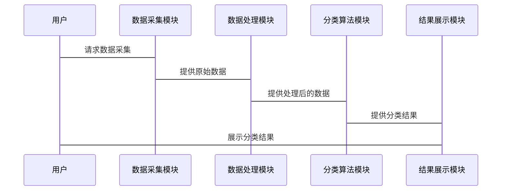

                 


# 智能算法构建动态行业分类体系

> **关键词**: 智能算法, 行业分类, 动态调整, 机器学习, 数据挖掘

> **摘要**: 本文深入探讨了智能算法在动态行业分类中的应用，分析了行业分类的核心概念、算法原理及系统架构设计。通过具体的项目实战和案例分析，详细讲解了如何利用智能算法实现行业的动态分类，帮助读者理解并掌握这一领域的关键技术。

---

## 第1章: 动态行业分类的背景与挑战

### 1.1 行业分类的定义与重要性

#### 1.1.1 行业分类的基本概念
行业分类是将企业或产品按照一定的规则和标准划分到不同的行业中，以便更好地进行分析、管理和决策。传统的行业分类通常基于固定的分类标准，如《国民经济行业分类》。

#### 1.1.2 行业分类在商业中的作用
行业分类帮助企业了解市场结构、竞争对手和行业趋势，为投资决策、资源配置和战略规划提供重要依据。

#### 1.1.3 动态行业分类的必要性
随着市场环境的变化，行业的边界和结构也在不断调整。传统的静态分类方法难以适应这种变化，动态行业分类能够实时捕捉行业变化，提供更精准的分类结果。

---

### 1.2 动态行业的特点与挑战

#### 1.2.1 行业动态变化的驱动因素
技术进步、市场需求变化、政策调整和全球化等因素都会导致行业结构的变化。

#### 1.2.2 动态行业分类的核心问题
如何实时更新分类标准、如何处理数据的动态变化、如何保证分类的准确性和稳定性是动态行业分类的核心挑战。

#### 1.2.3 现有分类方法的局限性
传统的行业分类方法通常基于固定的规则和静态数据，难以应对行业的动态变化。

---

### 1.3 智能算法的优势与应用前景

#### 1.3.1 智能算法的基本概念
智能算法是一种基于数据驱动的算法，能够通过学习和适应来完成复杂的任务。它包括机器学习、深度学习、自然语言处理等多种技术。

#### 1.3.2 智能算法在行业分类中的优势
智能算法能够自动学习行业特征，实时更新分类模型，并适应数据的动态变化。

#### 1.3.3 动态行业分类的未来发展趋势
随着人工智能和大数据技术的不断发展，动态行业分类将在商业分析、金融投资、市场营销等领域发挥越来越重要的作用。

---

## 第2章: 智能算法与动态行业分类的核心概念

### 2.1 智能算法的基本原理

#### 2.1.1 数据特征提取
数据特征提取是智能算法的基础，通过提取数据的关键特征，算法能够更好地理解和分类行业。

#### 2.1.2 算法模型选择
选择合适的算法模型是动态行业分类的关键，常见的算法包括决策树、随机森林、支持向量机（SVM）和深度学习模型。

#### 2.1.3 动态调整机制
动态调整机制是智能算法的核心，通过实时更新模型参数和分类规则，算法能够适应行业的动态变化。

---

### 2.2 动态行业分类的数学模型

#### 2.2.1 行业分类的数学表达
行业分类可以表示为一个分类问题，目标是将行业数据映射到预定义的行业类别。

#### 2.2.2 动态调整的数学公式
动态调整的核心是通过优化算法参数来更新分类模型。例如，使用梯度下降算法优化分类器的权重。

#### 2.2.3 模型的优化与评估
模型的优化目标是最大化分类准确率和稳定性。评估指标包括准确率、召回率、F1分数等。

---

### 2.3 智能算法与动态行业的关系

#### 2.3.1 数据流与算法流的关系
数据流是算法的核心输入，算法流是数据处理和分类的逻辑流程。两者相互依存，共同实现动态行业分类。

#### 2.3.2 算法与行业动态的互动
算法通过学习行业数据的变化，不断调整分类规则，行业动态则为算法提供新的数据输入，形成一个动态反馈机制。

#### 2.3.3 算法的可扩展性与行业复杂性
算法的可扩展性决定了其在处理复杂行业动态时的表现。行业复杂性越高，算法的可扩展性要求越高。

---

## 第3章: 智能算法的数学模型与公式

### 3.1 数据特征提取的数学模型

#### 3.1.1 特征选择的数学公式
特征选择可以通过信息增益、卡方检验等方法进行，公式如下：
$$ \text{信息增益} = \text{熵} - \text{条件熵} $$

#### 3.1.2 特征权重的计算方法
特征权重可以通过梯度下降算法优化，公式如下：
$$ w = w + \alpha \cdot \nabla J(w) $$
其中，$w$ 是权重向量，$\alpha$ 是学习率，$J(w)$ 是损失函数。

#### 3.1.3 特征向量的构建过程
特征向量是将多个特征组合成一个向量，用于表示数据的特征空间。

---

### 3.2 算法模型的数学表达

#### 3.2.1 决策树算法的数学公式
决策树的分裂标准可以通过信息增益或基尼指数来衡量，公式如下：
$$ \text{基尼指数} = \sum_{k=1}^{n} p_k (1 - p_k) $$
其中，$p_k$ 是第$k$个类别在当前节点的分布概率。

#### 3.2.2 支持向量机的数学公式
支持向量机的目标是最优化以下目标函数：
$$ \min_{w, b, \xi} \frac{1}{2} ||w||^2 + C \sum_{i=1}^{n} \xi_i $$
约束条件为：
$$ y_i (w \cdot x_i + b) \geq 1 - \xi_i $$
$$ \xi_i \geq 0 $$

#### 3.2.3 神经网络的数学公式
神经网络的前向传播公式为：
$$ a^{(l+1)} = \sigma(w^{(l)} a^{(l)} + b^{(l)}) $$
其中，$a^{(l)}$ 是第$l$层的激活值，$\sigma$ 是激活函数。

---

## 第4章: 系统分析与架构设计

### 4.1 问题场景介绍
动态行业分类系统需要实时处理大量的行业数据，包括企业信息、市场数据和行业趋势。

### 4.2 系统功能设计

#### 4.2.1 领域模型
以下是领域模型的类图：
```mermaid
classDiagram
    class 行业数据 {
        属性: 名称, 类别, 特征
        方法: 更新数据()
    }
    class 分类算法 {
        属性: 模型参数
        方法: 训练模型(), 分类数据()
    }
    class 行业分类结果 {
        属性: 分类结果
        方法: 输出结果()
    }
    行业数据 -> 分类算法: 提供数据
    分类算法 -> 行业分类结果: 输出结果
```

### 4.3 系统架构设计

#### 4.3.1 系统架构图
以下是系统架构图：


### 4.4 系统交互设计

#### 4.4.1 系统交互流程
以下是系统交互流程图：


---

## 第5章: 项目实战与案例分析

### 5.1 环境安装
需要安装以下工具和库：
- Python 3.8+
- scikit-learn
- numpy
- pandas
- mermaid

### 5.2 系统核心实现源代码

#### 5.2.1 数据特征提取代码
```python
import numpy as np
from sklearn.feature_selection import mutual_info_classif

# 示例数据
X = np.array([[1, 2, 3], [4, 5, 6], [7, 8, 9]])
y = np.array([0, 1, 0])

# 计算互信息特征
mi = mutual_info_classif(X, y)
print(mi)
```

#### 5.2.2 分类算法实现代码
```python
from sklearn.tree import DecisionTreeClassifier
from sklearn.model_selection import train_test_split

# 示例数据
X = [[1, 2, 3], [4, 5, 6], [7, 8, 9], [10, 11, 12]]
y = [0, 1, 0, 1]

# 划分训练集和测试集
X_train, X_test, y_train, y_test = train_test_split(X, y, test_size=0.25)

# 训练决策树模型
model = DecisionTreeClassifier()
model.fit(X_train, y_train)

# 预测测试数据
y_pred = model.predict(X_test)
print(y_pred)
```

### 5.3 实际案例分析
以电商行业为例，分析如何利用智能算法实现动态行业分类。

---

## 第6章: 总结与展望

### 6.1 本章小结
智能算法在动态行业分类中具有重要的应用价值，通过实时更新分类模型，能够准确捕捉行业变化。

### 6.2 最佳实践 tips
- 数据预处理是关键，确保数据质量和完整性。
- 选择合适的算法模型，根据实际需求进行调整和优化。
- 定期更新模型，保持分类的准确性和时效性。

### 6.3 展望
未来，随着人工智能技术的不断发展，动态行业分类将更加智能化和自动化，为企业和投资者提供更精准的行业分析和决策支持。

---

## 作者：AI天才研究院/AI Genius Institute & 禅与计算机程序设计艺术 /Zen And The Art of Computer Programming

