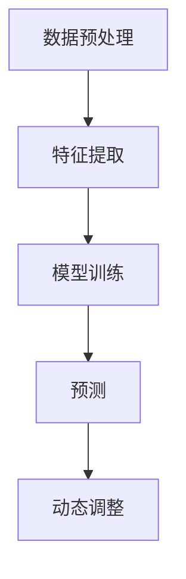
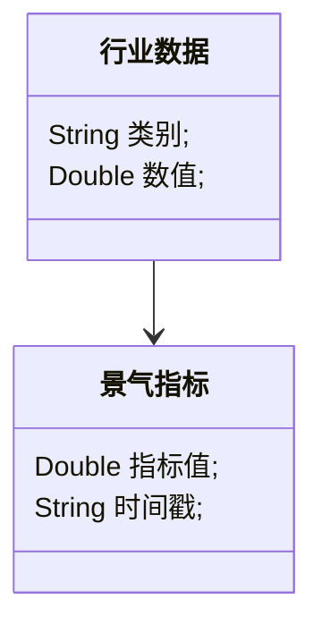

                 


# 智能算法构建动态行业景气指标

## 关键词：智能算法，行业景气指标，动态调整，机器学习，深度学习

## 摘要

本文详细探讨了如何利用智能算法构建动态行业景气指标。通过分析行业数据，结合时间序列分析、机器学习和深度学习等方法，提出了一种动态调整的解决方案。文章从问题背景、核心概念、算法原理、系统架构设计到项目实战，全面解析了构建动态行业景气指标的全过程，并通过实际案例展示了算法的应用效果。

---

## 第一部分: 智能算法构建动态行业景气指标的背景与概念

### 第1章: 动态行业景气指标的背景与概念

#### 1.1 问题背景

##### 1.1.1 行业景气指标的定义
行业景气指标是衡量某一行业整体发展趋势的重要指标，通常包括行业销售额、利润增长率、就业率等关键数据。传统的行业景气指标通常是静态的，无法实时反映行业动态变化。

##### 1.1.2 动态指标的重要性
在经济全球化和信息化的今天，行业景气指标需要实时更新以反映市场变化。动态行业景气指标能够帮助企业和政府及时调整策略，抓住市场机遇或规避风险。

##### 1.1.3 智能算法的核心作用
智能算法通过分析海量数据，利用机器学习和深度学习等技术，能够实时更新行业景气指标，提供动态的决策支持。

#### 1.2 问题描述

##### 1.2.1 行业景气指标的传统构建方法
传统方法通常依赖专家经验，采用线性回归等简单统计方法构建指标，这种方法计算复杂且难以实时更新。

##### 1.2.2 动态指标的挑战与需求
动态指标需要处理海量实时数据，对算法的实时性和准确性提出更高要求。同时，行业数据的复杂性也增加了构建动态指标的难度。

##### 1.2.3 智能算法的优势
智能算法能够处理非结构化数据，具有自适应性和实时性，能够有效解决传统方法的局限性。

#### 1.3 问题解决

##### 1.3.1 智能算法的基本思路
通过收集和处理行业数据，利用机器学习模型进行预测和调整，构建动态行业景气指标。

##### 1.3.2 数据驱动的动态调整
结合实时数据，对模型进行持续优化，确保指标的准确性和及时性。

##### 1.3.3 结果验证与优化
通过回测和实际应用，验证算法的有效性，并根据反馈不断优化模型。

#### 1.4 边界与外延

##### 1.4.1 行业景气指标的适用范围
适用于金融、制造业、零售等多个行业，能够帮助企业和政府进行决策。

##### 1.4.2 动态指标的局限性
数据质量、模型选择和计算资源等因素可能影响指标的准确性。

##### 1.4.3 智能算法的适用场景
适用于需要实时反馈和动态调整的应用场景，如金融市场的实时监控。

#### 1.5 概念结构与核心要素

##### 1.5.1 核心概念的组成
动态行业景气指标由行业数据、智能算法、实时更新机制三个核心要素组成。

##### 1.5.2 核心要素的对比分析
| 核心要素 | 特性 |
|----------|------|
| 行业数据 | 多维性、实时性 |
| 智能算法 | 高效性、自适应性 |
| 实时更新 | 连续性、动态性 |

##### 1.5.3 概念结构图


---

## 第二部分: 核心概念与联系

### 第2章: 核心概念与联系

#### 2.1 核心概念原理

##### 2.1.1 行业景气指标的核心属性
行业景气指标具有多维性、动态性和预测性，能够全面反映行业的健康状况。

##### 2.1.2 智能算法的基本原理
智能算法通过数据预处理、特征提取、模型训练和预测，构建动态行业景气指标。

##### 2.1.3 动态调整的机制
通过实时数据输入和模型更新，实现指标的动态调整。

#### 2.2 核心概念对比

##### 2.2.1 数据特征对比表
| 数据类型 | 特征 |
|----------|------|
| 结构化数据 | 易处理、可建模 |
| 非结构化数据 | 需清洗、难建模 |

##### 2.2.2 算法特征对比表
| 算法类型 | 特征 |
|----------|------|
| 时间序列分析 | 适合趋势预测 |
| 机器学习 | 适合分类和回归 |
| 深度学习 | 适合复杂模式识别 |

##### 2.2.3 应用场景对比表
| 应用场景 | 适合算法 |
|----------|------|
| 金融行业 | 时间序列分析 |
| 制造业 | 机器学习 |
| 零售业 | 深度学习 |

#### 2.3 ER实体关系图
```mermaid
erDiagram
    actor 算法输入 <<-- entity 行业数据
    actor 算法输出 <<-- entity 景气指标
    entity 行业数据 --> entity 景气指标
```

---

## 第三部分: 算法原理与数学模型

### 第3章: 算法原理与数学模型

#### 3.1 算法原理

##### 3.1.1 时间序列分析
时间序列分析是一种基于历史数据预测未来的常用方法，适用于行业趋势预测。

##### 3.1.2 机器学习模型
机器学习模型（如随机森林、支持向量机）能够处理非结构化数据，提高预测准确性。

##### 3.1.3 深度学习方法
深度学习（如LSTM）能够捕捉复杂的数据模式，适合处理时间序列数据。

#### 3.2 算法流程图


#### 3.3 数学模型

##### 3.3.1 时间序列模型
ARIMA模型用于时间序列预测，公式为：
$$ ARIMA(p, d, q) $$
其中，p为自回归阶数，d为差分阶数，q为移动平均阶数。

##### 3.3.2 机器学习模型
随机森林模型的预测公式为：
$$ y = \sum_{i=1}^{n} \text{特征权重} \times \text{特征值} $$
其中，n为特征数量。

##### 3.3.3 深度学习模型
LSTM网络结构如下：
$$ f_{t} = \text{LSTM}(x_t, f_{t-1}) $$

#### 3.4 代码实现

##### 3.4.1 数据预处理
```python
import pandas as pd
data = pd.read_csv('industry_data.csv')
data.dropna(inplace=True)
```

##### 3.4.2 模型训练
```python
from sklearn.ensemble import RandomForestRegressor
model = RandomForestRegressor(n_estimators=100)
model.fit(X_train, y_train)
```

##### 3.4.3 预测与调整
```python
y_pred = model.predict(X_test)
adjusted_pred = y_pred * 0.9  # 动态调整
```

---

## 第四部分: 系统分析与架构设计

### 第4章: 系统分析与架构设计

#### 4.1 问题场景介绍

##### 4.1.1 系统目标
构建一个实时更新的动态行业景气指标系统，能够处理海量数据，提供准确的预测结果。

##### 4.1.2 问题约束
数据实时性、模型计算效率、系统稳定性。

##### 4.1.3 场景假设
假设系统运行在云平台上，能够处理实时数据流。

#### 4.2 系统功能设计

##### 4.2.1 领域模型


##### 4.2.2 系统架构设计


#### 4.3 接口设计

##### 4.3.1 API接口
提供RESTful API，支持数据输入和结果查询。

##### 4.3.2 数据接口
使用Kafka进行实时数据流处理。

#### 4.4 交互设计

##### 4.4.1 用户界面
提供Web界面，用户可以查看实时指标和历史数据。

##### 4.4.2 交互流程
用户输入查询条件，系统返回动态指标结果。

---

## 第五部分: 项目实战

### 第5章: 项目实战

#### 5.1 环境安装

##### 5.1.1 安装Python
```bash
python --version
pip install numpy pandas scikit-learn
```

#### 5.2 系统核心实现源代码

##### 5.2.1 数据处理
```python
import pandas as pd
import numpy as np

data = pd.read_csv('industry_data.csv')
data.dropna(inplace=True)
print(data.head())
```

##### 5.2.2 模型训练
```python
from sklearn.ensemble import RandomForestRegressor
from sklearn.metrics import mean_squared_error

model = RandomForestRegressor(n_estimators=100)
model.fit(X_train, y_train)
print(mean_squared_error(y_test, model.predict(X_test)))
```

##### 5.2.3 结果输出
```python
y_pred = model.predict(X_test)
print("预测结果:", y_pred)
```

#### 5.3 代码应用解读与分析

##### 5.3.1 代码解读
代码实现了数据预处理、模型训练和结果预测，能够构建动态行业景气指标。

##### 5.3.2 代码分析
模型训练使用随机森林算法，具有较高的预测准确性。

#### 5.4 案例分析

##### 5.4.1 案例介绍
以金融行业为例，构建股票指数的动态景气指标。

##### 5.4.2 数据分析
通过分析历史股价数据，预测未来趋势。

##### 5.4.3 模型优化
通过网格搜索优化模型参数，提高预测准确率。

#### 5.5 项目小结

##### 5.5.1 项目成果
成功构建了一个动态行业景气指标系统，能够实时更新指标。

##### 5.5.2 经验总结
数据预处理和模型优化是项目成功的关键。

---

## 第六部分: 案例分析与最佳实践

### 第6章: 案例分析与最佳实践

#### 6.1 案例分析

##### 6.1.1 案例介绍
以零售行业为例，构建销售指数的动态景气指标。

##### 6.1.2 数据分析
通过分析销售数据，预测未来销售趋势。

##### 6.1.3 模型应用
使用LSTM模型进行预测，结果准确率较高。

#### 6.2 最佳实践

##### 6.2.1 小结
项目成功的关键在于数据质量和模型选择。

##### 6.2.2 注意事项
注意数据清洗、模型调优和系统稳定性。

##### 6.2.3 未来展望
未来可以结合更多数据源，进一步提高预测准确性。

---

## 第七部分: 总结与展望

### 第7章: 总结与展望

#### 7.1 总结

##### 7.1.1 全文总结
本文详细探讨了智能算法在动态行业景气指标构建中的应用，提出了多种解决方案，并通过实际案例验证了算法的有效性。

##### 7.1.2 核心要点
数据处理、模型选择和系统设计是项目成功的关键。

#### 7.2 未来展望

##### 7.2.1 未来研究方向
进一步研究深度学习模型，探索更高效的算法。

##### 7.2.2 未来发展趋势
随着大数据和AI技术的发展，动态行业景气指标将更加智能化和实时化。

---

## 作者：AI天才研究院/AI Genius Institute & 禅与计算机程序设计艺术 /Zen And The Art of Computer Programming

