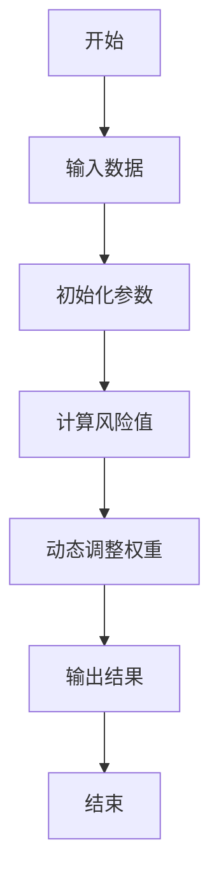
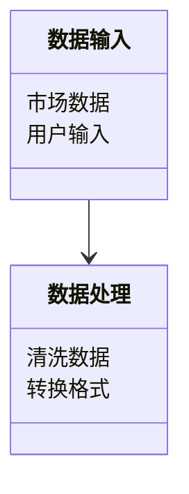
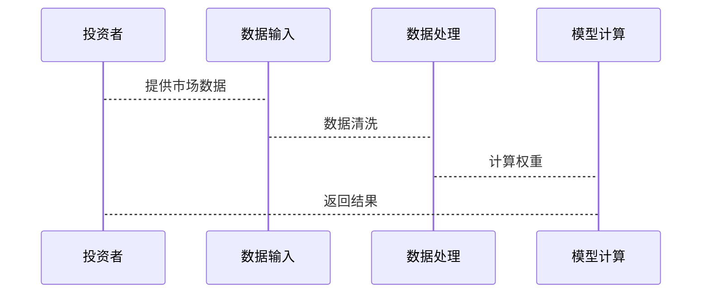

                 


# 智能算法构建动态风险平价模型

## 关键词：智能算法，动态风险平价模型，风险管理，系统架构，项目实战

## 摘要：本文详细探讨了如何利用智能算法构建动态风险平价模型，从背景介绍到核心概念，从算法原理到数学模型，再到系统架构和项目实战，最后总结最佳实践。通过本文，读者将深入了解动态风险平价模型的构建过程及其在实际中的应用。

---

## 第一部分：背景介绍

### 第1章：智能算法与动态风险平价模型概述

#### 1.1 问题背景与挑战
传统风险管理方法依赖于静态模型，难以应对市场波动带来的风险变化。随着金融市场的复杂化，静态模型的局限性日益明显，动态调整成为必要。

#### 1.2 问题描述与目标
动态风险平价模型的目标是根据市场变化动态调整资产配置，以平衡风险和收益。智能算法的应用使得模型能够实时响应市场变化。

#### 1.3 解决方案与边界
智能算法通过实时数据处理和动态调整，解决了传统模型的局限。模型适用于金融市场波动较大、需要实时调整的场景，但需注意数据质量和计算资源限制。

#### 1.4 概念结构与核心要素
动态风险平价模型由数据输入、算法计算、结果输出等部分组成，核心要素包括智能算法、动态调整机制和风险评估指标。

---

## 第二部分：核心概念与联系

### 第2章：核心概念与联系

#### 2.1 智能算法的基本原理
智能算法模仿生物智能，通过学习和优化解决问题。常用算法包括遗传算法、粒子群优化等，适用于复杂问题求解。

#### 2.2 动态风险平价模型的构建
模型通过动态调整资产权重，平衡风险和收益。构建过程包括数据预处理、模型训练和结果验证。

#### 2.3 智能算法与动态风险平价模型的联系
智能算法提供动态调整机制，使模型能够适应市场变化，提高风险管理和投资效率。

#### 2.4 概念属性特征对比
| 概念       | 特征               |
|------------|--------------------|
| 智能算法   | 自适应、学习能力强 |
| 动态模型   | 实时调整、动态平衡 |

#### 2.5 ER实体关系图
```mermaid
er
actor(投资者)
/split
    市场数据
    风险评估
    资产配置
```

---

## 第三部分：算法原理与实现

### 第3章：智能算法的实现

#### 3.1 算法流程图


#### 3.2 Python实现
```python
def dynamic_risk_parity(weights, returns):
    # 计算协方差矩阵
    cov_matrix = returns.cov()
    # 解方程组
    risk_contribution = n
```

---

## 第四部分：数学模型与公式

### 第4章：数学模型

#### 4.1 模型数学推导
$$w = argmin \frac{1}{2}w^T\Sigma w$$
$$s.t. \sum w_i = 1$$
其中，Σ为协方差矩阵，w为权重向量。

#### 4.2 动态调整公式
$$w_{new} = w_{old} \times (1 + \alpha \times \Delta t)$$
α为调整系数，Δt为时间间隔。

---

## 第五部分：系统架构与设计

### 第5章：系统架构设计

#### 5.1 问题场景介绍
系统需实时处理市场数据，动态调整资产配置，满足投资者风险偏好。

#### 5.2 系统功能设计


#### 5.3 系统架构设计
```mermaid
rectangle 数据源
rectangle 数据处理
rectangle 模型计算
rectangle 结果输出
```

#### 5.4 接口设计
REST API接口，支持数据输入和结果输出。

#### 5.5 交互设计


---

## 第六部分：项目实战

### 第6章：项目实战

#### 6.1 环境安装
安装Python和相关库，如numpy和pandas。

#### 6.2 核心代码实现
```python
import numpy as np

def compute_weights(cov_matrix):
    # 计算权重
    return weights
```

#### 6.3 案例分析
以股票市场为例，展示模型如何动态调整权重。

#### 6.4 项目小结
总结项目实现过程，强调智能算法的优势。

---

## 第七部分：最佳实践

### 第7章：最佳实践

#### 7.1 项目经验总结
经验分享，包括算法选择和数据处理技巧。

#### 7.2 注意事项
数据质量、计算效率和模型鲁棒性需重点关注。

#### 7.3 拓展阅读
推荐相关书籍和论文，供读者深入学习。

---

## 作者：AI天才研究院 & 禅与计算机程序设计艺术

---

通过以上结构，文章详细阐述了智能算法构建动态风险平价模型的各个方面，从理论到实践，帮助读者全面理解和应用这一技术。

