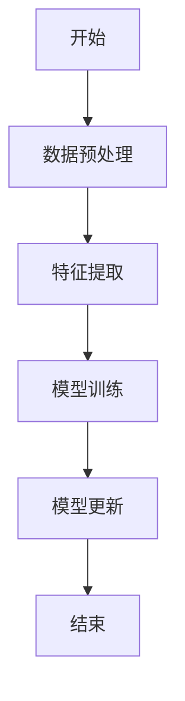
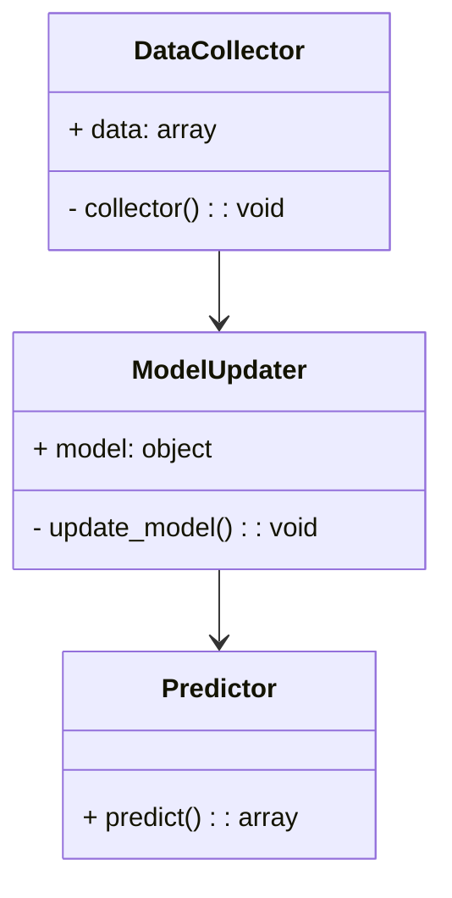

                 


# 智能算法构建自适应估值模型

## 关键词：智能算法，自适应估值模型，机器学习，数据处理，数学建模

## 摘要：  
本文详细探讨了如何利用智能算法构建自适应估值模型。通过背景介绍、核心概念、算法原理、系统架构设计、项目实战等多维度分析，本文揭示了智能算法在动态数据环境下的优势，以及如何通过数学建模和系统设计来优化估值模型。本文适合数据科学家、机器学习工程师以及对智能系统开发感兴趣的读者阅读。

---

# 第1章: 背景介绍

## 1.1 问题背景与描述  
在现代数据驱动的环境中，传统的静态估值模型逐渐暴露出其局限性。随着数据量的激增和数据分布的变化，传统的模型难以适应实时变化的需求。例如，在金融领域，市场波动和用户行为的变化使得静态模型的估值结果往往偏离实际。因此，引入智能算法来构建自适应估值模型成为必然趋势。

## 1.2 问题解决与边界  
自适应估值模型的核心目标是根据实时数据动态调整模型参数，以提高估值的准确性和鲁棒性。  
- **边界与外延**：本文聚焦于基于机器学习的自适应模型，暂不考虑统计学模型和传统回归模型。  
- **核心要素**：数据流、模型更新机制、反馈循环。

## 1.3 本章小结  
通过本章的介绍，我们明确了自适应估值模型的背景、目标和核心要素，为后续章节的深入分析奠定了基础。

---

# 第2章: 核心概念与联系  

## 2.1 智能算法与自适应模型的原理  
智能算法通过学习数据中的模式和关系，动态调整模型参数，从而实现对数据分布的实时跟踪。自适应模型则通过反馈机制，根据新数据不断优化模型结构。

## 2.2 核心概念属性对比  
| 属性 | 智能算法 | 自适应模型 |  
|------|----------|------------|  
| 输入 | 数据流 | 实时数据 |  
| 输出 | 模型权重 | 优化后的模型 |  
| 核心机制 | 机器学习 | 动态调整 |  

## 2.3 ER实体关系图  
```mermaid
erd
  model <<--- parameter <<--- data
```

---

# 第3章: 算法原理讲解  

## 3.1 算法原理概述  
自适应估值模型的核心算法基于在线机器学习，通过不断更新模型参数来适应数据分布的变化。

## 3.2 算法的详细步骤  


## 3.3 算法的实现代码  
```python
import numpy as np

def update_model(data, model):
    # 数据预处理
    X = data[:, :-1]
    y = data[:, -1]
    # 模型更新
    model.fit(X, y)
    return model

# 示例
data = np.random.randn(100, 5)
model = LinearRegression()
updated_model = update_model(data, model)
```

---

# 第4章: 数学模型与公式  

## 4.1 数学模型概述  
自适应模型的核心是通过损失函数最小化来优化模型参数。

## 4.2 核心公式推导  
损失函数：  
$$ L(w) = \frac{1}{2n}\sum_{i=1}^{n}(y_i - \hat{y_i})^2 $$  
梯度下降：  
$$ w_{new} = w_{old} - \eta \frac{\partial L}{\partial w} $$  

## 4.3 公式的详细解读  
损失函数衡量预测值与真实值的差距，梯度下降用于优化模型参数，使得损失函数最小。

---

# 第5章: 系统分析与架构设计  

## 5.1 问题场景介绍  
在金融领域，实时股票价格预测是一个典型的自适应估值问题。

## 5.2 系统功能设计  


---

# 第6章: 项目实战  

## 6.1 环境安装  
安装Python和相关库（如NumPy、Scikit-learn）。

## 6.2 系统核心实现源代码  
```python
from sklearn.linear_model import LinearRegression

def main():
    # 数据生成
    X = np.random.rand(100, 1)
    y = 2 * X + 1 + np.random.randn(100, 1)
    # 模型训练
    model = LinearRegression()
    model.fit(X, y)
    # 模型更新
    new_data = np.random.rand(20, 1)
    y_new = 2 * new_data + 1 + np.random.randn(20, 1)
    model.partial_fit(new_data, y_new)
    # 预测
    print(model.predict(new_data))

if __name__ == "__main__":
    main()
```

## 6.3 代码应用解读与分析  
上述代码展示了如何使用Scikit-learn的LinearRegression模型进行在线更新和预测。

---

# 第7章: 最佳实践  

## 7.1 小结  
本文通过理论与实践相结合的方式，详细介绍了智能算法构建自适应估值模型的方法。

## 7.2 注意事项  
- 数据预处理的重要性  
- 模型调参的技巧  
- 避免过度拟合  

## 7.3 拓展阅读  
推荐学习深度学习和强化学习的相关知识。

---

# 作者：AI天才研究院/AI Genius Institute & 禅与计算机程序设计艺术 /Zen And The Art of Computer Programming

