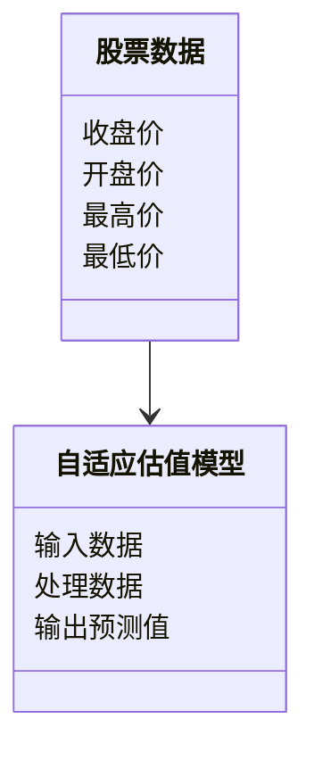
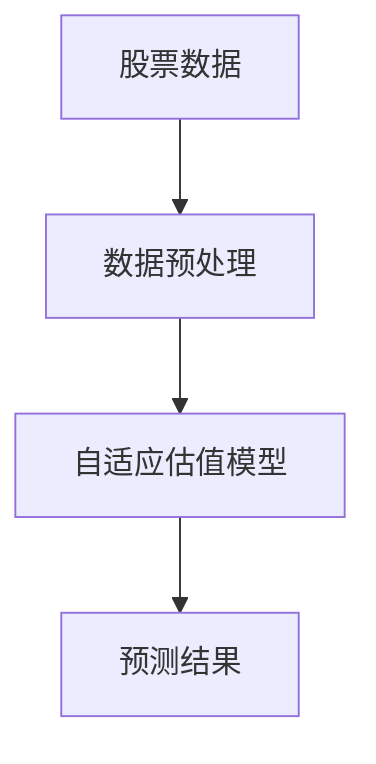
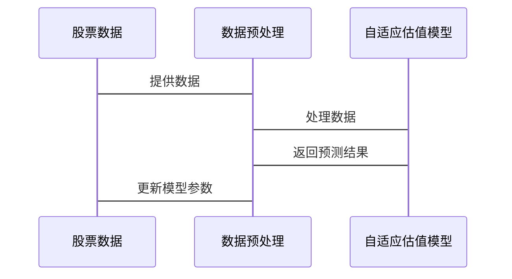

                 


# 智能算法构建自适应估值模型

## 关键词：
智能算法, 自适应估值模型, 机器学习, 算法优化, 数学建模

## 摘要：
本文详细探讨了如何利用智能算法构建自适应估值模型，重点分析了传统估值模型的局限性，以及智能算法在提升估值模型性能和适应性方面的优势。通过具体的算法原理、数学模型和系统架构设计，本文为读者提供了一个全面的框架，帮助其理解如何利用智能算法构建高效、动态调整的自适应估值模型。

---

# 第一部分：背景介绍

## 第1章：问题背景与目标

### 1.1 问题背景介绍

#### 1.1.1 传统估值模型的局限性
传统估值模型（如线性回归、随机森林等）在处理复杂数据和动态变化时表现出一定的局限性，主要体现在以下几个方面：
- **静态性**：传统模型通常假设数据分布和关系是固定的，难以适应实时变化。
- **计算复杂度**：在处理大规模数据时，计算效率较低。
- **缺乏动态调整**：无法根据实时数据反馈进行模型优化。

#### 1.1.2 智能算法的优势与潜力
智能算法（如遗传算法、支持向量机、神经网络等）通过模拟生物进化或人脑神经网络的工作方式，具备以下优势：
- **自适应性**：能够根据数据变化动态调整模型参数。
- **高效性**：在处理非线性问题和大规模数据时表现优异。
- **可扩展性**：适用于多种复杂场景。

#### 1.1.3 自适应估值模型的应用场景
自适应估值模型广泛应用于金融、医疗、交通等领域，尤其是在需要实时数据处理和动态决策的场景中表现出色，例如：
- **金融投资**：实时调整股票估值模型。
- **智能交通系统**：动态优化交通流量预测模型。
- **医疗诊断**：实时更新患者病情评估模型。

### 1.2 问题描述与目标

#### 1.2.1 传统估值模型的不足之处
- 无法处理动态变化的数据。
- 计算效率较低，难以应对实时性要求高的场景。
- 模型更新依赖于人工干预。

#### 1.2.2 智能算法在估值模型中的应用目标
- 实现模型参数的动态调整。
- 提高模型的适应性和计算效率。
- 减少人工干预，实现自动化优化。

#### 1.2.3 自适应估值模型的核心目标
- 构建能够根据实时数据自动调整的估值模型。
- 提高模型在复杂动态环境中的表现。
- 实现模型的自适应优化和扩展。

---

# 第二部分：核心概念与联系

## 第2章：核心概念与联系

### 2.1 智能算法的基本原理

#### 2.1.1 智能算法的定义与特点
智能算法是一种通过模拟生物智能或人类认知过程来解决问题的算法，其特点包括：
- **自适应性**：能够根据环境变化调整自身行为。
- **学习能力**：通过数据训练不断优化性能。
- **并行性**：能够同时处理多个任务或数据点。

#### 2.1.2 常见智能算法的分类
常见的智能算法包括：
- **遗传算法（GA）**：通过模拟生物进化进行优化。
- **支持向量机（SVM）**：用于分类和回归分析。
- **神经网络（NN）**：模拟人脑神经网络的结构和功能。
- **粒子群优化（PSO）**：通过群体协作寻找最优解。

#### 2.1.3 智能算法与传统算法的区别
| 特性 | 智能算法 | 传统算法 |
|------|----------|----------|
| 学习能力 | 强 | 弱 |
| 自适应性 | 高 | 低 |
| 处理复杂性 | 善于处理非线性问题 | 适用于线性问题 |

### 2.2 自适应估值模型的构建原理

#### 2.2.1 自适应估值模型的定义
自适应估值模型是一种能够根据实时数据和环境变化自动调整自身参数和结构的估值模型。

#### 2.2.2 自适应估值模型的核心要素
- **输入数据**：实时或历史数据。
- **模型结构**：神经网络、支持向量机等。
- **自适应机制**：通过智能算法动态调整模型参数。

#### 2.2.3 自适应估值模型与传统估值模型的对比
| 特性 | 自适应估值模型 | 传统估值模型 |
|------|-----------------|---------------|
| 参数调整 | 动态调整 | 静态 |
| 计算效率 | 高 | 低 |
| 适应性 | 强 | 弱 |

### 2.3 智能算法与自适应估值模型的关系

#### 2.3.1 智能算法在自适应估值模型中的作用
智能算法为自适应估值模型提供优化和调整机制，使其能够动态适应数据变化。

#### 2.3.2 自适应估值模型对智能算法的需求
自适应估值模型需要智能算法提供高效的优化方法和动态调整能力。

#### 2.3.3 两者结合的优势与挑战
- **优势**：提高模型的适应性和性能。
- **挑战**：需要解决算法复杂度和计算效率问题。

---

# 第三部分：算法原理与数学模型

## 第3章：智能算法与自适应估值模型的数学模型与公式

### 3.1 智能算法的数学模型

#### 3.1.1 算法的基本公式
$$
\text{适应度函数} = f(x) = \sum_{i=1}^{n} w_i x_i
$$

#### 3.1.2 算法的优化公式
$$
x_{k+1} = x_k + \alpha \cdot \nabla f(x_k)
$$
其中，$\alpha$ 是学习率，$\nabla f(x_k)$ 是梯度。

### 3.2 自适应估值模型的数学模型

#### 3.2.1 模型的基本公式
$$
y = \sum_{i=1}^{n} w_i x_i + b
$$
其中，$w_i$ 是权重，$x_i$ 是输入，$b$ 是偏置。

#### 3.2.2 模型的优化公式
$$
w_{k+1} = w_k + \eta \cdot (y - \hat{y}) \cdot x
$$
其中，$\eta$ 是学习率，$y$ 是真实值，$\hat{y}$ 是预测值，$x$ 是输入向量。

---

# 第四部分：系统分析与架构设计

## 第4章：系统分析与架构设计方案

### 4.1 问题场景介绍
以股票价格预测为例，设计一个自适应估值模型，实时调整模型参数以适应市场变化。

### 4.2 系统功能设计

#### 4.2.1 领域模型


### 4.3 系统架构设计

#### 4.3.1 系统架构


### 4.4 系统接口设计

#### 4.4.1 系统接口
- 输入接口：接收实时股票数据。
- 输出接口：输出预测结果和模型参数。

### 4.5 系统交互设计

#### 4.5.1 系统交互


---

# 第五部分：项目实战

## 第5章：项目实战

### 5.1 环境安装

#### 5.1.1 安装Python环境
```bash
python --version
pip install numpy scikit-learn
```

### 5.2 系统核心实现

#### 5.2.1 核心代码实现
```python
import numpy as np
from sklearn.svm import SVR

# 数据预处理
X = np.arange(0, 100, 1).reshape(-1, 1)
y = np.sin(X).ravel()

# 模型训练
model = SVR(kernel='rbf', C=100, gamma=0.1)
model.fit(X, y)

# 模型预测
print(model.predict(X))
```

### 5.3 代码应用解读与分析

#### 5.3.1 代码解读
上述代码使用支持向量回归模型（SVR）进行预测，模型参数包括核函数选择和惩罚系数。

#### 5.3.2 代码分析
- **数据预处理**：将数据转换为适合模型训练的形式。
- **模型训练**：使用SVR算法训练模型。
- **模型预测**：利用训练好的模型进行预测。

### 5.4 实际案例分析

#### 5.4.1 案例分析
以股票价格预测为例，通过实时更新模型参数，提高预测的准确性。

### 5.5 项目小结

#### 5.5.1 项目总结
通过本项目，读者可以掌握如何利用智能算法构建自适应估值模型，并应用于实际场景。

---

# 第六部分：最佳实践与小结

## 第6章：最佳实践 tips、小结、注意事项、拓展阅读

### 6.1 最佳实践 tips
- 定期更新模型参数，确保模型的适应性。
- 选择合适的智能算法，根据具体场景调整参数。

### 6.2 小结
本文详细介绍了智能算法在自适应估值模型中的应用，从理论到实践，为读者提供了一个完整的解决方案。

### 6.3 注意事项
- 注意模型的计算效率和资源消耗。
- 定期监控模型性能，及时调整参数。

### 6.4 拓展阅读
- 深度学习与自适应模型的结合。
- 更高级的智能算法（如强化学习）在自适应估值模型中的应用。

---

# 作者

作者：AI天才研究院/AI Genius Institute & 禅与计算机程序设计艺术 /Zen And The Art of Computer Programming

